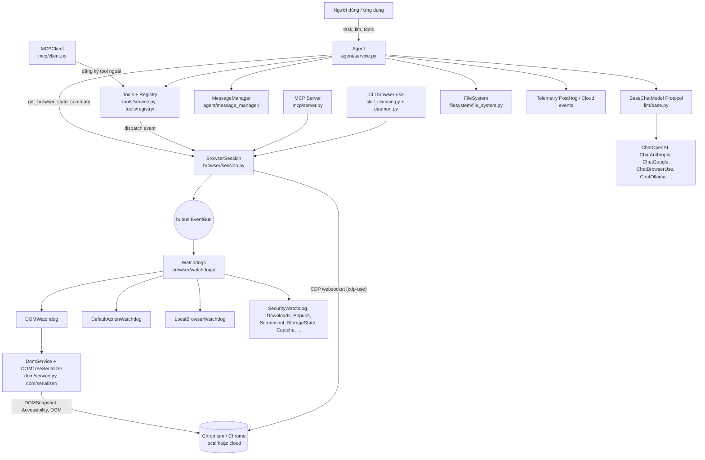
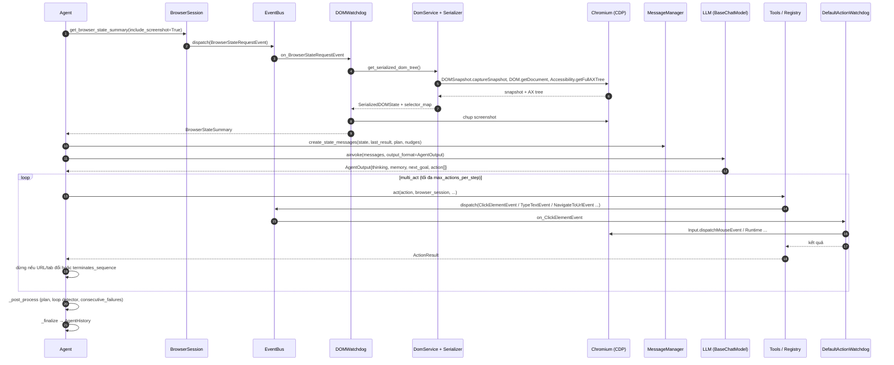
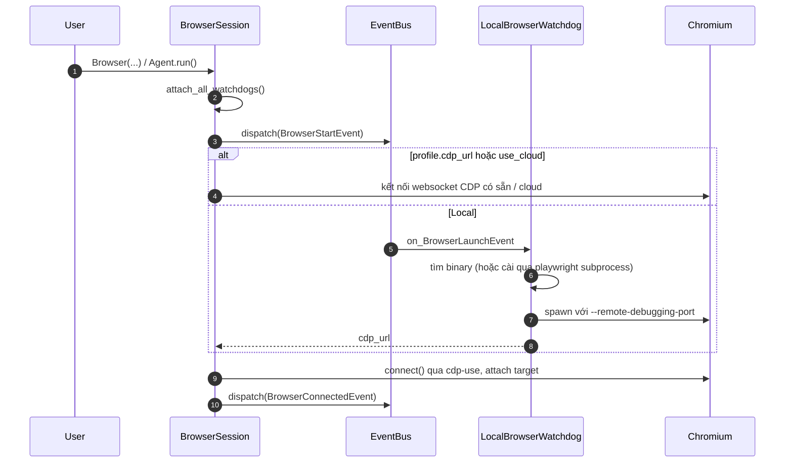

# browser-use — Tài liệu thiết kế giải pháp

> **Fork:** [mrchinh189/browser-use](https://github.com/mrchinh189/browser-use) · **Upstream:** [browser-use/browser-use](https://github.com/browser-use/browser-use)
> **Nhóm:** AI Agent (browser automation)
> **Ngôn ngữ chính:** Python (>=3.11, async) · **License:** MIT · **Commit đã phân tích:** `55ca9cb`

## 1. Tóm tắt

browser-use (package `browser-use`, v0.12.6, tác giả Gregor Zunic) là thư viện Python async giúp **LLM điều khiển trình duyệt thật** để hoàn thành tác vụ mô tả bằng ngôn ngữ tự nhiên ("Make websites accessible for AI agents"). Agent lặp vòng *quan sát → suy luận → hành động*: chụp trạng thái trang (DOM đã tinh giản + screenshot), gửi cho LLM, nhận về danh sách action có cấu trúc (click, input, navigate, extract...) rồi thực thi qua Chrome DevTools Protocol (CDP). Điểm khác biệt cốt lõi: điều khiển Chromium trực tiếp bằng CDP (thư viện `cdp-use`) thay vì Playwright/Selenium, kiến trúc **event bus + watchdog** cho phiên trình duyệt, lớp LLM tự viết hỗ trợ ~15 provider, cùng các phụ trợ cho agent dài hạn (planning, loop detection, message compaction, judge).

## 2. Bài toán & yêu cầu

- **Bài toán:** Tự động hoá thao tác web (điền form, mua sắm, tra cứu, trích xuất dữ liệu) trên những trang không có API, mà không phải viết script selector cứng cho từng trang.
- **Yêu cầu chức năng chính:**
  - Nhận `task` (text) và chạy agent tới khi gọi action `done` hoặc hết `max_steps` (mặc định 500).
  - Biểu diễn trang cho LLM: danh sách phần tử tương tác có chỉ số (`[index]`), screenshot (vision), thông tin tab, trạng thái scroll.
  - Bộ action dựng sẵn trong `browser_use/tools/service.py`: `search`, `navigate`, `go_back`, `wait`, `click` (theo index hoặc toạ độ), `input`, `upload_file`, `switch`/`close` tab, `extract` (dùng LLM trích xuất), `search_page`, `find_elements`, `scroll`, `send_keys`, `find_text`, `screenshot`, `save_as_pdf`, `dropdown_options`, `select_dropdown`, `write_file`/`replace_file`/`read_file`, `evaluate` (chạy JS), `done`.
  - Custom tools do người dùng đăng ký; kết nối MCP server bên ngoài làm tool; chạy chính nó như MCP server.
  - Output có cấu trúc (`output_model_schema`), dữ liệu nhạy cảm (`sensitive_data`) được che khỏi LLM, giới hạn domain (`allowed_domains`/`prohibited_domains`).
  - CLI lưu phiên trình duyệt giữa các lệnh (`browser-use open/state/click/type/screenshot/close`), phát lại lịch sử (`rerun_history`, `load_and_rerun`).
- **Yêu cầu phi chức năng:**
  - Độ bền: timeout cho LLM (`llm_timeout`) và mỗi step (`step_timeout=180`), `max_failures=5`, `fallback_llm` khi rate limit/lỗi provider, tự reconnect CDP (`_auto_reconnect`).
  - Kiểm soát chi phí/context: `max_clickable_elements_length=40000`, rút gọn URL dài, message compaction (`MessageCompactionSettings`), tính chi phí token (`browser_use/tokens/`).
  - Bảo mật: `SecurityWatchdog` chặn điều hướng ngoài domain cho phép, secrets chỉ thay vào action `input` theo domain khớp.
  - Quan sát: telemetry PostHog ẩn danh (tắt bằng `ANONYMIZED_TELEMETRY=false`), tracing Laminar (`lmnr`, tuỳ chọn), lưu conversation, GIF lịch sử.
- **Ngoài phạm vi:** Không phải crawler quy mô lớn; không tự giải CAPTCHA/proxy rotation trong bản open-source (README định hướng các tính năng stealth, proxy, captcha sang Browser Use Cloud — code chỉ có `CaptchaWatchdog` chờ kết quả giải từ phía cloud browser); không phải trình duyệt headless tự viết (dùng Chromium/Chrome có sẵn).

## 3. Kiến trúc tổng thể



Giải thích các lớp:

1. **Lớp Agent** — `Agent` điều phối vòng lặp step; `MessageManager` dựng prompt (system prompt dạng Markdown trong `agent/system_prompts/`), lịch sử, trạng thái trình duyệt.
2. **Lớp Tools** — `Tools` (tên cũ `Controller`, alias vẫn giữ trong `browser_use/controller/`) chứa `Registry` các action; mỗi action là async function với Pydantic param model, được inject dependency (`browser_session`, `page_extraction_llm`, `file_system`...).
3. **Lớp Browser** — `BrowserSession` (alias `Browser`) quản lý kết nối CDP, target/tab, và **EventBus** (`bubus`). Các **watchdog** (kế thừa `BaseWatchdog` trong `browser/watchdog_base.py`) tự đăng ký handler theo quy ước tên method `on_<EventName>`.
4. **Lớp DOM** — `DomService` gọi CDP (`DOMSnapshot.captureSnapshot`, `DOM.getDocument`, `Accessibility.getFullAXTree`, `Page.getLayoutMetrics`...) để dựng `EnhancedDOMTreeNode`, rồi `DOMTreeSerializer` lọc phần tử tương tác/hiển thị và gán index.
5. **Lớp LLM** — `BaseChatModel` là `Protocol` với `ainvoke(messages, output_format)` trả `ChatInvokeCompletion`; mỗi provider có thư mục riêng trong `browser_use/llm/` cùng serializer message.

## 4. Thành phần chính

| Thành phần | Vị trí trong mã nguồn | Trách nhiệm |
|---|---|---|
| `Agent` | `browser_use/agent/service.py` | Vòng lặp `run()` → `step()`; quản lý state, retry, fallback LLM, planning, loop detection, judge, history, GIF |
| Views của agent | `browser_use/agent/views.py` | `AgentSettings`, `AgentState`, `AgentOutput`, `ActionResult`, `AgentHistoryList`, `ActionLoopDetector`, `JudgementResult`, `MessageCompactionSettings` |
| `MessageManager` | `browser_use/agent/message_manager/service.py` | Xây message system/state/history, che sensitive data, compaction (`<compacted_memory>`) |
| System prompts | `browser_use/agent/system_prompts/*.md` | Biến thể prompt: chuẩn, `flash`, `no_thinking`, riêng cho Anthropic và cho model của browser-use |
| Judge | `browser_use/agent/judge.py` | Dựng message để LLM đánh giá trace có thành công không (`use_judge=True`, `ground_truth`) |
| `Tools` | `browser_use/tools/service.py` | Đăng ký action mặc định, `act()` thực thi một action, xử lý lỗi thành `ActionResult(error=...)` |
| `Registry` | `browser_use/tools/registry/service.py` | Decorator `action(description, param_model, domains, terminates_sequence)`, tạo `ActionModel` động theo URL trang, thay secrets, inject special params |
| `BrowserSession` | `browser_use/browser/session.py` | Vòng đời trình duyệt, CDP client/session, tab, cookie, storage state, highlight phần tử, reconnect |
| `BrowserProfile` | `browser_use/browser/profile.py` | Tham số launch/connect: `headless`, `cdp_url`, `use_cloud`, `user_data_dir`, proxy, `allowed_domains`, extension, viewport... |
| Events | `browser_use/browser/events.py` | `NavigateToUrlEvent`, `ClickElementEvent`, `TypeTextEvent`, `ScrollEvent`, `BrowserStateRequestEvent`, `FileDownloadedEvent`, `CaptchaSolverStartedEvent`... |
| Watchdogs | `browser_use/browser/watchdogs/` | `LocalBrowserWatchdog` (khởi chạy Chromium subprocess với `--remote-debugging-port`), `DefaultActionWatchdog` (click/type/scroll), `DOMWatchdog` (state summary), `SecurityWatchdog`, `DownloadsWatchdog`, `PopupsWatchdog`, `ScreenshotWatchdog`, `StorageStateWatchdog`, `PermissionsWatchdog`, `AboutBlankWatchdog`, `RecordingWatchdog`, `HarRecordingWatchdog`, `CaptchaWatchdog` |
| `DomService` | `browser_use/dom/service.py` | Thu thập DOM + snapshot + AX tree mọi frame, tính visibility, phát hiện nút phân trang |
| `DOMTreeSerializer` | `browser_use/dom/serializer/serializer.py` | Tạo cây tinh giản, lọc theo paint order/bounding box, gán index cho phần tử tương tác, đánh dấu phần tử mới |
| Actor API | `browser_use/actor/` (`page.py`, `element.py`, `mouse.py`) | API mức thấp trên CDP (`Page`, `Element`, `Mouse`) cho người dùng muốn tự điều khiển |
| LLM providers | `browser_use/llm/<provider>/chat.py` | OpenAI, Azure, Anthropic, AWS Bedrock, Google, Groq, Mistral, DeepSeek, Cerebras, Ollama, OpenRouter, Vercel, OCI, LiteLLM, `ChatBrowserUse` (API cloud) |
| MCP | `browser_use/mcp/server.py`, `client.py`, `controller.py` | Server expose tool `browser_navigate`, `browser_click`, `browser_type`, `browser_get_state`, `browser_extract_content`, `browser_screenshot`, `browser_scroll`, `browser_list_tabs`...; Client đăng ký tool MCP ngoài vào `Registry` |
| CLI | `browser_use/skill_cli/` | Entry point `browser-use`/`bu`/`browser`: daemon giữ một `BrowserSession` sống qua Unix socket (TCP trên Windows), mỗi session có socket + PID file riêng; lệnh `doctor`, `setup`, `cloud`, `python_exec` |
| TUI cũ | `browser_use/cli.py` | `browser-use-tui` (Textual) |
| Sandbox | `browser_use/sandbox/sandbox.py` | Decorator `@sandbox(...)` serialize hàm bằng `cloudpickle` và chạy trên hạ tầng cloud với browser được inject |
| Skills | `browser_use/skills/` | `SkillService` lấy skill từ Browser Use API, Agent đăng ký chúng thành action |
| FileSystem | `browser_use/filesystem/file_system.py` | Không gian file làm việc cho agent (todo, kết quả) và trạng thái lưu được |
| Tokens | `browser_use/tokens/` | Theo dõi usage và chi phí theo model (`custom_pricing.py`, `mappings.py`) |
| Config | `browser_use/config.py`, `.env.example` | Biến môi trường: API key, `ANONYMIZED_TELEMETRY`, `BROWSER_USE_HEADLESS`, `BROWSER_USE_ALLOWED_DOMAINS`, proxy, `DEFAULT_LLM`... |
| Telemetry / Sync | `browser_use/telemetry/service.py`, `browser_use/sync/` | PostHog event ẩn danh; đồng bộ session/task lên cloud khi bật |

### 4.1 Vòng lặp Agent

`Agent.run(max_steps=500)` phát `CreateAgentSessionEvent`/`CreateAgentTaskEvent`, chạy `initial_actions` (và tự mở URL nếu task chứa URL khi `directly_open_url=True`), rồi lặp `while n_steps <= max_steps`. Nếu `consecutive_failures >= max_failures` thì dừng (có thể gọi một lần "final response" khi `final_response_after_failure=True`). Mỗi `step()` gồm:

1. **Phase 0** — chờ CAPTCHA nếu cloud browser đang giải (`wait_if_captcha_solving`).
2. **Phase 1 `_prepare_context`** — `browser_session.get_browser_state_summary(include_screenshot=True)`, kiểm tra download mới, cập nhật `ActionModel` theo URL (action giới hạn domain), dựng state message, compaction, chèn các "nudge": cảnh báo ngân sách step, replan khi bế tắc, exploration khi chưa có plan, loop detection, ép `done` ở step cuối.
3. **Phase 2** — `_get_next_action`: gọi LLM với `asyncio.wait_for(..., llm_timeout)` và retry, parse ra `AgentOutput`; `_execute_actions` → `multi_act()`.
4. **Phase 3 `_post_process`** — cập nhật plan, loop detector, đếm lỗi liên tiếp, log kết quả `done`.
5. Mọi exception đi vào `_handle_step_error`; `_finalize` ghi `AgentHistory`.

### 4.2 `multi_act` – an toàn khi chạy nhiều action/step

LLM có thể trả tới `max_actions_per_step=5` action. `multi_act` bảo vệ khỏi việc thao tác trên DOM cũ bằng hai lớp: (1) action có cờ `terminates_sequence=True` (navigate, search, go_back, switch) dừng chuỗi; (2) sau mỗi action so sánh URL/target focus trước-sau, thay đổi thì huỷ phần còn lại. Ngoài ra `done` chỉ được phép là action duy nhất.

### 4.3 Event bus + watchdog

`BrowserSession.attach_all_watchdogs()` khởi tạo các watchdog với cùng `event_bus`. `BaseWatchdog.attach_to_session()` duyệt method `on_*`, ánh xạ sang class event cùng tên và (nếu có khai báo) kiểm tra nằm trong `LISTENS_TO`. Ví dụ `get_browser_state_summary()` chỉ `dispatch(BrowserStateRequestEvent(...))` rồi `await event.event_result()`; `DOMWatchdog.on_BrowserStateRequestEvent` chờ trang ổn định, lấy tab, DOM, screenshot và trả `BrowserStateSummary`. Click/type do `DefaultActionWatchdog.on_ClickElementEvent/on_TypeTextEvent` xử lý; `SecurityWatchdog.on_NavigateToUrlEvent` chặn URL không thuộc `allowed_domains`.

## 5. Luồng xử lý chính

### 5.1 Một step của Agent



### 5.2 Khởi động phiên trình duyệt



## 6. Mô hình dữ liệu & giao diện

**AgentOutput** (LLM phải trả JSON đúng schema, `extra='forbid'`):

```python
class AgentOutput(BaseModel):
    thinking: str | None
    evaluation_previous_goal: str | None
    memory: str | None
    next_goal: str | None
    current_plan_item: int | None
    plan_update: list[str] | None
    action: list[ActionModel]   # ít nhất 1, mỗi phần tử {"<tên_action>": {params}}
```

**ActionResult**: `is_done`, `success`, `error`, `extracted_content`, `long_term_memory`, `attachments`, `images`, `judgement`... — kết quả action được đưa lại vào context step sau.

**AgentHistoryList**: lịch sử (model output, kết quả, state trình duyệt, phần tử đã tương tác) — lưu bằng `save_history()`, phát lại bằng `load_and_rerun()`/`rerun_history()` (có cơ chế khớp lại index phần tử khi DOM thay đổi).

**API công khai** (`browser_use/__init__.py`): `Agent`, `Browser`/`BrowserSession`, `BrowserProfile`, `Tools`/`Controller`, `ActionResult`, các `Chat*` model.

```python
from browser_use import Agent, Browser, ChatAnthropic, Tools, ActionResult

tools = Tools()

@tools.action('Lưu kết quả vào DB', domains=['*.example.com'])
async def save_row(name: str, price: float) -> ActionResult:
    ...
    return ActionResult(extracted_content=f'saved {name}')

agent = Agent(
    task='Tìm giá sản phẩm X trên example.com',
    llm=ChatAnthropic(model='claude-sonnet-4-6'),
    browser=Browser(headless=True, allowed_domains=['*.example.com']),
    tools=tools,
    sensitive_data={'https://*.example.com': {'x_user': 'alice', 'x_pass': '***'}},
    max_actions_per_step=5,
    fallback_llm=None,
)
history = await agent.run(max_steps=50)
```

**Giao diện khác:**

- **CLI:** `browser-use open <url> | state | click <idx> | type "<text>" | screenshot <file> | close`, `browser-use init --template default|advanced|tools`, `browser-use doctor|setup|install`.
- **MCP server:** chạy qua `uvx browser-use[cli] --mcp` (theo `CLAUDE.md`), giao tiếp stdio với client như Claude Desktop.
- **Claude Code skill:** `skills/browser-use/SKILL.md` (cùng `skills/cloud`, `skills/open-source`, `skills/remote-browser`).
- **Cấu hình:** biến môi trường trong `browser_use/config.py` (xem `.env.example`).

## 7. Tech stack

| Lớp | Công nghệ | Vai trò |
|---|---|---|
| Ngôn ngữ | Python >=3.11, asyncio | Toàn bộ thư viện |
| Điều khiển trình duyệt | `cdp-use` (CDP typed client), Chromium/Chrome | Giao tiếp DevTools Protocol trực tiếp |
| Event bus | `bubus` | Điều phối watchdog trong `BrowserSession` |
| Mô hình dữ liệu | `pydantic` v2 | Settings, views, param action, schema output |
| LLM SDK | `openai`, `anthropic`, `google-genai`, `groq`, `ollama`, (tuỳ chọn `boto3`, `oci`) | Provider LLM |
| HTTP | `httpx`, `aiohttp`, `requests` | Gọi API cloud, tải tài nguyên |
| MCP | `mcp` | Server/Client Model Context Protocol |
| Nội dung | `markdownify`, `pypdf`, `reportlab`, `python-docx`, `pillow` | Chuyển HTML → Markdown, đọc/ghi PDF, DOCX, ảnh |
| CLI/TUI | `click`, `rich`, `InquirerPy`, `textual` (extra `cli`) | Giao diện dòng lệnh |
| Khác | `psutil`, `screeninfo`/`pyobjc`, `pyotp`, `cloudpickle`, `uuid7` | Quản lý tiến trình, kích thước màn hình, TOTP 2FA, sandbox, ID |
| Telemetry/Tracing | `posthog`, `lmnr` (extra `eval`) | Analytics ẩn danh, tracing span |
| Build/QA | `hatchling`, `uv`, `ruff`, `pyright`, `pytest` (`tests/ci`), pre-commit | Đóng gói và kiểm thử |
| Container | Docker (`Dockerfile`, `Dockerfile.fast`, `docker/base-images/`) | Image chạy sẵn Chromium |

## 8. Quyết định thiết kế & đánh đổi

| Quyết định | Lý do | Đánh đổi |
|---|---|---|
| Dùng CDP trực tiếp (`cdp-use`) thay Playwright | Kiểm soát chi tiết (DOMSnapshot, AX tree, target/iframe), ít lớp trung gian, kết nối được browser từ xa/cloud | Phải tự xử lý nhiều edge case (iframe, popup, download, reconnect) — `session.py` gần 4.000 dòng |
| Event bus + watchdog theo quy ước `on_<Event>` | Tách mối quan tâm (security, download, popup, DOM) thành module độc lập, dễ thêm/tắt | Luồng điều khiển gián tiếp, khó debug; phụ thuộc thư viện `bubus` |
| Biểu diễn trang bằng DOM tinh giản có index + screenshot | LLM chọn phần tử bằng số index, giảm token so với HTML thô, vision giúp hiểu layout | Index thay đổi giữa các step; cần `max_clickable_elements_length` để không vượt context |
| Nhiều action mỗi step + guard thay đổi trang | Giảm số lần gọi LLM (nhanh, rẻ hơn) | Rủi ro thao tác trên DOM cũ — giải quyết bằng `terminates_sequence` và so sánh URL/focus |
| Lớp LLM tự viết (Protocol `BaseChatModel`) thay LangChain | Ít phụ thuộc, kiểm soát structured output và serializer theo provider | Phải tự bảo trì adapter cho từng provider |
| Planning, loop detection, nudges, compaction, judge trong Agent | Tăng tỉ lệ thành công tác vụ dài, chống lặp vô hạn | `Agent` phình to (~4.100 dòng), nhiều tham số |
| Action giới hạn theo domain + secrets theo domain | An toàn hơn khi agent cầm credential | Cấu hình phức tạp hơn (glob domain) |
| Telemetry bật mặc định | Thu thập số liệu cải tiến sản phẩm | Cần tắt `ANONYMIZED_TELEMETRY` cho môi trường nhạy cảm |
| Tích hợp sâu với Browser Use Cloud (`ChatBrowserUse`, `use_cloud`, sandbox, skills, sync) | Đường nâng cấp sang dịch vụ trả phí (stealth, scale) | Một số tính năng chỉ có ý nghĩa khi dùng cloud |

## 9. Triển khai & vận hành

- **Cài đặt:** `uv add browser-use` (Python >=3.11); `uvx browser-use install` để cài Chromium nếu máy chưa có. CLI cài một dòng qua `curl -fsSL https://browser-use.com/cli/install.sh | bash` (xem `browser_use/skill_cli/README.md`), kiểm tra bằng `browser-use doctor`.
- **Cấu hình:** sao chép `.env.example` → `.env`: `BROWSER_USE_API_KEY` (cloud / `ChatBrowserUse`), `OPENAI_API_KEY`/`ANTHROPIC_API_KEY`/`GOOGLE_API_KEY`..., `BROWSER_USE_LOGGING_LEVEL`, `ANONYMIZED_TELEMETRY`, `BROWSER_USE_CLOUD_SYNC`, `BROWSER_USE_HEADLESS`, proxy.
- **Docker:** `Dockerfile` (base `python:3.12-slim`, cài Chromium từ system packages, user `browseruse` uid 911, volume `/data`, expose `9242` và `9222` (CDP), `ENTRYPOINT ["browser-use"]`); `Dockerfile.fast` dùng các base image trong `docker/base-images/{system,chromium,python-deps}` (build bằng `docker/build-base-images.sh`, ~30 giây theo `docker/README.md`).
- **Chế độ chạy:** local headful/headless; kết nối Chrome có sẵn qua `cdp_url` hoặc `BrowserSession.from_system_chrome()` (dùng profile Chrome thật); cloud browser (`use_cloud=True`); `@sandbox` để chạy hàm trên hạ tầng cloud.
- **Quan sát:** log theo `BROWSER_USE_LOGGING_LEVEL`, file log debug/info; `save_conversation_path`; `generate_gif`; Laminar span cho từng action (`Tools.act`); tính chi phí với `calculate_cost=True`; HAR/video recording qua watchdog.
- **CI:** `.github/workflows/test.yaml`, `lint.yml`, `eval-on-pr.yml`, `cloud_evals.yml`, `docker.yml`, `publish.yml`, `install-script.yml`. Test trong `tests/ci` dùng `pytest-httpserver`, không gọi URL thật (theo `CLAUDE.md`).
- **Giới hạn đã biết:** chi phí và độ trễ LLM mỗi step; kết quả không tất định; trang có anti-bot/CAPTCHA khó vượt khi chạy local; cần tài nguyên đáng kể cho mỗi Chromium.

## 10. Điểm mở rộng

- **Custom action:** `@tools.action(description, param_model=..., domains=[...], terminates_sequence=...)` — function async có thể khai báo tham số đặc biệt (`browser_session`, `page_extraction_llm`, `file_system`, `available_file_paths`) để được inject; loại bỏ action mặc định bằng `tools.exclude_action(name)`; bật click theo toạ độ bằng `set_coordinate_clicking(True)`.
- **LLM provider mới:** cài một class thoả `BaseChatModel` Protocol (`model`, `provider`, `ainvoke(messages, output_format)`), tham khảo `browser_use/llm/openai/` hoặc `browser_use/llm/litellm/`.
- **Watchdog mới:** kế thừa `BaseWatchdog`, khai báo `LISTENS_TO`/`EMITS`, viết `on_<EventName>`; đăng ký trong `BrowserSession.attach_all_watchdogs()`.
- **Event mới:** khai báo trong `browser_use/browser/events.py` (kế thừa `bubus.BaseEvent[T]`).
- **MCP:** gắn MCP server ngoài làm tool qua `MCPClient.register_to_tools()`; hoặc dùng browser-use như MCP server cho agent khác.
- **Prompt:** `override_system_message` / `extend_system_message`; `flash_mode`, `use_thinking` chọn biến thể prompt.
- **Hook vòng đời:** `register_new_step_callback`, `register_done_callback`, `register_should_stop_callback`, `on_step_start`/`on_step_end` của `run()`.
- **Skills cloud:** `skills=[...]` để nạp skill từ Browser Use API thành action.

## 11. Bài học & cách áp dụng

- **Vòng lặp observe → think → act với output có schema chặt** (`AgentOutput` có `evaluation_previous_goal`, `memory`, `next_goal`) là khung tham khảo tốt cho mọi agent dùng tool: buộc LLM tự đánh giá bước trước và ghi nhớ ngắn gọn.
- **Biểu diễn môi trường dạng "danh sách phần tử có index"** giảm mạnh token và lỗi so với đưa HTML thô — áp dụng được cho agent điều khiển UI desktop/mobile.
- **Guard chống trạng thái cũ** (`terminates_sequence`, so sánh URL trước/sau) là pattern cần thiết khi cho phép LLM batch nhiều action.
- **Event bus + watchdog theo tên method** giúp hệ thống phức tạp (trình duyệt) được chia thành module nhỏ; nên dùng khi có nhiều concern xuyên suốt.
- **Cơ chế an toàn cho agent**: action giới hạn domain, secrets thay theo placeholder chỉ ở action `input`, `allowed_domains` ở tầng điều hướng — nên mặc định có trong bất kỳ agent nào chạm vào web thật.
- **Các "nudge" (budget warning, replan, loop detection) và message compaction** là kỹ thuật thực dụng để agent chạy dài không bị lặp và tràn context.
- **Protocol thay vì kế thừa cho LLM client** giữ lõi độc lập framework.
- Khi áp dụng: kết hợp với Scrapy/ScrapeGraphAI — dùng browser-use cho các bước cần tương tác (đăng nhập, form, điều hướng nhiều bước), còn trích xuất hàng loạt giao cho crawler rẻ hơn.

## 12. Tham khảo

- README: `README.md`; hướng dẫn cho agent/dev: `CLAUDE.md`, `AGENTS.md`, `CLOUD.md`
- Manifest: `pyproject.toml`, `.env.example`, `Dockerfile`, `Dockerfile.fast`, `docker/README.md`
- Agent: `browser_use/agent/service.py`, `browser_use/agent/views.py`, `browser_use/agent/message_manager/service.py`, `browser_use/agent/system_prompts/`
- Tools: `browser_use/tools/service.py`, `browser_use/tools/registry/service.py`
- Browser: `browser_use/browser/session.py`, `browser_use/browser/profile.py`, `browser_use/browser/events.py`, `browser_use/browser/watchdog_base.py`, `browser_use/browser/watchdogs/`
- DOM: `browser_use/dom/service.py`, `browser_use/dom/serializer/serializer.py`
- LLM: `browser_use/llm/base.py`, `browser_use/llm/README.md`
- MCP: `browser_use/mcp/server.py`, `browser_use/mcp/client.py`
- CLI: `browser_use/skill_cli/README.md`, `browser_use/skill_cli/daemon.py`
- Ví dụ: `examples/` (`getting_started`, `custom-functions`, `features`, `models`, `use-cases`, `sandbox`)
- Docs chính thức: https://docs.browser-use.com
