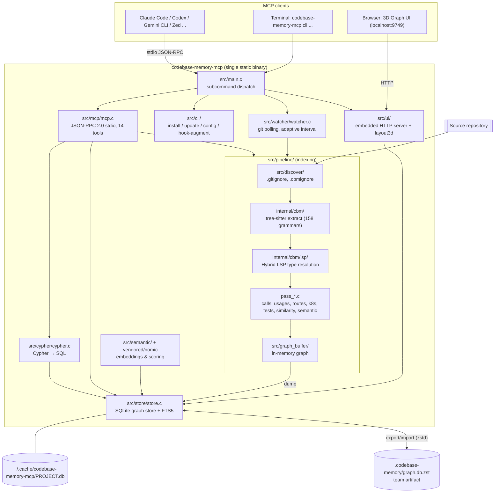
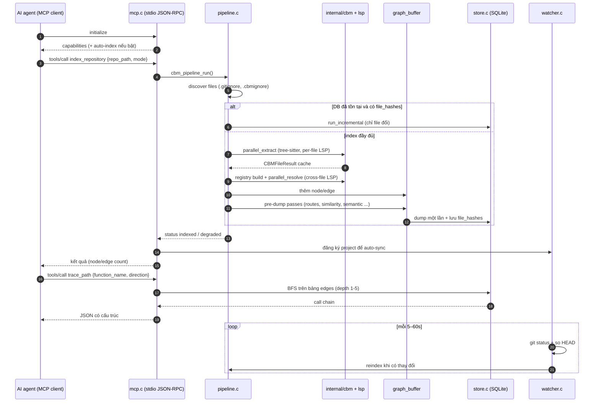

# codebase-memory-mcp — Tài liệu thiết kế giải pháp

> **Fork:** [mrchinh189/codebase-memory-mcp](https://github.com/mrchinh189/codebase-memory-mcp) · **Upstream:** [DeusData/codebase-memory-mcp](https://github.com/DeusData/codebase-memory-mcp)
> **Nhóm:** Code intelligence / MCP
> **Ngôn ngữ chính:** C (C11, có một phần C++ vendored; UI bằng TypeScript/React) · **License:** MIT · **Commit đã phân tích:** `34efbc0`

## 1. Tóm tắt

`codebase-memory-mcp` là một **MCP server dạng single static binary viết bằng C thuần**, index toàn bộ codebase thành một **knowledge graph** (function, class, call chain, HTTP route, liên kết cross-service) lưu trong SQLite, rồi cung cấp 14 MCP tool để AI coding agent (Claude Code, Codex CLI, Gemini CLI, Zed, ...) truy vấn cấu trúc thay vì grep/đọc từng file. Điểm khác biệt cốt lõi: 158 tree-sitter grammar được biên dịch sẵn vào binary, một lớp **"Hybrid LSP"** viết bằng C để resolve kiểu cho 9 nhóm ngôn ngữ, pipeline RAM-first rất nhanh (README: Linux kernel ~3 phút), và **không nhúng LLM** — agent đang dùng chính là lớp "trí tuệ" dịch câu hỏi sang graph query.

## 2. Bài toán & yêu cầu

- **Bài toán:** AI agent khám phá codebase bằng grep/read từng file tốn rất nhiều token và tool call; câu hỏi cấu trúc ("ai gọi `ProcessOrder`?", "đổi file này ảnh hưởng gì?") cần một đồ thị quan hệ đã được tính sẵn. README dẫn số liệu: 5 query cấu trúc ~3.400 token so với ~412.000 token khi khám phá từng file.
- **Yêu cầu chức năng chính:**
  - Index repository thành graph (node label: `Project`, `Package`, `Folder`, `File`, `Module`, `Class`, `Function`, `Method`, `Interface`, `Enum`, `Type`, `Route`, `Resource`) với các edge `CALLS`, `IMPORTS`, `DEFINES`, `HTTP_CALLS`, `ASYNC_CALLS`, `IMPLEMENTS`, `USAGE`, `TESTS`, `SIMILAR_TO`, `SEMANTICALLY_RELATED`, ...
  - Truy vấn: tìm kiếm cấu trúc/BM25/semantic, trace call path (BFS), Cypher read-only, lấy code snippet, kiến trúc tổng quan, phân tích tác động của git diff, phát hiện dead code.
  - Liên kết cross-service (HTTP route ↔ call-site, gRPC/GraphQL/tRPC, channel `EMITS`/`LISTENS_ON`) và cross-repo (`CROSS_*` edges).
  - Tự đồng bộ khi code thay đổi (watcher dựa trên git), index tăng dần (incremental).
  - Tự cấu hình cho 11 coding agent (`install`), kèm hook và instruction file.
- **Yêu cầu phi chức năng:**
  - Hiệu năng: query cấu trúc < 1ms–10ms; index song song nhiều worker; bộ nhớ giải phóng sau khi index.
  - Phân phối: một binary tĩnh, zero runtime dependency (mọi thư viện vendored), chạy macOS/Linux/Windows.
  - Bảo mật/riêng tư: xử lý 100% local, release ký bằng Sigstore, SLSA L3, quét VirusTotal (xem `SECURITY.md`, `.github/workflows/release.yml`).
  - Độ tin cậy: hook không bao giờ chặn tool call; kiểm tra plausibility sau khi dump (`CBM_DUMP_VERIFY_MIN_RATIO`).
- **Ngoài phạm vi:** không có LLM tích hợp, không ghi/sửa code (Cypher chỉ đọc), không thay thế language server đầy đủ (Hybrid LSP là bản "lightweight"), watcher chỉ hoạt động cho repo git (không có fsnotify).

## 3. Kiến trúc tổng thể



Giải thích ngắn:

- **Một process, nhiều thread:** `main()` trong `src/main.c` khởi tạo allocator (mimalloc), logging, rồi chạy MCP event loop trên stdin/stdout ở thread chính; watcher và HTTP UI chạy ở background thread; thêm một "parent-death watchdog" để tự thoát khi agent cha chết.
- **Ghi:** pipeline đọc file nguồn → extract AST → resolve → đẩy vào `graph_buffer` trong RAM → dump một lần xuống SQLite.
- **Đọc:** tool MCP truy vấn trực tiếp SQLite (`store.c`), hoặc qua engine Cypher dịch sang SQL.

## 4. Thành phần chính

| Thành phần | Vị trí trong mã nguồn | Trách nhiệm |
|---|---|---|
| Entry point | `src/main.c` | Dispatch subcommand (`cli`, `hook-augment`, `install`, `uninstall`, `update`, `config`, `--ui`, `--port`), khởi tạo server, watcher, HTTP thread, signal handler |
| MCP server | `src/mcp/mcp.c` | Parse JSON-RPC 2.0, `initialize`/`tools/list`/`tools/call`/`ping`, xử lý `notifications/cancelled`, bảng `TOOLS[]` 14 tool, auto-index khi khởi tạo session, thông báo update |
| CLI & installer | `src/cli/cli.c`, `src/cli/hook_augment.c` | Phát hiện agent đã cài, ghi MCP config/instruction/skill/hook; hook `PreToolUse` cho Grep/Glob của Claude Code |
| Discovery | `src/discover/discover.c`, `gitignore.c`, `language.c`, `userconfig.c` | Duyệt file, áp dụng ignore nhiều lớp, map extension → ngôn ngữ, đọc `.codebase-memory.json` |
| Pipeline điều phối | `src/pipeline/pipeline.c`, `pipeline_incremental.c`, `pass_parallel.c`, `worker_pool.c` | Chọn full vs incremental, sequential vs parallel; chạy các pass; dump + lưu file hash |
| Các pass | `src/pipeline/pass_*.c` | `definitions`, `calls`, `usages`, `k8s`, `lsp_cross`, `route_nodes`, `configlink`, `similarity`, `semantic_edges`, `complexity`, `tests`, `githistory`, `gitdiff`, `cross_repo`, `envscan`, `infrascan`, `pkgmap` |
| Extraction engine | `internal/cbm/cbm.c`, `extract_*.c`, `grammar_*.c` | Parse bằng tree-sitter, trích defs/calls/imports/usages/channels/env/k8s; Aho-Corasick (`ac.c`) |
| Hybrid LSP | `internal/cbm/lsp/*_lsp.c`, `type_registry.c`, `scope.c` | Resolve kiểu cho Go, Python, TS/JS, PHP, C#, C/C++, Java, Kotlin, Rust |
| Graph buffer | `src/graph_buffer/graph_buffer.c` | Lưu node/edge trong RAM, lookup O(1) theo qualified name, dedup edge, dump sang SQLite |
| Store | `src/store/store.c` | Schema SQLite (`projects`, `file_hashes`, `nodes`, `edges`, `project_summaries`, `nodes_fts`), traversal, search, Louvain |
| Cypher engine | `src/cypher/cypher.c` | Lexer, parser, planner, executor cho tập con openCypher chỉ đọc → SQL |
| Semantic | `src/semantic/semantic.c`, `ast_profile.c`, `src/simhash/minhash.c`, `vendored/nomic/` | 11 tín hiệu similarity, MinHash/LSH near-clone, vector Nomic nhúng sẵn |
| Watcher | `src/watcher/watcher.c` | Poll `git status` + HEAD, interval 5s + 1s/500 file (tối đa 60s), gọi lại index |
| Artifact | `src/pipeline/artifact.c` | Export/import `.codebase-memory/graph.db.zst` (strip index → `VACUUM INTO` → zstd) |
| Traces | `src/traces/traces.c` | Nạp runtime trace để xác thực edge `HTTP_CALLS` |
| UI | `src/ui/http_server.c`, `layout3d.c`, `graph-ui/` | HTTP server nhúng + frontend React/Three.js được embed vào binary |
| Foundation | `src/foundation/` | Arena, slab allocator, hash table, string intern, compat (thread/fs/regex), log, diagnostics |
| Phân phối | `pkg/npm`, `pkg/pypi`, `pkg/go`, `pkg/homebrew`, `pkg/scoop`, `pkg/winget`, `pkg/chocolatey`, `pkg/aur` | Wrapper tải binary release đúng nền tảng |

### 4.1 MCP server (`src/mcp/mcp.c`)

Hàm `cbm_mcp_server_handle()` là router: `initialize` trả capability, đồng thời kích hoạt `start_update_check`, `detect_session` và `maybe_auto_index` (nếu `auto_index=true`). `tools/call` đo thời gian thực thi, ghi diagnostics, rồi `inject_update_notice` chèn thông báo phiên bản mới một lần. Transport hỗ trợ cả line-delimited JSON lẫn framing kiểu LSP `Content-Length` (`handle_content_length_frame`). Định nghĩa tool (tên, mô tả, JSON schema) nằm trong mảng tĩnh `TOOLS[]`.

### 4.2 Indexing pipeline (`src/pipeline/pipeline.c`)

`cbm_pipeline_run()` thực hiện:

1. Load user config (extra extensions), bật/tắt trích macro C (chỉ ở mode `full`).
2. **Discover** file (`cbm_discover_ex`), ghi lại thư mục bị loại trừ.
3. `try_incremental_or_delete_db`: nếu DB đã có và số file không tăng đột biến → chạy `cbm_pipeline_run_incremental` (so mtime+size, xoá node file đổi, parse lại chỉ file đổi, merge vào DB); ngược lại xoá DB cũ và index đầy đủ.
4. Tạo `graph_buffer` + registry, load path alias (tsconfig/jsconfig).
5. `pass_structure` rồi **parallel** (`cbm_parallel_extract` → `cbm_build_registry_from_cache` → chuẩn bị cross-LSP registry cho Go/Python/C/C#/TS → `cbm_parallel_resolve`) hoặc **sequential** (definitions → k8s → lsp_cross → calls → usages → semantic) tuỳ số worker và số file.
6. Tests & git history, rồi các **pre-dump pass**: `decorator_tags`, `configlink`, `route_match`, `similarity`, `semantic_edges`, `complexity` (similarity/semantic bỏ qua ở mode `fast`).
7. `dump_and_persist_hashes`: dump graph một lần xuống SQLite, lưu `file_hashes`, kiểm tra tỉ lệ node đã ghi.

Có `cbm_mem_collect()` giữa các pha để trả bộ nhớ cho OS (comment trong code nêu trường hợp index Linux kernel bị SIGKILL nếu không làm vậy).

### 4.3 Hybrid LSP (`internal/cbm/lsp/`)

Lớp thứ hai chạy trên kết quả tree-sitter: dùng import graph + registry định nghĩa (per-file hoặc cross-file dựng sẵn) để tinh chỉnh edge `CALLS`/`USAGE`/`RESOLVED_CALLS`. Ngôn ngữ chưa có LSP fallback về resolve theo text. Có thể tắt cross-file LSP bằng `CBM_DISABLE_LSP_CROSS=1` (comment nêu lỗi SIGSEGV trên project TS lớn).

## 5. Luồng xử lý chính

### 5.1 Agent index repository rồi trace call path



### 5.2 Hook augment cho Claude Code

Khi Claude Code chuẩn bị gọi `Grep`/`Glob`, hook `PreToolUse` chạy `codebase-memory-mcp hook-augment`: đọc hook JSON từ stdin, chạy `search_graph` (thuần SQLite, không shell-out) theo token tìm kiếm, và nếu khớp symbol đã index thì trả `additionalContext`. Mọi lỗi/timeout đều `exit 0` không output — hook **không bao giờ chặn** tool (`src/cli/hook_augment.c`).

## 6. Mô hình dữ liệu & giao diện

**Schema SQLite** (`src/store/store.c`, `init_schema`):

| Bảng | Cột chính | Ghi chú |
|---|---|---|
| `projects` | `name` (PK), `indexed_at`, `root_path` | Mỗi project một DB file `<cache>/<project>.db` |
| `file_hashes` | `project`, `rel_path`, `sha256`, `mtime_ns`, `size` | Phục vụ incremental |
| `nodes` | `id`, `project`, `label`, `name`, `qualified_name`, `file_path`, `start_line`, `end_line`, `properties` (JSON) | `UNIQUE(project, qualified_name)` |
| `edges` | `source_id`, `target_id`, `type`, `properties` (JSON), `url_path_gen` (generated column) | `UNIQUE(source_id, target_id, type)`, `ON DELETE CASCADE` |
| `project_summaries` | `project`, `summary`, `source_hash` | Tóm tắt kiến trúc |
| `nodes_fts` | FTS5 contentless (`name`, `qualified_name`, `label`, `file_path`) | BM25, feed bằng `cbm_camel_split` |

Qualified name có dạng `<project>.<path_parts>.<name>`.

**MCP tools** (`TOOLS[]` trong `src/mcp/mcp.c`): `index_repository` (mode `full`/`moderate`/`fast`/`cross-repo-intelligence`, tham số `persistence` để ghi artifact), `search_graph` (BM25 `query`, regex `name_pattern`, `semantic_query`), `query_graph` (Cypher), `trace_path`, `get_code_snippet`, `get_graph_schema`, `get_architecture`, `search_code`, `list_projects`, `delete_project`, `index_status`, `detect_changes`, `manage_adr` (lưu tại `.codebase-memory/adr.md`), `ingest_traces`.

**CLI:**

```bash
codebase-memory-mcp cli index_repository '{"repo_path": "/path/to/repo"}'
codebase-memory-mcp cli query_graph '{"query": "MATCH (f:Function) RETURN f.name LIMIT 5"}'
codebase-memory-mcp config set auto_index true
codebase-memory-mcp install | uninstall | update
codebase-memory-mcp --ui=true --port=9749
```

**Cấu hình:** `.codebase-memory.json` (per-project, `extra_extensions`), `~/.config/codebase-memory-mcp/config.json` (global), `.cbmignore`; biến môi trường `CBM_CACHE_DIR`, `CBM_LOG_LEVEL`, `CBM_WORKERS`, `CBM_DIAGNOSTICS`, `CBM_DUMP_VERIFY_MIN_RATIO`, `CBM_DOWNLOAD_URL`, `CBM_DISABLE_LSP_CROSS`.

**Cypher subset:** `MATCH`/`OPTIONAL MATCH`/`WITH`/`UNWIND`/`UNION`, variable-length path `[*1..3]`, `EXISTS { ... }`, aggregate `count/sum/avg/min/max/collect`; phần không hỗ trợ trả lỗi `unsupported …` rõ ràng thay vì rỗng.

## 7. Tech stack

| Lớp | Công nghệ | Vai trò |
|---|---|---|
| Ngôn ngữ lõi | C (build bằng `Makefile.cbm`, `scripts/build.sh`) | Toàn bộ server, pipeline, store |
| Parser | tree-sitter runtime + 158 grammar vendored (`internal/cbm/vendored/`) | AST cho mọi ngôn ngữ |
| Lưu trữ | SQLite (vendored `vendored/sqlite3`), FTS5, WAL | Graph store, full-text search |
| JSON | yyjson (`vendored/yyjson`) | JSON-RPC, properties |
| Bộ nhớ | mimalloc (`vendored/mimalloc`), arena/slab tự viết | Allocator nhanh, theo dõi RSS |
| Nén | LZ4, zstd (`internal/cbm/vendored/lz4`, `zstd`) | Đọc file nén trong RAM, artifact |
| Regex | TRE (`vendored/tre`) | Regex portable |
| Hash | xxhash (`vendored/xxhash`) | Hashing nhanh |
| Embedding | Nomic `nomic-embed-code` vector nhúng (`vendored/nomic/`) | Semantic search không cần API |
| UI | React 19, Three.js / `@react-three/fiber`, Tailwind 4, Vite (`graph-ui/package.json`) | 3D graph visualization, embed vào binary |
| Phân phối | npm, PyPI, Go wrapper, Homebrew, Scoop, Winget, Chocolatey, AUR | Kênh cài đặt |
| CI/Bảo mật | GitHub Actions (`.github/workflows/`), CodeQL, Scorecard, cosign, SLSA | Build, test, ký và kiểm tra release |

## 8. Quyết định thiết kế & đánh đổi

| Quyết định | Lý do | Đánh đổi |
|---|---|---|
| Viết bằng C thuần, vendored mọi thứ, binary tĩnh | Không runtime dependency, khởi động tức thì, giảm supply-chain risk | Code nhiều, phải tự viết allocator/hash table/compat; khó đóng góp hơn Go/Rust |
| Không nhúng LLM | Agent hiện tại đã là bộ dịch NL → query; không cần API key, không thêm chi phí | Chất lượng phụ thuộc vào khả năng agent chọn tool và viết query |
| RAM-first: build graph trong RAM, dump một lần | Tránh I/O SQLite từng dòng, index rất nhanh | Đỉnh RAM cao với repo lớn; cần `cbm_mem_collect()` và giới hạn 50% RAM |
| Tree-sitter + Hybrid LSP tự viết thay vì gọi language server | Không phải chạy server ngôn ngữ cho từng project, chạy được 158 ngôn ngữ | Độ chính xác resolve thấp hơn LSP thật; phải bảo trì nhiều thuật toán type-inference |
| SQLite làm graph DB + Cypher → SQL | Một file, ACID, có FTS5, dễ phân phối | Traversal sâu kém graph DB chuyên dụng; chỉ hỗ trợ tập con Cypher đọc |
| Incremental theo mtime+size, watcher theo git | Đơn giản, đáng tin cậy, chi phí thấp | Không hỗ trợ repo không phải git cho auto-sync; nhiều file mới → reindex đầy đủ |
| Nhiều mode index (`full`/`moderate`/`fast`) | Cân bằng tốc độ và độ phong phú (similarity, semantic, macro C) | Người dùng phải chọn; kết quả khác nhau theo mode |
| Team artifact `.codebase-memory/graph.db.zst` | Đồng đội khỏi reindex; `merge=ours` tránh conflict | Thêm file binary vào repo; có thể lệch với code nếu không refresh |
| Hook không bao giờ chặn | Tránh làm hỏng workflow agent (issue #362 trong comment) | Augment chỉ là "gợi ý", không ép agent dùng graph |

## 9. Triển khai & vận hành

- **Cài đặt:** `install.sh` / `install.ps1` (tải release, kiểm tra checksum, chạy `install` để cấu hình agent); hoặc qua npm (`npx codebase-memory-mcp`), PyPI (`uvx`), `go install`, Homebrew, AUR... (`server.json` khai báo transport `stdio` cho npm/PyPI).
- **Build từ nguồn:** cần gcc/clang, g++, zlib; `scripts/build.sh` hoặc `scripts/build.sh --with-ui` (dùng `scripts/embed-frontend.sh` để nhúng UI). Có `flake.nix` cho Nix.
- **Docker:** không cần để chạy. `pkg/glama/Dockerfile` chỉ dùng cho Glama directory: tải asset `-portable` (static) vào `debian:bookworm-slim`, `ENV CBM_CACHE_DIR=/tmp/cbm`. `test-infrastructure/docker-compose.yml` phục vụ test đa nền tảng.
- **Lưu trữ:** DB tại `~/.cache/codebase-memory-mcp/` (hoặc `CBM_CACHE_DIR`), WAL mode. Reset bằng xoá thư mục.
- **Quan sát:** log ra stderr (stdout dành cho JSON-RPC), mức log qua `CBM_LOG_LEVEL`; `CBM_DIAGNOSTICS=1` ghi `/tmp/cbm-diagnostics-<pid>.json`; log `pass.timing` cho từng pass; `CBM_PROFILE` bật profiling macro.
- **Cập nhật:** `codebase-memory-mcp update`; server tự kiểm tra version khi khởi động và báo ở lần tool call đầu.
- **Giới hạn đã biết:** cross-file LSP có thể crash trên project TS lớn (có biến tắt); watcher bỏ qua repo không phải git; Windows SmartScreen cảnh báo binary chưa ký; trong container nên đặt `CBM_WORKERS` vì `sysconf` trả số CPU của host.

## 10. Điểm mở rộng

- **Thêm ngôn ngữ:** thêm grammar tree-sitter vào `internal/cbm/vendored/grammars/`, file `internal/cbm/grammar_<lang>.c`, enum trong `internal/cbm/cbm.h`; có công cụ `scripts/generate-lang-code.py` và `scripts/new-languages.json`.
- **Thêm Hybrid LSP cho ngôn ngữ:** viết `internal/cbm/lsp/<lang>_lsp.c` theo mẫu `go_lsp.c`/`py_lsp.c`, và tuỳ chọn cross registry trong `run_parallel_pipeline`.
- **Thêm pass phân tích:** tạo `src/pipeline/pass_<name>.c`, đăng ký vào bảng `seq_passes[]` hoặc `passes[]` trong `run_predump_passes` (`src/pipeline/pipeline.c`).
- **Thêm MCP tool:** thêm entry vào `TOOLS[]` và nhánh xử lý trong `cbm_mcp_handle_tool` (`src/mcp/mcp.c`); tool tự có ở CLI mode.
- **Thêm agent được hỗ trợ:** mở rộng logic detect/config trong `src/cli/cli.c`.
- **Mở rộng file type không cần code:** `extra_extensions` trong `.codebase-memory.json`.
- **Dữ liệu runtime:** `ingest_traces` để bổ sung/xác thực edge HTTP.

## 11. Bài học & cách áp dụng

- **"Agent là query planner":** thay vì nhúng LLM, thiết kế tool có schema rõ ràng và mô tả hướng dẫn (ví dụ "Use INSTEAD OF grep/glob") để agent tự chọn. Áp dụng cho mọi MCP server nội bộ.
- **Graph cấu trúc + SQLite:** một bảng `nodes`/`edges` với `properties` JSON và generated column cho trường hay lọc (`url_path_gen`) là mô hình graph đơn giản, đủ dùng, dễ ship.
- **Pipeline nhiều pass, dữ liệu trung gian trong RAM:** tách extract → registry → resolve → enrichment → dump; mỗi pass đo thời gian, có thể bỏ qua theo mode và hỗ trợ cancel.
- **Incremental bằng file hash + `ON DELETE CASCADE`:** xoá node theo file rồi parse lại, rất dễ áp dụng cho bất kỳ indexer nào.
- **Hook non-blocking:** mọi tích hợp vào workflow của agent nên fail-open.
- **Phân phối một binary qua nhiều package manager bằng wrapper mỏng** (`pkg/npm/install.js`, `pkg/go/cmd/...`) — giảm công bảo trì.
- **Artifact chia sẻ trong repo** để bootstrap cache cho cả team.

## 12. Tham khảo

- README: `README.md`; bài báo: arXiv:2603.27277 (link trong README)
- Benchmark & đánh giá: `docs/BENCHMARK.md`, `docs/EVALUATION_PLAN.md`
- Bảo mật: `SECURITY.md`, `docs/SECURITY-DISCLOSURE.md`, `THIRD_PARTY.md`
- Đóng góp: `CONTRIBUTING.md`
- Mã nguồn chính: `src/main.c`, `src/mcp/mcp.c`, `src/pipeline/pipeline.c`, `src/pipeline/pipeline_incremental.c`, `src/pipeline/artifact.c`, `src/store/store.c`, `src/cypher/cypher.c`, `src/watcher/watcher.c`, `src/cli/hook_augment.c`, `src/semantic/semantic.h`, `internal/cbm/cbm.h`, `internal/cbm/lsp/`
- Build & phân phối: `Makefile.cbm`, `scripts/build.sh`, `install.sh`, `server.json`, `pkg/`
- Upstream: https://github.com/DeusData/codebase-memory-mcp
