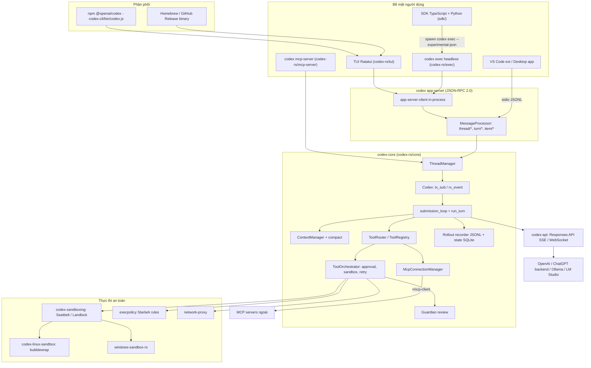
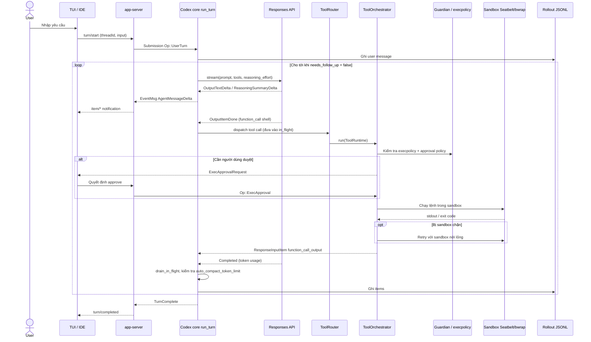

# Codex CLI — Tài liệu thiết kế giải pháp

> **Fork:** [mrchinh189/codex](https://github.com/mrchinh189/codex) · **Upstream:** [openai/codex](https://github.com/openai/codex)
> **Nhóm:** AI coding agent / CLI
> **Ngôn ngữ chính:** Rust (`codex-rs`, phiên bản được duy trì) + TypeScript (npm launcher, SDK) + Python (SDK) · **License:** Apache-2.0 · **Commit đã phân tích:** `b00a05c`

## 1. Tóm tắt

Codex CLI là coding agent của OpenAI chạy local trên máy lập trình viên: đọc repo, chạy lệnh shell, sửa file bằng patch và lặp cho tới khi hoàn thành task. Bản hiện tại được viết lại hoàn toàn bằng Rust (`codex-rs/`), phân phối dưới dạng binary native qua npm (`@openai/codex`) hoặc Homebrew. Điểm khác biệt cốt lõi là **sandbox ở mức hệ điều hành** (Seatbelt trên macOS, bubblewrap/Landlock trên Linux, sandbox riêng trên Windows) kết hợp **chính sách phê duyệt** (approval policy), execpolicy viết bằng Starlark và cơ chế "guardian" tự đánh giá rủi ro — cho phép agent tự chủ cao mà vẫn kiểm soát được rủi ro. Core được thiết kế dạng hàng đợi Submission/Event và được bọc bởi một **app-server JSON-RPC** để phục vụ TUI, IDE extension, desktop app và SDK.

## 2. Bài toán & yêu cầu

- **Bài toán:** Cho phép model (OpenAI Responses API hoặc model OSS qua Ollama/LM Studio) thao tác thật trên codebase local — chạy lệnh, sửa file — một cách an toàn, minh bạch và có thể tự động hoá.
- **Yêu cầu chức năng chính:**
  - TUI toàn màn hình tương tác (`codex-rs/tui`), chế độ headless `codex exec` (`codex-rs/exec`), review code (`codex review`).
  - Bộ tool cho model: `shell`/`exec_command`/`write_stdin` (unified exec, PTY), `apply_patch`, `update_plan`, `view_image`, `list_dir`, `web_search`, `js_repl`, `request_user_input`, `request_permissions`, `tool_search`, multi-agent (`spawn_agent`, `send_input`, `wait_agent`, `close_agent`...), tool MCP (`codex-rs/core/src/tools/spec.rs`).
  - MCP client (kết nối MCP server từ `config.toml`) và MCP server (`codex mcp-server`).
  - Session lưu dạng rollout JSONL, resume/fork/undo/rollback, compaction context.
  - Đăng nhập bằng ChatGPT hoặc API key (`codex-rs/login`), Codex Cloud tasks.
  - Skills, plugins, hooks, AGENTS.md theo dự án.
- **Yêu cầu phi chức năng:**
  - Bảo mật: sandbox OS bắt buộc theo mặc định, network bị chặn trong `workspace-write`, phê duyệt theo policy, fail-closed.
  - Zero-dependency install: binary tĩnh (musl trên Linux), npm chỉ là launcher (`codex-cli/bin/codex.js`).
  - Hiệu năng: streaming SSE/WebSocket, tool chạy song song (`core/src/tools/parallel.rs`), prewarm session.
  - Quan sát: OpenTelemetry (`codex-rs/otel`), feedback tags, `RUST_LOG`.
- **Ngoài phạm vi:** Codex Web (agent cloud) không nằm trong repo; repo chỉ có client `cloud-tasks` để duyệt và apply kết quả. Không hỗ trợ API dạng Chat Completions — `WireApi` chỉ còn `Responses` (`core/src/model_provider_info.rs`).

## 3. Kiến trúc tổng thể

**Giải thích:** `codex-core` là thư viện chứa toàn bộ logic. Giao diện chính với core là cặp kênh `Submission` (vào, kiểu `Op`) / `Event` (ra, kiểu `EventMsg`) trong struct `Codex` (`core/src/codex.rs`). `ThreadManager` quản lý nhiều thread (cuộc hội thoại). Lớp `app-server` bọc core thành API JSON-RPC với ba primitive Thread/Turn/Item; TUI (khi bật feature `TuiAppServer`) và `exec` dùng app-server chạy in-process qua `codex-app-server-client`, còn IDE/desktop dùng stdio. Mọi lệnh có side-effect đi qua `ToolOrchestrator` để quyết định phê duyệt và chọn sandbox.

## 4. Thành phần chính

| Thành phần | Vị trí trong mã nguồn | Trách nhiệm |
|---|---|---|
| CLI multitool | `codex-rs/cli/src/main.rs` | Subcommand: `exec`, `review`, `login`, `mcp`, `mcp-server`, `app-server`, `app`, `sandbox`, `execpolicy`, `apply`, `resume`, `fork`, `cloud`, `features`... |
| npm launcher | `codex-cli/bin/codex.js` | Chọn binary theo `platform`/`arch` rồi `spawn` |
| Codex / Session | `codex-rs/core/src/codex.rs` | Queue Submission/Event, `submission_loop`, `run_turn`, `run_sampling_request` |
| ThreadManager | `codex-rs/core/src/thread_manager.rs` | Tạo/resume/fork thread, quản lý vòng đời |
| ModelClient | `codex-rs/core/src/client.rs`, `codex-rs/codex-api/` | Gọi Responses API, stream `ResponseEvent` qua SSE/WebSocket |
| Model providers | `codex-rs/core/src/model_provider_info.rs` | Provider built-in: OpenAI, Ollama, LM Studio (OSS, `CODEX_OSS_BASE_URL`) |
| ContextManager | `codex-rs/core/src/context_manager/` | Lịch sử hội thoại, normalize, cập nhật context |
| Compaction | `codex-rs/core/src/compact.rs`, `compact_remote.rs`, `tasks/compact.rs` | Auto-compact khi vượt `auto_compact_token_limit` |
| Tools | `codex-rs/core/src/tools/` (`spec.rs`, `router.rs`, `registry.rs`, `handlers/`, `runtimes/`) | Khai báo spec tool cho model, route call tới handler |
| ToolOrchestrator | `codex-rs/core/src/tools/orchestrator.rs` | approval → chọn sandbox → chạy → retry với sandbox nới lỏng khi bị từ chối |
| Guardian | `codex-rs/core/src/guardian/` | Phiên LLM phụ đánh giá rủi ro, chỉ tự duyệt khi `risk_score < 80`, fail-closed |
| apply_patch | `codex-rs/apply-patch/`, `core/src/tools/handlers/tool_apply_patch.lark` | Định dạng patch riêng `*** Begin Patch ... *** End Patch` |
| Sandboxing | `codex-rs/sandboxing/`, `codex-rs/linux-sandbox/`, `codex-rs/windows-sandbox-rs/` | Seatbelt (`.sbpl`), bubblewrap/Landlock, Windows sandbox |
| execpolicy | `codex-rs/execpolicy/` | Luật `prefix_rule` Starlark: `allow` / `prompt` / `forbidden` |
| Network proxy | `codex-rs/network-proxy/`, `core/src/tools/network_approval.rs` | Kiểm soát truy cập mạng có phê duyệt |
| MCP | `codex-rs/core/src/mcp_connection_manager.rs`, `codex-rs/rmcp-client/`, `codex-rs/mcp-server/` | Client tới MCP server ngoài; chạy Codex như MCP server |
| Rollout & state | `codex-rs/rollout/`, `codex-rs/state/` | Ghi `~/.codex/sessions/rollout-*.jsonl`; index/metadata qua SQLite (sqlx) |
| app-server | `codex-rs/app-server/`, `app-server-protocol/`, `app-server-client/` | JSON-RPC 2.0 qua stdio JSONL hoặc WebSocket (thử nghiệm) |
| TUI | `codex-rs/tui/` | Giao diện Ratatui |
| Hooks | `codex-rs/hooks/` | Sự kiện `AfterAgent`, `AfterToolUse`, notify script |
| Skills / Plugins | `codex-rs/skills/`, `codex-rs/core-skills/`, `codex-rs/plugin/`, `core/src/plugins/` | Mở rộng hành vi agent |
| Code mode | `codex-rs/code-mode/` (V8), `core/src/tools/js_repl/` | Cho model viết JS để gọi tool / REPL |
| SDK | `sdk/typescript/src/`, `sdk/python/` | Nhúng Codex vào ứng dụng (`Codex`, `Thread`, `exec`) |

### 4.1 Core: hàng đợi Submission/Event
`Codex` (`core/src/codex.rs`) chỉ có `tx_sub: Sender<Submission>` và `rx_event: Receiver<Event>` cùng `agent_status`. Frontend gửi `Op` như `UserTurn`, `UserInput`, `Interrupt`, `ExecApproval`, `PatchApproval`, `Compact`, `Undo`, `ThreadRollback`, `Review`, `Shutdown`... (`codex-rs/protocol/src/protocol.rs`). Core phát `EventMsg` như `TurnStarted`, `AgentMessageDelta`, `AgentReasoningDelta`, `ExecCommandBegin/OutputDelta/End`, `ExecApprovalRequest`, `ApplyPatchApprovalRequest`, `McpToolCallBegin/End`, `TokenCount`, `ContextCompacted`, `TurnComplete`. Thiết kế này tách hoàn toàn UI khỏi logic và cho phép nhiều frontend dùng chung core.

### 4.2 Turn loop
`run_turn` lặp: dựng prompt từ lịch sử + tool spec (`built_tools` → `ToolRouter`), gọi `run_sampling_request` → `try_run_sampling_request`. Trong đó `ModelClientSession::stream` trả các `ResponseEvent` (`OutputItemAdded`, `OutputTextDelta`, `ReasoningSummaryDelta`, `OutputItemDone`, `RateLimits`, `Completed`...). Mỗi `OutputItemDone` là function call sẽ được `handle_output_item_done` chuyển thành future đẩy vào `FuturesOrdered in_flight` — tool chạy đồng thời trong khi stream tiếp tục; cuối stream `drain_in_flight` gom kết quả. Nếu có tool output thì `needs_follow_up = true` và lặp; nếu tổng token ≥ `auto_compact_token_limit` khi còn follow-up thì `run_auto_compact` trước khi lặp.

### 4.3 Approval + sandbox
`AskForApproval` có `untrusted` (UnlessTrusted – chỉ tự duyệt lệnh đọc an toàn), `OnFailure` (deprecated), `OnRequest` (mặc định – model tự quyết khi nào xin), `Granular`, `Never`. `SandboxPolicy` có `danger-full-access`, `read-only`, `workspace-write`, `ExternalSandbox`. `ToolOrchestrator` thực thi chuỗi: tính `ExecApprovalRequirement` (kết hợp execpolicy) → hỏi người dùng hoặc guardian → chọn `SandboxType` qua `SandboxManager` → chạy → nếu lỗi do sandbox thì retry với sandbox leo thang (không hỏi lại nhờ cache phê duyệt).

## 5. Luồng xử lý chính

### 5.1 Một turn với tool call cần phê duyệt

### 5.2 `codex exec` headless
`codex exec PROMPT` (hoặc prompt qua stdin) khởi động app-server in-process (`exec/src/lib.rs` dùng `InProcessAppServerClient`), chạy tới khi agent tự kết thúc, in output dạng human (`event_processor_with_human_output.rs`) hoặc JSONL (`event_processor_with_jsonl_output.rs`). `--ephemeral` không ghi rollout. Đây là đường SDK TypeScript dùng: `sdk/typescript/src/exec.ts` spawn `codex exec --experimental-json` và đọc event JSONL.

### 5.3 Resume / fork
Rollout JSONL lưu đầy đủ item; `codex resume` / `thread/resume` dựng lại lịch sử (`core/src/codex/rollout_reconstruction.rs`), `fork` sao chép lịch sử sang thread id mới.

## 6. Mô hình dữ liệu & giao diện

- **Protocol nội bộ:** `codex-rs/protocol` — `Submission { id, op: Op }`, `Event { id, msg: EventMsg }`, `SandboxPolicy`, `AskForApproval`, `UserInput`, `ReviewDecision`. Kiểu được derive `JsonSchema` + `TS` để sinh schema/TypeScript cho client.
- **App-server JSON-RPC:** handshake `initialize`/`initialized`; `thread/start|resume|fork`, `turn/start`, notification `thread/started`, `turn/started`, `item/*`, `turn/completed`; server-request cho approval (`codex-rs/app-server/README.md`). Transport: stdio JSONL (mặc định) hoặc `ws://` (thử nghiệm, có `/readyz`, `/healthz`).
- **Cấu hình:** `~/.codex/config.toml` (TOML) — `model`, `model_provider`, `sandbox_mode`, `approval_policy`, `[mcp_servers.*]`, `notify`, profile, feature flags (`codex-rs/config/`, `docs/config.md`, `docs/example-config.md`). Override bằng `-c key=value`, `--sandbox`, `--profile`.
- **AGENTS.md:** `core/src/project_doc.rs` gom mọi `AGENTS.md` từ project root xuống cwd, nối với `instructions` trong config.
- **Rollout:** `~/.codex/sessions/rollout-<timestamp>-<uuid>.jsonl`, đọc được bằng `jq`; archived ở `archived_sessions`.
- **Patch format:** grammar Lark `tool_apply_patch.lark` (`*** Begin Patch`, add/delete/update hunk, `*** End Patch`).
- **execpolicy:** file Starlark với `prefix_rule(pattern, decision, justification, match, not_match)` và `host_executable(name, paths)`.
- **Hooks:** `HookEvent::AfterAgent`, `HookEvent::AfterToolUse` (`codex-rs/hooks/src/types.rs`).

## 7. Tech stack

| Lớp | Công nghệ | Vai trò |
|---|---|---|
| Ngôn ngữ core | Rust (Cargo workspace nhiều crate), tokio | Toàn bộ agent |
| Build | Cargo + Bazel (`MODULE.bazel`, `BUILD.bazel`), Nix flake, `justfile` | Build đa nền tảng, RBE |
| LLM API | OpenAI Responses API (SSE / WebSocket) | Sampling model |
| TUI | Ratatui | Giao diện terminal |
| MCP | `rmcp` (`codex-rmcp-client`) | Client/server MCP |
| Sandbox | macOS Seatbelt (`.sbpl`), Linux bubblewrap + Landlock + seccomp, Windows sandbox | Cô lập lệnh |
| Policy | Starlark (execpolicy) | Luật lệnh |
| Lưu trữ | JSONL rollout, SQLite (sqlx) trong `codex-rs/state` | Session, index, log |
| Code mode | V8 (`code-mode`), JS REPL | Tool dạng code |
| Quan sát | OpenTelemetry (`codex-rs/otel`), tracing | Trace/metrics |
| Phân phối | npm (`@openai/codex`), Homebrew cask, GitHub Releases | Cài đặt |
| SDK | TypeScript (`sdk/typescript`), Python (`sdk/python`) | Tích hợp |

## 8. Quyết định thiết kế & đánh đổi

| Quyết định | Lý do | Đánh đổi |
|---|---|---|
| Viết lại từ TypeScript sang Rust | Binary native zero-dependency, hiệu năng, truy cập API sandbox OS | Hai ngôn ngữ trong lịch sử, đóng góp khó hơn cho dev JS |
| Core giao tiếp qua queue Submission/Event | Tách UI khỏi logic, nhiều frontend dùng chung | Mọi tương tác (kể cả approval) phải mô hình hoá thành Op/Event |
| App-server JSON-RPC làm lớp tích hợp chung | IDE, desktop, TUI, SDK dùng một API ổn định có schema | Thêm một lớp gián tiếp; WebSocket chưa production-ready |
| Sandbox OS mặc định + approval policy | Cho agent tự chủ mà vẫn chặn ghi ngoài workspace và network | Một số lệnh hợp lệ bị chặn → cần retry/escalation; khác biệt giữa OS |
| Retry với sandbox leo thang có cache phê duyệt | Giảm số lần hỏi người dùng | Logic orchestrator phức tạp |
| Guardian LLM tự duyệt rủi ro thấp/trung bình | Giảm phiền nhiễu trong `on-request` | Tốn thêm lời gọi model; fail-closed khi timeout |
| Chỉ hỗ trợ Responses API | Tận dụng reasoning, tool built-in (web_search), stateful | Provider chỉ dùng Chat Completions không tương thích |
| Patch format riêng thay vì unified diff | Model sinh ổn định, parse chặt bằng grammar | Không phải chuẩn phổ biến |
| Tool chạy song song trong khi stream | Giảm độ trễ turn | Cần đảm bảo thứ tự output (`FuturesOrdered`) |
| Rollout JSONL append-only | Đơn giản, dễ debug, resume/fork | Cần SQLite phụ trợ để index/list nhanh |

## 9. Triển khai & vận hành

- **Cài đặt:** `npm i -g @openai/codex` hoặc `brew install --cask codex`, hoặc tải binary từ GitHub Releases (`codex-<target>.tar.gz`).
- **Xác thực:** `codex login` (Sign in with ChatGPT hoặc API key) — `codex-rs/login`, lưu credential (có `keyring-store`).
- **Chạy:** `codex` (TUI), `codex exec "..."` (CI/automation), `codex review`, `codex resume --last`, `codex mcp-server`, `codex app-server --listen stdio://`.
- **Sandbox:** `--sandbox read-only|workspace-write|danger-full-access`; thử nghiệm bằng `codex sandbox macos|linux|windows [COMMAND]`. Linux ưu tiên `/usr/bin/bwrap`, fallback bubblewrap vendored (`codex-rs/linux-sandbox/README.md`).
- **Docker:** `codex-cli/Dockerfile` dựa trên `node:24-slim`, cài gói `codex.tgz`, đặt `CODEX_UNSAFE_ALLOW_NO_SANDBOX=1` vì coi container là đã cô lập, kèm `scripts/init_firewall.sh` (iptables/ipset) để giới hạn egress; chạy qua `scripts/run_in_container.sh`.
- **Build từ source:** trong `codex-rs/` dùng `cargo build` / `just`; Bazel cho CI (`docs/install.md`).
- **Quan sát:** `RUST_LOG`, OpenTelemetry exporter, `codex debug`, `notify` script khi kết thúc turn.
- **Giới hạn đã biết:** WebSocket app-server chưa hỗ trợ chính thức và mặc định không xác thực với listener non-loopback; `OnFailure` đã deprecated; `danger-full-access` chỉ nên dùng trong môi trường đã cô lập.

## 10. Điểm mở rộng

- **MCP servers:** khai báo `[mcp_servers.<name>]` trong `config.toml` hoặc `codex mcp add`; tool được đưa vào `ToolRouter` (có `tool_search` để tìm tool khi số lượng lớn).
- **Model provider:** thêm `[model_providers.<id>]` (base URL tương thích Responses API) hoặc dùng `--oss` với Ollama/LM Studio.
- **AGENTS.md:** hướng dẫn theo dự án, xếp tầng từ root tới thư mục hiện tại (`docs/agents_md.md`).
- **Skills:** `docs/skills.md`, `codex-rs/skills/`; **custom prompts / slash commands:** `docs/prompts.md`, `docs/slash_commands.md`.
- **Plugins & hooks:** `codex-rs/plugin/`, `codex-rs/hooks/` (`AfterAgent`, `AfterToolUse`), `notify`.
- **execpolicy:** viết luật Starlark để allow/prompt/forbid lệnh cụ thể (`codex execpolicy` để kiểm tra).
- **Dynamic tools:** client app-server có thể đăng ký tool riêng (`DynamicToolSpec`, `Op::DynamicToolResponse`).
- **SDK:** nhúng vào ứng dụng Node/Python (`sdk/typescript/src/codex.ts`, `thread.ts`).
- **Tool handler mới (fork):** thêm handler vào `core/src/tools/handlers/` và đăng ký trong `core/src/tools/spec.rs` (`builder.register_handler`).

## 11. Bài học & cách áp dụng

- **Queue-pair API cho agent core:** định nghĩa `Op` vào / `Event` ra, có schema sinh tự động (JsonSchema + TS) → mọi frontend (TUI, IDE, SDK) dùng chung, dễ test.
- **Orchestrator cho side-effect:** gom approval + chọn sandbox + retry vào một chỗ, áp dụng thống nhất cho mọi `ToolRuntime` (shell, apply_patch, unified exec).
- **Defense in depth:** sandbox OS + execpolicy tĩnh + approval động + guardian LLM + network proxy; mỗi lớp fail-closed.
- **Streaming + thực thi tool song song:** đẩy tool future vào `FuturesOrdered` ngay khi item hoàn tất, không chờ hết stream.
- **Lưu lịch sử append-only (JSONL):** đơn giản mà hỗ trợ resume, fork, rollback, debug bằng `jq`.
- **Định dạng edit có grammar:** dùng grammar (Lark) để ràng buộc output sửa file của model, tránh lỗi parse.
- **Đóng gói binary qua npm launcher:** tận dụng kênh phân phối npm nhưng chạy binary native theo nền tảng.

## 12. Tham khảo

- README: `README.md`, `codex-rs/README.md`, `codex-rs/app-server/README.md`, `codex-rs/linux-sandbox/README.md`, `codex-rs/execpolicy/README.md`
- Docs: `docs/config.md`, `docs/sandbox.md`, `docs/exec.md`, `docs/agents_md.md`, `docs/skills.md`, `docs/install.md`; https://developers.openai.com/codex
- Core: `codex-rs/core/src/codex.rs`, `codex-rs/core/src/client.rs`, `codex-rs/core/src/thread_manager.rs`
- Tools: `codex-rs/core/src/tools/spec.rs`, `router.rs`, `orchestrator.rs`, `handlers/`
- An toàn: `codex-rs/core/src/guardian/mod.rs`, `codex-rs/sandboxing/src/`, `codex-rs/protocol/src/protocol.rs`
- Lưu trữ: `codex-rs/rollout/src/recorder.rs`, `codex-rs/state/`
- Phân phối: `codex-cli/package.json`, `codex-cli/bin/codex.js`, `codex-cli/Dockerfile`
- SDK: `sdk/typescript/src/`, `sdk/python/`
