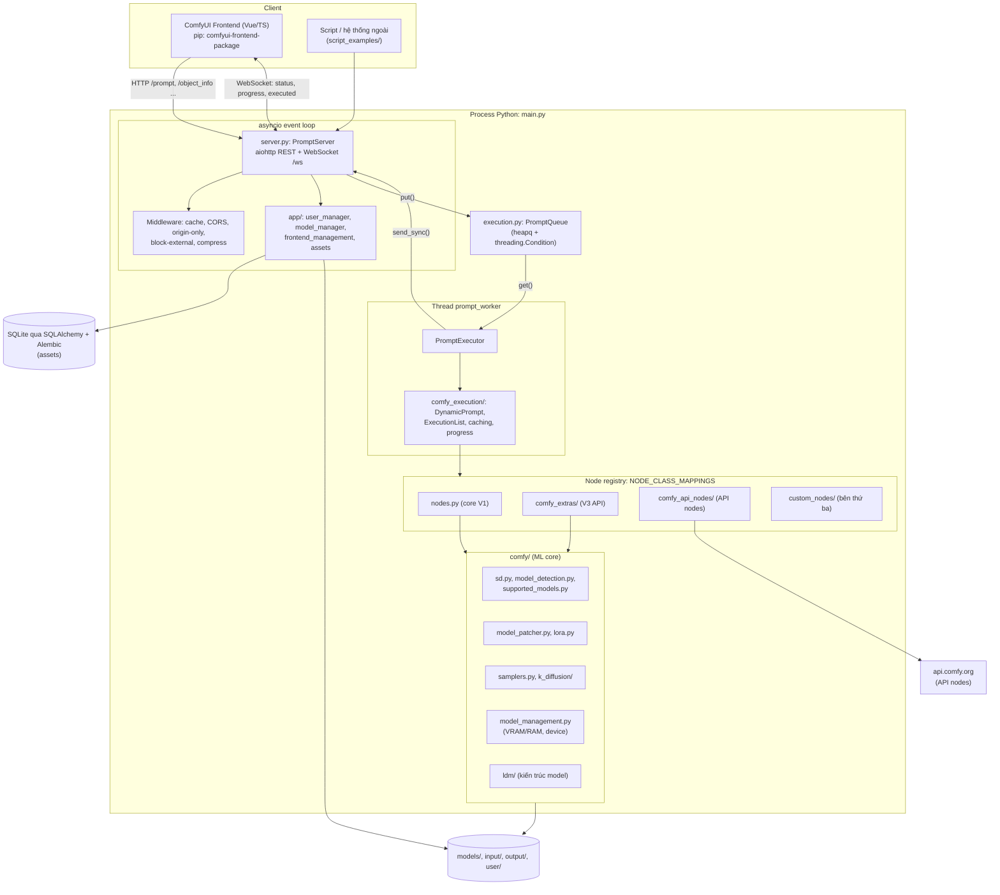
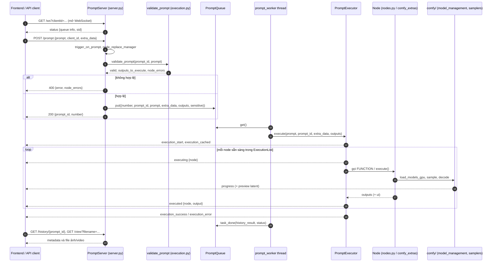

# ComfyUI — Tài liệu thiết kế giải pháp

> **Fork:** [mrchinh189/ComfyUI](https://github.com/mrchinh189/ComfyUI) · **Upstream:** [comfyanonymous/ComfyUI](https://github.com/comfyanonymous/ComfyUI) (do Comfy Org phát triển)
> **Nhóm:** Nền tảng workflow
> **Ngôn ngữ chính:** Python (≥ 3.10, PyTorch) · **License:** GPL-3.0 · **Commit đã phân tích:** `7d4194d`

## 1. Tóm tắt

ComfyUI là một **engine thực thi workflow dạng node graph** cho AI sinh nội dung (ảnh, video, audio, 3D). Người dùng kéo-thả node trên giao diện web để nối các bước (load checkpoint → encode prompt → sample → decode VAE → lưu ảnh); backend Python nhận graph dưới dạng JSON ("prompt"), validate, sắp xếp topo, rồi thực thi từng node trên GPU với **cache kết quả trung gian** để chỉ chạy lại phần graph thay đổi. Điểm khác biệt cốt lõi: hỗ trợ native rất nhiều model mở (SD1.x/SDXL/SD3/Flux/Wan/Hunyuan/LTX...), quản lý VRAM thông minh (offload để chạy trên GPU ~1GB), hệ sinh thái **custom node** khổng lồ, và cùng một API HTTP/WebSocket dùng cho cả UI lẫn tích hợp production.

## 2. Bài toán & yêu cầu

- **Bài toán:** Pipeline diffusion có rất nhiều biến thể (model, LoRA, ControlNet, sampler, scheduler, upscaler...). Viết code cho từng tổ hợp thì chậm và khó tái sử dụng; UI dạng form thì thiếu linh hoạt. Cần một mô hình "graph of operations" vừa trực quan cho người dùng sáng tạo, vừa tự động hoá được qua API.
- **Yêu cầu chức năng chính:**
  - Định nghĩa workflow bằng node graph; lưu/tải workflow JSON, nhúng workflow vào metadata PNG/WebP/FLAC đầu ra.
  - Hàng đợi bất đồng bộ (queue) các prompt, có ưu tiên ("front"), huỷ, interrupt, lịch sử.
  - Thực thi chỉ phần graph thay đổi (cache theo input signature), hỗ trợ lazy input, node async, mở rộng graph động (subgraph/expand).
  - Load nhiều định dạng model (ckpt, safetensors, diffusers), tự nhận dạng kiến trúc model.
  - Tiến độ thời gian thực + preview latent qua WebSocket.
  - Mở rộng bằng custom node (thư mục `custom_nodes/`) và "API nodes" gọi model đóng (OpenAI, Gemini, Kling, Runway, Stability, ...).
- **Yêu cầu phi chức năng:**
  - Chạy được trên NVIDIA/AMD/Intel/Apple Silicon/Ascend và cả CPU; tối ưu VRAM/RAM (offload, pinned memory, dynamic VRAM).
  - Hoạt động offline hoàn toàn: core không tự tải gì trừ khi người dùng muốn (README).
  - An toàn khi load model (safe loading ckpt/pt), mặc định chỉ listen `127.0.0.1`, có middleware chặn origin/external.
- **Ngoài phạm vi:** frontend đã tách sang repo riêng `Comfy-Org/ComfyUI_frontend` và được cài như package pip `comfyui-frontend-package`; trình quản lý custom node (ComfyUI-Manager) là package tuỳ chọn (`manager_requirements.txt`); desktop app nằm ở `Comfy-Org/desktop`. Repo không kèm Dockerfile chính thức.

## 3. Kiến trúc tổng thể



Giải thích:

- **Hai luồng thực thi chính:** event loop asyncio chạy `PromptServer` (aiohttp), còn một **daemon thread** `prompt_worker` (`main.py`) lấy job từ `PromptQueue` và gọi `PromptExecutor.execute()`. Giao tiếp ngược về client qua `server.send_sync()` (đẩy message vào loop để phát WebSocket).
- **Node là đơn vị mở rộng:** mọi node (core, extras, API, custom) đều đăng ký vào dict `NODE_CLASS_MAPPINGS` trong `nodes.py`; executor chỉ biết interface của node.
- **`comfy/`** là thư viện ML độc lập: load model, patch trọng số (LoRA), sampling, quản lý bộ nhớ thiết bị.

## 4. Thành phần chính

| Thành phần | Vị trí trong mã nguồn | Trách nhiệm |
|---|---|---|
| Entry point | `main.py` | Áp dụng đường dẫn tuỳ chỉnh, chạy prestartup script của custom node, setup DB, tạo `PromptServer`, `init_extra_nodes`, khởi động thread `prompt_worker`, chạy server |
| CLI args | `comfy/cli_args.py` | `--listen`, `--port`, `--cpu`, `--lowvram/--highvram/--novram`, `--cache-*`, `--disable-api-nodes`, `--multi-user`, `--database-url`, `--front-end-version`, ... |
| HTTP/WS server | `server.py` (`PromptServer`) | Route REST, WebSocket `/ws`, middleware, gửi sự kiện, phục vụ static frontend |
| Executor | `execution.py` | `validate_prompt`, `PromptExecutor.execute_async`, `execute()` từng node, `CacheSet`, `PromptQueue` + history |
| Graph runtime | `comfy_execution/graph.py` | `DynamicPrompt` (cho phép thêm node ephemeral), `TopologicalSort`, `ExecutionList` (chọn node sẵn sàng, phát hiện cycle) |
| Caching | `comfy_execution/caching.py`, `cache_provider.py` | Key theo input signature/ID, `HierarchicalCache`, `LRUCache`, `RAMPressureCache`, `NullCache`, cache provider ngoài |
| Progress & jobs | `comfy_execution/progress.py`, `jobs.py` | Progress handler (WebUI), chuẩn hoá trạng thái job cho `/api/jobs` |
| Node core (V1) | `nodes.py` | Node built-in (`CheckpointLoaderSimple`, `KSampler`, `VAEDecode`, ...), `load_custom_node`, `init_extra_nodes` |
| Node API V3 | `comfy_api/latest/` (`_io.py`, `__init__.py`) | `ComfyNode`, `Schema`, `NodeOutput`, `ComfyExtension`, kiểu IO có định kiểu |
| Node mở rộng | `comfy_extras/` (~120 file) | Node nâng cao: mask, video, audio, model-specific, ... |
| API nodes | `comfy_api_nodes/` + `util/client.py` | Node gọi dịch vụ đóng qua `https://api.comfy.org` |
| ML core | `comfy/sd.py`, `model_detection.py`, `supported_models.py`, `model_base.py`, `ldm/` | Load checkpoint, nhận dạng kiến trúc từ state dict, định nghĩa mạng |
| Model patching | `comfy/model_patcher.py`, `lora.py`, `weight_adapter/` | Áp LoRA/patch lên trọng số mà không sửa model gốc, load/offload |
| Sampling | `comfy/samplers.py`, `sample.py`, `k_diffusion/` | Hàm CFG, scheduler, KSampler |
| Quản lý bộ nhớ | `comfy/model_management.py`, `memory_management.py`, `pinned_memory.py` | Phát hiện thiết bị, `load_models_gpu`, `free_memory`, VRAM state |
| Đường dẫn model | `folder_paths.py`, `extra_model_paths.yaml.example` | Bản đồ `folder_names_and_paths` (checkpoints, loras, vae, ...) |
| App services | `app/` | `user_manager.py` (multi-user), `model_manager.py`, `frontend_management.py`, `subgraph_manager.py`, `node_replace_manager.py`, `assets/` |
| Persistence | `app/database/`, `app/assets/database/models.py`, `alembic_db/` | SQLite/SQLAlchemy cho asset (bảng `assets`, `asset_references`, `tags`, ...), migration Alembic |

### 4.1 Executor (`execution.py`)

`PromptExecutor.execute_async()` làm các bước: đặt preview method, gửi `execution_start`, tạo `DynamicPrompt`, đặt prompt cho các cache và dọn mục không dùng, xác định node đã cache rồi gửi `execution_cached`, sau đó lặp `ExecutionList.stage_node_execution()` → `execute()` cho tới khi hết node. Kết quả `execute()` có ba trạng thái `SUCCESS` / `FAILURE` / `PENDING` (`ExecutionResult`): `PENDING` xảy ra khi node cần thêm lazy input hoặc đang chờ node async/subgraph. Tất cả chạy trong `torch.inference_mode()`.

Trong `execute()`: kiểm tra cache; với node có `check_lazy_status` thì chỉ yêu cầu các input thật sự cần; gọi hàm của node qua `_async_map_node_over_list` (tự map khi input là list/batch); nếu node trả về `expand` thì graph mới được chèn vào `DynamicPrompt` như node ephemeral (cơ chế subgraph/vòng lặp động); node `OUTPUT_NODE` sinh UI output (ảnh, ...) được gửi qua sự kiện `executed`.

### 4.2 Caching

`CacheSet` gồm hai cache: `outputs` (key theo **input signature** — hash của toàn bộ input và tổ tiên, `CacheKeySetInputSignature`) và `objects` (key theo ID node, giữ instance node). Chế độ chọn bằng CLI: mặc định `RAM_PRESSURE` (giải phóng theo headroom RAM), `--cache-classic`, `--cache-lru N`, `--cache-none`. `IsChangedCache` gọi `IS_CHANGED` (V1) hoặc `fingerprint_inputs` (V3) để node tự báo "đã thay đổi" (ví dụ file ảnh input bị sửa).

### 4.3 Node registry & custom node

`init_extra_nodes()` (`nodes.py`) nạp lần lượt: public API, node trong `comfy_extras/`, API nodes (`comfy_api_nodes/`, tắt bằng `--disable-api-nodes`), rồi custom node trong `custom_nodes/`. `load_custom_node()` import module và chấp nhận hai kiểu: biến `NODE_CLASS_MAPPINGS` (V1) hoặc hàm `comfy_entrypoint` trả `ComfyExtension` (V3); `WEB_DIRECTORY` để phục vụ JS mở rộng frontend.

## 5. Luồng xử lý chính

### 5.1 Gửi và thực thi một workflow



### 5.2 Khởi động server

`start_comfyui()` (`main.py`): tạo event loop → `PromptServer(loop)` → `hijack_progress` (móc progress bar của `comfy.utils` vào WebSocket) → `init_extra_nodes()` → `add_routes()` → khởi động `prompt_worker` thread → `run()` gom `start_multi_address` và `publish_loop` bằng `asyncio.gather`. Sau mỗi job, worker kiểm tra flag `unload_models`/`free_memory` (do `POST /free` đặt) và chạy `gc.collect()` + `soft_empty_cache()` định kỳ.

## 6. Mô hình dữ liệu & giao diện

**Định dạng prompt (API format)** — dict `node_id → {class_type, inputs}`, input là giá trị hoặc link `[node_id_nguồn, chỉ_số_output]`:

```json
{
  "4": {"class_type": "CheckpointLoaderSimple", "inputs": {"ckpt_name": "model.safetensors"}},
  "6": {"class_type": "CLIPTextEncode", "inputs": {"text": "a cat", "clip": ["4", 1]}},
  "3": {"class_type": "KSampler", "inputs": {"model": ["4", 0], "positive": ["6", 0], "...": "..."}}
}
```

**Định nghĩa node V1** (`nodes.py`): class với `INPUT_TYPES()` (classmethod trả `required`/`optional`/`hidden`), `RETURN_TYPES`, `FUNCTION`, `CATEGORY`, tuỳ chọn `OUTPUT_NODE`, `IS_CHANGED`, `check_lazy_status`.

**Định nghĩa node V3** (`comfy_api/latest/_io.py`): `class X(io.ComfyNode)` với `define_schema()` trả `io.Schema(node_id, category, inputs=[io.Int.Input(...)], outputs=[...])` và `execute(cls, **kwargs) -> io.NodeOutput`; đóng gói bằng `ComfyExtension.get_node_list()` và hàm `comfy_entrypoint`.

**REST API chính** (`server.py`):

| Endpoint | Mục đích |
|---|---|
| `GET /ws` | WebSocket sự kiện (`status`, `execution_start`, `execution_cached`, `executing`, `progress`, `executed`, `execution_success`, `execution_error`, `execution_interrupted`) |
| `POST /prompt`, `GET /prompt` | Đưa workflow vào hàng đợi / xem số job còn lại |
| `GET /queue`, `POST /queue` | Xem / xoá hoặc huỷ job trong hàng đợi |
| `POST /interrupt` | Ngắt job đang chạy |
| `GET /history`, `GET /history/{prompt_id}`, `POST /history` | Lịch sử và kết quả |
| `GET /api/jobs`, `GET /api/jobs/{job_id}` | API job chuẩn hoá (pending/in_progress/completed/failed/cancelled) |
| `GET /object_info`, `GET /object_info/{node_class}` | Schema mọi node (frontend dùng để dựng UI) |
| `POST /upload/image`, `POST /upload/mask`, `GET /view` | Upload input, xem output |
| `GET /models`, `GET /models/{folder}`, `GET /embeddings`, `GET /extensions` | Liệt kê tài nguyên |
| `GET /system_stats`, `GET /features`, `POST /free` | Thông tin hệ thống, feature flag, giải phóng bộ nhớ |

Đặc tả asset API có trong `openapi.yaml`. Ví dụ client: `script_examples/basic_api_example.py`, `websockets_api_example.py`.

**Cấu hình & lưu trữ:** `extra_model_paths.yaml` (chia sẻ thư mục model với UI khác), thư mục `models/<loại>/`, `input/`, `output/`, `user/` (settings, workflow, `users.json` khi `--multi-user`), DB mặc định SQLite (`--database-url`), migration `alembic_db/versions/`. Workflow mẫu (blueprint) dạng JSON trong `blueprints/`.

## 7. Tech stack

| Lớp | Công nghệ | Vai trò |
|---|---|---|
| Ngôn ngữ | Python ≥ 3.10 (`pyproject.toml`) | Toàn bộ backend |
| ML | PyTorch, torchvision, torchaudio, torchsde, einops, safetensors, transformers, tokenizers, sentencepiece, spandrel, kornia | Mạng nơ-ron, tokenizer, upscaler |
| Web | aiohttp, yarl | REST + WebSocket server |
| Dữ liệu | SQLAlchemy 2, Alembic, SQLite | Asset DB, migration |
| Media | Pillow, av (PyAV), numpy, scipy | Ảnh, video, audio |
| Tiện ích | pydantic/pydantic-settings, pyyaml, psutil, blake3, simpleeval, filelock | Schema, cấu hình, RAM, hash asset |
| Frontend | `comfyui-frontend-package` (Vue/TS build sẵn), `comfyui-workflow-templates`, `comfyui-embedded-docs` | UI, template, docs nhúng |
| Bộ nhớ GPU | `comfy-kitchen`, `comfy-aimdo` (requirements) | Tối ưu kernel / quản lý bộ nhớ |
| Chất lượng | ruff, pylint, pytest (`tests/`, `tests-unit/`), GitHub Actions (`.github/workflows/`) | Lint, test, release |

## 8. Quyết định thiết kế & đánh đổi

| Quyết định | Lý do | Đánh đổi |
|---|---|---|
| Workflow là graph JSON thuần (API format) | Dễ lưu, nhúng vào ảnh, gửi qua API, tái lập kết quả | Graph lớn khó đọc bằng tay; phiên bản node thay đổi có thể làm hỏng workflow cũ (có `node_replace_manager`) |
| Một worker thread thực thi tuần tự, server async riêng | Đơn giản, tránh tranh chấp GPU, UI vẫn phản hồi | Không song song nhiều job trên một instance; scale bằng nhiều process/instance |
| Cache theo input signature của cả tổ tiên | Chỉ chạy lại phần thay đổi, rất nhanh khi tinh chỉnh tham số | Tốn RAM/VRAM; cần nhiều chế độ cache (RAM pressure, LRU, none) |
| Hàng đợi + history trong bộ nhớ (`PromptQueue`) | Nhanh, không phụ thuộc DB | Mất hàng đợi/lịch sử khi restart; history giới hạn `MAXIMUM_HISTORY_SIZE` |
| Custom node là Python import trực tiếp vào process | Mở rộng cực linh hoạt, hệ sinh thái lớn | Không sandbox: custom node có toàn quyền process, có thể xung đột dependency hoặc làm crash server |
| Hai thế hệ API node (V1 class attribute, V3 `io.Schema`) | Giữ tương thích ngược, V3 có định kiểu & versioning (`comfy_api/v0_0_x`) | Hai cách viết song song, tăng độ phức tạp executor |
| Tách frontend thành package pip | Phát hành độc lập, có thể chọn version (`--front-end-version`) | Phải đồng bộ phiên bản giữa core và frontend |
| Tự nhận dạng model từ state dict | Người dùng chỉ cần thả file vào `models/` | Phải cập nhật `model_detection.py`/`supported_models.py` cho mỗi kiến trúc mới |
| Quản lý VRAM chủ động (offload, pinned, dynamic) | Chạy model lớn trên GPU nhỏ | Logic phức tạp (`model_management.py` > 2000 dòng), hiệu năng phụ thuộc phần cứng |

## 9. Triển khai & vận hành

- **Local:** desktop app (Windows/macOS), bản portable Windows (Python nhúng + PyTorch CUDA), `comfy-cli` (`pip install comfy-cli && comfy install`), hoặc thủ công: cài PyTorch theo GPU, `pip install -r requirements.txt`, `python main.py` (mặc định `127.0.0.1:8188`).
- **Cloud:** Comfy Cloud (dịch vụ trả phí của upstream, nằm ngoài repo). Repo không có Dockerfile chính thức; workflow CI `update-ci-container.yml` chỉ phục vụ CI.
- **Mạng & bảo mật:** `--listen` để mở ra ngoài, `--tls-keyfile/--tls-certfile` cho HTTPS, `--enable-cors-header`, middleware origin-only/block-external (`server.py`), `--max-upload-size`; `--multi-user` tách storage theo header `comfy-user`. Khoá API nhạy cảm trong `extra_data` được tách riêng (`SENSITIVE_EXTRA_DATA_KEYS`) và loại khỏi history.
- **Hiệu năng/bộ nhớ:** `--lowvram`, `--novram`, `--highvram`, `--cpu`, `--cpu-vae`, các chế độ cache; `POST /free` để unload model.
- **Quan sát:** log qua `app/logger.py`, `GET /system_stats`, sự kiện WebSocket, `/api/jobs`.
- **Phát hành:** chu kỳ khoảng hàng tuần/2 tuần; commit ngoài tag stable có thể làm hỏng custom node (README).
- **Giới hạn đã biết:** một job tại một thời điểm mỗi instance; custom node không cô lập; queue/history mất khi restart.

## 10. Điểm mở rộng

- **Custom node (V1):** tạo thư mục trong `custom_nodes/` với `__init__.py` export `NODE_CLASS_MAPPINGS` (+ `NODE_DISPLAY_NAME_MAPPINGS`, `WEB_DIRECTORY` cho JS frontend). Có thể kèm `prestartup_script.py` (chạy bởi `execute_prestartup_script` trong `main.py`).
- **Custom node (V3):** export `comfy_entrypoint()` trả `ComfyExtension` với `get_node_list()` gồm các lớp `io.ComfyNode`.
- **API node:** theo mẫu `comfy_api_nodes/nodes_*.py`, dùng helper `comfy_api_nodes/util/client.py`; có template workflow `.github/workflows/api-node-template.yml`.
- **Kiến trúc model mới:** thêm mạng vào `comfy/ldm/<model>/`, cấu hình vào `comfy/supported_models.py`, nhận dạng trong `comfy/model_detection.py`, text encoder trong `comfy/text_encoders/`.
- **Sampler/scheduler:** `comfy/samplers.py`, `comfy/k_diffusion/`, `comfy/extra_samplers/`.
- **Hooks & patch:** `comfy/hooks.py`, `comfy/patcher_extension.py`, `ModelPatcher` cho wrapper/callback trong quá trình sampling.
- **Cache provider ngoài:** `comfy_execution/cache_provider.py` (`enable_providers=True` cho outputs cache).
- **Server hook:** `PromptServer.trigger_on_prompt` cho phép extension sửa prompt trước khi queue; custom node có thể đăng ký route aiohttp riêng.
- **Thư mục model bổ sung:** `extra_model_paths.yaml`.

## 11. Bài học & cách áp dụng

- **Graph-as-data + executor tách biệt:** biểu diễn workflow bằng JSON đơn giản (`class_type` + `inputs` có link), còn executor chỉ cần registry `type → class`. Mẫu này áp dụng tốt cho mọi engine pipeline (ETL, agent tool-chain).
- **Cache theo chữ ký đầu vào của cả nhánh tổ tiên** cho phép "chỉnh một tham số, chạy lại tối thiểu" — rất đáng học cho pipeline AI tốn kém.
- **Lazy input + `PENDING` + graph expansion** biến DAG tĩnh thành DAG động (điều kiện, vòng lặp) mà không cần ngôn ngữ riêng.
- **Server async + worker thread + queue có ưu tiên** là kiến trúc tối thiểu, dễ hiểu để phục vụ tác vụ GPU dài.
- **WebSocket event stream có cấu trúc** (`executing`, `progress`, `executed`) giúp UI và client tự động hoá dùng chung một giao thức.
- **Schema node do server công bố (`/object_info`)** để frontend tự sinh UI — tách rời UI và backend.
- **Plugin bằng convention đơn giản** (`NODE_CLASS_MAPPINGS`) giúp hệ sinh thái bùng nổ; nhưng nếu áp dụng cho môi trường multi-tenant cần thêm sandbox/cô lập.

## 12. Tham khảo

- README: `README.md`; hướng dẫn quantization: `QUANTIZATION.md`; bảo mật: `SECURITY.md`; đóng góp: `CONTRIBUTING.md`
- Docs chính thức: https://docs.comfy.org/ · Frontend: https://github.com/Comfy-Org/ComfyUI_frontend
- Mã nguồn chính: `main.py`, `server.py`, `execution.py`, `nodes.py`, `folder_paths.py`, `comfy/cli_args.py`, `comfy_execution/graph.py`, `comfy_execution/caching.py`, `comfy_execution/jobs.py`, `comfy_api/latest/_io.py`, `comfy/sd.py`, `comfy/model_management.py`, `comfy/model_patcher.py`, `comfy/samplers.py`, `app/frontend_management.py`, `app/user_manager.py`, `app/assets/database/models.py`
- Đặc tả API: `openapi.yaml`; ví dụ client: `script_examples/`
- Upstream: https://github.com/comfyanonymous/ComfyUI
