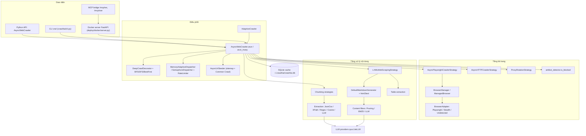
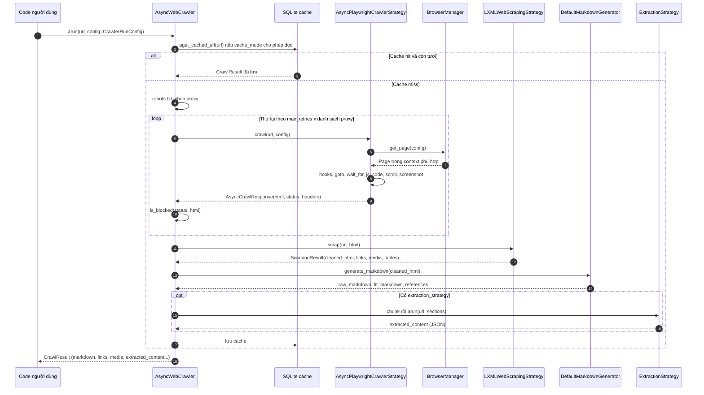
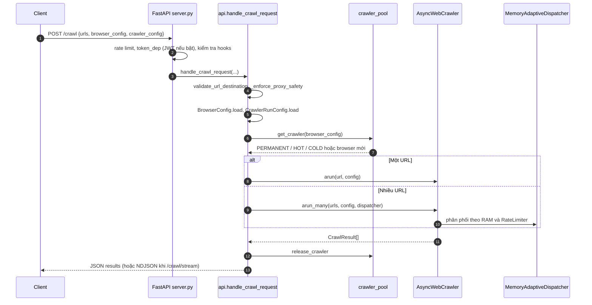

# Crawl4AI — Tài liệu thiết kế giải pháp

> **Fork:** [mrchinh189/crawl4ai](https://github.com/mrchinh189/crawl4ai) · **Upstream:** [unclecode/crawl4ai](https://github.com/unclecode/crawl4ai)
> **Nhóm:** Web scraping
> **Ngôn ngữ chính:** Python (>= 3.10) · **License:** Apache-2.0 (kèm điều khoản bắt buộc ghi công UncleCode/Crawl4AI ở cuối `LICENSE`) · **Commit đã phân tích:** `cdf2ead`

## 1. Tóm tắt

Crawl4AI là một **thư viện crawler/scraper mã nguồn mở, async, thân thiện với LLM**: biến trang web thành Markdown sạch (kèm "fit markdown" đã lọc nhiễu và danh sách trích dẫn) hoặc JSON có cấu trúc, phục vụ RAG, agent và pipeline dữ liệu. Lõi là `AsyncWebCrawler` điều khiển trình duyệt qua Playwright, với kiến trúc **Strategy pattern** ở mọi tầng (crawl, scraping, markdown, content filter, chunking, extraction, deep crawl, dispatcher, proxy). Ngoài thư viện, repo có CLI `crwl` và một **Docker server** FastAPI (REST + MCP + dashboard giám sát + browser pool 3 tầng). Phiên bản phân tích: `0.8.9` (`crawl4ai/__version__.py`).

## 2. Bài toán & yêu cầu

- **Bài toán:** Đưa nội dung web vào LLM cần đầu ra sạch, có cấu trúc, ít token; crawl được trang JS động, đi sâu nhiều trang có định hướng, kiểm soát tài nguyên khi chạy song song, và tự host được mà không cần API key trả phí.
- **Yêu cầu chức năng chính:**
  - Crawl một URL (`http(s)://`, `file://`, `raw:`) hoặc nhiều URL (`arun_many`) với cache, session, proxy, cookie, header, JS tùy biến, chờ selector, cuộn toàn trang/virtual scroll, iframe, screenshot, PDF, MHTML, bắt network/console.
  - Sinh Markdown (raw + fit + citations), lọc nội dung (Pruning, BM25, LLM), trích bảng.
  - Trích xuất cấu trúc: CSS/XPath/lxml schema, regex, cosine clustering, LLM (mọi provider qua LiteLLM).
  - Deep crawl BFS/DFS/Best-First với filter chain và scorer; khám phá URL qua sitemap + Common Crawl (`AsyncUrlSeeder`); adaptive crawling dừng khi "đủ thông tin"; domain mapping.
  - Chống chặn: stealth/undetected adapter, phát hiện anti-bot, retry + xoay proxy + `fallback_fetch_function`.
  - Docker API: `/crawl`, `/crawl/stream`, `/md`, `/html`, `/screenshot`, `/pdf`, `/execute_js`, `/llm/...`, job async + webhook, MCP (WS/SSE), dashboard.
- **Yêu cầu phi chức năng:**
  - Hiệu năng: async toàn bộ, tái sử dụng browser/context/page, cache SQLite, chế độ `text_mode`/`light_mode`.
  - Kiểm soát tài nguyên: `MemoryAdaptiveDispatcher` theo % RAM, `RateLimiter` theo domain, browser pool có ngưỡng bộ nhớ.
  - Bảo mật (server): JWT tùy chọn, rate limit, chống SSRF (`validate_url_destination`, `_enforce_proxy_safety`), hooks tắt mặc định vì rủi ro RCE.
  - Khả năng mở rộng: mọi thành phần là strategy có thể thay thế; config serialize được (`dump()`/`load()`).
- **Ngoài phạm vi:** không có hàng đợi phân tán đa node (server chạy 1 worker Gunicorn), không có dịch vụ chống bot trả phí tích hợp; bản Cloud API được nhắc trong README là sản phẩm riêng (closed beta).

## 3. Kiến trúc tổng thể



Luồng dữ liệu tổng quát: **Config** (`BrowserConfig` cho trình duyệt, `CrawlerRunConfig` cho từng lần crawl) → `AsyncWebCrawler` kiểm tra cache → **crawler strategy** tải HTML (`AsyncCrawlResponse`) → **scraping strategy** làm sạch HTML, gom link/media/bảng (`ScrapingResult`) → **markdown generator** (+ content filter) → **chunking + extraction strategy** → `CrawlResult` và ghi cache.

## 4. Thành phần chính

| Thành phần | Vị trí trong mã nguồn | Trách nhiệm |
|---|---|---|
| `AsyncWebCrawler` | `crawl4ai/async_webcrawler.py` | API chính: `arun`, `arun_many`, `aprocess_html`, `aseed_urls`, `amap_domain`; cache, robots.txt, retry anti-bot, proxy |
| Config | `crawl4ai/async_configs.py` | `BrowserConfig`, `CrawlerRunConfig`, `HTTPCrawlerConfig`, `LLMConfig`, `ProxyConfig`, `GeolocationConfig`, `VirtualScrollConfig`, `LinkPreviewConfig`, `SeedingConfig`, `DomainMapperConfig`; `to_serializable_dict`/`from_serializable_dict` |
| Crawler strategies | `crawl4ai/async_crawler_strategy.py` | `AsyncPlaywrightCrawlerStrategy` (trình duyệt, hooks, scroll, screenshot, PDF, MHTML, JS), `AsyncHTTPCrawlerStrategy` (HTTP thuần, file) |
| Browser management | `crawl4ai/browser_manager.py` | `BrowserManager` (context theo chữ ký config, LRU evict, session, recycle), `ManagedBrowser` (CDP, profile), cache kết nối CDP |
| Browser adapters | `crawl4ai/browser_adapter.py` | `PlaywrightAdapter`, `StealthAdapter` (playwright-stealth), `UndetectedAdapter` (patchright) |
| Browser profiler | `crawl4ai/browser_profiler.py` | Tạo/quản lý profile bền (đăng nhập, cookie) |
| Scraping | `crawl4ai/content_scraping_strategy.py` | `LXMLWebScrapingStrategy.scrap()` → `ScrapingResult` (cleaned_html, links, media, metadata, tables) |
| Markdown | `crawl4ai/markdown_generation_strategy.py`, `crawl4ai/html2text/` | `DefaultMarkdownGenerator`: raw markdown, chuyển link thành citations, fit markdown |
| Content filters | `crawl4ai/content_filter_strategy.py` | `PruningContentFilter`, `BM25ContentFilter`, `LLMContentFilter` |
| Chunking | `crawl4ai/chunking_strategy.py` | Identity, Regex, NlpSentence, TopicSegmentation, FixedLengthWord, SlidingWindow, OverlappingWindow |
| Extraction | `crawl4ai/extraction_strategy.py` | `JsonCssExtractionStrategy`, `JsonXPathExtractionStrategy`, `JsonLxmlExtractionStrategy`, `RegexExtractionStrategy`, `CosineStrategy`, `LLMExtractionStrategy` |
| Tables | `crawl4ai/table_extraction.py` | `DefaultTableExtraction`, `LLMTableExtraction` |
| Dispatcher | `crawl4ai/async_dispatcher.py` | `MemoryAdaptiveDispatcher`, `SemaphoreDispatcher`, `RateLimiter` (backoff theo domain) |
| Deep crawling | `crawl4ai/deep_crawling/` | `DeepCrawlDecorator`, `BFSDeepCrawlStrategy`, `DFSDeepCrawlStrategy`, `BestFirstCrawlingStrategy`, `FilterChain` + filters, `CompositeScorer` + scorers |
| URL seeding | `crawl4ai/async_url_seeder.py` | Khám phá URL từ robots.txt → sitemap và Common Crawl index, lọc pattern, chấm BM25 |
| Adaptive | `crawl4ai/adaptive_crawler.py` | `AdaptiveCrawler` với `StatisticalStrategy`/`EmbeddingStrategy`, `CrawlState` |
| Domain mapper | `crawl4ai/domain_mapper.py` | `DomainMapper`, phát hiện soft-404 |
| Anti-bot | `crawl4ai/antibot_detector.py` | Heuristic phân tầng (status 403/503, pattern Akamai/Cloudflare..., trang rỗng) |
| Proxy | `crawl4ai/proxy_strategy.py` | `ProxyConfig`, `RoundRobinProxyStrategy` |
| Cache | `crawl4ai/async_database.py`, `cache_context.py`, `cache_validator.py` | SQLite (aiosqlite) + thư mục nội dung; `CacheMode`; xác thực độ tươi bằng ETag/Last-Modified/head fingerprint |
| Models | `crawl4ai/models.py` | `CrawlResult`, `CrawlResultContainer`, `AsyncCrawlResponse`, `MarkdownGenerationResult`, `ScrapingResult`, `Links`, `Media`, `DispatchResult` |
| C4A-Script | `crawl4ai/script/` | DSL tương tác trang biên dịch sang JS (dùng `lark`) |
| CLI | `crawl4ai/cli.py` | `crwl crawl`, `browser`, `cdp`, `config`, `profiles`, `examples`, `shrink` |
| Docker server | `deploy/docker/server.py`, `api.py`, `crawler_pool.py`, `job.py`, `webhook.py`, `auth.py`, `mcp_bridge.py`, `monitor.py`, `hook_manager.py`, `config.yml` | REST API, browser pool, job Redis, webhook, JWT, MCP, dashboard |
| Docker SDK | `crawl4ai/docker_client.py` | Client Python gọi Docker server |

### 4.1. `AsyncWebCrawler.arun` (`crawl4ai/async_webcrawler.py`)

Trình tự trong `arun`:

1. Tự `start()` nếu chưa sẵn sàng; mặc định `cache_mode = CacheMode.ENABLED`.
2. Đọc cache (`async_db_manager.aget_cached_url`); nếu `check_cache_freshness` thì `CacheValidator` kiểm tra ETag/Last-Modified để gắn `cache_status` = `hit_validated`, `hit_fallback` hoặc bỏ cache.
3. Nếu không có cache: chọn proxy (sticky theo `proxy_session_id` hoặc `proxy_rotation_strategy`), kiểm tra `robots.txt` khi `check_robots_txt=True`.
4. Vòng **anti-bot retry**: `1 + max_retries` lần × danh sách proxy; mỗi lần gọi `crawler_strategy.crawl()` rồi `aprocess_html()`, sau đó `is_blocked(status, html)`. Hết lượt vẫn bị chặn thì gọi `fallback_fetch_function` (nếu có). Thống kê lưu vào `crawl_stats` (`proxies_used`, `resolved_by`, `fallback_fetch_used`).
5. Ghi cache và trả về `CrawlResultContainer`.

`aprocess_html` gọi `scraping_strategy.scrap()`, sinh Markdown bằng `markdown_generator.generate_markdown()` (nguồn `cleaned_html`/`raw_html`/`fit_html`), rồi nếu có `extraction_strategy`: chọn `input_format`, chia chunk (HTML thì dùng `IdentityChunking`) và chạy `extraction_strategy.arun/run`.

### 4.2. Deep crawl qua decorator

`DeepCrawlDecorator` (`crawl4ai/deep_crawling/base_strategy.py`) bọc `arun`: nếu `config.deep_crawl_strategy` có mặt, nó chuyển quyền điều khiển sang `strategy.arun(crawler, start_url, config)`; một `ContextVar` `deep_crawl_active` ngăn đệ quy khi strategy gọi lại `arun` cho từng trang. Kết quả có thể là list hoặc async generator (`stream=True`). Strategy dùng `FilterChain` (URL pattern, domain, content-type, relevance, SEO) và scorer (keyword, path depth, freshness, domain authority) để chọn link.

### 4.3. Docker server và browser pool 3 tầng

`deploy/docker/crawler_pool.py` giữ `PERMANENT` (browser cấu hình mặc định, luôn sống), `HOT_POOL` (config dùng ≥ 3 lần) và `COLD_POOL` (config hiếm), khóa bằng `asyncio.Lock`, khóa chữ ký config bằng hash. Trước khi tạo browser mới, kiểm tra RAM container (cgroup) so với `memory_threshold_percent` (95% trong `config.yml`); một `janitor()` chạy nền đóng browser nhàn rỗi theo TTL. `api.py` (`handle_crawl_request`) load config từ dict (`BrowserConfig.load`, `CrawlerRunConfig.load`), validate URL đích, lấy crawler từ pool và gọi `arun` (1 URL) hoặc `arun_many` với `MemoryAdaptiveDispatcher`. Tài liệu chi tiết: `deploy/docker/ARCHITECTURE.md`.

## 5. Luồng xử lý chính

### 5.1. Crawl một URL bằng thư viện



### 5.2. `POST /crawl` trên Docker server



Với job dài, client dùng `POST /crawl/job` (trả 202 + `task_id`, kết quả lưu Redis với TTL `task_ttl_seconds`, có thể gọi webhook) rồi poll `GET /crawl/job/{task_id}` — định nghĩa trong `deploy/docker/job.py`.

## 6. Mô hình dữ liệu & giao diện

**Python API**

```python
from crawl4ai import AsyncWebCrawler, BrowserConfig, CrawlerRunConfig, CacheMode
from crawl4ai import JsonCssExtractionStrategy, LLMExtractionStrategy, LLMConfig
from crawl4ai.deep_crawling import BFSDeepCrawlStrategy
```

- `BrowserConfig` (trích): `browser_type`, `headless`, `browser_mode`, `use_managed_browser`, `cdp_url`, `use_persistent_context`, `user_data_dir`, `proxy_config`, `viewport_*`, `storage_state`, `cookies`, `headers`, `user_agent_mode`, `text_mode`, `light_mode`, `extra_args`, `enable_stealth`, `avoid_ads`, `init_scripts`, `memory_saving_mode`, `max_pages_before_recycle`.
- `CrawlerRunConfig` (trích): nội dung (`word_count_threshold`, `css_selector`, `target_elements`, `excluded_tags`), strategy (`extraction_strategy`, `chunking_strategy`, `markdown_generator`, `scraping_strategy`, `table_extraction`, `deep_crawl_strategy`), cache (`cache_mode`, `check_cache_freshness`), chờ (`wait_until`, `wait_for`, `page_timeout`), tương tác (`js_code`, `scan_full_page`, `virtual_scroll_config`, `process_iframes`, `remove_overlay_elements`, `remove_consent_popups`, `simulate_user`, `magic`), đầu ra (`screenshot`, `pdf`, `capture_mhtml`, `capture_network_requests`), link (`exclude_external_links`, `score_links`), proxy (`proxy_rotation_strategy`, `proxy_session_id`), điều khiển (`stream`, `prefetch`, `check_robots_txt`, `max_retries`, `fallback_fetch_function`, `url_matcher`).
- Config serialize được bằng `dump()`/`load()` — chính là định dạng `browser_config`/`crawler_config` gửi lên Docker API.

**`CrawlResult`** (`crawl4ai/models.py`): `url`, `html`, `fit_html`, `cleaned_html`, `success`, `media`, `links`, `markdown` (`MarkdownGenerationResult`: raw, fit, citations, references), `extracted_content`, `metadata`, `screenshot`, `pdf`, `mhtml`, `downloaded_files`, `js_execution_result`, `tables`, `status_code`, `response_headers`, `redirected_url`, `ssl_certificate`, `network_requests`, `console_messages`, `session_id`, `cache_status`, `crawl_stats`, `dispatch_result`.

**Hooks của Playwright strategy**: `on_browser_created`, `on_page_context_created`, `on_user_agent_updated`, `on_execution_started`, `on_execution_ended`, `before_goto`, `after_goto`, `before_return_html`, `before_retrieve_html` (đăng ký bằng `crawler_strategy.set_hook`).

**CLI** (`crwl`, entry point trong `pyproject.toml`): `crwl <url> -o markdown`, `crwl crawl ... --deep-crawl bfs --max-pages 10`, `-q "câu hỏi"` cho trích xuất LLM, `crwl browser start/stop/status/view/restart`, `crwl cdp`, `crwl profiles`, `crwl config`. Các lệnh khác: `crawl4ai-setup`, `crawl4ai-doctor`, `crawl4ai-download-models`, `crawl4ai-migrate`.

**Docker REST API** (`deploy/docker/server.py`, `job.py`, `monitor_routes.py`): `POST /crawl`, `POST /crawl/stream`, `POST /md`, `POST /html`, `POST /screenshot`, `POST /pdf`, `POST /execute_js`, `GET /llm/{url}`, `GET /ask`, `GET /schema`, `GET /hooks/info`, `POST /token`, `POST /config/dump`, `POST /crawl/job`, `GET /crawl/job/{task_id}`, `POST /llm/job`, `GET /llm/job/{task_id}`, `GET /health`, `GET /metrics` (Prometheus), router monitor (dashboard, `/monitor/ws`). Endpoint gắn `@mcp_tool` (`md`, `html`, `screenshot`, `pdf`, `execute_js`, `crawl`, `ask`) được `attach_mcp` xuất thành MCP tools qua WebSocket/SSE.

**Lưu trữ:** SQLite tại `~/.crawl4ai/crawl4ai.db` (đổi bằng `CRAWL4_AI_BASE_DIRECTORY`); Redis (trong container) cho task/job, thống kê monitor.

## 7. Tech stack

| Lớp | Công nghệ | Vai trò |
|---|---|---|
| Ngôn ngữ | Python 3.10–3.13, asyncio/anyio | Lõi async |
| Browser | `playwright`, `patchright`, `playwright-stealth` | Render, stealth, undetected |
| HTTP | `httpx[http2]`, `aiohttp`, `requests` | HTTP strategy, URL seeder, cache validator |
| Parsing | `lxml`, `beautifulsoup4`, `cssselect`, html2text (vendored) | Làm sạch HTML, trích xuất, Markdown |
| NLP/IR | `rank-bm25`, `snowballstemmer`, `nltk`; tùy chọn `torch`, `transformers`, `sentence-transformers`, `scikit-learn` | BM25 filter, chunking, cosine, embedding |
| LLM | `unclecode-litellm` (fork LiteLLM, pin `1.81.13`) | Gọi mọi provider LLM |
| Storage | `aiosqlite`, `aiofiles` | Cache |
| Dữ liệu | `pydantic` v2, `PyYAML`, `xxhash` | Model, config, hash |
| DSL | `lark` | C4A-Script |
| Hình học | `alphashape`, `shapely`, `numpy`, `pillow` | Xử lý layout/ảnh |
| CLI/UI | `click`, `rich`, `humanize` | CLI, log đẹp |
| Server | FastAPI, Gunicorn + UvicornWorker, Redis, supervisord, JWT | Docker API |
| Hệ thống | `psutil` | Giám sát bộ nhớ |

## 8. Quyết định thiết kế & đánh đổi

| Quyết định | Lý do | Đánh đổi |
|---|---|---|
| Strategy pattern cho mọi bước (crawl, scrape, markdown, filter, chunk, extract, deep crawl, dispatch, proxy) | Người dùng thay từng mảnh mà không sửa lõi | Nhiều lớp/khái niệm phải học; `CrawlerRunConfig` rất nhiều tham số |
| Gom tham số vào `BrowserConfig` + `CrawlerRunConfig` có `dump/load` | Một nguồn cấu hình, gửi được qua mạng tới Docker API | Serialize đối tượng strategy phức tạp; tương thích ngược với kwargs cũ (`CrawlResultContainer`) |
| Markdown 2 lớp: raw + fit (qua content filter) + citations | Cân bằng giữa đầy đủ và tiết kiệm token | Heuristic Pruning/BM25 có thể cắt nhầm nội dung |
| Extraction không LLM (CSS/XPath schema) song song với LLM | Rẻ, nhanh, xác định cho trang lặp mẫu; LLM cho trường hợp khó | Schema cần bảo trì khi site đổi |
| Retry anti-bot × proxy × fallback function trong `arun` | Tăng tỉ lệ thành công mà không cần dịch vụ ngoài | `arun` dài và phức tạp; heuristic phát hiện chặn có thể dương tính giả (chủ ý "thà nhầm còn hơn bỏ sót") |
| Deep crawl qua decorator + `ContextVar` | Giữ API `arun` duy nhất cho cả crawl đơn và sâu | Luồng điều khiển ẩn, khó debug |
| `MemoryAdaptiveDispatcher` theo % RAM | Tránh OOM khi chạy hàng trăm trang | Thông lượng dao động theo bộ nhớ máy |
| Browser pool 3 tầng (PERMANENT/HOT/COLD) ở server | Giảm chi phí khởi động browser cho config phổ biến | Trạng thái in-process, server 1 worker → giới hạn mở rộng ngang |
| Cache SQLite cục bộ | Không cần hạ tầng, tăng tốc lặp lại | Không chia sẻ giữa nhiều máy |
| Hooks dạng code string ở server tắt mặc định | Rủi ro RCE | Mất tính năng nếu không bật `CRAWL4AI_HOOKS_ENABLED=true` |
| Dùng fork `unclecode-litellm` | Phản ứng sự cố supply chain PyPI của `litellm` (README v0.8.6) | Phụ thuộc bản fork do tác giả duy trì |

## 9. Triển khai & vận hành

**Cài thư viện**

```bash
pip install -U crawl4ai
crawl4ai-setup      # cài Playwright browser, khởi tạo
crawl4ai-doctor     # kiểm tra môi trường
pip install "crawl4ai[all]"   # thêm torch/transformers/cosine/sync(selenium)
```

**Docker** (`Dockerfile`, `docker-compose.yml`):

- Image `python:3.12-slim-bookworm`, cài Redis server trong image, `crawl4ai-setup` + `playwright install --with-deps`, chạy bằng `supervisord` gồm `redis-server` và Gunicorn (`--workers 1 --threads 4 --timeout 1800`, `uvicorn.workers.UvicornWorker server:app`) trên port **11235**, user `appuser`.
- Build arg `INSTALL_TYPE` (`default|all|torch|transformer`), `ENABLE_GPU`.
- Compose: `env_file: .llm.env` (API key LLM), mount `/dev/shm`, giới hạn 4 GB RAM, healthcheck `GET /health`.

```bash
docker run -d -p 11235:11235 --shm-size=1g unclecode/crawl4ai:latest
# Dashboard: http://localhost:11235/dashboard  ·  Playground: http://localhost:11235/playground
```

**Cấu hình server** (`deploy/docker/config.yml`): `llm.provider` (mặc định `openai/gpt-4o-mini`), `redis.task_ttl_seconds=3600`, `rate_limiting.default_limit="1000/minute"`, `security.enabled/jwt_enabled/api_token`, `crawler.memory_threshold_percent=95`, `crawler.pool.max_pages=40`, `crawler.pool.idle_ttl_sec`, `crawler.browser.extra_args`, `observability.prometheus`, `webhooks`.

**Quan sát:** `/metrics` Prometheus, dashboard real-time qua WebSocket `/monitor/ws` (`monitor.py`), log `AsyncLogger` (rich), `CrawlerMonitor` (`crawl4ai/components/crawler_monitor.py`) cho dispatcher.

**Giới hạn & lưu ý:**

- Bảo mật mặc định của server còn mở (`security.enabled: false`); README v0.8.9 nói về các bản vá SSRF và một bản "secure-by-default" sắp ra — khi public cần bật JWT, đặt `SECRET_KEY`, giới hạn `trusted_hosts`.
- Server chạy 1 worker Gunicorn; mở rộng ngang cần nhiều container + load balancer.
- Bản sync (Selenium) đã deprecated.
- License yêu cầu ghi công khi phân phối/sử dụng công khai.

## 10. Điểm mở rộng

- **Crawler strategy:** kế thừa `AsyncCrawlerStrategy` (`crawl(url, **kwargs) -> AsyncCrawlResponse`) và truyền `AsyncWebCrawler(crawler_strategy=...)`.
- **Browser adapter:** kế thừa `BrowserAdapter` (`crawl4ai/browser_adapter.py`).
- **Scraping/Markdown:** kế thừa `ContentScrapingStrategy.scrap()` hoặc `MarkdownGenerationStrategy.generate_markdown()`.
- **Content filter:** kế thừa `RelevantContentFilter` (`filter_content`).
- **Chunking/Extraction:** kế thừa `ChunkingStrategy.chunk()` / `ExtractionStrategy.extract()`; với CSS schema có thể sinh schema bằng LLM rồi tái sử dụng.
- **Deep crawl:** kế thừa `DeepCrawlStrategy`, `URLFilter`, `URLScorer`; ghép bằng `FilterChain`, `CompositeScorer`.
- **Dispatcher/Rate limit:** kế thừa `BaseDispatcher`; tùy chỉnh `RateLimiter(base_delay, max_delay, max_retries, rate_limit_codes)`.
- **Proxy:** kế thừa `ProxyRotationStrategy.get_next_proxy()`.
- **Hooks:** `set_hook(...)` trên Playwright strategy; trên server qua `hooks` trong request (cần bật biến môi trường).
- **Crawler chuyên biệt:** thư mục `crawl4ai/crawlers/` (`amazon_product`, `google_search`) và `crawl4ai/hub.py` làm mẫu đóng gói crawler theo site.
- **MCP:** đánh dấu endpoint FastAPI mới bằng `@mcp_tool("name")` để tự xuất thành MCP tool (`deploy/docker/mcp_bridge.py`).

## 11. Bài học & cách áp dụng

1. **Config object tách khỏi engine:** `BrowserConfig` (vòng đời trình duyệt) vs `CrawlerRunConfig` (mỗi lần chạy), có `dump/load` → cùng một cấu hình dùng được ở thư viện, CLI và REST. Áp dụng cho mọi SDK có cả bản local lẫn bản server.
2. **Pipeline strategy có thể thay mảnh:** fetch → scrape → markdown → filter → chunk → extract. Mỗi bước có một interface nhỏ; dễ thử nghiệm và A/B.
3. **"Fit markdown" + citations:** tách nội dung chính khỏi nhiễu và đẩy link xuống cuối thành tham chiếu — mẹo rất hiệu quả để giảm token khi đưa web vào LLM.
4. **Kiểm soát tài nguyên theo bộ nhớ thực** (dispatcher + browser pool dùng cgroup) thay vì chỉ giới hạn số luồng — quan trọng khi chạy headless browser trong container.
5. **Anti-bot phân tầng + fallback** với triết lý "false positive rẻ, false negative đắt" là cách nghĩ đúng cho pipeline dữ liệu cần độ tin cậy.
6. **Decorator để mở rộng API mà không đổi chữ ký** (`DeepCrawlDecorator`) — giữ trải nghiệm người dùng đơn giản.
7. **Xuất REST thành MCP tự động** bằng decorator trên route — cách nhanh để biến một service sẵn có thành tool cho agent.
8. **Bảo mật khi tự host crawler:** chống SSRF ở URL lẫn proxy, tắt thực thi code người dùng mặc định — bài học trực tiếp từ các bản vá 0.8.x.

## 12. Tham khảo

- README: [`README.md`](https://github.com/unclecode/crawl4ai/blob/main/README.md), `ROADMAP.md`, `CHANGELOG.md`, `SECURITY.md`
- Tài liệu: https://docs.crawl4ai.com/ — nguồn trong `docs/md_v2/` (đặc biệt `core/browser-crawler-config.md`, `core/markdown-generation.md`, `core/deep-crawling.md`, `core/url-seeding.md`, `core/adaptive-crawling.md`, `core/self-hosting.md`)
- Docker: `Dockerfile`, `docker-compose.yml`, `deploy/docker/ARCHITECTURE.md`, `deploy/docker/README.md`, `deploy/docker/config.yml`, `deploy/docker/supervisord.conf`
- Mã nguồn chính: `crawl4ai/async_webcrawler.py`, `crawl4ai/async_configs.py`, `crawl4ai/async_crawler_strategy.py`, `crawl4ai/browser_manager.py`, `crawl4ai/content_scraping_strategy.py`, `crawl4ai/markdown_generation_strategy.py`, `crawl4ai/content_filter_strategy.py`, `crawl4ai/extraction_strategy.py`, `crawl4ai/async_dispatcher.py`, `crawl4ai/deep_crawling/`, `crawl4ai/async_url_seeder.py`, `crawl4ai/antibot_detector.py`, `crawl4ai/models.py`, `deploy/docker/server.py`, `deploy/docker/api.py`, `deploy/docker/crawler_pool.py`
