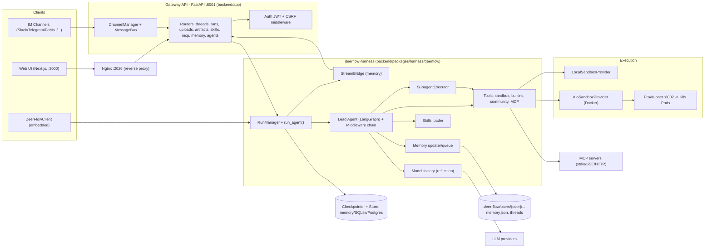
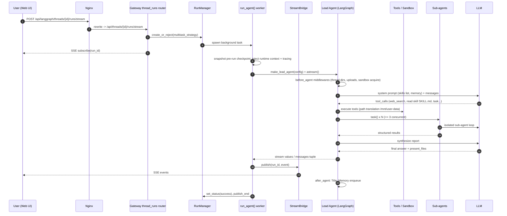

# DeerFlow — Tài liệu thiết kế giải pháp

> **Fork:** [mrchinh189/deer-flow](https://github.com/mrchinh189/deer-flow) · **Upstream:** [bytedance/deer-flow](https://github.com/bytedance/deer-flow)
> **Nhóm:** AI Agent / Deep research
> **Ngôn ngữ chính:** Python (backend) + TypeScript (frontend Next.js) · **License:** MIT · **Commit đã phân tích:** `5ddf698`

## 1. Tóm tắt

DeerFlow (**D**eep **E**xploration and **E**fficient **R**esearch **Flow**) 2.0 là một "super agent harness" mã nguồn mở của ByteDance, xây trên LangGraph/LangChain: một lead agent điều phối **sub-agent**, **sandbox** thực thi code, **long-term memory** và **skills** dạng Markdown để làm từ deep research tới sinh báo cáo, slide, website. Bản 2.0 là bản viết lại hoàn toàn (không chung code với v1, v1 nằm ở nhánh `main-1.x`). Điểm khác biệt cốt lõi: mỗi thread có một "máy tính" riêng (filesystem ảo `/mnt/user-data/...` + sandbox Docker/K8s), chuỗi middleware dày đặc quản lý context, và một Gateway FastAPI tương thích giao thức LangGraph để Web UI, IM channel (Slack, Telegram, Feishu…) và embedded Python client cùng dùng.

## 2. Bài toán & yêu cầu

- **Bài toán:** Các tác vụ nghiên cứu/tạo nội dung dài (vài phút đến vài giờ) vượt quá khả năng của một lần gọi LLM: cần lập kế hoạch, tìm kiếm web nhiều góc độ, chạy code, đọc/ghi file, chia việc song song rồi tổng hợp.
- **Yêu cầu chức năng chính:**
  - Lead agent có tool: web search/fetch, file ops, `bash`, MCP tools, `task` (giao việc cho sub-agent), `ask_clarification`, `present_files`, `view_image`.
  - Skill hệ thống (`skills/public/*/SKILL.md`): deep-research, chart-visualization, ppt-generation, podcast-generation, image/video-generation… nạp lũy tiến (progressive loading) hoặc kích hoạt bằng `/skill-name`.
  - Sandbox theo thread (local / Docker AIO / Kubernetes qua provisioner).
  - Long-term memory theo user (facts + context), tự cập nhật bất đồng bộ.
  - Đa kênh: Web UI (Next.js), IM channels, embedded client `DeerFlowClient`, Claude Code skill `claude-to-deerflow`.
  - Streaming SSE, hủy run, regenerate, branch theo checkpoint.
- **Yêu cầu phi chức năng:**
  - Model-agnostic (OpenAI-compatible, Anthropic, DeepSeek, Gemini, vLLM, Ollama, Codex CLI, Claude Code OAuth).
  - Không block event loop (có detector AST `make detect-blocking-io` và runtime gate Blockbuster trong `backend/tests/blocking_io/`).
  - Cô lập dữ liệu theo user: `.deer-flow/users/{user_id}/threads/{thread_id}/...`.
  - Bảo mật: mặc định triển khai trên loopback; auth JWT + CSRF; artifact HTML/SVG bị ép tải xuống để giảm XSS; guardrail trước tool call.
  - Quan sát: LangSmith và Langfuse.
- **Ngoài phạm vi:** Không phải dịch vụ multi-tenant scale ngang: Gateway giữ run state trong process nên production mặc định `GATEWAY_WORKERS=1`; chưa có stream bridge chia sẻ giữa các worker (README nói rõ).

## 3. Kiến trúc tổng thể

Giải thích:
- **Hai lớp backend tách bạch**: `backend/packages/harness/deerflow/` (package `deerflow-harness`, có thể publish) và `backend/app/` (Gateway + channels). Quy tắc phụ thuộc một chiều app → harness, được kiểm tra bởi `backend/tests/test_harness_boundary.py`.
- **Agent runtime chạy nhúng trong Gateway**: `RunManager` + `run_agent()` + `StreamBridge` (`deerflow/runtime/`). Nginx map `/api/langgraph/*` sang router native `/api/*` của Gateway, nên frontend dùng `@langchain/langgraph-sdk` như với LangGraph Server thật.
- `backend/langgraph.json` vẫn khai báo graph `lead_agent` → `deerflow.agents:make_lead_agent`, auth và checkpointer để dùng được với LangGraph Studio/CLI.

## 4. Thành phần chính

| Thành phần | Vị trí trong mã nguồn | Trách nhiệm |
|---|---|---|
| Gateway app | `backend/app/gateway/app.py`, `backend/app/gateway/routers/` | FastAPI: threads, runs (SSE), uploads, artifacts, skills, MCP config, memory, agents, suggestions, feedback, auth |
| Auth/CSRF | `backend/app/gateway/auth/`, `auth_middleware.py`, `csrf_middleware.py`, `internal_auth.py` | JWT, local password provider, CSRF origin check, internal token cho IM worker |
| IM channels | `backend/app/channels/` (`manager.py`, `message_bus.py`, `slack.py`, `telegram.py`, `feishu.py`, `dingtalk.py`, `wechat.py`, `wecom.py`, `discord.py`) | Cầu nối nền tảng chat ↔ Gateway qua `langgraph-sdk` |
| Lead agent | `deerflow/agents/lead_agent/agent.py` (`make_lead_agent`, `build_middlewares`) | Tạo agent LangGraph: chọn model, tool, prompt, middleware |
| ThreadState | `deerflow/agents/thread_state.py` | State mở rộng `AgentState`: sandbox, thread_data, artifacts, todos, viewed_images… với reducer riêng |
| Middlewares | `deerflow/agents/middlewares/` | ~20 middleware: thread data, uploads, sandbox, dangling tool call, LLM error, guardrail, summarization, todo, title, memory, loop detection, clarification… |
| Run runtime | `deerflow/runtime/runs/manager.py`, `worker.py`, `stream_bridge/` | Quản lý vòng đời run, multitask strategy, rollback checkpoint, phát SSE |
| Checkpointer/Store | `deerflow/runtime/checkpointer/async_provider.py`, `runtime/store/` | Backend memory/sqlite/postgres cho LangGraph |
| Persistence | `deerflow/persistence/` (SQLAlchemy + Alembic migrations) | Run, thread_meta, feedback, user, channel_connections |
| Sandbox | `deerflow/sandbox/` (`sandbox.py`, `sandbox_provider.py`, `tools.py`, `local/`) | Interface `Sandbox` + provider; tool `bash`, `ls`, `read_file`, `write_file`, `str_replace` |
| AIO sandbox | `deerflow/community/aio_sandbox/` | Sandbox Docker container, local/remote backend |
| Provisioner | `docker/provisioner/app.py` | FastAPI tạo/xóa Pod + NodePort Service trên K8s cho sandbox |
| Sub-agents | `deerflow/subagents/` (`executor.py`, `registry.py`, `builtins/general_purpose.py`, `bash_agent.py`) | Chạy sub-agent nền, giới hạn đồng thời, timeout |
| Tools | `deerflow/tools/tools.py`, `tools/builtins/` | `get_available_tools()` gộp tool config, MCP, builtin (`task_tool.py`, `clarification_tool.py`, `present_file_tool.py`, `tool_search.py`, `invoke_acp_agent_tool.py`…) |
| Community tools | `deerflow/community/` (tavily, jina_ai, firecrawl, exa, brave, serper, searxng, ddg_search, infoquest, browserless, image_search…) | Search/fetch provider có thể thay thế |
| MCP | `deerflow/mcp/` | `MultiServerMCPClient`, cache theo mtime, OAuth cho HTTP/SSE |
| Skills | `deerflow/skills/`, `skills/public/` | Quét `SKILL.md`, frontmatter, bật/tắt qua `extensions_config.json` |
| Memory | `deerflow/agents/memory/` (`updater.py`, `queue.py`, `prompt.py`, `storage.py`) | Trích facts bằng LLM, debounce, lưu `memory.json` theo user/agent |
| Model factory | `deerflow/models/factory.py`, `vllm_provider.py`, `claude_provider.py`, `openai_codex_provider.py` | Khởi tạo chat model qua reflection, thinking/vision |
| Guardrails | `deerflow/guardrails/` (`provider.py`, `builtin.py`, `middleware.py`) | `GuardrailProvider` Protocol, `AllowlistProvider` |
| Tracing | `deerflow/tracing/` | Callback LangSmith/Langfuse, metadata trace |
| Embedded client | `deerflow/client.py` | `DeerFlowClient` dùng runtime in-process, schema khớp Gateway |
| Frontend | `frontend/src/app/workspace`, `frontend/src/core/{threads,messages,artifacts,memory,skills,...}` | UI chat, artifact viewer, settings |

### 4.1 Lead agent & middleware chain
`make_lead_agent(config)` (`deerflow/agents/lead_agent/agent.py`) đọc runtime config (`thinking_enabled`, `model_name`, `is_plan_mode`, `subagent_enabled`, `agent_name`), gọi `create_chat_model()`, `get_available_tools()` và `apply_prompt_template()` (nhúng danh sách skill, memory, hướng dẫn sub-agent). Middleware được append theo thứ tự nghiêm ngặt (xem `backend/CLAUDE.md`): ThreadData → Uploads → Sandbox → DanglingToolCall → LLMErrorHandling → Guardrail → SandboxAudit → ToolErrorHandling → SkillActivation → Summarization → TodoList → TokenUsage → Title → Memory → ViewImage → DeferredToolFilter → SubagentLimit → LoopDetection → Clarification (luôn cuối, ngắt graph bằng `Command(goto=END)`).

Đây là nơi chứa phần lớn "context engineering": tóm tắt khi gần hết token, ẩn schema MCP tool cho tới khi `tool_search` promote, tự vá tool call bị treo, phát hiện vòng lặp tool call.

### 4.2 Sandbox & filesystem ảo
Agent chỉ thấy đường dẫn ảo: `/mnt/user-data/{uploads,workspace,outputs}`, `/mnt/skills`, `/mnt/acp-workspace`. `LocalSandboxProvider` (`deerflow/sandbox/local/local_sandbox_provider.py`) map sang `backend/.deer-flow/users/{user_id}/threads/{thread_id}/user-data/...`; host `bash` bị tắt mặc định vì không phải ranh giới cô lập. `AioSandboxProvider` chạy container all-in-one, có warm pool; chế độ K8s gọi provisioner (`docker/provisioner/app.py`) để tạo Pod mount hostPath skills (read-only) và user-data.

### 4.3 Sub-agent
Tool `task` (`deerflow/tools/builtins/task_tool.py`) → `SubagentExecutor` (`deerflow/subagents/executor.py`) chạy trên event loop cô lập/thread pool, poll trạng thái, phát event `task_started`/`task_running`/`task_completed|failed|timed_out`. `MAX_CONCURRENT_SUBAGENTS = 3` do `SubagentLimitMiddleware` cắt bớt tool call dư; timeout mặc định 1800s. Sub-agent graph compile với `checkpointer=False` (one-shot) và có context riêng, không thấy context lead agent.

### 4.4 Memory
`MemoryMiddleware` lọc tin nhắn user + câu trả lời cuối → `queue.py` debounce (30s mặc định) → `updater.py` gọi LLM trích `workContext`, `personalContext`, `topOfMind`, history và `facts` (category, confidence) → ghi atomic `{base_dir}/users/{user_id}/memory.json`. Lần chat sau, top facts + context được nhúng trong thẻ `<memory>` của system prompt, giới hạn `max_injection_tokens`.

## 5. Luồng xử lý chính

### 5.1 Web UI gửi một câu hỏi nghiên cứu (streaming)

Điểm đáng chú ý: nếu run lỗi hoặc bị interrupt/rollback, `worker.py::_rollback_to_pre_run_checkpoint` khôi phục checkpoint đã snapshot; `POST /runs/wait` drain bridge qua `wait_for_run_completion()` để tôn trọng `on_disconnect`.

### 5.2 Tin nhắn từ IM channel
Platform → `Channel` impl (`app/channels/telegram.py`…) → `MessageBus.publish_inbound()` → `ChannelManager._dispatch_loop()` tra/tạo thread (mapping lưu trong `app/channels/store.py`) → gọi Gateway bằng `langgraph-sdk` (`runs.stream()` cho Feishu/Telegram/DingTalk card để cập nhật dần, `runs.wait()` cho Slack/Discord) → `OutboundMessage` → callback channel trả lời. Lệnh `/new`, `/status`, `/models`, `/memory`, `/help` xử lý cục bộ.

## 6. Mô hình dữ liệu & giao diện

- **`config.yaml`** (mẫu `config.example.yaml`, có `config_version`): `models[]` (`use: module:Class`, `supports_thinking`, `supports_vision`, `when_thinking_enabled`), `tools[]`, `tool_groups[]`, `sandbox.use`, `skills.*`, `title`, `summarization`, `memory`, `subagents`, `channels`, `guardrails`, `checkpointer`. Giá trị bắt đầu bằng `$` được resolve từ env. Hot-reload theo chữ ký nội dung file; các trường hạ tầng liệt kê trong `deerflow/config/reload_boundary.py::STARTUP_ONLY_FIELDS` cần restart.
- **`extensions_config.json`**: MCP servers + trạng thái bật/tắt skill; Gateway `PUT /api/mcp/config` ghi vào file này.
- **ThreadState** (`thread_state.py`): `sandbox`, `thread_data`, `title`, `artifacts` (reducer dedupe), `todos`, `uploaded_files`, `viewed_images` (dict rỗng = xóa), `promoted` (deferred tools).
- **REST/SSE (Gateway)**: `/api/threads/{id}/runs[/stream|/wait|/cancel|/join]`, `/api/runs/stream|wait`, `/api/threads/{id}/uploads` (tự convert PDF/PPT/Excel/Word bằng markitdown), `/api/threads/{id}/artifacts/{path}`, `/api/skills` (+ `POST /install` file `.skill`), `/api/memory`, `/api/models`, `/api/mcp/config`, `/api/channels/...`, `/health`. Chi tiết: `backend/docs/API.md`, `backend/docs/STREAMING.md`.
- **Memory JSON**: `{ user: {workContext, personalContext, topOfMind}, history: {...}, facts: [{id, content, category, confidence, createdAt, source}] }`.
- **Skill**: thư mục chứa `SKILL.md` với YAML frontmatter (`name`, `description`, `license`, `allowed-tools`).
- **Custom agent**: `SOUL.md` + `config.yaml` tại `{base_dir}/users/{user_id}/agents/{agent_name}/`, tạo bằng tool `setup_agent`, cập nhật bằng `update_agent`.
- **Embedded API**: `DeerFlowClient.chat()`, `.stream()`, `.list_models()`, `.list_skills()`, `.upload_files()` — kiểm tra khớp schema Gateway bằng `TestGatewayConformance`.

## 7. Tech stack

| Lớp | Công nghệ | Vai trò |
|---|---|---|
| Agent framework | LangGraph ≥1.1, LangChain ≥1.2, `langgraph-api`, `langgraph-runtime-inmem` | Graph agent, checkpoint, protocol |
| LLM SDK | `langchain-openai`, `langchain-anthropic`, `langchain-deepseek`, `langchain-google-genai`, `langchain-ollama` (extra) | Đa provider |
| API | FastAPI, Uvicorn, `sse-starlette`, PyJWT, bcrypt | Gateway REST + SSE |
| Persistence | SQLAlchemy async, Alembic, aiosqlite, `langgraph-checkpoint-sqlite`/`-postgres`, asyncpg (extra) | Run/thread/feedback store, checkpointer |
| Search/crawl | Tavily, Exa, Firecrawl, DDGS, Jina, InfoQuest, readabilipy, markdownify, markitdown | Research tools |
| Sandbox | `agent-sandbox`, Docker, `kubernetes` client | Thực thi code cô lập |
| Protocols | `langchain-mcp-adapters` (MCP), `agent-client-protocol` (ACP) | Mở rộng tool/agent ngoài |
| IM | `slack-sdk`, `python-telegram-bot`, `lark-oapi`, `dingtalk-stream`, `wecom-aibot-python-sdk`, `discord.py` | Channels |
| Observability | LangSmith, `langfuse` | Tracing |
| Frontend | Next.js 16, React 19, Tailwind 4, Radix UI, TanStack Query, `@langchain/langgraph-sdk`, `ai` SDK, CodeMirror, `@xyflow/react` | Web workspace |
| Tooling | `uv` workspace, pnpm, ruff, pytest, vitest, Playwright, Blockbuster | Build & test |
| Hạ tầng | Docker Compose, Nginx, provisioner FastAPI | Triển khai |

## 8. Quyết định thiết kế & đánh đổi

| Quyết định | Lý do | Đánh đổi |
|---|---|---|
| Tách `harness` (publishable) và `app` với import firewall | Tái sử dụng harness làm thư viện, embedded client | Phải duy trì boundary test, một số logic (auth user id) phải đi qua contextvar |
| Chạy agent runtime trong Gateway thay vì LangGraph Server riêng | Ít service hơn, kiểm soát auth/CSRF/run lifecycle | Run state + StreamBridge in-process → chỉ 1 worker, không scale ngang |
| Giữ tương thích API LangGraph (`/api/langgraph/*`) | Frontend và IM channel dùng `langgraph-sdk` sẵn có | Phải tự hiện thực lại semantics (multitask strategy, join, stream modes; không hỗ trợ `events` mode) |
| Middleware chain thay vì node graph tùy biến | Tính năng cắt ngang (memory, title, guardrail, summarization) cắm/rút theo config | Thứ tự phụ thuộc chặt, khó debug; Clarification phải ở cuối |
| Skills = Markdown nạp lũy tiến | Context gọn, người dùng tự viết skill không cần code | Chất lượng phụ thuộc model tự quyết định đọc skill |
| Filesystem ảo `/mnt/...` + provider sandbox | Cùng prompt/tool chạy được local, Docker, K8s | Phải dịch path hai lớp (mapping + `replace_virtual_path`), host bash mặc định tắt |
| Sub-agent context cô lập, giới hạn 3 đồng thời | Tránh nhiễu context, kiểm soát chi phí | Kết quả phải được tóm tắt lại; tác vụ lớn chạy lâu hơn |
| Memory cập nhật bất đồng bộ có debounce | Không làm chậm phản hồi | Memory có độ trễ, phụ thuộc chất lượng LLM trích xuất |
| Model khai báo qua `use: module:Class` (reflection) | Thêm provider không cần sửa code | Lỗi cấu hình chỉ lộ ra lúc runtime (có hint cài package) |
| MCP tool deferred + `tool_search` | Không nhồi hàng trăm schema vào prompt | Thêm một bước gọi tool trước khi dùng tool thật |

## 9. Triển khai & vận hành

- **Cấu hình nhanh:** `make setup` (wizard `scripts/setup_wizard.py` sinh `config.yaml` + `.env`), `make doctor` kiểm tra; `make config` copy template đầy đủ; `make config-upgrade` merge trường mới.
- **Local:** `make check` (Node 22+, pnpm, uv, nginx) → `make install` → `make dev` (Gateway :8001 + Frontend :3000 + Nginx :2026). `./scripts/serve.sh --prod --daemon` cho chế độ nền.
- **Docker dev:** `make docker-init` (pull image sandbox) → `make docker-start` (`docker/docker-compose-dev.yaml`; provisioner chỉ khởi động khi `sandbox.use` là `AioSandboxProvider` có `provisioner_url`).
- **Docker prod:** `make up` / `scripts/deploy.sh` dùng `docker/docker-compose.yaml`: services `nginx`, `frontend`, `gateway` (uvicorn `--workers ${GATEWAY_WORKERS:-1}`), `provisioner`. Mount `config.yaml`, `extensions_config.json`, `skills/` (ro), `DEER_FLOW_HOME`. `backend/Dockerfile` multi-stage (builder/dev/runtime).
- **Sizing (README):** local tối thiểu 4 vCPU/8 GB; server dài hạn khuyến nghị 16 vCPU/32 GB.
- **Quan sát:** đặt `LANGSMITH_TRACING` / `LANGFUSE_TRACING`; trace gắn `session_id = thread_id`, `user_id`, tags `env:`/`model:`. Token usage qua `TokenUsageMiddleware` và `RunJournal`.
- **Bảo mật:** README cảnh báo chỉ nên chạy trong mạng tin cậy (127.0.0.1); nếu public phải có IP allowlist, reverse proxy xác thực, VLAN. `GATEWAY_CORS_ORIGINS` cho client khác origin.
- **Giới hạn đã biết:** một Gateway worker; `events` stream mode không hỗ trợ; tiktoken có thể block khi mạng hạn chế (có cooldown và chế độ `memory.token_counting: char`).

## 10. Điểm mở rộng

- **Model mới:** thêm mục `models[]` với `use: <module>:<ChatModelClass>`; provider đặc thù tham khảo `deerflow/models/vllm_provider.py`.
- **Tool mới:** khai báo trong `tools[]` với `use: <module>:<variable>` (resolve bằng `deerflow/reflection/resolvers.py`), hoặc thêm thư mục dưới `deerflow/community/` theo mẫu `tavily/`, `firecrawl/`.
- **MCP server:** thêm vào `extensions_config.json` (stdio/SSE/HTTP, OAuth `client_credentials`/`refresh_token`) hoặc qua `PUT /api/mcp/config`.
- **Skill:** tạo `skills/custom/<name>/SKILL.md` hoặc cài file `.skill` qua `POST /api/skills/install`; có skill `skill-creator` hỗ trợ viết skill.
- **Sandbox provider:** hiện thực `SandboxProvider` (`deerflow/sandbox/sandbox_provider.py`) và trỏ `sandbox.use`.
- **Guardrail:** hiện thực `GuardrailProvider` Protocol (`deerflow/guardrails/provider.py`).
- **Sub-agent:** đăng ký trong `deerflow/subagents/registry.py` theo mẫu `builtins/general_purpose.py`.
- **ACP agent ngoài:** cấu hình `acp_agents.*` → tool `invoke_acp_agent`.
- **IM channel:** kế thừa `Channel` (`backend/app/channels/base.py`) và đăng ký trong `service.py`.
- **Custom agent persona:** `SOUL.md` + `config.yaml` per-user.

## 11. Bài học & cách áp dụng

1. **Harness/App split với test kiểm tra import**: đóng gói lõi agent thành thư viện độc lập, kiểm bằng test tĩnh — áp dụng cho bất kỳ dự án agent nào muốn vừa có server vừa có SDK.
2. **Middleware chain cho agent**: tách các mối quan tâm cắt ngang (memory, title, summarization, guardrail, loop detection, dangling tool call) thành middleware có thứ tự rõ ràng, bật/tắt theo config.
3. **Filesystem ảo + provider sandbox**: prompt và tool chỉ biết `/mnt/user-data/...`; việc thực thi ở local/Docker/K8s là chi tiết hạ tầng. Rất hợp cho agent coding/report.
4. **Skills dạng Markdown nạp lũy tiến**: chỉ để metadata trong system prompt, nội dung `SKILL.md` đọc khi cần — giữ context nhỏ, cho phép người dùng không biết code mở rộng hành vi.
5. **Deferred tool + `tool_search`**: mẫu tốt khi có nhiều MCP tool.
6. **Snapshot checkpoint trước run để rollback**: an toàn khi hủy/regenerate.
7. **Tương thích giao thức có sẵn (LangGraph API)** thay vì tự định nghĩa: tận dụng SDK client sẵn có cho mọi kênh.
8. **Kỷ luật async**: detector blocking IO tĩnh + runtime gate trong CI — đáng học cho mọi backend asyncio.

## 12. Tham khảo

- `README.md`, `Install.md`, `CONTRIBUTING.md`
- `backend/CLAUDE.md` (kiến trúc chi tiết), `backend/README.md`
- `backend/docs/ARCHITECTURE.md`, `API.md`, `CONFIGURATION.md`, `STREAMING.md`, `MCP_SERVER.md`, `GUARDRAILS.md`, `middleware-execution-flow.md`, `summarization.md`, `IM_CHANNEL_CONNECTIONS.md`
- `backend/langgraph.json`, `backend/pyproject.toml`, `backend/packages/harness/pyproject.toml`
- `backend/packages/harness/deerflow/agents/lead_agent/agent.py`
- `backend/packages/harness/deerflow/runtime/runs/worker.py`, `manager.py`
- `backend/packages/harness/deerflow/subagents/executor.py`
- `backend/packages/harness/deerflow/sandbox/tools.py`
- `docker/docker-compose.yaml`, `docker/provisioner/README.md`, `backend/Dockerfile`
- `config.example.yaml`, `extensions_config.example.json`
- `skills/public/deep-research/SKILL.md`
