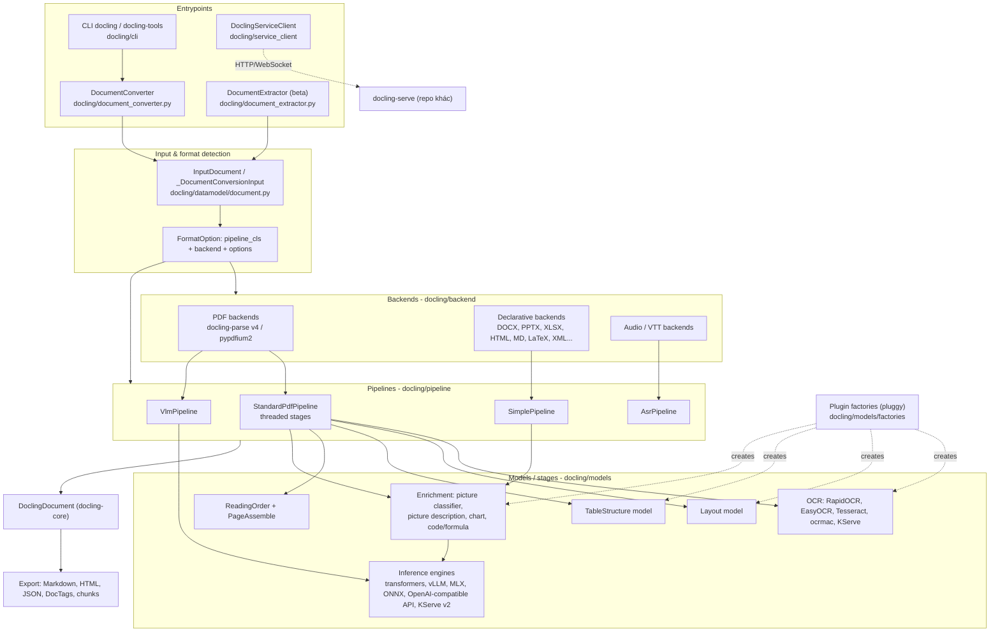
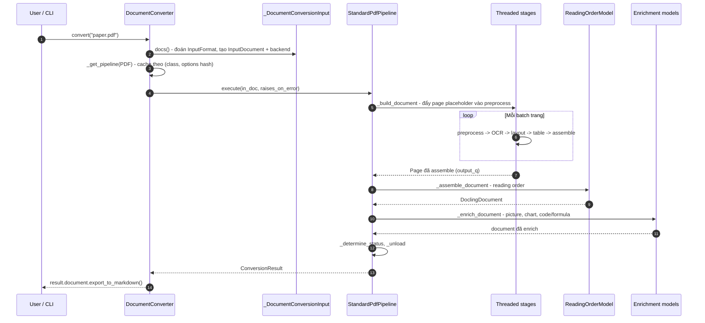

# Docling — Tài liệu thiết kế giải pháp

> **Fork:** [mrchinh189/docling](https://github.com/mrchinh189/docling) · **Upstream:** [docling-project/docling](https://github.com/docling-project/docling)
> **Nhóm:** Xử lý tài liệu
> **Ngôn ngữ chính:** Python (>=3.10) · **License:** MIT · **Commit đã phân tích:** `41a37e7`

## 1. Tóm tắt

Docling là SDK + CLI Python (khởi nguồn từ IBM Research Zurich, nay thuộc LF AI & Data) dùng để parse nhiều định dạng tài liệu — PDF, DOCX, PPTX, XLSX, HTML, Markdown, LaTeX, ảnh, audio, XML chuyên ngành (USPTO, JATS, XBRL)… — thành một biểu diễn thống nhất là `DoclingDocument`, sau đó export sang Markdown, HTML, JSON lossless, DocTags hoặc chunk cho RAG. Điểm khác biệt cốt lõi là pipeline hiểu PDF "thực thụ": layout model, reading order, table structure, OCR, nhận dạng công thức/code và phân loại hình, chạy local (kể cả air-gapped) và có thể thay thế từng stage qua plugin.

## 2. Bài toán & yêu cầu

- **Bài toán:** Tài liệu doanh nghiệp/khoa học tồn tại ở rất nhiều định dạng, đặc biệt PDF không có cấu trúc ngữ nghĩa (bảng, cột, heading, chú thích). Ứng dụng GenAI (RAG, agent) cần nội dung có cấu trúc, đúng thứ tự đọc, kèm provenance (trang, bbox).
- **Yêu cầu chức năng chính:**
  - Nhận đầu vào từ path, URL hoặc stream (`DocumentStream`), tự nhận diện định dạng (`_DocumentConversionInput._guess_format` trong `docling/datamodel/document.py`).
  - Với PDF/ảnh: layout analysis, OCR (nhiều engine), table structure, reading order, enrichment (công thức, code, mô tả ảnh, chart extraction).
  - Pipeline thay thế dùng VLM end-to-end (GraniteDocling…) và pipeline ASR cho audio.
  - Export đa định dạng (`OutputFormat`: md, json, yaml, html, html_split_page, text, doctags, vtt).
  - Trích xuất thông tin có cấu trúc (beta) qua `DocumentExtractor`.
  - Client gọi tới `docling-serve` từ xa (`docling/service_client`).
- **Yêu cầu phi chức năng:**
  - Chạy local trên CPU/GPU/MPS; xử lý song song theo trang bằng thread + hàng đợi có giới hạn (backpressure).
  - Cài đặt "modular": gói `docling-slim` tối thiểu ~8 dependency, các tính năng nặng là optional extras.
  - Chịu lỗi theo trang: hỗ trợ `PARTIAL_SUCCESS`, `document_timeout`, không làm sập cả batch khi `raises_on_error=False`.
  - Bảo mật dữ liệu: mặc định không gọi dịch vụ ngoài; muốn dùng API VLM/OCR từ xa phải bật `enable_remote_services`.
- **Ngoài phạm vi:** Docling không tự cung cấp server REST (đó là repo `docling-serve`), MCP server (repo `docling-mcp`) hay job phân tán (repo `docling-jobkit`) — repo này chỉ chứa thư viện, CLI và client SDK; docs mô tả các repo kia qua `docs/usage/mcp.md`, `docs/usage/jobkit.md`.

## 3. Kiến trúc tổng thể



Kiến trúc được mô tả trong `docs/concepts/architecture.md`: với mỗi định dạng, *document converter* biết dùng *backend* nào để đọc và *pipeline* nào để điều phối, kèm *options*. Kết quả luôn là `ConversionResult` chứa `DoclingDocument` (kiểu dữ liệu nằm ở package riêng `docling-core`). Ranh giới lớp được ép bằng `tach.toml` với thứ tự layer: `entrypoints → clients → pipeline → models → core → foundation`.

## 4. Thành phần chính

| Thành phần | Vị trí trong mã nguồn | Trách nhiệm |
|---|---|---|
| `DocumentConverter` | `docling/document_converter.py` | API chính: `convert`, `convert_all`, `convert_string`; map `InputFormat` → `FormatOption`; cache pipeline |
| `FormatOption` & các biến thể | `docling/document_converter.py` (`PdfFormatOption`, `WordFormatOption`…) | Gắn `pipeline_cls`, `backend`, `pipeline_options` cho từng định dạng |
| Data model | `docling/datamodel/base_models.py`, `document.py`, `pipeline_options.py`, `settings.py` | `InputFormat`, `OutputFormat`, `ConversionStatus`, `Page`, `InputDocument`, `ConversionResult`, options Pydantic, settings `DOCLING_*` |
| Backends | `docling/backend/*` | Đọc file gốc: `AbstractDocumentBackend`, `PaginatedDocumentBackend`, `DeclarativeDocumentBackend`; PDF qua `docling_parse_v4_backend.py`, `pypdfium2_backend.py` |
| `BasePipeline` | `docling/pipeline/base_pipeline.py` | Template method `execute`: build → assemble → enrich → determine status → unload |
| `StandardPdfPipeline` | `docling/pipeline/standard_pdf_pipeline.py` | Pipeline PDF/ảnh đa luồng: preprocess → OCR → layout → table → assemble, rồi reading order |
| `SimplePipeline` | `docling/pipeline/simple_pipeline.py` | Cho backend declarative: backend tự trả `DoclingDocument` qua `convert()` |
| `VlmPipeline` | `docling/pipeline/vlm_pipeline.py` | Chuyển trang thành ảnh, cho VLM sinh DocTags/Markdown/HTML rồi dựng document |
| `AsrPipeline` | `docling/pipeline/asr_pipeline.py` | Audio → transcript qua Whisper (`openai-whisper` hoặc `mlx-whisper`) |
| Model stages | `docling/models/stages/*` | OCR, layout, table structure (v1/v2/Granite Vision), reading order, page assemble, picture classifier/description, code/formula, chart extraction |
| Inference engines | `docling/models/inference_engines/*` | Trừu tượng hoá runtime: transformers, vLLM, MLX, ONNX Runtime, API OpenAI-compatible, KServe v2 (HTTP/gRPC) |
| Plugin factories | `docling/models/factories/*`, `docling/models/plugins/defaults.py` | Đăng ký và khởi tạo engine theo `kind` của options, nạp qua pluggy entry point `docling` |
| CLI | `docling/cli/main.py`, `docling/cli/tools.py`, `docling/cli/models.py` | `docling` (convert) và `docling-tools models download` |
| Service client | `docling/service_client/client.py` | `DoclingServiceClient` gọi `docling-serve`: `convert`, `submit`, `chunk`, `health`… |
| `DocumentExtractor` | `docling/document_extractor.py`, `docling/pipeline/extraction_vlm_pipeline.py` | Trích xuất trường có cấu trúc theo template (beta) bằng VLM |

### 4.1 `DocumentConverter` và cache pipeline

Khi khởi tạo, converter lấy mặc định từ `_get_default_option(format)` — ví dụ PDF/ảnh/METS_GBS → `StandardPdfPipeline`, Office/HTML/MD/XML/LaTeX → `SimplePipeline`, audio → `AsrPipeline`. `_get_pipeline` cache instance theo khóa `(pipeline_class, hash(pipeline_options))` dưới `_PIPELINE_CACHE_LOCK`, nên các model nặng chỉ load một lần cho mỗi cấu hình. `_process_document` kiểm tra `allowed_formats`, trả `SKIPPED` nếu định dạng không được phép.

### 4.2 `BasePipeline.execute`

Template method chung cho mọi pipeline:

1. `_build_document` — dựng cấu trúc (theo trang hoặc trực tiếp từ backend).
2. `_assemble_document` — ghép thành `DoclingDocument`.
3. `_enrich_document` — chạy `enrichment_pipe` trên các element (chỉ dựa vào `conv_res.document`).
4. `_determine_status` — `SUCCESS` / `PARTIAL_SUCCESS` / `FAILURE`.
5. `_unload` (trong `finally`) — giải phóng backend.

Lỗi được bọc thành `ErrorItem` nếu `raises_on_error=False`. `ConvertPipeline` thêm sẵn các enrichment model dùng chung: `DocumentPictureClassifier`, picture description (qua factory), `ChartExtractionModelGraniteVision`/`V4`.

### 4.3 `StandardPdfPipeline` — pipeline đa luồng theo trang

`_init_models` dựng các model qua factory (OCR, layout, table) và `PagePreprocessingModel`, `PageAssembleModel`, `ReadingOrderModel`, cộng thêm `CodeFormulaVlmModel` vào đầu `enrichment_pipe`. `_create_run_ctx` nối các `ThreadedPipelineStage` bằng `ThreadedQueue` có `max_size`:

`preprocess → ocr → layout → table → assemble → output_q`

Mỗi stage có `batch_size` riêng (`ocr_batch_size`, `layout_batch_size`, `table_batch_size`) và `batch_polling_interval_seconds`. Stage `assemble` gọi `_release_page_resources` để xoá image cache / unload page backend khi không cần (tiết kiệm RAM). `_build_document` hỗ trợ `document_timeout`; trang lỗi được thêm vào document qua `_add_failed_pages_to_document`. Cuối cùng `_assemble_document` gom `elements/headers/body` và gọi `self.reading_order_model(conv_res)` để tạo `DoclingDocument`.

### 4.4 Backend

`AbstractDocumentBackend` (`docling/backend/abstract_backend.py`) có hai nhánh: `PaginatedDocumentBackend` (PDF, ảnh, METS) cung cấp page-level API cho pipeline; `DeclarativeDocumentBackend` (DOCX `msword_backend.py`, PPTX, XLSX, HTML, Markdown, AsciiDoc, CSV, LaTeX, JATS/USPTO/XBRL XML, WebVTT, Docling JSON) tự sinh `DoclingDocument` trong `convert()`.

## 5. Luồng xử lý chính

### 5.1 Convert một PDF bằng `StandardPdfPipeline`



### 5.2 Convert DOCX/HTML bằng `SimplePipeline`

`DocumentConverter` chọn `WordFormatOption`/`HTMLFormatOption` → `SimplePipeline._build_document` kiểm tra backend là `DeclarativeDocumentBackend` rồi gọi thẳng `backend.convert()` để nhận `DoclingDocument`; sau đó vẫn chạy chung bước enrichment của `ConvertPipeline` (ví dụ mô tả ảnh) nếu được bật.

## 6. Mô hình dữ liệu & giao diện

**Enum & model chính** (`docling/datamodel/base_models.py`):

- `InputFormat`: `docx, pptx, html, image, pdf, asciidoc, md, csv, xlsx, xml_uspto, xml_jats, xml_xbrl, mets_gbs, json_docling, audio, vtt, latex`.
- `OutputFormat`: `md, json, yaml, html, html_split_page, text, doctags, vtt`.
- `ConversionStatus`: `pending, started, failure, success, partial_success, skipped`.
- `Page`: `page_no`, `size`, `parsed_page` (SegmentedPdfPage), `predictions`, `assembled`, kèm cache ảnh nội bộ.
- `ConversionResult` (`docling/datamodel/document.py`): `input`, `status`, `errors`, `pages`, `document: DoclingDocument`, timings; có `save()/load()`.

**Options** (`docling/datamodel/pipeline_options.py`, Pydantic):

- `PipelineOptions` → `ConvertPipelineOptions` → `PaginatedPipelineOptions` → `PdfPipelineOptions` → `ThreadedPdfPipelineOptions`.
- Cờ quan trọng của `PdfPipelineOptions`: `do_ocr` (mặc định True), `do_table_structure` (True), `do_code_enrichment`, `do_formula_enrichment`, `force_backend_text`, `table_structure_options`, `ocr_options`, `layout_options`, `document_timeout`, `allow_external_plugins`, `enable_remote_services`, `artifacts_path`.
- Options OCR theo engine: `OcrAutoOptions`, `RapidOcrOptions`, `EasyOcrOptions`, `TesseractOcrOptions`, `TesseractCliOcrOptions`, `OcrMacOptions`, `KserveV2OcrOptions`.

**Settings toàn cục** (`docling/datamodel/settings.py`): `AppSettings` dùng `pydantic-settings` với `env_prefix="DOCLING_"`; nhóm `perf` (`doc_batch_size`, `doc_batch_concurrency`, `page_batch_size`), `debug`, `inference`, `artifacts_path`.

**Giao diện Python:**

```python
from docling.document_converter import DocumentConverter
result = DocumentConverter().convert("https://arxiv.org/pdf/2408.09869")
print(result.document.export_to_markdown())
```

**CLI** (`docling/cli/main.py`, Typer): `docling <source> --from ... --to ... --pipeline vlm --vlm-model granite_docling --ocr-engine ... --pdf-backend ... --table-mode ... --enrich-code --enrich-formula --artifacts-path ... --output ... --num-threads 4 --device ...`. `docling-tools models download` / `download-hf-repo` tải trọng số model trước (dùng trong Dockerfile).

**Service client** (`docling/service_client/client.py`): `DoclingServiceClient` với `convert`, `convert_all`, `submit`, `submit_chunk`, `chunk`, `health`, `version`, dùng `httpx` + `websockets` để theo dõi task.

## 7. Tech stack

| Lớp | Công nghệ | Vai trò |
|---|---|---|
| Ngôn ngữ / build | Python 3.10–3.14, hatchling, uv workspace (`packages/docling`, `packages/docling-slim`) | Đóng gói meta-package `docling` = `docling-slim[standard]` |
| Data model | Pydantic v2, pydantic-settings, `docling-core` | Options, settings, `DoclingDocument`, chunking |
| PDF parsing | `docling-parse`, `pypdfium2` | Lấy text cell, bbox, render ảnh trang |
| Office / Web | python-docx, python-pptx, openpyxl, BeautifulSoup4, lxml, marko, pylatexenc, arelle (XBRL), Playwright (render HTML) | Backend declarative |
| Model local | PyTorch, torchvision, `docling-ibm-models`, accelerate, huggingface_hub | Layout, TableFormer, picture classifier |
| VLM | transformers, mlx-vlm, vLLM, qwen-vl-utils, peft; API OpenAI-compatible | VlmPipeline, picture description, code/formula |
| OCR | RapidOCR (+onnxruntime), EasyOCR, tesserocr / Tesseract CLI, ocrmac | Engine OCR thay thế được |
| Remote inference | tritonclient (KServe v2 gRPC/HTTP) | Gọi model trên server suy luận |
| ASR | openai-whisper, mlx-whisper | Audio pipeline |
| Plugin | pluggy + entry point `docling` | Mở rộng OCR/layout/table/picture description |
| CLI / client | Typer, Rich, httpx, websockets | `docling`, `docling-tools`, `DoclingServiceClient` |
| Chất lượng | ruff, ty (typecheck), tach (layer boundary), pytest | Kiểm soát kiến trúc & code |

## 8. Quyết định thiết kế & đánh đổi

| Quyết định | Lý do | Đánh đổi |
|---|---|---|
| Biểu diễn trung gian thống nhất `DoclingDocument` (tách sang `docling-core`) | Mọi backend/pipeline cùng một output; export/chunk/serialize viết một lần | Thêm một dependency/versioning chéo repo; định dạng nội bộ cần học |
| Tách *backend* (đọc file) khỏi *pipeline* (điều phối model) qua `FormatOption` | Thay backend PDF hoặc pipeline (standard ↔ VLM) mà không đổi API | Có những tổ hợp không hợp lệ, phải kiểm tra `is_backend_supported` |
| Pipeline PDF đa luồng với hàng đợi giới hạn và batch theo stage | Tận dụng GPU/CPU song song giữa OCR/layout/table, kiểm soát bộ nhớ (backpressure) | Phức tạp: timeout, thread bị "abandon" khi model treo (ghi chú trong `_build_document`) |
| Cache pipeline theo hash của options | Tránh load lại model nặng cho mỗi tài liệu | Thay đổi options in-place làm hỏng cache (code đã copy options để tránh, xem comment #3109) |
| Gói modular `docling-slim` + extras | Cài tối thiểu cho môi trường hạn chế, chọn đúng engine cần | Ma trận extras lớn, dễ thiếu dependency khi chạy tính năng |
| Plugin qua pluggy, external plugin phải bật `allow_external_plugins` | Mở rộng engine mà không fork; mặc định an toàn | Plugin bên thứ ba phải tuân interface `BaseOcrModel`/options tương ứng |
| `enable_remote_services` mặc định tắt | Phù hợp dữ liệu nhạy cảm / air-gapped | Người dùng phải bật rõ ràng khi dùng VLM API |
| Hai hướng xử lý PDF: model chuyên biệt (layout + TableFormer) và VLM end-to-end | Chọn giữa tốc độ/độ chính xác ổn định và khả năng tổng quát của VLM | Hai đường code song song cần bảo trì |

## 9. Triển khai & vận hành

- **Cài đặt:** `pip install docling` (đầy đủ chuẩn) hoặc `pip install "docling-slim[format-pdf,models-local,feat-ocr-rapidocr,cli]"` để chọn lọc. Extras khác: `easyocr`, `tesserocr`, `ocrmac`, `models-vlm-inline`, `format-audio`, `models-remote`…
- **Chạy local:** `docling https://arxiv.org/pdf/2206.01062` sinh file `.md`; hoặc dùng `DocumentConverter` trong Python.
- **Docker:** `Dockerfile` dựa trên `python:3.11-slim-bookworm`, cài torch CPU, chạy `docling-tools models download` lúc build và đặt `OMP_NUM_THREADS=4` để tránh tranh chấp thread; có thể trỏ `DOCLING_ARTIFACTS_PATH=/root/.cache/docling/models` để dùng model có sẵn trong image.
- **Offline / air-gapped:** tải model trước bằng `docling-tools models download`, sau đó đặt `artifacts_path` (option hoặc env `DOCLING_ARTIFACTS_PATH`); `BasePipeline.__init__` kiểm tra thư mục tồn tại.
- **Hiệu năng:** điều chỉnh `ocr_batch_size`, `layout_batch_size`, `table_batch_size`, `queue_max_size`; `AcceleratorOptions` (device CPU/CUDA/MPS, `num_threads`); docs `docs/usage/gpu.md`.
- **Quan sát:** `TimeRecorder`/`ProfilingScope` (`docling/utils/profiling.py`) ghi timings vào `ConversionResult`; cờ debug trong `settings.debug` và CLI (`--debug-visualize-cells`, `--debug-visualize-ocr`, `--debug-visualize-tables`…).
- **Giới hạn đã biết:** OCR và enrichment làm tăng mạnh thời gian xử lý; docstring khuyến nghị đặt `document_timeout` 90–120s cho production; RapidOCR có vấn đề với filesystem read-only; `doc_batch_concurrency` ghi chú là thử nghiệm, chưa có lợi khi không dùng free-threaded Python.
- **Mở rộng quy mô:** dùng các repo anh em `docling-serve` (REST) + `DoclingServiceClient`, hoặc `docling-jobkit` (Kubeflow, Ray, connector S3/Google Drive).

## 10. Điểm mở rộng

- **Plugin engine (pluggy):** khai báo entry point nhóm `docling` trong `pyproject.toml` của package riêng, module trả về dict cho các hook `ocr_engines`, `layout_engines`, `table_structure_engines`, `picture_description`… (xem `docling/models/plugins/defaults.py`). Class OCR phải kế thừa `BaseOcrModel` (`docling/models/base_ocr_model.py`) và có options kế thừa `OcrOptions`. Bật bằng `pipeline_options.allow_external_plugins = True`; liệt kê bằng CLI `--show-external-plugins`.
- **Backend mới:** kế thừa `DeclarativeDocumentBackend` (trả `DoclingDocument`) hoặc `PaginatedDocumentBackend`, sau đó map vào `DocumentConverter(format_options={InputFormat.X: FormatOption(pipeline_cls=SimplePipeline, backend=MyBackend)})`.
- **Pipeline mới:** kế thừa `BasePipeline`/`ConvertPipeline`/`PaginatedPipeline`, hiện thực `_build_document`, `get_default_options`, `is_backend_supported`.
- **Enrichment model:** thêm `GenericEnrichmentModel` vào `enrichment_pipe` (mẫu: `docling/models/stages/picture_classifier/document_picture_classifier.py`).
- **Inference engine:** thêm engine VLM/object detection/image classification trong `docling/models/inference_engines/*` và đăng ký vào `factory.py` tương ứng.
- **Downstream:** serializer và chunker (HierarchicalChunker, HybridChunker) từ `docling-core`, tích hợp LangChain/LlamaIndex/Haystack/CrewAI (`docs/integrations`).

## 11. Bài học & cách áp dụng

- **Biểu diễn trung gian giàu cấu trúc trước, export sau:** thay vì convert thẳng sang Markdown, dựng một document model có provenance (trang, bbox) rồi mới serialize; dễ thêm định dạng output và chunking cho RAG.
- **Registry Format → (Backend, Pipeline, Options):** pattern cấu hình hoá rất sạch cho hệ thống xử lý nhiều loại input; áp dụng cho ingestion service nội bộ.
- **Pipeline stage + bounded queue + batch size từng stage:** mẫu producer/consumer có backpressure, phù hợp khi các bước có chi phí khác nhau (OCR chậm, layout nhanh trên GPU).
- **Cache theo hash của cấu hình:** đơn giản mà hiệu quả để tái sử dụng tài nguyên đắt (model), nhưng phải coi options là immutable.
- **Factory + entry point plugin, mặc định chỉ nạp plugin nội bộ:** cân bằng giữa mở rộng và an toàn chuỗi cung ứng.
- **Extras chia nhỏ theo feature:** áp dụng cho thư viện có dependency nặng (torch, OCR) để người dùng serverless/edge vẫn cài được.
- **Ép kiến trúc layer bằng công cụ (`tach.toml`):** giữ codebase lớn không bị phụ thuộc vòng.

## 12. Tham khảo

- README: [`README.md`](https://github.com/mrchinh189/docling/blob/main/README.md)
- Docs: `docs/concepts/architecture.md`, `docs/concepts/plugins.md`, `docs/concepts/docling_document.md`, `docs/usage/supported_formats.md`, `docs/usage/gpu.md`, `docs/usage/mcp.md`, `docs/usage/jobkit.md`
- Manifest: `pyproject.toml` (docling-slim), `packages/docling/pyproject.toml`, `tach.toml`, `Dockerfile`
- Mã nguồn chính: `docling/document_converter.py`, `docling/pipeline/base_pipeline.py`, `docling/pipeline/standard_pdf_pipeline.py`, `docling/pipeline/simple_pipeline.py`, `docling/pipeline/vlm_pipeline.py`, `docling/datamodel/pipeline_options.py`, `docling/datamodel/base_models.py`, `docling/models/plugins/defaults.py`, `docling/models/factories/base_factory.py`, `docling/cli/main.py`, `docling/service_client/client.py`
- Technical report: [arXiv:2408.09869](https://arxiv.org/abs/2408.09869)
