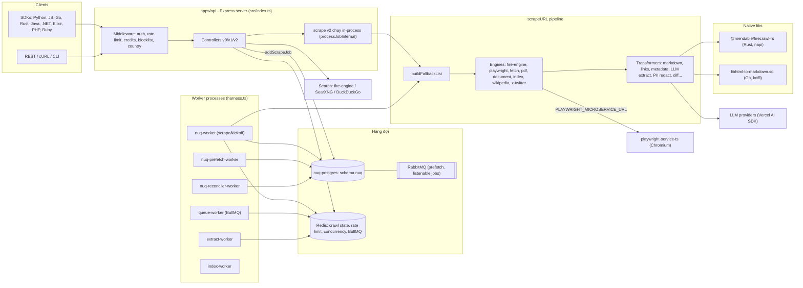
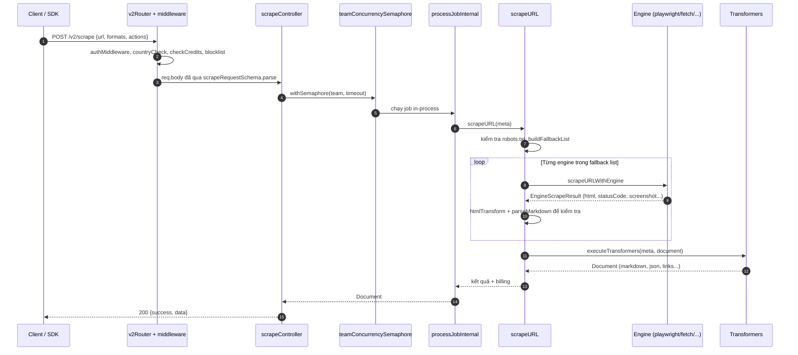
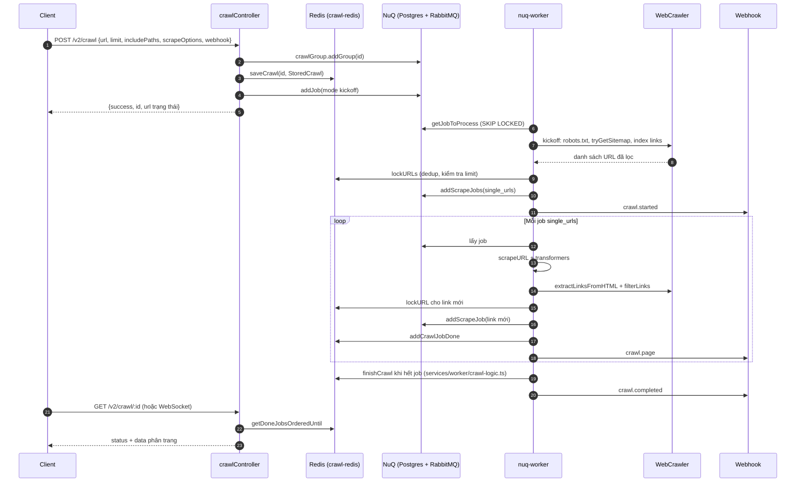

# Firecrawl — Tài liệu thiết kế giải pháp

> **Fork:** [mrchinh189/firecrawl](https://github.com/mrchinh189/firecrawl) · **Upstream:** [firecrawl/firecrawl](https://github.com/firecrawl/firecrawl)
> **Nhóm:** Web scraping
> **Ngôn ngữ chính:** TypeScript (Node.js 22), kèm Rust (native addon) và Go (HTML→Markdown) · **License:** AGPL-3.0 (SDK và một số UI: MIT) · **Commit đã phân tích:** `87cb6d7`

## 1. Tóm tắt

Firecrawl là một **Web Data API** dạng dịch vụ: nhận URL (hoặc truy vấn tìm kiếm) và trả về nội dung "LLM-ready" — Markdown sạch, HTML, ảnh chụp màn hình, link, hoặc JSON có cấu trúc trích xuất bằng LLM. Repo là **monorepo** gồm API server + các worker xử lý hàng đợi (`apps/api`), một microservice Playwright, Postgres tùy biến làm hàng đợi (`apps/nuq-postgres`), và SDK cho nhiều ngôn ngữ. Điểm khác biệt cốt lõi: **cơ chế chọn engine có fallback** (fire-engine, Playwright, fetch, PDF, document, index...) theo các "feature flag" của request, một **pipeline transformer** biến HTML thô thành nhiều định dạng đầu ra, và hệ thống **crawl phân tán** dựa trên hàng đợi job + Redis. Phiên bản cloud có thêm các thành phần đóng (fire-engine) không có trong bản self-host.

## 2. Bài toán & yêu cầu

- **Bài toán:** Ứng dụng AI/agent cần đọc nội dung web ở dạng sạch, ổn định, ở quy mô lớn — trong khi web hiện đại nhiều JS, chặn bot, có PDF/DOCX, và cần crawl cả website với giới hạn, robots.txt, webhook.
- **Yêu cầu chức năng chính** (theo `apps/api/src/routes/v2.ts`):
  - `POST /v2/scrape` — một URL → nhiều `formats` (markdown, html, rawHtml, links, images, summary, screenshot, json, changeTracking, branding, audio, video, attributes, query...), hỗ trợ `actions` (wait, click, write, press, scroll, screenshot, scrape, executeJavascript, pdf).
  - `POST /v2/batch/scrape`, `POST /v2/crawl`, `POST /v2/map`, `POST /v2/search`, `POST /v2/extract`, `POST /v2/agent`, `POST /v2/parse` (upload file ≤ 50 MB), `/v2/scrape/:jobId/interact`, `/v2/browser`, `/v2/monitor`.
  - Theo dõi trạng thái job (`GET /v2/crawl/:jobId`, WebSocket `/v2/crawl/:jobId`), hủy job, xem lỗi, webhook sự kiện `crawl.started/page/completed`, `batch_scrape.*`.
  - Trích xuất có cấu trúc bằng LLM (OpenAI, Ollama, Anthropic, Groq, Google, OpenRouter, Fireworks, DeepInfra, Vertex qua Vercel AI SDK).
- **Yêu cầu phi chức năng:**
  - Thông lượng cao, chịu tải: worker tách tiến trình, hàng đợi trên Postgres với `FOR UPDATE SKIP LOCKED`, giới hạn concurrency theo team và theo crawl.
  - Độ tin cậy: fallback nhiều engine, lock + gia hạn lock cho job, reconciler worker, retry.
  - Bảo mật/multi-tenant: xác thực API key, rate limit theo mode, kiểm tra credit, blocklist domain, Zero Data Retention (ZDR), không expose Postgres ra ngoài.
  - Quan sát: OpenTelemetry span (`lib/otel-tracer.ts`), Prometheus (`prom-client`), Sentry, Winston log, Bull Board UI.
- **Ngoài phạm vi (bản self-host):** fire-engine (chống chặn IP/bot nâng cao), xác thực DB qua Supabase, billing (Autumn/Stripe) — `SELF_HOST.md` nêu rõ self-host không có fire-engine và Supabase chưa cấu hình được.

## 3. Kiến trúc tổng thể



Kiến trúc gồm 4 khối:

1. **API server** (`apps/api/src/index.ts`): Express + `express-ws`, mount `v0Router`, `/v1`, `/v2`, `adminRouter`, Bull Board tại `/admin/${BULL_AUTH_KEY}/queues`.
2. **Hàng đợi NuQ** (`apps/api/src/services/worker/nuq.ts` + `apps/nuq-postgres/nuq.sql`): hàng đợi job tự viết trên Postgres (bảng `nuq.queue_scrape`, `nuq.queue_crawl_finished`, nhóm `nuq.group_crawl`), dùng RabbitMQ để đẩy job đã prefetch và thông báo job "listenable" hoàn thành; vẫn hỗ trợ `LISTEN/NOTIFY` của Postgres. BullMQ (Redis) vẫn dùng cho các hàng đợi phụ (billing, precrawl, deep research, llms.txt — `services/queue-service.ts`).
3. **Workers**: được `src/harness.ts` sinh thành nhiều tiến trình con (`queue-worker`, `extract-worker`, `nuq-worker` × N, `nuq-prefetch-worker`, `nuq-reconciler-worker`, `index-worker`).
4. **Scraper pipeline** (`apps/api/src/scraper/scrapeURL/`): chọn engine → lấy HTML → transformers → `Document`.

## 4. Thành phần chính

| Thành phần | Vị trí trong mã nguồn | Trách nhiệm |
|---|---|---|
| API entry | `apps/api/src/index.ts` | Khởi tạo Express, middleware chung, router, Bull Board, listen |
| Harness | `apps/api/src/harness.ts` | Khởi động/giám sát API + toàn bộ worker, (dev) dựng container Postgres/RabbitMQ |
| Routes | `apps/api/src/routes/{v0,v1,v2,admin}.ts` | Khai báo endpoint + chuỗi middleware |
| Controllers v2 | `apps/api/src/controllers/v2/*.ts` | `scrape`, `batch-scrape`, `crawl`, `crawl-status(-ws)`, `map`, `search`, `extract`, `agent`, `parse`, `browser`, `monitor`... |
| Schema request/response | `apps/api/src/controllers/v2/types.ts` | Zod schema: `scrapeOptions`, `crawlerOptions`, `actions`, `formats`, type `Document` |
| NuQ queue | `apps/api/src/services/worker/nuq.ts`, `apps/nuq-postgres/nuq.sql` | Job queue trên Postgres + RabbitMQ, lock/renew, finish/fail, group |
| NuQ workers | `apps/api/src/services/worker/nuq-worker.ts`, `nuq-prefetch-worker.ts`, `nuq-reconciler-worker.ts` | Lấy job, chạy, gia hạn lock 15 s; prefetch lô 500 job; dọn job treo |
| Scrape worker logic | `apps/api/src/services/worker/scrape-worker.ts` | `processJobInternal`: xử lý `kickoff`, `kickoff_sitemap`, `single_urls`; khám phá link trong crawl |
| Enqueue + concurrency | `apps/api/src/services/queue-jobs.ts`, `apps/api/src/lib/concurrency-limit.ts` | `addScrapeJob(s)`, hàng đợi concurrency theo team/crawl, `waitForJob` |
| Team semaphore | `apps/api/src/services/worker/team-semaphore.ts` | Giới hạn số scrape đồng thời của team cho `/v2/scrape` đồng bộ |
| Crawl state | `apps/api/src/lib/crawl-redis.ts` | `StoredCrawl`, `lockURL` (dedup bằng Redis SET), đếm job xong, `normalizeURL`, hoán vị URL |
| WebCrawler | `apps/api/src/scraper/WebScraper/crawler.ts` | Lọc link (include/exclude, depth, subdomain), robots.txt, sitemap |
| scrapeURL | `apps/api/src/scraper/scrapeURL/index.ts` | Vòng lặp thử engine, kiểm tra robots, gọi transformers |
| Engines | `apps/api/src/scraper/scrapeURL/engines/*` | `fire-engine`, `playwright`, `fetch`, `pdf`, `document`, `index`, `wikipedia`, `x-twitter` |
| Transformers | `apps/api/src/scraper/scrapeURL/transformers/*` | Chuỗi biến đổi `Document` (markdown, LLM extract, PII, diff, audio/video...) |
| HTML→Markdown | `apps/api/src/lib/html-to-markdown.ts`, `apps/api/sharedLibs/go-html-to-md/`, `apps/go-html-to-md-service/` | HTTP service → Go shared lib (koffi) → fallback Turndown |
| Rust native | `apps/api/native/src/{html,crawler,pdf,engpicker}.rs` | Trích link/metadata/ảnh, transform HTML, lọc link, parse sitemap, xử lý PDF, hậu xử lý Markdown |
| LLM | `apps/api/src/lib/generic-ai.ts`, `apps/api/src/lib/extract/*` | Chọn provider/model; dịch vụ `/extract` (rerank, build prompt, completions) |
| Search | `apps/api/src/search/index.ts`, `apps/api/src/search/v2/*` | fire-engine → SearXNG → DuckDuckGo |
| Map | `apps/api/src/lib/map-utils.ts`, `apps/api/src/lib/map-cosine.ts` | Gom URL từ sitemap, index, search; xếp hạng cosine theo `search` |
| Webhook | `apps/api/src/services/webhook/*` | Schema, hàng đợi, giao webhook sự kiện |
| Playwright service | `apps/playwright-service-ts/api.ts` | `POST /scrape`, `GET /health`; semaphore `MAX_CONCURRENT_PAGES` |
| SDKs | `apps/python-sdk`, `apps/js-sdk`, `apps/go-sdk`, `apps/rust-sdk`, `apps/java-sdk`, `apps/dot-net-sdk`, `apps/elixir-sdk`, `apps/php-sdk`, `apps/ruby-sdk` | Client cho REST API |

### 4.1. Chọn engine có fallback (`engines/index.ts`)

Danh sách engine khả dụng được dựng tĩnh theo cấu hình: `fire-engine;*` chỉ khi có `FIRE_ENGINE_BETA_URL`, `playwright` khi có `PLAYWRIGHT_MICROSERVICE_URL`, `wikipedia`/`x-twitter`/`index` khi có credential tương ứng; `fetch`, `pdf`, `document` luôn có. Mỗi request được quy về tập **feature flags** (`actions`, `waitFor`, `screenshot`, `pdf`, `document`, `location`, `mobile`, `stealthProxy`, `branding`...), mỗi flag có `priority`. `buildFallbackList(meta)`:

1. Loại engine theo ngữ cảnh (`lockdown` → chỉ `index`; URL x.com → chỉ `x-twitter`...).
2. Tính `supportScore` của mỗi engine = tổng priority các flag nó hỗ trợ; giữ engine có điểm ≥ một nửa tổng priority.
3. Ưu tiên engine `quality > 0`, sắp theo `supportScore` rồi `quality` (có thể được "engpicker" cộng điểm cho TLS client).

`scrapeURLLoop` (`scrapeURL/index.ts`) thử lần lượt; mỗi lần thành công sẽ được chuyển Markdown để kiểm tra; nếu hết engine thì ném `NoEnginesLeftError`. Sơ đồ gốc nằm ở `apps/api/src/scraper/scrapeURL/README.md`.

### 4.2. Pipeline transformer (`transformers/index.ts`)

`transformerStack` chạy tuần tự: `deriveHTMLFromRawHTML` → `deriveMarkdownFromHTML` → `performCleanContent` → `performRedactPII` → `deriveLinksFromHTML` → `deriveImagesFromHTML` → `deriveBrandingFromActions` → `deriveMetadataFromRawHTML` → … → `performLLMExtract` → `performDeterministicJson` → `performSummary` → `performQuery` → `performAttributes` → `performAgent` → `removeBase64Images` → `deriveDiff` → `fetchAudio` → `fetchVideo` → `coerceFieldsToFormats`. Mỗi transformer có chữ ký `(meta, document) => Document`, chỉ hoạt động khi format tương ứng được yêu cầu; bước cuối loại bỏ trường không được yêu cầu.

### 4.3. NuQ — hàng đợi trên Postgres

Bảng `nuq.queue_scrape` có `status` (enum `queued/active/completed/failed`), `priority`, `lock`, `locked_at`, `stalls`, `owner_id`, `group_id`, `listen_channel_id`, `returnvalue`/`failedreason` (chỉ dùng self-host). Lấy job bằng CTE `SELECT ... WHERE status='queued' ORDER BY priority, created_at FOR UPDATE SKIP LOCKED LIMIT 1` (`getJobToProcess`), hoặc prefetch lô 500 rồi đẩy qua RabbitMQ (`prefetchJobs`). Worker gia hạn lock mỗi 15 giây (`renewLock`), kết thúc bằng `jobFinish`/`jobFail`. `nuq.sql` cũng tinh chỉnh WAL/checkpoint/autovacuum và dùng `pg_cron` cho dọn dẹp — cho thấy hàng đợi được thiết kế cho hàng chục triệu bản ghi.

## 5. Luồng xử lý chính

### 5.1. `POST /v2/scrape` (đồng bộ)



Lưu ý: ở `apps/api/src/controllers/v2/scrape.ts`, scrape đơn được chạy **trực tiếp trong tiến trình API** (`processJobInternal`) dưới semaphore của team, semaphore chỉ có ~2/3 timeout để lấy lock, phần còn lại dành cho việc scrape.

### 5.2. `POST /v2/crawl` (bất đồng bộ)



## 6. Mô hình dữ liệu & giao diện

**REST API v2** (`apps/api/src/routes/v2.ts`): `/search`, `/parse`, `/scrape`, `/scrape/:jobId`, `/scrape/:jobId/interact`, `/batch/scrape`, `/batch/scrape/:jobId(/errors)`, `/map`, `/crawl`, `/crawl/params-preview`, `/crawl/ongoing`, `/crawl/active`, `/crawl/:jobId(/errors)` (GET/DELETE/WS), `/extract(/:jobId)`, `/agent(/:jobId)`, `/team/*` (credit/token usage, queue status, activity), `/concurrency-check`, `/monitor/*`, `/browser/*`, `/support/*`, `/research/*`, `/x402/search`. OpenAPI có sẵn ở `apps/api/openapi.json`, `v1-openapi.json`, `openapi-v0.json`.

**Scrape options chính** (`baseScrapeOptions` trong `controllers/v2/types.ts`): `formats` (mặc định `[{type:"markdown"}]`), `headers`, `includeTags`, `excludeTags`, `onlyMainContent=true`, `timeout`, `waitFor ≤ 60000`, `mobile`, `parsers` (pdf mode `fast/auto/ocr`), `actions`, `location`, `skipTlsVerification`, `removeBase64Images=true`, `blockAds=true`, `proxy` (`basic|stealth|enhanced|auto`), `maxAge`/`minAge`/`storeInCache` (cache), `lockdown`, `redactPII`, `profile`.

**Crawler options** (`crawlerOptions`): `includePaths`, `excludePaths`, `maxDiscoveryDepth`, `limit=10000`, `crawlEntireDomain`, `allowExternalLinks`, `allowSubdomains`, `ignoreRobotsTxt`, `sitemap` (`skip|include|only`), `deduplicateSimilarURLs=true`, `ignoreQueryParameters`, `regexOnFullURL`, `delay ≤ 60s`; cộng `webhook`, `maxConcurrency`, `zeroDataRetention`, `prompt` (sinh tham số crawl bằng LLM).

**Document** (type `Document`): `markdown`, `html`, `rawHtml`, `links`, `images`, `screenshot`, `json`, `summary`, `answer`, `highlights`, `branding`, `attributes`, `actions{screenshots, scrapes, javascriptReturns, pdfs}`, `changeTracking{previousScrapeAt, changeStatus, visibility, diff}`, `metadata`, `warning`.

**Job NuQ** (`NuQJob` trong `nuq.ts`): `id`, `status` (`queued|active|completed|failed|backlog`), `priority`, `data` (`ScrapeJobData` với `mode`: `kickoff`, `kickoff_sitemap`, `single_urls`...), `lock`, `ownerId` (team), `groupId` (crawl).

**Redis keys** (`lib/crawl-redis.ts`): `crawl:<id>` (StoredCrawl), `crawl:<id>:visited`, `crawl:<id>:visited_unique`, `crawl:<id>:jobs_qualified`, `crawl:<id>:sitemaps`, TTL 24 h.

**Webhook events** (`services/webhook/types.ts`): `crawl.started`, `crawl.page`, `crawl.completed`, `batch_scrape.started`, `batch_scrape.page`, `batch_scrape.completed`.

## 7. Tech stack

| Lớp | Công nghệ | Vai trò |
|---|---|---|
| Runtime | Node.js 22, TypeScript 5.9, pnpm | API + worker |
| Web | Express 4.22, `express-ws`, `body-parser`, `cors`, `multer` | REST, WebSocket, upload |
| Validation | Zod 4, Ajv | Schema request, JSON Schema cho extract |
| Queue | Postgres (`pg`) + RabbitMQ (`amqplib`) — NuQ; Redis (`ioredis`) + BullMQ | Hàng đợi chính và phụ |
| Lock/Rate limit | `redlock`, `rate-limiter-flexible`, `async-mutex` | Khóa phân tán, giới hạn tần suất |
| ORM | `drizzle-orm` (`src/db/schema/*`) | Truy cập DB |
| Browser | Playwright (service riêng `apps/playwright-service-ts`) | Render JS |
| Parsing | `cheerio`, `jsdom`, `turndown`, `marked`, `pdf-parse`, `xml2js`, `robots-parser`, `tldts` | HTML/Markdown/PDF/robots |
| Native | Rust (`napi`, `lol_html`, `kuchikiki`, `texting_robots`, `pdf-inspector`, `calamine`), Go (`go-html-to-md`, nạp qua `koffi`) | Xử lý HTML/PDF/doc hiệu năng cao |
| AI | Vercel AI SDK `ai` + `@ai-sdk/*`, `ollama-ai-provider`, `openai`, `@dqbd/tiktoken`, `langsmith` | LLM extract, summary, agent |
| Observability | Sentry, OpenTelemetry, `prom-client`, Winston, ClickHouse client, PostHog | Lỗi, trace, metrics, log, analytics |
| Billing (cloud) | `autumn-js`, Stripe, `@x402/*` | Credit, thanh toán |
| Deploy | Docker multi-stage, Docker Compose | Self-host |
| Test | Jest, supertest, "snips" E2E (`src/__tests__/snips`) | Kiểm thử |

## 8. Quyết định thiết kế & đánh đổi

| Quyết định | Lý do | Đánh đổi |
|---|---|---|
| Tự viết hàng đợi NuQ trên Postgres thay vì chỉ BullMQ | Bền vững, truy vấn/thống kê bằng SQL, `SKIP LOCKED` cho nhiều worker, nhóm job theo crawl | Phải tự lo lock, stall, reconciler, tuning WAL/autovacuum (`nuq.sql`) |
| Thêm RabbitMQ cho prefetch và thông báo hoàn thành | Giảm tải poll Postgres, đẩy job nhanh | Thêm một hạ tầng phải vận hành |
| Engine fallback theo feature-flag + quality | Một API chung cho nhiều backend, tự chọn cách rẻ/tốt nhất | Logic phức tạp (comment "THIS SUCKS BUT IT WORKS"), khó dự đoán engine nào chạy |
| Pipeline transformer tuần tự | Dễ thêm định dạng mới, mỗi bước độc lập | Thứ tự là ràng buộc ngầm (transformer báo lỗi nếu chạy sai thứ tự) |
| `/v2/scrape` chạy in-process với semaphore theo team | Giảm độ trễ (không qua queue) | Tải scrape đè lên tiến trình API |
| HTML→Markdown ba tầng: HTTP service → Go `.so` → Turndown | Tốc độ của Go, vẫn có fallback thuần JS | Ba đường code cần giữ tương thích |
| Rust native addon cho HTML/crawler/PDF | Hiệu năng, an toàn bộ nhớ | Build phức tạp (Rust toolchain trong Dockerfile) |
| Dedup crawl bằng Redis SET + hoán vị URL | Nhanh, nguyên tử, chống trùng www/http/https | Trạng thái crawl phụ thuộc Redis, TTL 24 h |
| Self-host bỏ qua giới hạn concurrency (`isSelfHosted()`) | Đơn giản hóa vận hành nội bộ | Không bảo vệ tài nguyên nếu mở cho nhiều người |
| Mô hình open-core (AGPL + cloud có fire-engine) | Bền vững thương mại | Bản self-host yếu hơn với site chống bot |

## 9. Triển khai & vận hành

**Docker Compose** (`docker-compose.yaml`, hướng dẫn `SELF_HOST.md`):

| Service | Build/Image | Ghi chú |
|---|---|---|
| `api` | `apps/api` | `node dist/src/harness.js --start-docker` — chạy API + mọi worker; port `3002`; 4 CPU / 8 GB |
| `playwright-service` | `apps/playwright-service-ts` | Port 3000, `MAX_CONCURRENT_PAGES` = `CRAWL_CONCURRENT_REQUESTS` (10); 2 CPU / 4 GB |
| `redis` | `redis:alpine` | Crawl state, rate limit, BullMQ |
| `rabbitmq` | `rabbitmq:3-management` | Có healthcheck, API chờ healthy |
| `nuq-postgres` | `apps/nuq-postgres` | Postgres + `nuq.sql`, không expose port |

```bash
# tạo .env ở thư mục gốc theo mẫu trong SELF_HOST.md (mẫu biến cho API: apps/api/.env.example)
docker compose build && docker compose up
curl -X POST http://localhost:3002/v1/crawl -H 'Content-Type: application/json' -d '{"url":"https://firecrawl.dev"}'
```

**Dockerfile API** (`apps/api/Dockerfile`): stage Go build `libhtml-to-markdown.so`; stage build cài Rust + `pnpm install` + `tsc`; stage runtime `node:22-slim` copy `dist`, `native`, `.so`.

**Biến môi trường quan trọng:** `PORT`, `USE_DB_AUTHENTICATION`, `REDIS_URL`, `PLAYWRIGHT_MICROSERVICE_URL`, `POSTGRES_*`, `NUQ_RABBITMQ_URL`, `NUM_WORKERS_PER_QUEUE`, `CRAWL_CONCURRENT_REQUESTS`, `MAX_CONCURRENT_JOBS`, `BROWSER_POOL_SIZE`, `OPENAI_API_KEY`/`OPENAI_BASE_URL`/`OLLAMA_BASE_URL`/`MODEL_NAME`, `PROXY_SERVER`/`USERNAME`/`PASSWORD`, `SEARXNG_ENDPOINT`, `BULL_AUTH_KEY`, `MAX_CPU`/`MAX_RAM` (worker từ chối job khi vượt ngưỡng), `LLAMAPARSE_API_KEY`, `SLACK_WEBHOOK_URL`, `ALLOW_LOCAL_WEBHOOKS`.

**Quan sát:** Bull Board `/admin/<BULL_AUTH_KEY>/queues`, metrics NuQ (`getMetrics`, `nuqGetLocalMetrics`), health check Playwright `GET /health`, Sentry, OTel.

**Giới hạn đã biết (self-host):** không có fire-engine (kém với site chống bot), không có Supabase auth, cảnh báo "bypassing authentication" là bình thường; cần đổi `BULL_AUTH_KEY` và mật khẩu Postgres khi public.

**Phát triển:** `CLAUDE.md` yêu cầu viết E2E "snips" trước, chạy bằng `pnpm harness jest ...` (harness tự dựng API + worker).

## 10. Điểm mở rộng

- **Engine mới:** thêm thư mục trong `apps/api/src/scraper/scrapeURL/engines/`, khai báo vào union `Engine`, `engineOptions` (features + quality) và handler trong `engines/index.ts`.
- **Transformer/format mới:** viết hàm `(meta, document) => Document` trong `transformers/`, chèn vào `transformerStack`, thêm literal format vào schema `formats` ở `controllers/v2/types.ts`.
- **LLM provider:** thêm vào `providerList` trong `apps/api/src/lib/generic-ai.ts` (mọi provider tương thích Vercel AI SDK); hoặc dùng `OPENAI_BASE_URL` cho API tương thích OpenAI.
- **Search backend:** thêm hàm vào `apps/api/src/search/v2/` và chuỗi ưu tiên trong `search/v2/index.ts`.
- **Native function:** thêm `#[napi]` trong `apps/api/native/src/*.rs`, gọi qua `@mendable/firecrawl-rs`.
- **Webhook:** đăng ký `webhook` trong request crawl/batch để nhận sự kiện.
- **SDK/integration:** các SDK trong `apps/*-sdk`; CLI, skills, workflows nằm ở repo riêng (`firecrawl-cli/README.md`, `firecrawl-skills/README.md`, `firecrawl-workflows/README.md` chỉ là con trỏ).

## 11. Bài học & cách áp dụng

1. **Feature-flag → engine scoring:** biểu diễn yêu cầu thành tập tính năng có trọng số, mỗi backend khai báo tính năng hỗ trợ + chất lượng, rồi sinh danh sách fallback. Pattern này áp dụng tốt cho mọi hệ thống "nhiều nhà cung cấp" (OCR, LLM, proxy).
2. **Pipeline transformer thuần hàm** cho phép bật/tắt đầu ra theo request mà không làm rối luồng chính.
3. **Postgres làm job queue** với `FOR UPDATE SKIP LOCKED`, partial index theo `status`, lock + renew + reconciler — giải pháp mạnh khi đã có Postgres và cần truy vấn trạng thái job phức tạp.
4. **Tách hot path ra native (Rust/Go)** qua FFI, luôn giữ fallback JS — cách cân bằng hiệu năng và tính sẵn sàng.
5. **Dedup crawl bằng Redis SET + chuẩn hóa/hoán vị URL** là kỹ thuật gọn để crawl phân tán không trùng lặp.
6. **Harness quản lý đa tiến trình** giúp chạy "cả hệ thống" trong một container cho dev/test, đồng thời vẫn tách được thành nhiều deployment ở production.
7. **Thiết kế cho agent:** đầu ra Markdown sạch, `onlyMainContent`, `formats` chọn lọc, `maxAge` cache — giảm token và chi phí cho ứng dụng LLM.

## 12. Tham khảo

- README: [`README.md`](https://github.com/firecrawl/firecrawl/blob/main/README.md), self-host: `SELF_HOST.md`, hướng dẫn dev: `CLAUDE.md`, `CONTRIBUTING.md`
- Tài liệu: https://docs.firecrawl.dev, API reference: https://docs.firecrawl.dev/api-reference/introduction
- Hạ tầng: `docker-compose.yaml`, `apps/api/Dockerfile`, `apps/nuq-postgres/nuq.sql`, `apps/api/package.json`, `apps/api/native/Cargo.toml`
- Mã nguồn chính: `apps/api/src/index.ts`, `apps/api/src/harness.ts`, `apps/api/src/routes/v2.ts`, `apps/api/src/controllers/v2/{scrape,crawl,types}.ts`, `apps/api/src/services/worker/{nuq,nuq-worker,scrape-worker}.ts`, `apps/api/src/services/queue-jobs.ts`, `apps/api/src/lib/crawl-redis.ts`, `apps/api/src/scraper/scrapeURL/{index.ts,README.md}`, `apps/api/src/scraper/scrapeURL/engines/index.ts`, `apps/api/src/scraper/scrapeURL/transformers/index.ts`, `apps/api/src/lib/html-to-markdown.ts`, `apps/api/src/lib/generic-ai.ts`, `apps/playwright-service-ts/api.ts`
