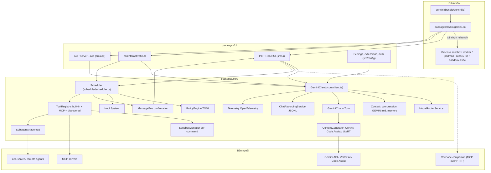
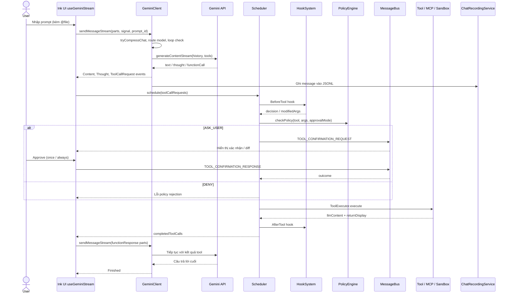

# Gemini CLI — Tài liệu thiết kế giải pháp

> **Fork:** [mrchinh189/gemini-cli](https://github.com/mrchinh189/gemini-cli) · **Upstream:** [google-gemini/gemini-cli](https://github.com/google-gemini/gemini-cli)
> **Nhóm:** AI coding agent / CLI
> **Ngôn ngữ chính:** TypeScript (Node.js ≥ 20, React/Ink cho UI terminal) · **License:** Apache-2.0 · **Commit đã phân tích:** `77078b3`

## 1. Tóm tắt

Gemini CLI là AI agent mã nguồn mở của Google, đưa model Gemini vào terminal: hiểu codebase, sửa file, chạy shell, tìm kiếm web có grounding và tự động hoá workflow. Dự án là một npm monorepo (`@google/gemini-cli`) tách rõ **`packages/cli`** (giao diện Ink/React, cấu hình, sandbox cấp tiến trình) và **`packages/core`** (vòng lặp agent, tool, scheduler, policy engine, MCP, hooks). Điểm khác biệt cốt lõi: free tier qua đăng nhập Google, context window 1M token, **policy engine dạng TOML** phân tầng (Admin > User > Workspace > Extension > Default), hệ thống hooks/extension/skills phong phú, model routing, và nhiều bề mặt tích hợp (ACP cho IDE, A2A server, VS Code companion, SDK).

## 2. Bài toán & yêu cầu

- **Bài toán:** Cung cấp đường ngắn nhất từ prompt tới model Gemini ngay trong terminal, đủ an toàn để agent tự đọc/ghi file và chạy lệnh trên máy người dùng, đồng thời dùng được trong script/CI.
- **Yêu cầu chức năng chính:**
  - Chế độ tương tác (Ink UI) và không tương tác (`gemini -p "..." --output-format json|stream-json`) — `packages/cli/src/gemini.tsx`, `nonInteractiveCli.ts`.
  - Bộ tool built-in: `read_file`, `read_many_files`, `write_file`, `replace` (edit), `glob`, `grep_search`, `list_directory`, `run_shell_command`, `web_fetch`, `google_web_search`, `write_todos`, `ask_user`, `activate_skill`, `enter_plan_mode`/`exit_plan_mode`, tracker tools, MCP resource tools (`packages/core/src/tools/definitions/base-declarations.ts`, `tool-names.ts`).
  - MCP client (stdio/SSE/HTTP, OAuth) — `packages/core/src/tools/mcp-client.ts`, `packages/core/src/mcp/`.
  - Context file `GEMINI.md` phân cấp, memory, checkpointing (shadow git repo), resume session.
  - Subagent (codebase investigator, generalist, cli help, browser, remote A2A) — `packages/core/src/agents/`.
  - Nhiều cách xác thực: Login with Google, Gemini API key, Vertex AI, Cloud Shell, ADC, gateway (`AuthType` trong `packages/core/src/core/contentGenerator.ts`).
- **Yêu cầu phi chức năng:**
  - An toàn: policy engine + approval mode, sandbox cấp tiến trình (Docker/Podman/gVisor/LXC/Seatbelt) và sandbox cấp lệnh (bubblewrap, `sandbox-exec`, Windows), folder trust.
  - Độ tin cậy: phát hiện vòng lặp (`LoopDetectionService`), nén lịch sử, retry/fallback model, giới hạn `MAX_TURNS = 100` mỗi lượt.
  - Quan sát: OpenTelemetry đầy đủ (trace/metrics/logs, exporter OTLP và Google Cloud) — `packages/core/src/telemetry/`.
  - Phân phối dễ: `npx`, npm, Homebrew, MacPorts; bản bundle esbuild và single-executable (`sea/`).
- **Ngoài phạm vi:** Không phải agent đa nhà cung cấp tổng quát — `ContentGenerator` hướng tới API Gemini/Code Assist (có thêm client LiteRT-LM cho Gemma local). Không có server REST đa người dùng chính thức (A2A server còn experimental).

## 3. Kiến trúc tổng thể

**Giải thích:** `packages/cli` lo phần trình bày, đọc settings, xác thực, và có thể **relaunch toàn bộ CLI bên trong sandbox** (container hoặc Seatbelt) qua `packages/cli/src/utils/sandbox.ts`. `packages/core` độc lập với UI: `GeminiClient.sendMessageStream()` trả async generator các `ServerGeminiStreamEvent`; khi gặp `ToolCallRequest`, phía CLI (hook `useGeminiStream`/`useToolScheduler` trong UI, hoặc vòng `while (true)` trong `nonInteractiveCli.ts`) giao cho `Scheduler` thực thi rồi gửi `functionResponse` trở lại client. Việc tool cần xác nhận được truyền qua `MessageBus` (event emitter) giữa core và UI.

## 4. Thành phần chính

| Thành phần | Vị trí trong mã nguồn | Trách nhiệm |
|---|---|---|
| Entry CLI | `packages/cli/src/gemini.tsx`, `packages/cli/src/config/config.ts` | Parse args (yargs), load settings, chọn chế độ interactive / non-interactive / ACP, subcommand `mcp`, `extensions`, `skills`, `hooks`, `gemma` |
| UI | `packages/cli/src/ui/` (`App.tsx`, `AppContainer.tsx`, `hooks/useGeminiStream.ts`, `hooks/useToolScheduler.ts`) | Render Ink/React, xác nhận tool, slash command, theme |
| Non-interactive | `packages/cli/src/nonInteractiveCli.ts` | Vòng lặp headless, output text/JSON/stream-JSON |
| ACP | `packages/cli/src/acp/` | JSON-RPC ndjson qua stdio cho IDE (`acpRpcDispatcher.ts`, `acpSessionManager.ts`, `acpSession.ts`) |
| GeminiClient | `packages/core/src/core/client.ts` | `sendMessageStream`, `processTurn`, nén chat, loop detection, next-speaker check, `MAX_TURNS = 100` |
| GeminiChat / Turn | `packages/core/src/core/geminiChat.ts`, `turn.ts` | Giữ history, gọi stream, chuyển response thành `GeminiEventType` |
| ContentGenerator | `packages/core/src/core/contentGenerator.ts`, `code_assist/`, `localLiteRtLmClient.ts` | Trừu tượng `generateContent(Stream)`, `countTokens`, `embedContent`; bọc logging/recording |
| Model routing | `packages/core/src/routing/` | Chọn model theo strategy: default, classifier, Gemma classifier, numerical, approval mode, override, fallback, composite |
| Scheduler | `packages/core/src/scheduler/` | Hàng đợi tool call, state machine `validating → scheduled → awaiting_approval → executing → success/error/cancelled` |
| PolicyEngine | `packages/core/src/policy/` | Đánh giá rule TOML → `allow` / `deny` / `ask_user`; tầng ưu tiên Admin > User > Workspace > Extension > Default |
| MessageBus | `packages/core/src/confirmation-bus/` | Sự kiện `tool-confirmation-request/response`, `tool-policy-rejection`, `ask-user-*`, `subagent-activity` |
| Tools | `packages/core/src/tools/` | Cài đặt tool, `ToolRegistry`, MCP tool wrapper, tool "discovered" (prefix `discovered_tool_`) |
| MCP | `packages/core/src/tools/mcp-client*.ts`, `packages/core/src/mcp/` | Kết nối MCP, OAuth (Google auth, service account impersonation, token storage) |
| Hooks | `packages/core/src/hooks/` | `HookSystem`, registry, planner, runner, aggregator; trusted hooks |
| Context | `packages/core/src/context/`, `utils/memoryDiscovery.ts` | Nén chat (ngưỡng mặc định 0.5 context), masking/distill tool output, GEMINI.md phân cấp |
| Subagents | `packages/core/src/agents/` | `local-executor.ts`, `agent-tool.ts` (`invoke_agent`), A2A client, browser agent |
| Sandbox per-command | `packages/core/src/sandbox/{linux,macos,windows}/`, `services/sandboxManager.ts` | Chạy lệnh shell trong bubblewrap / `sandbox-exec` / Windows sandbox |
| Process sandbox | `packages/cli/src/utils/sandbox.ts`, `config/sandboxConfig.ts`, profile `.sb` | Relaunch CLI trong docker/podman/runsc/lxc/sandbox-exec/windows-native |
| Services | `packages/core/src/services/` | `chatRecordingService` (JSONL dưới `chats/`), `gitService` (shadow repo checkpoint), `loopDetectionService`, `shellExecutionService`, `fileDiscoveryService`, `worktreeService` |
| Telemetry | `packages/core/src/telemetry/` | OpenTelemetry SDK, exporter OTLP/Google Cloud |
| VS Code companion | `packages/vscode-ide-companion/src/ide-server.ts` | MCP server (Streamable HTTP, express) cung cấp open files, diff cho CLI |
| A2A server | `packages/a2a-server/` | Server Agent2Agent (experimental) |
| SDK | `packages/sdk/src/` | `GeminiCliAgent`, session, tool, skills cho lập trình |

### 4.1 GeminiClient và Turn
`sendMessageStream(request, signal, prompt_id, turns = MAX_TURNS)` reset loop detector rồi gọi `processTurn`. `processTurn` kiểm tra giới hạn session, thử nén chat (`tryCompressChat` → phát `ChatCompressed`), chọn model qua router, tạo `Turn` và stream các event: `Content`, `Thought`, `ToolCallRequest`, `Citation`, `Retry`, `ContextWindowWillOverflow`, `LoopDetected`, `Finished`, `AgentExecutionStopped/Blocked`... Sau khi model dừng mà không có tool call, `checkNextSpeaker` (`utils/nextSpeakerChecker.ts`) có thể hỏi model xem có nên tiếp tục không, và client tự gọi tiếp (đệ quy, giới hạn bởi `boundedTurns`).

### 4.2 Scheduler + Policy
`Scheduler.schedule()` nhận batch `ToolCallRequestInfo`, `_processToolCall` lần lượt: chạy hook `BeforeTool` (`evaluateBeforeToolHook`, có thể sửa args hoặc ép hỏi), `checkPolicy` lấy `PolicyDecision`; `DENY` → trả lỗi cho model; `ASK_USER` → `resolveConfirmation` qua MessageBus (ở non-interactive sẽ báo lỗi nếu cần hỏi); `ALLOW` → `ToolExecutor.execute`. Người dùng chọn "Always allow" sẽ `updatePolicy` (rule ưu tiên 4.95). `ApprovalMode` gồm `default`, `autoEdit`, `yolo`, `plan`; các file policy mặc định nằm ở `packages/core/src/policy/policies/` (`read-only.toml`, `write.toml`, `yolo.toml`, `plan.toml`, `non-interactive.toml`, `sandbox-default.toml`, `conseca.toml`...).

## 5. Luồng xử lý chính

### 5.1 Một lượt hỏi có tool call (chế độ tương tác)

### 5.2 Chế độ không tương tác
`gemini -p "..."`: `nonInteractiveCli.ts` tạo `Scheduler` riêng, vòng `while (true)` gọi `geminiClient.sendMessageStream`, gom `ToolCallRequest`, `await scheduler.schedule(...)`, đặt `currentMessages = [{ role: 'user', parts: toolResponseParts }]` và lặp tới khi model không còn gọi tool. Policy `non-interactive.toml` áp dụng; tool cần `ASK_USER` sẽ bị từ chối thay vì treo chờ. Output có thể là text, JSON hoặc stream-JSON (`packages/cli/src/ui/noninteractive`, `packages/core/src/output`).

### 5.3 Khởi động trong sandbox
Nếu bật `--sandbox`/`GEMINI_SANDBOX`, `sandboxConfig.ts` chọn lệnh hợp lệ (`docker`, `podman`, `sandbox-exec`, `runsc`, `lxc`, `windows-native`); `sandbox.ts` relaunch CLI trong container (mount workspace, `--add-host host.docker.internal`, proxy qua `GEMINI_SANDBOX_PROXY_COMMAND`) hoặc dưới profile Seatbelt (`sandbox-macos-{permissive,restrictive,strict}-{open,proxied}.sb`). Image container build từ `Dockerfile` gốc (node:20-slim, `ENV SANDBOX=gemini-cli-sandbox`).

## 6. Mô hình dữ liệu & giao diện

- **Content:** dùng kiểu `Content`/`Part` của `@google/genai` (text, `functionCall`, `functionResponse`, inlineData).
- **Stream event:** `GeminiEventType` trong `packages/core/src/core/turn.ts` (18 loại: `content`, `tool_call_request`, `tool_call_response`, `tool_call_confirmation`, `chat_compressed`, `thought`, `loop_detected`, `finished`, ...).
- **Tool call state:** `CoreToolCallStatus` (`packages/core/src/scheduler/types.ts`).
- **ContentGenerator interface:** `generateContent`, `generateContentStream`, `countTokens`, `embedContent`.
- **Settings:** JSON nhiều tầng — system (`/etc/gemini-cli/settings.json`, `/Library/Application Support/GeminiCli/settings.json`, `C:\ProgramData\gemini-cli\settings.json`), user `~/.gemini/settings.json`, workspace `.gemini/settings.json` (`packages/cli/src/config/settings.ts`); schema JSON tại `schemas/`.
- **Policy TOML:** `[[rule]]` với `toolName`, điều kiện args, `decision`, `priority` (xem `packages/core/src/policy/policies/*.toml`).
- **Extension:** thư mục chứa `gemini-extension.json` (MCP server, context file, commands, hooks, policy) — `packages/core/src/config/storage.ts`.
- **Hooks:** sự kiện `BeforeTool`, `AfterTool`, `BeforeAgent`, `AfterAgent`, `BeforeModel`, `AfterModel`, `BeforeToolSelection`, `SessionStart`, `SessionEnd`, `PreCompress`, `Notification` (`packages/core/src/hooks/types.ts`).
- **Context file:** `GEMINI.md` (tên cấu hình được) thu thập phân cấp từ thư mục home, project, thư mục con (`utils/memoryDiscovery.ts`).
- **Session record:** JSONL trong thư mục `chats/` của project temp dir (`chatRecordingService.ts`).
- **Giao thức:** MCP (`@modelcontextprotocol/sdk`), ACP (`--acp`, ndjson stdio), A2A (`@a2a-js/sdk`).

## 7. Tech stack

| Lớp | Công nghệ | Vai trò |
|---|---|---|
| Runtime | Node.js ≥ 20, TypeScript | Toàn bộ ứng dụng |
| Monorepo | npm workspaces (`packages/*`), esbuild bundle | Build & đóng gói `bundle/gemini.js` |
| UI terminal | Ink (fork `@jrichman/ink`), React 19 | Giao diện tương tác |
| CLI parsing | yargs | Lệnh & tuỳ chọn |
| LLM SDK | `@google/genai` | Gọi Gemini API / Vertex AI |
| MCP | `@modelcontextprotocol/sdk` | Client MCP, IDE companion server |
| A2A | `@a2a-js/sdk` | Remote agent |
| Config | JSON settings, TOML (`@iarna/toml`) cho policy | Cấu hình & chính sách |
| Telemetry | OpenTelemetry SDK, exporter OTLP + Google Cloud | Trace/metrics/logs |
| Sandbox | Docker, Podman, gVisor (`runsc`), LXC, macOS Seatbelt, bubblewrap, Windows sandbox (`GeminiSandbox.cs`) | Cô lập |
| Git | simple-git (shadow repo) | Checkpoint/restore |
| Test | Vitest, integration/perf/memory tests, evals | Chất lượng |

## 8. Quyết định thiết kế & đánh đổi

| Quyết định | Lý do | Đánh đổi |
|---|---|---|
| Tách `cli` và `core` | Core tái dùng cho ACP, A2A, SDK, VS Code; UI thay được | Vòng lặp tool nằm ở phía caller (UI/non-interactive) nên logic bị lặp lại một phần |
| Policy engine TOML phân tầng | Admin/enterprise áp chính sách mà user không ghi đè được; khai báo thay vì code | Thêm độ phức tạp hiểu thứ tự ưu tiên |
| Hai lớp sandbox (tiến trình + từng lệnh) | Linh hoạt theo môi trường: container khi có Docker, OS sandbox khi không | Cấu hình nhiều lựa chọn, hành vi khác nhau giữa nền tảng |
| MessageBus cho xác nhận | Tách core khỏi UI, hỗ trợ cả subagent và ACP | Luồng bất đồng bộ khó debug hơn callback trực tiếp |
| Nén chat ở ngưỡng 0.5 context + masking tool output | Giữ chất lượng với context dài, tiết kiệm token | Mất chi tiết; tốn thêm lời gọi model |
| Loop detection + next-speaker check | Tránh agent lặp vô hạn, tránh dừng sớm | Thêm lời gọi LLM, có thể dương tính giả |
| Model routing bằng classifier | Dùng model rẻ/nhanh cho việc đơn giản | Phụ thuộc chất lượng classifier |
| Tập trung vào Gemini | Tối ưu cho tính năng Gemini (grounding, 1M context, free tier) | Không đa provider như goose |
| Hooks theo vòng đời mở rộng | Tích hợp tổ chức (audit, chặn tool, inject context) không cần fork | Hook chạy script ngoài → cần cơ chế trusted hooks |

## 9. Triển khai & vận hành

- **Cài đặt:** `npx @google/gemini-cli`, `npm install -g @google/gemini-cli`, `brew install gemini-cli`, MacPorts, hoặc Anaconda; kênh phát hành preview / stable / nightly.
- **Xác thực:** Login with Google (OAuth, free tier 60 req/phút, 1.000 req/ngày), `GEMINI_API_KEY`, Vertex AI (`GOOGLE_API_KEY` + `GOOGLE_GENAI_USE_VERTEXAI`), `GOOGLE_CLOUD_PROJECT` cho Code Assist license.
- **Chạy:** `gemini` (tương tác), `gemini -p ... --output-format json|stream-json`, `gemini --acp` (IDE), `gemini mcp|extensions|skills|hooks ...`. Có GitHub Action `run-gemini-cli`.
- **Docker / sandbox:** `Dockerfile` hai stage (node:20-slim) build `core` + `cli` thành tarball và cài vào image sandbox; dùng khi bật `--sandbox` với docker/podman.
- **Build từ source:** `npm ci && npm run build` (workspaces), `Makefile`, esbuild (`esbuild.config.js`), single-executable qua `sea/sea-launch.cjs`.
- **Quan sát:** cấu hình telemetry trong settings (OTLP endpoint hoặc Google Cloud), `packages/devtools`, `/stats` trong UI.
- **Giới hạn đã biết:** `MAX_TURNS = 100` mỗi lượt gửi; A2A server experimental; free tier có giới hạn quota; tool `ASK_USER` không chạy được ở chế độ non-interactive nếu không cấu hình policy/`--yolo`.

## 10. Điểm mở rộng

- **MCP servers:** khai báo `mcpServers` trong `settings.json` hoặc `gemini mcp add`; hỗ trợ OAuth và `trust` (rule ưu tiên 4.2).
- **Extensions:** gói `gemini-extension.json` gồm MCP server, context file, custom commands, hooks, policy (tầng Extension) — `gemini extensions install`.
- **Custom commands / slash commands:** file TOML trong `.gemini/commands/` (docs `docs/cli/`).
- **Hooks:** cấu hình theo 11 sự kiện vòng đời; `gemini hooks` để quản lý.
- **Skills:** `activate_skill`, `gemini skills` (`packages/core/src/skills/`).
- **Subagents:** định nghĩa agent mới qua `agentLoader.ts` / registry; remote agent qua A2A.
- **Policy:** thêm file TOML ở tầng user/workspace/admin.
- **Tool discovery:** lệnh discovery trong settings sinh tool động (prefix `discovered_tool_`).
- **Model routing:** thêm strategy trong `packages/core/src/routing/strategies/`.
- **SDK:** `packages/sdk` (`GeminiCliAgent`) để nhúng agent, định nghĩa tool riêng.

## 11. Bài học & cách áp dụng

- **Core không phụ thuộc UI, giao tiếp bằng async generator + event bus:** dễ cắm nhiều frontend (TUI, headless, ACP, SDK).
- **Scheduler với state machine rõ ràng cho tool call:** validating → awaiting_approval → executing → done giúp UI hiển thị và huỷ chính xác.
- **Policy-as-config phân tầng ưu tiên:** mô hình hay cho sản phẩm có người dùng doanh nghiệp — admin đặt sàn an toàn, user tuỳ biến trong giới hạn.
- **Hook trước/sau tool và model:** điểm chèn audit, redaction, guardrail mà không sửa core.
- **Bảo vệ khỏi vòng lặp:** kết hợp `MAX_TURNS`, loop detection theo pattern và next-speaker check.
- **Checkpoint bằng shadow git repo:** cho phép rollback file mà không đụng repo git của người dùng.
- **Sandbox nhiều backend chọn theo môi trường:** cùng một cấu hình `sandbox` chạy được trên macOS, Linux, Windows, CI.

## 12. Tham khảo

- README & docs: `README.md`, `GEMINI.md`, `ROADMAP.md`, `docs/` (cli, core, tools, extensions, hooks, reference); https://geminicli.com/docs/
- Entry: `packages/cli/src/gemini.tsx`, `packages/cli/src/nonInteractiveCli.ts`, `packages/cli/src/config/config.ts`
- Core loop: `packages/core/src/core/client.ts`, `geminiChat.ts`, `turn.ts`, `contentGenerator.ts`
- Scheduler & policy: `packages/core/src/scheduler/scheduler.ts`, `packages/core/src/policy/policy-engine.ts`, `packages/core/src/policy/policies/`
- Tools: `packages/core/src/tools/`, `packages/core/src/tools/definitions/base-declarations.ts`
- Hooks: `packages/core/src/hooks/`
- Sandbox: `packages/cli/src/utils/sandbox.ts`, `packages/cli/src/config/sandboxConfig.ts`, `packages/core/src/sandbox/`
- ACP: `packages/cli/src/acp/README.md`
- Khác: `packages/vscode-ide-companion/`, `packages/a2a-server/`, `packages/sdk/`, `Dockerfile`
