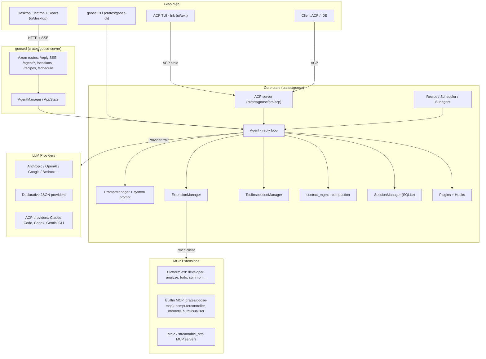
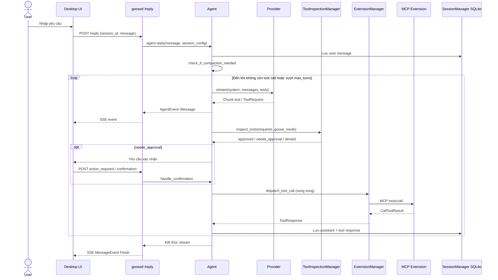

# goose — Tài liệu thiết kế giải pháp

> **Fork:** [mrchinh189/goose](https://github.com/mrchinh189/goose) · **Upstream:** [aaif-goose/goose](https://github.com/aaif-goose/goose) (trước đây là `block/goose`, nay thuộc Agentic AI Foundation – Linux Foundation)
> **Nhóm:** AI coding agent / CLI
> **Ngôn ngữ chính:** Rust (core, CLI, server) + TypeScript (Electron desktop, TUI, SDK) · **License:** Apache-2.0 · **Commit đã phân tích:** `4904e3c`

## 1. Tóm tắt

goose là một AI agent mã nguồn mở chạy trên máy người dùng, có ba "mặt": desktop app (Electron), CLI (`goose`) và server HTTP (`goosed`) để nhúng vào ứng dụng khác. Lõi agent viết bằng Rust, nói chuyện với 15+ LLM provider (Anthropic, OpenAI, Google, Ollama, Bedrock, OpenRouter, ... và cả các agent CLI khác qua ACP), và lấy toàn bộ "tay chân" (tool) từ các extension theo chuẩn **Model Context Protocol (MCP)**. Điểm khác biệt cốt lõi: agent không chỉ dành cho code mà là general-purpose; mọi năng lực đều là MCP extension cắm-rút được, kèm hệ thống **recipe** (YAML) để đóng gói workflow tái sử dụng, scheduler, subagent và lớp kiểm tra an toàn tool-call nhiều tầng.

## 2. Bài toán & yêu cầu

- **Bài toán:** Cho phép người dùng giao việc bằng ngôn ngữ tự nhiên (sửa code, chạy shell, nghiên cứu, tự động hoá) cho một agent chạy local, tự gọi tool lặp nhiều bước cho tới khi xong, mà không bị khoá vào một nhà cung cấp LLM hay một bộ tool cố định.
- **Yêu cầu chức năng chính:**
  - Vòng lặp agent: gọi LLM → nhận tool call → thực thi → đưa kết quả lại LLM (`crates/goose/src/agents/agent.rs`).
  - Hỗ trợ nhiều provider qua một trait chung `Provider` (`crates/goose/src/providers/base.rs`), kể cả provider khai báo bằng JSON (`crates/goose/src/providers/declarative/*.json`).
  - Extension MCP với nhiều transport: `stdio`, `streamable_http`, `builtin`, `platform`, `frontend`, `inline_python` (`crates/goose/src/agents/extension.rs`).
  - Quản lý session bền vững, export/import, đặt tên tự động (`crates/goose/src/session/session_manager.rs`).
  - Recipe, schedule (cron), subagent, skills, plugin + hooks, gateway (Telegram).
  - Nhiều giao diện: CLI, desktop, TUI (Ink), ACP server, REST/SSE server.
- **Yêu cầu phi chức năng:**
  - Hiệu năng & portability: binary Rust native, build release LTO/`opt-level=z` (`Dockerfile`).
  - An toàn: chế độ phê duyệt tool (`GooseMode`), chuỗi inspector (security, egress, adversary, permission, repetition).
  - Độ tin cậy: tự compaction khi vượt context, retry provider, giới hạn `GOOSE_MAX_TURNS` (mặc định 1000).
  - Quan sát: tracing/OpenTelemetry (`crates/goose/src/otel`, `crates/goose/src/tracing`).
- **Ngoài phạm vi:** goose không tự host model (trừ tuỳ chọn `local-inference` bằng candle), không cung cấp sandbox cách ly mạnh ở mức OS như container bắt buộc; tool chạy trực tiếp với quyền user (có hỗ trợ chạy trong `Container` tuỳ chọn – `crates/goose/src/agents/container.rs`).

## 3. Kiến trúc tổng thể

**Giải thích:** Toàn bộ logic nằm trong crate `goose`. CLI nhúng trực tiếp `Agent` (in-process, `crates/goose-cli/src/session/builder.rs` tạo `Agent::new()`), trong khi desktop Electron khởi chạy tiến trình `goosed` (`ui/desktop/src/goosed.ts`) và giao tiếp qua REST + Server-Sent Events. ACP (Agent Client Protocol) là hướng giao tiếp mới: `goose acp` chạy agent qua stdio, `goose serve` qua HTTP/WebSocket; TUI trong `ui/text` dùng chính đường này. Agent chỉ biết hai trừu tượng bên ngoài: `Provider` (LLM) và extension MCP (tool).

## 4. Thành phần chính

| Thành phần | Vị trí trong mã nguồn | Trách nhiệm |
|---|---|---|
| Agent | `crates/goose/src/agents/agent.rs` | Vòng lặp reply, phân loại tool call, dispatch, compaction, final output |
| ExtensionManager | `crates/goose/src/agents/extension_manager.rs` | Kết nối/ngắt MCP client, gộp tool có prefix tên extension |
| ExtensionConfig | `crates/goose/src/agents/extension.rs` | Enum cấu hình extension theo transport |
| Platform extensions | `crates/goose/src/agents/platform_extensions/` | Tool chạy trong tiến trình agent: `developer` (shell, edit, tree, image), `analyze`, `todo`, `summon`, `orchestrator`, `code_execution`, `chatrecall`, `apps`, `ext_manager` |
| Builtin MCP servers | `crates/goose-mcp/src/` | `computercontroller` (docx/pdf/xlsx, tự động hoá), `memory`, `autovisualiser`, `tutorial`, `peekaboo` |
| Provider trait & registry | `crates/goose/src/providers/base.rs`, `provider_registry.rs`, `init.rs` | Trừu tượng LLM: `stream()`, `complete()`, metadata, model info |
| Format adapters | `crates/goose/src/providers/formats/` | Chuyển đổi message/tool sang định dạng từng API (anthropic, openai, openai_responses, google, bedrock...) |
| Toolshim | `crates/goose/src/providers/toolshim.rs` | Giả lập tool calling cho model không hỗ trợ native |
| Tool inspection | `crates/goose/src/tool_inspection.rs`, `crates/goose/src/security/`, `crates/goose/src/permission/` | Chuỗi inspector quyết định Allow / Deny / RequireApproval |
| Context management | `crates/goose/src/context_mgmt/mod.rs` | Auto-compact ở ngưỡng 80% context, tóm tắt cặp tool-call |
| SessionManager | `crates/goose/src/session/session_manager.rs` | Lưu session/message vào SQLite (sqlx), đặt tên, extension data |
| Recipe | `crates/goose/src/recipe/` | Định nghĩa workflow YAML có tham số, extension, settings, response schema |
| Scheduler | `crates/goose/src/scheduler.rs` | Chạy recipe theo cron (`tokio_cron_scheduler`) |
| Subagent | `crates/goose/src/agents/subagent_handler.rs`, `subagent_execution_tool/` | Agent con chạy task độc lập, trả text/final output |
| Plugins & Hooks | `crates/goose/src/plugins/`, `crates/goose/src/hooks/mod.rs` | Hook vòng đời theo spec Open Plugins (`hooks/hooks.json`) |
| ACP | `crates/goose/src/acp/` | Server/transport Agent Client Protocol và provider ACP |
| goose-cli | `crates/goose-cli/src/cli.rs`, `session/` | Lệnh `session`, `run`, `recipe`, `schedule`, `configure`, `acp`, `serve`, `tui`... |
| goose-server (`goosed`) | `crates/goose-server/src/` | Axum server cho desktop: `/reply` (SSE), `/agent/*`, session, recipe, schedule, tunnel |
| Desktop | `ui/desktop/` | Electron 41 + React 19 + Vite + Tailwind |

### 4.1 Agent (`agents/agent.rs`)
`Agent` giữ provider hiện tại, `ExtensionManager`, `final_output_tool`, `frontend_tools`, `ToolInspectionManager`, `PromptManager`, retry state. Hàm public `reply()` chuẩn bị session, kiểm tra auto-compaction (`check_if_compaction_needed`), rồi gọi `reply_internal()` trả về `BoxStream<AgentEvent>`. `AgentEvent` có ba biến thể `Message`, `McpNotification`, `HistoryReplaced` để frontend render tăng dần. Trong mỗi vòng:
1. `prepare_reply_context` gom tool, system prompt, `GooseMode`; nạp thêm project instructions (`load_project_instructions`).
2. Gọi provider stream; mỗi chunk được `categorize_tools` tách thành `frontend_requests` (tool do UI thực thi) và `remaining_requests`.
3. Với `remaining_requests`, chạy inspector → `PermissionCheckResult { approved, needs_approval, denied }`.
4. Thực thi song song các tool future (`stream::select_all`), stream thông báo/log tool về client.
5. Nếu không còn tool call → kết thúc turn; nếu có, ghép tool response vào conversation và lặp.

Xử lý lỗi: `ProviderError::ContextLengthExceeded` kích hoạt compaction khôi phục (tối đa 2 lần), `CreditsExhausted`, `NetworkError` sinh thông báo thân thiện.

### 4.2 Tool inspection & permission
`create_tool_inspection_manager` (agent.rs) đăng ký theo thứ tự: `SecurityInspector` (pattern nguy hiểm, `security/patterns.rs`), `EgressInspector`, `AdversaryInspector` (dùng chính LLM để đánh giá), `PermissionInspector` (dựa trên `GooseMode` và `permission_store`), `RepetitionInspector` (chặn lặp tool call). `GooseMode` (`config/goose_mode.rs`) có 4 giá trị: `Auto`, `Approve`, `SmartApprove` (dùng `permission_judge.rs` hỏi LLM xem tool có read-only không), `Chat`.

### 4.3 Extension
`ExtensionConfig` là enum serde-tagged: `stdio` (spawn tiến trình), `streamable_http` (hỗ trợ cả Unix socket), `builtin` (server trong `goose-mcp`), `platform` (chạy trong tiến trình, truy cập trực tiếp agent), `frontend` (tool do UI cung cấp), `inline_python` (code Python chạy qua `uvx`); `sse` chỉ giữ để tương thích cấu hình. Tool được prefix tên extension (ví dụ `developer__shell`). Có kiểm tra malware cho extension (`extension_malware_check.rs`).

## 5. Luồng xử lý chính

### 5.1 Một lượt hội thoại với tool call (desktop → goosed)

### 5.2 Compaction khi vượt context
Trước mỗi reply, nếu tổng token vượt `DEFAULT_COMPACTION_THRESHOLD = 0.8` của context limit, agent gọi `compact_messages` (tóm tắt bằng LLM), thay conversation trong DB (`replace_conversation`) và phát `AgentEvent::HistoryReplaced`. Nếu provider vẫn trả `ContextLengthExceeded` trong vòng lặp, agent compact lại và thử tiếp; quá 2 lần thì dừng với thông báo lỗi. Ngoài ra còn cơ chế tóm tắt từng batch cặp tool-call (`TOOLCALL_SUMMARIZATION_BATCH_SIZE = 10`).

### 5.3 Chạy recipe headless
`goose run --recipe <file>` (CLI) hoặc scheduler cron: đọc YAML → `Recipe` → áp dụng extension, instructions, `response` schema (thêm `FinalOutputTool` để ép output có cấu trúc) → chạy agent không tương tác → lưu session gắn `schedule_id`.

## 6. Mô hình dữ liệu & giao diện

- **Message/Conversation:** `crates/goose-providers/src/conversation/` (re-export trong `crates/goose/src/lib.rs` dưới tên `goose::conversation`), `MessageContent` gồm text, image, `ToolRequest`, `ToolResponse`, thinking...; dùng kiểu `rmcp::model` cho Tool/CallToolResult.
- **Provider trait:** `stream(model_config, session_id, system, messages, tools) -> MessageStream` là phương thức bắt buộc; `ProviderDef` cung cấp `metadata()` và `from_env()`.
- **Declarative provider (JSON):** ví dụ `providers/declarative/groq.json` khai báo `engine: "openai"`, `base_url`, `api_key_env`, danh sách model với `context_limit`, `max_tokens`.
- **Recipe YAML:** `version`, `title`, `description`, `instructions`/`prompt`, `extensions`, `settings`, `activities`, tham số, `response` (JSON schema), sub-recipes (`crates/goose/src/recipe/mod.rs`).
- **Cấu hình:** `config.yaml` trong thư mục config của goose (`crates/goose/src/config/base.rs`), secret lưu trong system keyring (feature `system-keyring`) hoặc file; biến môi trường như `GOOSE_PROVIDER`, `GOOSE_MODEL`, `GOOSE_MAX_TURNS`.
- **REST API (goosed):** `/reply` (SSE, body tới 50 MB), `/agent/start|resume|restart|tools|call_tool|read_resource|list_apps`, cùng các nhóm route `session`, `recipe`, `schedule`, `config_management`, `action_required`, `tunnel`, `dictation`... (`crates/goose-server/src/routes/`). OpenAPI sinh từ `openapi.rs` sang `ui/desktop/openapi.json`.
- **Giao thức:** MCP (qua crate `rmcp`) cho tool; ACP (`agent-client-protocol`) cho giao tiếp agent ↔ client/IDE và để dùng agent khác làm provider.
- **Hooks:** `<plugin-root>/hooks/hooks.json` với event như `PostToolUse`, `matcher` regex theo tên tool, action `type: "command"` nhận JSON qua stdin.

## 7. Tech stack

| Lớp | Công nghệ | Vai trò |
|---|---|---|
| Core | Rust 2021 (toolchain 1.91), tokio, async-trait, futures | Runtime async cho agent loop |
| MCP | `rmcp` 1.4 | Client/server MCP |
| ACP | `agent-client-protocol` 0.11 | Giao thức agent ↔ client |
| HTTP server | axum 0.8, utoipa (OpenAPI) | `goosed` |
| HTTP client | reqwest 0.13, rustls | Gọi API provider |
| Lưu trữ | sqlx + SQLite | Session & message |
| Scheduler | tokio-cron-scheduler | Chạy recipe định kỳ |
| CLI | clap 4 | Parse lệnh |
| Local inference | candle (tuỳ chọn) | Chạy model local |
| Desktop | Electron 41, React 19, Vite 7, Tailwind 4 | App desktop |
| TUI | Ink (React cho terminal) | `ui/text` |
| Build/dev | Cargo workspace, Hermit, Just, Nix flake | Môi trường dev tái lập |
| Docs | Docusaurus (`documentation/`) | Trang tài liệu |

## 8. Quyết định thiết kế & đánh đổi

| Quyết định | Lý do | Đánh đổi |
|---|---|---|
| Mọi năng lực là MCP extension | Chuẩn mở, tái dùng 70+ server có sẵn, tách agent khỏi tool | Chi phí IPC/tiến trình, chất lượng tool phụ thuộc bên thứ ba |
| Phân biệt `platform` vs `builtin` vs `stdio` extension | Tool cần truy cập agent (todo, summon, ext_manager) chạy in-process; tool khác cô lập | Thêm độ phức tạp trong `ExtensionManager` |
| Trait `Provider` + provider khai báo JSON | Thêm provider OpenAI-compatible không cần code Rust | JSON chỉ cover các engine có sẵn |
| Dùng agent CLI khác (Claude Code, Codex, Gemini CLI) làm provider qua ACP | Tận dụng subscription người dùng | Hành vi phụ thuộc agent bên ngoài, khó kiểm soát tool |
| Chuỗi inspector + `GooseMode` | An toàn nhiều lớp, cấu hình được theo mức tin cậy | SmartApprove/Adversary tốn thêm lời gọi LLM |
| Auto-compaction 80% + recovery compaction | Session dài không chết vì context | Mất chi tiết lịch sử do tóm tắt |
| CLI in-process, desktop qua `goosed` | CLI nhẹ; desktop tách UI khỏi core, có OpenAPI | Hai đường tích hợp phải giữ đồng bộ (đang dịch chuyển sang ACP) |
| SQLite cho session | Local-first, không cần server DB | Không chia sẻ đa máy (có export/nostr share) |

## 9. Triển khai & vận hành

- **Cài đặt:** desktop app (macOS/Linux/Windows) hoặc CLI qua `download_cli.sh`; cũng có Nix flake và gói distro.
- **Build từ source:** `source bin/activate-hermit && cargo build`; `just release-binary`; `just run-ui` cho desktop; `just generate-openapi` sau khi đổi server (`AGENTS.md`).
- **Docker:** `Dockerfile` multi-stage: build `goose-cli` trên `rust:1.82-bookworm`, runtime `debian:bookworm-slim`, chạy user non-root `goose`, `ENTRYPOINT goose`. Xem thêm `BUILDING_DOCKER.md`.
- **Cấu hình lần đầu:** `goose configure` chọn provider/model, lưu `config.yaml` + keyring. `goose doctor` kiểm tra thiết lập.
- **Chế độ chạy:** `goose session` (tương tác), `goose run` (headless, recipe/text), `goose acp` / `goose serve` (ACP), `goosed agent` (server cho desktop), `goose schedule add` (cron), `goose gateway` (Telegram).
- **Quan sát:** tracing + OpenTelemetry (`crates/goose/src/otel`), log file (`logging.rs`), `session diagnostics`, telemetry PostHog có thể tắt.
- **Giới hạn đã biết:** SSE transport cho extension đã bỏ; tool chạy với quyền user thật (khuyến nghị dùng Approve/SmartApprove khi làm việc với dữ liệu nhạy cảm); `max_turns` mặc định 1000.
- **Đánh giá:** `evals/open-model-gym`, `evals/harbor`; tự kiểm thử bằng `goose run --recipe goose-self-test.yaml`.

## 10. Điểm mở rộng

- **Provider mới:** implement `Provider` + `ProviderDef` (`providers/base.rs`) và đăng ký trong `providers/init.rs`; hoặc thêm file JSON vào `providers/declarative/` cho API OpenAI-compatible.
- **Extension MCP:** viết MCP server bất kỳ (stdio/HTTP) và khai báo trong config/recipe; extension built-in mới đặt trong `crates/goose-mcp/src/` và đăng ký `McpCommand`.
- **Platform extension:** thêm module trong `agents/platform_extensions/` khi tool cần truy cập trạng thái agent.
- **Recipe & sub-recipe:** đóng gói workflow YAML, chia sẻ qua deeplink (`recipe_deeplink.rs`).
- **Skills:** `crates/goose/src/skills/` (built-in + do người dùng thêm, lệnh `goose skills`).
- **Plugins & hooks:** `goose plugin install <git-url>`; hook `hooks/hooks.json` chạy script tại sự kiện vòng đời.
- **Frontend tools:** UI có thể khai báo tool riêng (`ExtensionConfig::Frontend`) để agent gọi ngược về giao diện.
- **Inspector:** implement trait `ToolInspector` (`tool_inspection.rs`) để thêm chính sách an toàn.
- **Custom distro:** `CUSTOM_DISTROS.md` mô tả đóng gói goose với provider/extension/branding dựng sẵn.

## 11. Bài học & cách áp dụng

- **Tách agent khỏi tool bằng MCP:** khi xây agent riêng, coi mọi tool là MCP server; agent core chỉ cần client MCP + vòng lặp. Đặt prefix `extension__tool` để tránh trùng tên.
- **Agent loop dạng stream sự kiện:** trả `Stream<AgentEvent>` thay vì kết quả cuối giúp CLI, desktop, server cùng dùng một core, và hỗ trợ huỷ (`CancellationToken`).
- **Pipeline inspector cho tool call:** tách các mối quan tâm (pattern nguy hiểm, egress, lặp, quyền) thành inspector độc lập, gộp kết quả thành approved/needs_approval/denied.
- **Compaction hai tầng:** chủ động (ngưỡng %) và phản ứng (khi provider báo vượt context), có giới hạn số lần thử.
- **Final output tool:** ép agent trả JSON theo schema bằng một tool đặc biệt — hữu ích cho pipeline tự động/headless.
- **Provider khai báo bằng dữ liệu:** giảm chi phí hỗ trợ các endpoint OpenAI-compatible.
- **Workflow dạng recipe + cron:** biến prompt + cấu hình thành artifact có version, chạy lịch định kỳ.

## 12. Tham khảo

- README: `README.md`, `AGENTS.md`, `CUSTOM_DISTROS.md`, `BUILDING_DOCKER.md`, `CONTRIBUTING_RECIPES.md`
- Tài liệu: `documentation/docs/`, https://goose-docs.ai
- Core: `crates/goose/src/agents/agent.rs`, `crates/goose/src/agents/extension.rs`, `crates/goose/src/agents/extension_manager.rs`
- Provider: `crates/goose/src/providers/base.rs`, `crates/goose/src/providers/declarative/`
- An toàn: `crates/goose/src/tool_inspection.rs`, `crates/goose/src/security/`, `crates/goose/src/permission/`, `crates/goose/src/config/goose_mode.rs`
- Context: `crates/goose/src/context_mgmt/mod.rs`
- Session: `crates/goose/src/session/session_manager.rs`
- Recipe/Scheduler: `crates/goose/src/recipe/mod.rs`, `crates/goose/src/scheduler.rs`
- Hooks: `crates/goose/src/hooks/mod.rs`
- CLI: `crates/goose-cli/src/cli.rs`; Server: `crates/goose-server/src/routes/`
- Desktop: `ui/desktop/package.json`, `ui/desktop/src/goosed.ts`
