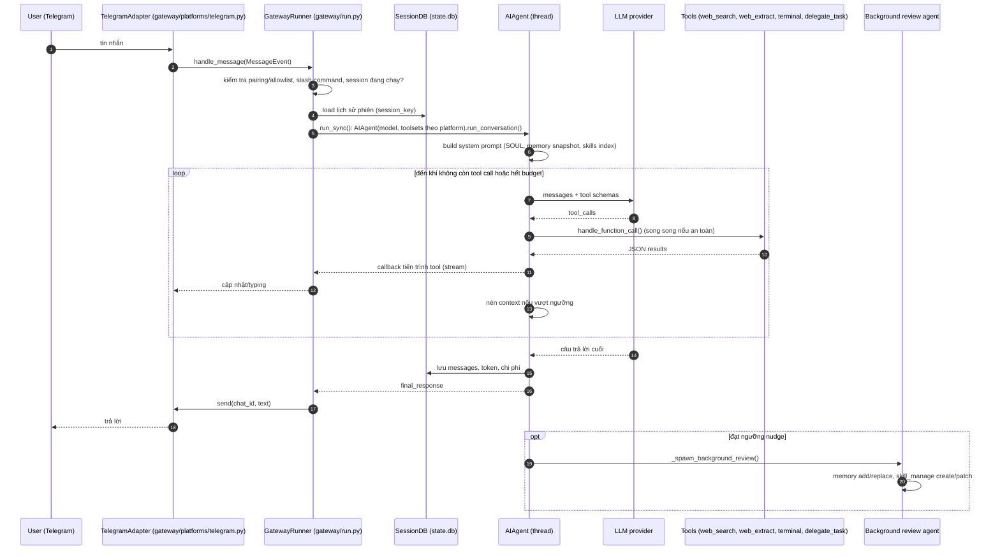

# Hermes Agent — Tài liệu thiết kế giải pháp

> **Fork:** [mrchinh189/hermes-agent](https://github.com/mrchinh189/hermes-agent) · **Upstream:** [NousResearch/hermes-agent](https://github.com/NousResearch/hermes-agent)
> **Nhóm:** AI Agent / Deep research
> **Ngôn ngữ chính:** Python (lõi agent, gateway, CLI) + TypeScript (TUI Ink, web dashboard) · **License:** MIT · **Commit đã phân tích:** `6122a79`

## 1. Tóm tắt

Hermes Agent (v0.13.0, Nous Research) là một agent cá nhân "tự cải thiện" chạy lâu dài trên máy người dùng hoặc VPS: một vòng lặp tool-calling đồng bộ kiểu OpenAI (`AIAgent` trong `run_agent.py`) được bao bởi CLI/TUI, một **messaging gateway** đa nền tảng (Telegram, Discord, Slack, WhatsApp, Signal, Email, Feishu, WeCom…), cron scheduler, MCP/ACP server. Điểm khác biệt cốt lõi là **learning loop khép kín**: memory file-backed (`MEMORY.md`, `USER.md`) có nhắc nhở định kỳ, agent tự tạo và vá **skills** sau tác vụ phức tạp (có "curator" dọn dẹp), tìm lại hội thoại cũ qua SQLite FTS5, và plugin memory bên ngoài (Honcho, mem0…). Ngoài ra repo phục vụ nghiên cứu: sinh trajectory hàng loạt, nén trajectory, môi trường RL Atropos.

## 2. Bài toán & yêu cầu

- **Bài toán:** Người dùng muốn một trợ lý AI dùng bất kỳ model nào, sống ở nơi họ làm việc (terminal, chat app), có thể chạy lệnh/duyệt web/nghiên cứu, nhớ được người dùng và *tích lũy kỹ năng* qua thời gian thay vì bắt đầu lại mỗi phiên.
- **Yêu cầu chức năng chính:**
  - Vòng lặp agent với 40+ tool: `terminal`, `read_file`/`write_file`/`patch`/`search_files`, `web_search`/`web_extract`, browser, `vision`, `execute_code`, `delegate_task`, `memory`, `session_search`, `skill_manage`/`skill_view`/`skills_list`, `todo`, `clarify`, `cronjob`, `mixture_of_agents`, `send_message`, TTS/STT, image/video gen…
  - Toolset theo nền tảng (`toolsets.py`), bật/tắt qua `hermes tools`.
  - Gateway một tiến trình phục vụ nhiều nền tảng, liên tục hội thoại xuyên nền tảng, slash command dùng chung.
  - Skills theo chuẩn `SKILL.md` (agentskills.io), Skills Hub, optional skills.
  - Cron với giao kết quả về bất kỳ nền tảng; Kanban đa agent.
  - 7 terminal backend: local, Docker, SSH, Singularity, Modal, Daytona, Vercel Sandbox.
  - Profiles: nhiều instance cô lập (`HERMES_HOME`).
- **Yêu cầu phi chức năng:**
  - **Giữ prompt cache**: không đổi system prompt/toolset giữa phiên (chỉ khi nén context) — ràng buộc thiết kế trung tâm trong `AGENTS.md`.
  - Chạy trên máy yếu ($5 VPS), Termux, Windows native (beta).
  - Bảo mật: duyệt lệnh nguy hiểm (`tools/approval.py`), DM pairing, quét skill (`tools/skills_guard.py`), URL safety, redact secrets; dependency pin chính xác (`==`) để giảm rủi ro supply-chain.
  - Độ tin cậy: credential pool, fallback provider, retry, phát hiện vòng lặp tool, budget vòng lặp.
- **Ngoài phạm vi:** Không phải nền tảng multi-tenant SaaS; `delegate_task` không bền vững (việc dài phải dùng cron hoặc background terminal); không có web UI chat riêng — dashboard nhúng chính TUI qua PTY.

## 3. Kiến trúc tổng thể

```mermaid
flowchart TB
    subgraph Surfaces["Giao diện"]
        CLI["hermes CLI (cli.py, prompt_toolkit)"]
        TUI["ui-tui (Ink/React) <-> tui_gateway (JSON-RPC stdio)"]
        DASH["Web dashboard (web/, hermes_cli/web_server.py, PTY bridge)"]
        GW["Messaging Gateway (gateway/run.py)"]
        ACP["ACP server (acp_adapter/) cho IDE"]
        MCPS["mcp_serve.py (Hermes as MCP server)"]
        CRON["cron/scheduler.py"]
        BATCH["batch_runner.py / environments (Atropos RL)"]
    end

    subgraph Platforms["gateway/platforms/*"]
        TG[Telegram]
        DC[Discord]
        SL[Slack]
        WA["WhatsApp / Signal / Email / Feishu / WeCom / ..."]
    end

    subgraph Core["Lõi agent"]
        AIA["AIAgent.run_conversation() (run_agent.py)"]
        PB["prompt_builder: SOUL.md, AGENTS.md, skills index, memory snapshot"]
        CC["ContextCompressor (agent/context_compressor.py)"]
        TR["Transports: chat_completions, anthropic, bedrock, codex"]
        REV["Background review fork (memory + skills)"]
    end

    subgraph Tools["Tool layer"]
        MT["model_tools.py: handle_function_call()"]
        REG["tools/registry.py (auto-discovery)"]
        TS["toolsets.py"]
        ENV["tools/environments: local, docker, ssh, modal, daytona, singularity, vercel"]
        MCPC["tools/mcp_tool.py (MCP client)"]
    end

    subgraph State["Trạng thái (HERMES_HOME, mặc định ~/.hermes)"]
        DB[("state.db SQLite + FTS5 (hermes_state.py)")]
        MEMF["memories/MEMORY.md, USER.md"]
        SK["skills/ + .usage.json"]
        CFG["config.yaml + .env"]
    end

    subgraph Plugins["plugins/"]
        MP["model-providers/*"]
        MEMP["memory/* (honcho, mem0, ...)"]
        OTH["kanban, image_gen, context_engine, observability, ..."]
    end

    LLM["LLM providers (OpenRouter, Nous Portal, Anthropic, OpenAI, ...)"]

    TG & DC & SL & WA --> GW
    CLI --> AIA
    TUI --> AIA
    DASH --> TUI
    GW --> AIA
    ACP --> AIA
    CRON --> AIA
    BATCH --> AIA
    AIA --> PB
    AIA --> CC
    AIA --> TR --> LLM
    TR -. profiles .-> MP
    AIA --> MT --> REG
    TS --> MT
    MT --> ENV
    MT --> MCPC
    AIA --> REV
    AIA --> DB
    PB --> MEMF
    PB --> SK
    AIA --> MEMP
    MCPS --> DB
```

Giải thích:
- **Một lõi, nhiều bề mặt**: CLI, TUI, gateway, ACP, cron, batch runner đều khởi tạo `AIAgent` và gọi `run_conversation()`. Gateway (async) chạy agent đồng bộ trong thread (`run_sync()` trong `gateway/run.py`).
- **Chuỗi phụ thuộc tool**: `tools/registry.py` (không phụ thuộc) ← `tools/*.py` gọi `registry.register()` khi import ← `model_tools.py` kích hoạt discovery ← `run_agent.py`, `cli.py`, `batch_runner.py`, `environments/`.
- **Trạng thái theo profile**: mọi đường dẫn qua `get_hermes_home()` (`hermes_constants.py`), nên nhiều profile chạy song song không đụng nhau.

## 4. Thành phần chính

| Thành phần | Vị trí trong mã nguồn | Trách nhiệm |
|---|---|---|
| Agent loop | `run_agent.py` (`AIAgent`, `IterationBudget`, `run_conversation`, `_execute_tool_calls_concurrent/sequential`) | Gọi LLM, thực thi tool (song song khi an toàn), interrupt, budget, nudge, review nền |
| Tool orchestration | `model_tools.py`, `tools/registry.py`, `toolsets.py` | Auto-discovery tool qua AST, schema, dispatch, check availability, toolset theo nền tảng |
| Prompt | `agent/prompt_builder.py`, `agent/prompt_caching.py` | Ghép SOUL.md, context files (`HERMES.md`/`AGENTS.md`/`CLAUDE.md`/`.cursorrules`), skills index (có snapshot cache), env hints; cache_control Anthropic |
| Nén context | `agent/context_compressor.py` (`ContextCompressor` kế thừa `ContextEngine`) | Prune tool result cũ, tóm tắt các lượt giữa, giữ tail và cặp tool_call/tool hợp lệ |
| Transports | `agent/transports/` (`chat_completions.py`, `anthropic.py`, `bedrock.py`, `codex.py`…) + adapters `agent/*_adapter.py` | Chuẩn hóa API khác nhau về một định dạng message OpenAI |
| Provider profiles | `providers/base.py` (`ProviderProfile`), `plugins/model-providers/*` | Khai báo backend suy luận (openrouter, anthropic, nous, deepseek, gemini, xai…) |
| Credential/rate | `agent/credential_pool.py`, `agent/rate_limit_tracker.py`, `agent/retry_utils.py`, `agent/error_classifier.py` | Xoay vòng key, phân loại lỗi, retry/fallback |
| Session store | `hermes_state.py` (`SessionDB`) | SQLite: `sessions`, `messages`, `messages_fts` + `messages_fts_trigram` (FTS5), chi phí/token |
| Memory | `tools/memory_tool.py`, `agent/memory_manager.py`, `agent/memory_provider.py`, `plugins/memory/*` | MEMORY.md/USER.md giới hạn ký tự + provider ngoài (prefetch, sync_turn) |
| Skills | `tools/skills_tool.py`, `tools/skill_manager_tool.py`, `tools/skills_hub.py`, `tools/skills_guard.py`, `agent/skill_commands.py`, `agent/curator.py` | Liệt kê/xem/tạo/vá skill, hub cài đặt, quét bảo mật, slash `/skill`, curator archive skill cũ |
| Session search | `tools/session_search_tool.py` | FTS5 → nhóm theo session → LLM phụ tóm tắt |
| Delegation | `tools/delegate_tool.py` | Subagent context riêng, leaf/orchestrator, song song tối đa 3 |
| Code execution | `tools/code_execution_tool.py` | Script Python gọi tool qua RPC (UDS hoặc file), chỉ stdout vào context |
| Terminal backends | `tools/terminal_tool.py`, `tools/environments/*` | Thực thi lệnh trên local/docker/ssh/modal/daytona/singularity/vercel |
| Web/browser | `tools/web_tools.py`, `tools/web_providers/`, `tools/browser_tool.py`, `tools/browser_providers/` | Search/extract (Exa, Firecrawl, Parallel, Tavily, DDGS, SearXNG, Brave), browser automation |
| Approval/safety | `tools/approval.py`, `tools/url_safety.py`, `tools/path_security.py`, `agent/redact.py`, `agent/tool_guardrails.py` | Lệnh nguy hiểm, allowlist, smart approval bằng LLM phụ |
| Gateway | `gateway/run.py` (`GatewayRunner`), `gateway/session.py`, `gateway/platforms/base.py` (`BasePlatformAdapter`), `gateway/delivery.py`, `gateway/pairing.py` | Nhận `MessageEvent`, khóa session, chạy agent, stream trả lời, approval, background notify |
| CLI | `cli.py` (`HermesCLI`), `hermes_cli/main.py`, `hermes_cli/commands.py` (`COMMAND_REGISTRY`), `hermes_cli/skin_engine.py` | Giao diện terminal, subcommand, slash command registry dùng chung |
| TUI | `ui-tui/src/`, `tui_gateway/server.py` | Ink frontend + backend JSON-RPC (`prompt.submit`, `message.delta`, `tool.start`, `approval.request`…) |
| Dashboard | `web/`, `hermes_cli/web_server.py`, `hermes_cli/pty_bridge.py` | React/Vite, nhúng `hermes --tui` qua WebSocket `/api/pty` |
| Cron | `cron/jobs.py`, `cron/scheduler.py`, `tools/cronjob_tools.py` | Lịch (duration, "every", cron 5 trường, ISO), delivery đa nền tảng |
| Kanban | `hermes_cli/kanban.py`, `tools/kanban_tools.py`, `plugins/kanban/` | Bảng việc SQLite, dispatcher spawn worker profile |
| ACP / MCP | `acp_adapter/`, `mcp_serve.py`, `tools/mcp_tool.py` | IDE integration; expose hội thoại như MCP tools; dùng MCP server ngoài |
| Plugins | `hermes_cli/plugins.py` (`PluginManager`) | Hooks `pre/post_tool_call`, `pre/post_llm_call`, `on_session_start/end`, đăng ký tool/CLI |
| Research | `batch_runner.py`, `trajectory_compressor.py`, `environments/` (`hermes_base_env.py`, `web_research_env.py`, `hermes_swe_env/`), `rl_cli.py` | Sinh trajectory, nén, môi trường Atropos |

### 4.1 Vòng lặp agent
`run_conversation()` là vòng lặp **đồng bộ**: trong khi `api_call_count < max_iterations` (mặc định 90) và `IterationBudget` còn, gọi LLM với `tool_schemas`; nếu có tool call thì thực thi (song song khi `_should_parallelize_tool_batch` cho phép, tránh đụng cùng đường dẫn), nối kết quả dạng message `tool`, lặp tiếp; không có tool call thì trả lời. Có kiểm tra interrupt, `/steer` chèn chỉ dẫn giữa chừng, sửa JSON tool args hỏng (`_repair_tool_call_arguments`), "nudge" khi model trả rỗng sau tool, một lượt grace khi hết budget. Tool cấp agent (`todo`, `memory`) bị chặn trước `handle_function_call()`.

### 4.2 Learning loop
- **Memory nudge**: đếm lượt user; mỗi `memory.nudge_interval` (mặc định 10) lượt đặt cờ review.
- **Skill nudge**: đếm số vòng tool-calling kể từ lần cuối dùng `skill_manage`; vượt `skills.creation_nudge_interval` (mặc định 10) thì review.
- **Background review** (`_spawn_background_review`): fork một `AIAgent` phụ (`max_iterations=16`, `enabled_toolsets=["memory","skills"]`, nudge = 0, im lặng) đọc lại hội thoại để ghi memory và tạo/vá skill, không làm bẩn context chính.
- **Frozen snapshot**: `MEMORY.md`/`USER.md` được chụp vào system prompt lúc đầu phiên; ghi giữa phiên lưu đĩa ngay nhưng chỉ có hiệu lực phiên sau — giữ prefix cache.
- **Curator** (`agent/curator.py`): theo dõi `use_count`/`view_count`/`patch_count` trong `skills/.usage.json`, chuyển skill do agent tạo sang stale/archived (không bao giờ xóa), hỗ trợ pin, backup tar.gz.

## 5. Luồng xử lý chính

### 5.1 Tin nhắn Telegram yêu cầu nghiên cứu

### 5.2 Programmatic Tool Calling (`execute_code`)
LLM viết một script Python → `tools/code_execution_tool.py` sinh stub `hermes_tools.py` → chạy script trong tiến trình con (local qua Unix domain socket; backend remote qua file request/response) → mỗi lời gọi tool trong script được chuyển về tiến trình cha để dispatch → chỉ stdout trả về LLM. Nhờ đó pipeline nhiều bước (search → extract → lọc) tốn một lượt context.

### 5.3 Cron
`cron/scheduler.py` tick (khóa file `cron/.tick.lock`) → job đến hạn → tùy chọn chạy `script` thu thập dữ liệu → `AIAgent` với `skip_memory=True`, skills/model riêng, giới hạn cứng 3 phút → giao kết quả tới nền tảng đích trong một cron session riêng.

## 6. Mô hình dữ liệu & giao diện

- **`config.yaml`** (`~/.hermes/config.yaml`, mẫu `cli-config.yaml.example`, mặc định ở `DEFAULT_CONFIG` trong `hermes_cli/config.py`): `model`, `terminal`, `browser`, `tool_loop_guardrails`, `compression`, `prompt_caching`, `memory`, `session_reset`, `streaming`, `skills`, `agent`, `platform_toolsets`, `stt`, `code_execution`, `delegation`, `display`, `auxiliary`, `curator`, `cron`, `plugins`…
- **`.env`**: chỉ chứa secrets (metadata ở `OPTIONAL_ENV_VARS`).
- **SessionDB** (`hermes_state.py`): bảng `sessions` (source, user_id, model, system_prompt, parent_session_id, token in/out/cache/reasoning, chi phí ước tính/thực, title, handoff_*), `messages` (role, content, tool_calls, tool_name, reasoning*, finish_reason), `state_meta`, FTS5 `messages_fts` và `messages_fts_trigram` cập nhật bằng trigger.
- **Message format**: OpenAI chat (`system/user/assistant/tool`), reasoning lưu ở `assistant_msg["reasoning"]`.
- **Tool registration**: `registry.register(name, toolset, schema, handler, check_fn, requires_env)`; handler luôn trả JSON string.
- **Memory files**: `memories/MEMORY.md`, `memories/USER.md`, entry phân tách bằng `§`, giới hạn theo ký tự; tool `memory` với action `add/replace/remove/read`.
- **Skill**: thư mục chứa `SKILL.md` (frontmatter `name`, `description` ≤ 60 ký tự, `version`, `author`, `license`, `platforms`, `metadata.hermes.*`), kèm `scripts/`, `references/`, `templates/`.
- **MemoryProvider ABC** (`agent/memory_provider.py`): `initialize`, `system_prompt_block`, `prefetch`, `sync_turn`, `get_tool_schemas`, `handle_tool_call`, `on_session_end`, `on_pre_compress`, `on_delegation`, `shutdown`…
- **TUI protocol**: JSON-RPC newline-delimited qua stdio (`tui_gateway/server.py`).
- **MCP server** (`hermes mcp serve`): `conversations_list`, `conversation_get`, `messages_read`, `attachments_fetch`, `events_poll`, `events_wait`, `messages_send`, `permissions_list_open`, `permissions_respond`, `channels_list`.
- **CLI entry points** (`pyproject.toml`): `hermes = hermes_cli.main:main`, `hermes-agent = run_agent:main`, `hermes-acp = acp_adapter.entry:main`.
- **Slash commands**: `COMMAND_REGISTRY` (`hermes_cli/commands.py`) là nguồn duy nhất cho CLI, gateway, menu Telegram, Slack, autocomplete.

## 7. Tech stack

| Lớp | Công nghệ | Vai trò |
|---|---|---|
| Ngôn ngữ | Python ≥ 3.11 (Docker dùng 3.13), TypeScript | Lõi và giao diện |
| LLM client | `openai==2.24.0` (chung), `anthropic`, `boto3` (Bedrock) qua extras | Gọi model |
| CLI | `prompt_toolkit`, `rich`, `fire`, curses | Terminal UI |
| TUI | Ink 6, React 19 (`ui-tui/`) | TUI hiện đại |
| Dashboard | React 19 + Vite (`web/`), FastAPI + Uvicorn (extra `web`), xterm.js, `ptyprocess` | Web dashboard |
| Lưu trữ | SQLite + FTS5 (stdlib `sqlite3`), file Markdown/JSON | Session, memory, skills |
| Scheduler | `croniter` | Cron |
| Messaging | `python-telegram-bot`, `discord.py`, `slack-bolt`, `lark-oapi`, `dingtalk-stream`, `mautrix` (Matrix), `aiohttp` | Gateway adapters |
| Web/search | Exa, Firecrawl, Parallel, Tavily, DDGS, SearXNG, Brave; Browserbase, browser-use | Research tools |
| Sandbox | Docker, SSH, Singularity, `modal`, `daytona`, `vercel` | Terminal backends |
| Giao thức | `mcp==1.26.0`, `agent-client-protocol` | MCP client/server, ACP |
| Voice | `faster-whisper`, `edge-tts`, `elevenlabs` | STT/TTS |
| RL | `atroposlib`, `tinker`, `wandb` | Huấn luyện/đánh giá |
| Đóng gói | setuptools, `uv`/`uv.lock`, Nix flake, Dockerfile (debian 13 + tini + gosu), `scripts/install.sh`/`install.ps1` | Phân phối |
| Test/lint | pytest (+xdist), `ruff`, `ty` | Chất lượng |

## 8. Quyết định thiết kế & đánh đổi

| Quyết định | Lý do | Đánh đổi |
|---|---|---|
| Vòng lặp agent đồng bộ, file `run_agent.py` lớn (~12k LOC) | Dễ suy luận, interrupt/budget tường minh, dùng chung cho mọi bề mặt | File khổng lồ, khó review; gateway phải đẩy vào thread |
| Định dạng message OpenAI làm chuẩn nội bộ + transport adapters | Hỗ trợ hàng chục provider/aggregator | Phải dịch reasoning/tool-call cho Anthropic, Codex, Gemini, Bedrock |
| Bảo toàn prompt cache tuyệt đối | Giảm chi phí mạnh cho phiên dài | Thay đổi skills/memory/toolset chỉ có hiệu lực phiên sau (trừ `--now`) |
| Memory là file Markdown giới hạn ký tự + frozen snapshot | Minh bạch, người dùng sửa được, không phụ thuộc vector DB | Dung lượng nhỏ; truy hồi rộng phải nhờ `session_search` hoặc plugin |
| Agent tự viết skill + background review fork | Tích lũy quy trình (procedural memory) mà không làm phình context chính | Tốn thêm lượt gọi LLM; cần curator và quét bảo mật để kiểm soát chất lượng |
| Auto-discovery tool qua AST + toolset khai báo thủ công | Thêm tool dễ, nhưng việc lộ tool cho model là có chủ đích | Hai bước khi thêm tool core; dễ quên thêm vào toolset |
| Plugin thay vì sửa core (rule trong `AGENTS.md`) | Giữ core ổn định, bên thứ ba mở rộng được | Phải mở rộng plugin surface khi thiếu hook |
| Dependency pin `==` + lazy install extras (`tools/lazy_deps.py`) | Giảm rủi ro supply-chain, cài đặt nhẹ | Cập nhật thủ công thường xuyên |
| Profiles qua biến `HERMES_HOME` | Nhiều instance cô lập trên một máy | Mọi code phải dùng `get_hermes_home()`, test phải cô lập |
| `delegate_task` đồng bộ, giới hạn độ sâu | Đơn giản, hủy theo cha | Không bền; việc dài phải dùng cron/background |
| Dashboard nhúng TUI qua PTY thay vì viết lại chat bằng React | Một nguồn sự thật cho trải nghiệm chat | Không chạy trên Windows native (cần POSIX PTY) |

## 9. Triển khai & vận hành

- **Cài đặt nhanh:** `curl -fsSL .../scripts/install.sh | bash` (Linux/macOS/WSL2/Termux) hoặc `install.ps1` (Windows beta); sau đó `hermes setup`, `hermes model`, `hermes tools`, `hermes doctor`.
- **Từ mã nguồn:** `./setup-hermes.sh` hoặc `uv venv .venv --python 3.11 && uv pip install -e ".[all,dev]"`, test bằng `scripts/run_tests.sh`.
- **Gateway:** `hermes gateway setup` + `hermes gateway start`; có thể chạy như service.
- **Docker:** `Dockerfile` (debian 13.4, `tini` + `gosu`, volume `/opt/data`, entrypoint `docker/entrypoint.sh`); `docker-compose.yml` có 2 service `gateway` (`gateway run`) và `dashboard` (`dashboard --host 127.0.0.1`), `network_mode: host`, mount `~/.hermes:/opt/data`, `HERMES_UID/GID`.
- **Nix:** `flake.nix`, thư mục `nix/`.
- **Quan sát:** log ở `~/.hermes/logs/` (`agent.log`, `errors.log`, `gateway.log`), xem bằng `hermes logs --follow`; `/usage`, `/insights`; bảng `sessions` lưu token và chi phí; plugin `observability`.
- **Kanban dispatcher:** chạy trong gateway (`kanban.dispatch_in_gateway: true`) hoặc systemd unit trong `plugins/kanban/systemd/`.
- **Giới hạn đã biết:** Windows native beta; `delegate_task` không bền; cron bị ngắt cứng sau 3 phút; memory provider không chạy trong cron; gateway có hai lớp guard tin nhắn nên lệnh điều khiển mới phải bypass cả hai (ghi chú trong `AGENTS.md`).

## 10. Điểm mở rộng

- **Tool:** plugin `~/.hermes/plugins/<name>/plugin.yaml` + `__init__.py` với `register(ctx)` → `ctx.register_tool(...)`; hoặc tool core trong `tools/your_tool.py` + thêm vào `toolsets.py`.
- **Hooks:** `pre_tool_call`, `post_tool_call`, `pre_llm_call`, `post_llm_call`, `on_session_start`, `on_session_end` qua `PluginManager` (`hermes_cli/plugins.py`); shell hooks (`agent/shell_hooks.py`); gateway hooks (`gateway/hooks.py`).
- **Model provider:** `plugins/model-providers/<name>/__init__.py` gọi `providers.register_provider(ProviderProfile(...))`; plugin người dùng cùng tên ghi đè bundled.
- **Memory provider:** hiện thực `MemoryProvider` ABC, phát hành như repo plugin riêng (policy: không thêm provider mới vào tree).
- **Context engine / image gen / video gen:** `agent/context_engine.py`, `agent/image_gen_provider.py`, `agent/video_gen_provider.py` + `plugins/<kind>/`.
- **Nền tảng nhắn tin:** kế thừa `BasePlatformAdapter` (`gateway/platforms/base.py`), xem `gateway/platforms/ADDING_A_PLATFORM.md`.
- **Terminal backend:** thêm lớp trong `tools/environments/` theo `base.py`.
- **Web provider:** `tools/web_providers/base.py` (xem `ARCHITECTURE.md` cùng thư mục).
- **Skills:** thêm thư mục `SKILL.md` vào `skills/<category>/` hoặc `optional-skills/`; cài từ hub qua `hermes skills install`.
- **Slash command:** thêm `CommandDef` vào `COMMAND_REGISTRY`, handler trong `cli.py` và/hoặc `gateway/run.py`.
- **Skin:** YAML trong `~/.hermes/skins/`.
- **MCP:** cấu hình MCP server ngoài (client) hoặc dùng `hermes mcp serve` để agent khác điều khiển Hermes.

## 11. Bài học & cách áp dụng

1. **Prompt-cache-first design**: coi system prompt là bất biến trong phiên, ghi state ra đĩa nhưng chỉ "nạp" ở phiên sau (frozen snapshot). Áp dụng cho mọi agent chạy dài để giảm chi phí.
2. **Learning loop qua fork nền**: đếm lượt/iteration, khi đạt ngưỡng thì fork agent nhỏ chỉ có tool `memory` + `skills` để phản tỉnh — tách việc "học" khỏi việc "làm".
3. **Skills là procedural memory có vòng đời**: tạo → dùng → vá → đếm usage → archive (không xóa), có pin và quét bảo mật.
4. **Programmatic Tool Calling**: cho model viết script gọi tool qua RPC để gộp nhiều bước, chỉ trả stdout — giảm mạnh token cho tác vụ research nhiều bước.
5. **Một registry cho slash command** sinh ra help, autocomplete, menu Telegram, routing Slack — tránh lệch giữa các bề mặt.
6. **Tool registry tự khám phá + toolset khai báo**: tách "tồn tại" và "được phép dùng".
7. **Profiles qua một biến môi trường gốc** (`HERMES_HOME`) + quy tắc `get_hermes_home()` + fixture cô lập test.
8. **Bảo mật thực dụng**: duyệt lệnh nguy hiểm với smart approval bằng LLM phụ, pin dependency chính xác, lazy install extras.
9. **Session search = FTS5 + LLM tóm tắt**: giải pháp nhớ dài hạn rẻ, không cần vector DB.

## 12. Tham khảo

- `README.md`, `AGENTS.md` (hướng dẫn phát triển/kiến trúc chi tiết), `CONTRIBUTING.md`, `SECURITY.md`, `RELEASE_v0.13.0.md`
- `pyproject.toml`, `Dockerfile`, `docker-compose.yml`, `docker/entrypoint.sh`, `flake.nix`
- `run_agent.py`, `model_tools.py`, `toolsets.py`, `tools/registry.py`, `hermes_state.py`, `hermes_constants.py`
- `agent/prompt_builder.py`, `agent/context_compressor.py`, `agent/memory_provider.py`, `agent/curator.py`, `agent/transports/`
- `tools/memory_tool.py`, `tools/skill_manager_tool.py`, `tools/session_search_tool.py`, `tools/delegate_tool.py`, `tools/code_execution_tool.py`, `tools/web_tools.py`, `tools/approval.py`
- `gateway/run.py`, `gateway/platforms/base.py`, `gateway/platforms/ADDING_A_PLATFORM.md`
- `cli.py`, `hermes_cli/main.py`, `hermes_cli/commands.py`, `hermes_cli/plugins.py`, `hermes_cli/web_server.py`
- `tui_gateway/server.py`, `ui-tui/`, `web/`
- `cron/scheduler.py`, `mcp_serve.py`, `acp_adapter/`
- `environments/README.md`, `batch_runner.py`, `trajectory_compressor.py`
- `cli-config.yaml.example`, `.env.example`, `website/docs/`
- Tài liệu online: https://hermes-agent.nousresearch.com/docs/
