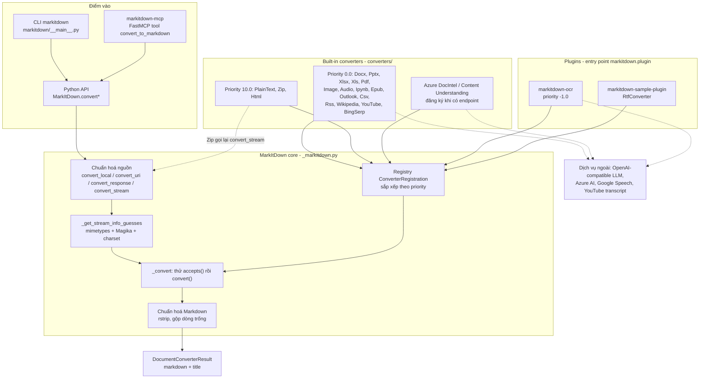
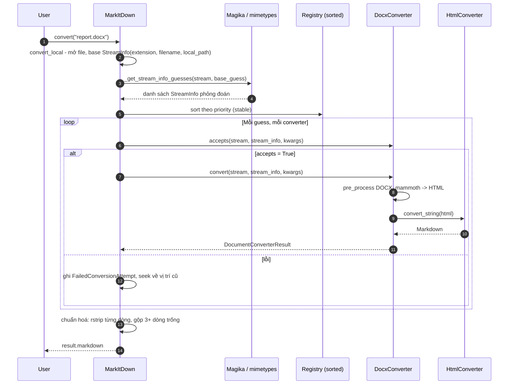

# MarkItDown — Tài liệu thiết kế giải pháp

> **Fork:** [mrchinh189/markitdown](https://github.com/mrchinh189/markitdown) · **Upstream:** [microsoft/markitdown](https://github.com/microsoft/markitdown)
> **Nhóm:** Xử lý tài liệu
> **Ngôn ngữ chính:** Python (>=3.10) · **License:** MIT · **Commit đã phân tích:** `e144e0a`

## 1. Tóm tắt

MarkItDown là thư viện + CLI Python nhẹ của Microsoft (AutoGen team) để chuyển nhiều loại file và URL (PDF, Word, PowerPoint, Excel, HTML, ảnh, audio, EPUB, ZIP, YouTube, Wikipedia, RSS, Outlook…) sang Markdown phục vụ LLM và pipeline phân tích văn bản. Thiết kế xoay quanh một registry các `DocumentConverter` được thử lần lượt theo priority, kết hợp nhận diện loại file bằng Magika; output ưu tiên giữ cấu trúc (heading, list, table, link) và tiết kiệm token hơn là độ trung thực hiển thị. Repo là monorepo gồm thư viện lõi, MCP server, plugin OCR dựa trên LLM Vision và plugin mẫu.

## 2. Bài toán & yêu cầu

- **Bài toán:** LLM "nói" Markdown tốt và Markdown tiết kiệm token, nhưng dữ liệu thực tế nằm trong nhiều định dạng nhị phân. Cần một công cụ đơn giản, cài nhẹ, biến mọi thứ thành Markdown có cấu trúc để đưa vào prompt/RAG/agent.
- **Yêu cầu chức năng chính:**
  - Chuyển đổi từ path, URI (`http:`, `https:`, `file:`, `data:`), `requests.Response` hoặc binary stream.
  - Tự nhận diện loại nội dung kể cả khi thiếu extension (Magika + mimetypes + charset).
  - Hỗ trợ nhiều định dạng, trong đó ZIP được duyệt đệ quy.
  - Tuỳ chọn dùng LLM để mô tả ảnh (image, pptx), dịch vụ Azure Document Intelligence / Content Understanding cho chất lượng cao hơn.
  - Plugin bên thứ ba qua entry point; MCP server cho agent.
- **Yêu cầu phi chức năng:**
  - Dependency lõi tối thiểu (`beautifulsoup4`, `requests`, `markdownify`, `magika`, `charset-normalizer`, `defusedxml`), phần còn lại là optional extras.
  - Thiếu dependency không làm hỏng import; chỉ báo lỗi khi thực sự cần converter đó.
  - Bảo mật: chạy với quyền của process; README khuyến cáo sanitize input và dùng API hẹp nhất (`convert_local`, `convert_stream`, `convert_response`).
- **Ngoài phạm vi:** Không nhằm chuyển đổi "high-fidelity" cho người đọc (README nói rõ); không có layout model/table model local như Docling; PDF mặc định chỉ trích xuất text bằng pdfminer/pdfplumber (không OCR ảnh scan trừ khi dùng Azure hoặc plugin `markitdown-ocr`).

## 3. Kiến trúc tổng thể



Lõi rất mỏng: lớp `MarkItDown` chỉ làm 3 việc — chuẩn hoá nguồn vào thành stream seekable + danh sách `StreamInfo` phỏng đoán, giữ registry converter có priority, và vòng lặp "ai nhận thì người đó convert". Toàn bộ tri thức định dạng nằm trong các converter độc lập.

## 4. Thành phần chính

| Thành phần | Vị trí trong mã nguồn | Trách nhiệm |
|---|---|---|
| `MarkItDown` | `packages/markitdown/src/markitdown/_markitdown.py` | Facade: khởi tạo registry, nạp plugin, các hàm `convert*`, phỏng đoán `StreamInfo`, vòng lặp converter |
| `DocumentConverter`, `DocumentConverterResult` | `packages/markitdown/src/markitdown/_base_converter.py` | Interface `accepts()` / `convert()`; kết quả `markdown` + `title` (`text_content` là alias cũ) |
| `StreamInfo` | `packages/markitdown/src/markitdown/_stream_info.py` | Dataclass frozen: `mimetype`, `extension`, `charset`, `filename`, `local_path`, `url`; `copy_and_update` |
| Exceptions | `packages/markitdown/src/markitdown/_exceptions.py` | `MissingDependencyException`, `UnsupportedFormatException`, `FileConversionException` (gom `FailedConversionAttempt`) |
| URI utils | `packages/markitdown/src/markitdown/_uri_utils.py` | `file_uri_to_path`, `parse_data_uri` |
| Converters | `packages/markitdown/src/markitdown/converters/*.py` | Mỗi định dạng một class: `_pdf_converter.py`, `_docx_converter.py`, `_pptx_converter.py`, `_xlsx_converter.py`, `_html_converter.py`, `_zip_converter.py`, `_image_converter.py`, `_audio_converter.py`, `_youtube_converter.py`, `_doc_intel_converter.py`, `_cu_converter.py`… |
| Helpers | `converters/_markdownify.py`, `_llm_caption.py`, `_exiftool.py`, `_transcribe_audio.py`, `converter_utils/docx/*` | Markdownify tuỳ biến, gọi LLM mô tả ảnh, đọc metadata bằng exiftool, transcribe audio, tiền xử lý DOCX (OMML math → LaTeX) |
| CLI | `packages/markitdown/src/markitdown/__main__.py` | argparse: `-o`, `-x`, `-m`, `-c`, `-d/-e`, `--use-cu`, `-p`, `--list-plugins`, `--keep-data-uris`; đọc stdin nếu không có filename |
| MCP server | `packages/markitdown-mcp/src/markitdown_mcp/__main__.py` | Một tool `convert_to_markdown(uri)`; transport STDIO hoặc Streamable HTTP + SSE (Starlette/uvicorn) |
| OCR plugin | `packages/markitdown-ocr/src/markitdown_ocr/*` | `LLMVisionOCRService` + converter PDF/DOCX/PPTX/XLSX có OCR ảnh nhúng |
| Sample plugin | `packages/markitdown-sample-plugin/src/markitdown_sample_plugin/_plugin.py` | Ví dụ `RtfConverter` dùng `striprtf` |

### 4.1 Registry và priority

`register_converter(converter, priority=0.0)` chèn vào **đầu** danh sách (`insert(0, ...)`); trước mỗi lần convert, danh sách được sort ổn định theo priority tăng dần. Hệ quả:

- Giá trị nhỏ hơn được thử trước: `PRIORITY_SPECIFIC_FILE_FORMAT = 0.0`, `PRIORITY_GENERIC_FILE_FORMAT = 10.0`.
- Cùng priority thì converter **đăng ký sau** được thử trước — vì vậy `DocumentIntelligenceConverter` và `ContentUnderstandingConverter` (đăng ký cuối trong `enable_builtins` khi có endpoint) chặn trước các converter local.
- Plugin có thể chen trước built-in bằng priority âm (plugin OCR dùng `-1.0`) hoặc chen giữa (ví dụ 9.0 trước PlainText).

### 4.2 Phỏng đoán loại nội dung

`_get_stream_info_guesses` bổ sung thông tin từ base guess (extension → mimetype qua `mimetypes`, và ngược lại), sau đó gọi `self._magika.identify_stream(file_stream)` để đoán từ nội dung; nếu kết quả Magika mâu thuẫn với base guess thì giữ cả hai phỏng đoán. Charset được chuẩn hoá (`_normalize_charset`) — `PlainTextConverter` nhận mọi stream có charset.

### 4.3 Tải dependency lười (lazy failure)

Mỗi converter bọc `import` thư viện tuỳ chọn trong `try/except ImportError` và lưu `_dependency_exc_info`; chỉ khi `convert()` thực sự chạy mới raise `MissingDependencyException` kèm gợi ý extra cần cài (ví dụ `_docx_converter.py` với `mammoth`).

### 4.4 Một số converter tiêu biểu

- **PDF** (`_pdf_converter.py`): ưu tiên `pdfplumber` để trích bảng/biểu mẫu thành bảng Markdown căn chỉnh; nếu trang không có nội dung dạng form hoặc pdfplumber lỗi thì fallback `pdfminer.high_level.extract_text`.
- **DOCX** (`_docx_converter.py`): tiền xử lý (`converter_utils/docx/pre_process.py`, chuyển OMML math), `mammoth.convert_to_html` (hỗ trợ `style_map`) rồi tái dùng `HtmlConverter`.
- **HTML** (`_html_converter.py` + `_markdownify.py`): BeautifulSoup + `_CustomMarkdownify` (heading ATX, xử lý link, bỏ data URI ảnh trừ khi `keep_data_uris`).
- **Image / PPTX**: metadata qua exiftool và mô tả ảnh bằng `llm_caption` (Chat Completions với ảnh base64 data URI) khi có `llm_client` + `llm_model`.
- **Audio** (`_transcribe_audio.py`): `pydub` + `SpeechRecognition` (`recognize_google`).
- **ZIP** (`_zip_converter.py`): giữ tham chiếu tới `MarkItDown`, gọi lại `convert_stream` cho từng file con, bỏ qua file không hỗ trợ.

## 5. Luồng xử lý chính

### 5.1 `MarkItDown().convert("report.docx")`



Nếu không converter nào trả kết quả: có lỗi → `FileConversionException` (liệt kê từng attempt); không ai nhận → `UnsupportedFormatException`. Vòng lặp còn assert vị trí stream không đổi sau `accepts()` để bảo vệ hợp đồng giữa các converter.

### 5.2 Agent gọi qua MCP

Client MCP (ví dụ Claude Desktop) gọi tool `convert_to_markdown(uri)` → server tạo `MarkItDown(enable_plugins=check_plugins_enabled())` (đọc env `MARKITDOWN_ENABLE_PLUGINS`) → `convert_uri(uri).markdown`. Với `--http`, Starlette mount `/mcp` (Streamable HTTP, stateless, JSON response) và `/sse` + `/messages/` (SSE); mặc định bind `127.0.0.1:3001` và in cảnh báo nếu bind ra interface khác vì server không có xác thực.

## 6. Mô hình dữ liệu & giao diện

**Python API:**

```python
from markitdown import MarkItDown
md = MarkItDown(enable_plugins=False,
                llm_client=client, llm_model="gpt-4o",   # tuỳ chọn
                docintel_endpoint=None, cu_endpoint=None)
result = md.convert("test.xlsx")      # path | URL | Response | BinaryIO
print(result.markdown, result.title)
```

Các tham số khởi tạo được đọc trong `enable_builtins(**kwargs)`: `llm_client`, `llm_model`, `llm_prompt`, `exiftool_path` (hoặc env `EXIFTOOL_PATH`, hoặc `shutil.which` trong các thư mục tin cậy), `style_map`, `docintel_endpoint/credential/file_types/api_version`, `cu_endpoint/credential/analyzer_id/file_types`, `requests_session` (mặc định gửi header `Accept: text/markdown, text/html;q=0.9, ...`).

**Hợp đồng converter:**

```python
class DocumentConverter:
    def accepts(self, file_stream, stream_info, **kwargs) -> bool: ...
    def convert(self, file_stream, stream_info, **kwargs) -> DocumentConverterResult: ...
```

`kwargs` được inject thêm `llm_client`, `llm_model`, `llm_prompt`, `style_map`, `exiftool_path`, `_parent_converters` và các key legacy `file_extension`, `url`.

**CLI:** `markitdown file.pdf -o out.md`, `cat file.pdf | markitdown -x pdf`, `markitdown file.pdf -d -e <endpoint>`, `markitdown file.pdf --use-cu --cu-endpoint <endpoint> [--cu-analyzer id] [--cu-file-types pdf,jpeg]`, `markitdown --list-plugins`, `markitdown -p file.rtf`.

**MCP:** tool duy nhất `convert_to_markdown(uri: str) -> str`; transport STDIO (mặc định), `--http [--host] [--port]` cho Streamable HTTP + SSE.

**Plugin interface:** module expose `__plugin_interface_version__ = 1` và `register_converters(markitdown, **kwargs)`; khai báo entry point nhóm `markitdown.plugin`.

**Optional extras** (`packages/markitdown/pyproject.toml`): `pptx`, `docx`, `xlsx`, `xls`, `pdf`, `outlook`, `audio-transcription`, `youtube-transcription`, `az-doc-intel`, `az-content-understanding`, `all`.

## 7. Tech stack

| Lớp | Công nghệ | Vai trò |
|---|---|---|
| Ngôn ngữ / build | Python >=3.10, hatchling, hatch envs (test, types) | Đóng gói 4 package trong `packages/` |
| Nhận diện file | Magika (~0.6.1), `mimetypes`, charset-normalizer | Đoán loại nội dung từ bytes |
| HTML → Markdown | BeautifulSoup4, markdownify | Lõi chuyển đổi cho HTML, DOCX, nhiều nguồn web |
| Office | mammoth, lxml, python-pptx, pandas + openpyxl / xlrd, olefile | DOCX, PPTX, XLSX/XLS, Outlook MSG |
| PDF | pdfminer.six, pdfplumber | Trích text và bảng |
| Media | pydub, SpeechRecognition, exiftool, ffmpeg (Docker) | Audio transcript, metadata |
| Web | requests, youtube-transcript-api | URL, YouTube transcript |
| Cloud AI (tuỳ chọn) | azure-ai-documentintelligence, azure-ai-contentunderstanding, azure-identity | Chuyển đổi chất lượng cao trên Azure |
| LLM (tuỳ chọn) | Client OpenAI-compatible (`client.chat.completions.create`) | Mô tả ảnh, OCR qua plugin |
| MCP | `mcp` (FastMCP) ~1.8, Starlette, uvicorn | Server MCP |
| OCR plugin | PyMuPDF, pdfplumber, python-docx… | Trích ảnh nhúng để gửi LLM Vision |

## 8. Quyết định thiết kế & đánh đổi

| Quyết định | Lý do | Đánh đổi |
|---|---|---|
| Output là Markdown "cho máy đọc" | LLM hiểu Markdown tốt, ít token | Mất định dạng chi tiết; không phù hợp tái tạo tài liệu cho người đọc |
| Chuỗi converter `accepts()/convert()` theo priority, thử lần lượt | Đơn giản, dễ thêm định dạng; tự fallback khi converter lỗi | Có thể tốn thời gian thử nhiều converter; thứ tự phụ thuộc thời điểm đăng ký |
| Nhận diện bằng Magika thay vì chỉ extension | Xử lý stream/stdin/URL không có tên file | Thêm model ONNX nhỏ vào dependency lõi |
| Optional extras + lazy `MissingDependencyException` | Cài nhẹ; import không lỗi khi thiếu thư viện | Lỗi chỉ lộ ra lúc runtime |
| Stream phải seekable; nếu không, đọc toàn bộ vào `BytesIO` | Cho phép nhiều converter đọc thử cùng stream | Tốn RAM với file lớn từ stdin/network |
| Dịch vụ Azure được đăng ký "trên đỉnh" stack khi có endpoint | Một cờ là chuyển sang chất lượng cloud | Mỗi lần convert là một API call tính phí (README cảnh báo, có `cu_file_types` để giới hạn) |
| Plugin tắt mặc định | An toàn, hành vi dự đoán được | Người dùng phải bật `enable_plugins=True` / `-p` |
| MCP chỉ một tool, bind localhost, không auth | Tối giản, dành cho agent local tin cậy | Không dùng được an toàn như dịch vụ mạng chung |
| `convert()` chấp nhận mọi loại nguồn | Tiện lợi | Bề mặt tấn công rộng (SSRF, đọc file local) — README khuyến nghị dùng hàm hẹp hơn |

## 9. Triển khai & vận hành

- **Cài đặt:** `pip install 'markitdown[all]'` hoặc chọn extras (`'markitdown[pdf, docx, pptx]'`); từ source: `pip install -e 'packages/markitdown[all]'`.
- **CLI:** `markitdown path-to-file.pdf > document.md` hoặc `-o document.md`; hỗ trợ pipe từ stdin.
- **Docker (thư viện):** `Dockerfile` gốc dùng `python:3.13-slim-bullseye`, cài `ffmpeg`, `exiftool`, đặt `EXIFTOOL_PATH`/`FFMPEG_PATH`, cài `markitdown[all]` + sample plugin, chạy dưới user `nobody`, `ENTRYPOINT ["markitdown"]` → `docker run --rm -i markitdown:latest < file.pdf > output.md`.
- **Docker (MCP):** `packages/markitdown-mcp/Dockerfile` tương tự, bật `MARKITDOWN_ENABLE_PLUGINS=True`, `WORKDIR /workdir` để mount thư mục dữ liệu; dùng trong `claude_desktop_config.json` với `docker run --rm -i markitdown-mcp:latest`.
- **Phát triển:** `.devcontainer/`, `hatch test`, `pre-commit run --all-files`; type-check qua hatch env `types` (mypy).
- **Cấu hình:** env `EXIFTOOL_PATH`, `MARKITDOWN_ENABLE_PLUGINS`; credential Azure: nếu có env `AZURE_API_KEY` thì dùng key, ngược lại dùng `DefaultAzureCredential` của `azure-identity`; hoặc truyền `docintel_credential`/`cu_credential`.
- **Giới hạn đã biết:** PDF scan không có text layer sẽ ra rỗng/ít nội dung nếu không dùng Azure/OCR plugin; transcribe audio gọi Google Web Speech API (cần mạng); LLM chỉ dùng để mô tả ảnh cho image/pptx (theo README); không có cơ chế timeout/giới hạn kích thước tích hợp — phải tự kiểm soát khi chạy server-side.

## 10. Điểm mở rộng

- **Plugin converter:** tạo package có entry point `[project.entry-points."markitdown.plugin"]`, module expose `__plugin_interface_version__ = 1` và `register_converters(markitdown, **kwargs)` gọi `markitdown.register_converter(MyConverter(), priority=...)`. Mẫu: `packages/markitdown-sample-plugin` (RTF).
- **Thay thế built-in:** đăng ký với priority âm như `markitdown-ocr` (`PRIORITY_OCR_ENHANCED = -1.0`) để "đè" `PdfConverter`, `DocxConverter`, `PptxConverter`, `XlsxConverter`; nếu không có `llm_client` thì plugin vẫn load nhưng bỏ qua OCR.
- **Đăng ký trực tiếp trong code:** `md.register_converter(MyConverter(), priority=9.0)` để chạy trước PlainText/HTML nhưng sau các converter đặc thù.
- **Tuỳ biến HTTP:** truyền `requests_session` riêng (proxy, auth, header) hoặc tự fetch và gọi `convert_response()`.
- **Tuỳ biến LLM:** `llm_prompt` cho caption; bất kỳ client nào có API dạng OpenAI Chat Completions.
- **Tuỳ biến DOCX:** `style_map` của mammoth.

## 11. Bài học & cách áp dụng

- **Chain of Responsibility + priority số thực:** cho phép plugin chèn vào bất kỳ vị trí nào mà không cần sửa core — pattern đáng dùng cho các hệ thống "parser registry".
- **Tách `accepts()` (rẻ) khỏi `convert()` (đắt) và hợp đồng "không dịch chuyển stream":** giúp thử nhiều handler trên cùng một input an toàn.
- **Phỏng đoán đa nguồn (extension, mimetype, nội dung) và giữ nhiều giả thuyết:** tăng độ bền khi metadata đầu vào sai/thiếu.
- **Lazy dependency error:** mẫu `_dependency_exc_info` hữu ích cho thư viện có nhiều backend tuỳ chọn.
- **Bọc thư viện thành MCP tool tối giản:** một tool, một tham số URI, mặc định localhost — cách nhanh để đưa công cụ có sẵn vào hệ agent; nhớ thêm sanitize URI/allowlist khi đưa lên server.
- **Đặt chất lượng cloud phía sau cùng một API:** `docintel_endpoint`/`cu_endpoint` chỉ là thêm một converter priority cao — dễ A/B giữa local và cloud.

## 12. Tham khảo

- README: `README.md`, `packages/markitdown-mcp/README.md`, `packages/markitdown-ocr/README.md`, `packages/markitdown-sample-plugin/README.md`, `SECURITY.md`
- Manifest: `packages/markitdown/pyproject.toml`, `packages/markitdown-mcp/pyproject.toml`, `packages/markitdown-ocr/pyproject.toml`, `Dockerfile`, `packages/markitdown-mcp/Dockerfile`
- Mã nguồn chính: `packages/markitdown/src/markitdown/_markitdown.py`, `_base_converter.py`, `_stream_info.py`, `_exceptions.py`, `__main__.py`, `converters/_pdf_converter.py`, `converters/_docx_converter.py`, `converters/_html_converter.py`, `converters/_zip_converter.py`, `converters/_llm_caption.py`, `packages/markitdown-mcp/src/markitdown_mcp/__main__.py`, `packages/markitdown-ocr/src/markitdown_ocr/_plugin.py`
- Upstream: https://github.com/microsoft/markitdown
