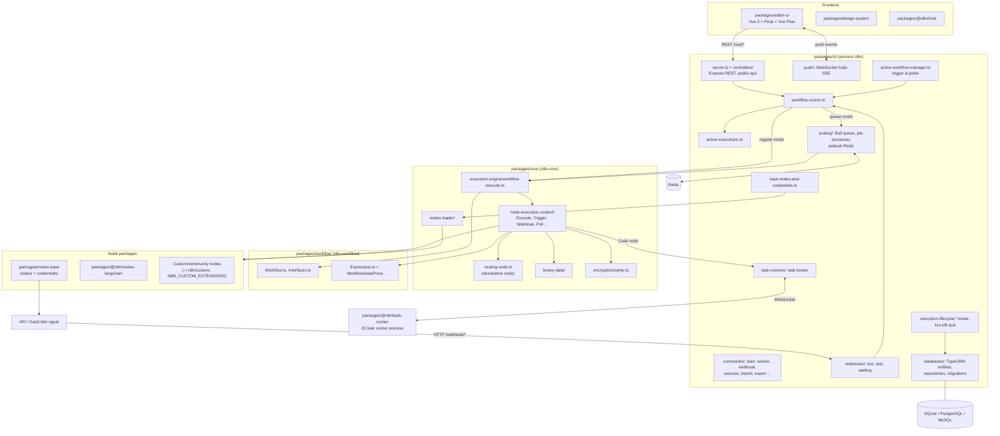
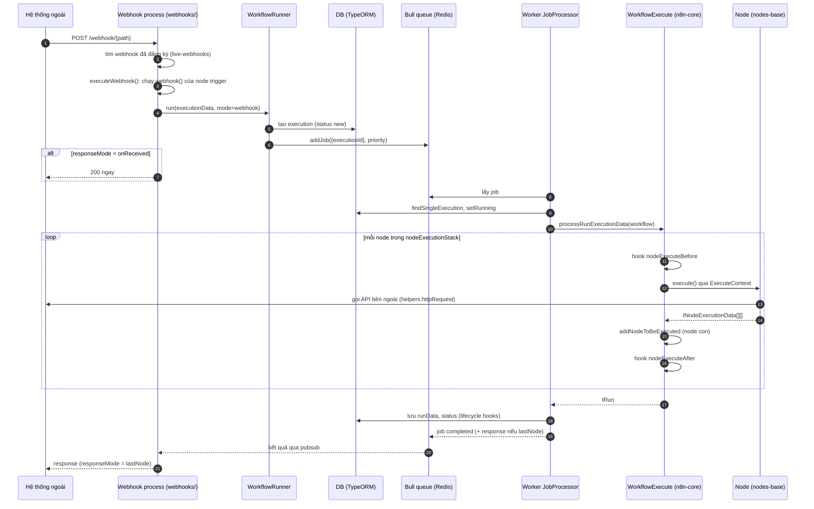

# n8n — Tài liệu thiết kế giải pháp

> **Fork:** [mrchinh189/n8n](https://github.com/mrchinh189/n8n) · **Upstream:** [n8n-io/n8n](https://github.com/n8n-io/n8n)
> **Nhóm:** Nền tảng workflow
> **Ngôn ngữ chính:** TypeScript (Node.js ≥ 20.15, monorepo pnpm + Turborepo; frontend Vue 3) · **License:** Sustainable Use License (fair-code) + n8n Enterprise License cho file `.ee.` · **Commit đã phân tích:** `182fc15` (monorepo version `1.77.0`)

## 1. Tóm tắt

n8n là **nền tảng workflow automation tự host được** dành cho đội kỹ thuật: người dùng nối các node (trigger, HTTP, Slack, database, AI agent...) trên editor trực quan, viết thêm JavaScript/Python khi cần, rồi n8n chạy workflow theo trigger, webhook, lịch hoặc thủ công. Điểm khác biệt cốt lõi: kết hợp "no-code + code" (Code node chạy trong task runner tách biệt), 400+ integration (`packages/nodes-base` có ~300 thư mục node và ~377 credential), node AI dựa trên LangChain (`packages/@n8n/nodes-langchain`), và kiến trúc mở rộng ngang bằng **queue mode** (Bull + Redis) với các process `main` / `worker` / `webhook` riêng biệt.

## 2. Bài toán & yêu cầu

- **Bài toán:** Tích hợp nhiều SaaS/API/DB và tự động hoá quy trình thường đòi hỏi viết glue code, quản lý credential, retry, lịch chạy, webhook. Các nền tảng SaaS (Zapier, Make) khó tự host và khó tuỳ biến bằng code. n8n cung cấp engine workflow có thể tự host, kiểm soát dữ liệu, mở rộng bằng node tuỳ chỉnh.
- **Yêu cầu chức năng chính:**
  - Thiết kế workflow dạng graph (node + connection) trên editor web; chạy thử từng phần (partial execution), pin data.
  - Kích hoạt bằng trigger (polling, event, cron/schedule), webhook (production/test), form, chat, sub-workflow, error workflow.
  - Biểu thức (`{{ $json.field }}`) để ánh xạ dữ liệu giữa các node; Code node JS/Python.
  - Quản lý credential mã hoá, OAuth; chia sẻ theo project/role (một số tính năng EE).
  - Lưu lịch sử execution, retry, wait/resume (node Wait), phản hồi webhook.
  - Public REST API, CLI (`execute`, `import`, `export`, `audit`...).
- **Yêu cầu phi chức năng:**
  - Mở rộng ngang: tách main/webhook/worker, giới hạn concurrency (`N8N_CONCURRENCY_PRODUCTION_LIMIT`), multi-main (EE).
  - Bảo mật: mã hoá credential bằng `N8N_ENCRYPTION_KEY`, sandbox biểu thức (`ExpressionSandboxing.ts`), Code node chạy ở task runner process riêng với cờ `--disallow-code-generation-from-strings`.
  - Bền vững dữ liệu: SQLite mặc định, hỗ trợ PostgreSQL/MySQL/MariaDB; binary data lưu `default`/`filesystem`/`s3`.
  - Quan sát: event bus, log streaming, metrics, Sentry, telemetry.
- **Ngoài phạm vi (trong repo):** dịch vụ n8n Cloud; launcher của task runner là binary riêng (`n8n-io/task-runner-launcher`, tải trong Dockerfile); file `.ee.` cần license enterprise để dùng.

## 3. Kiến trúc tổng thể



Giải thích:

- **`n8n-workflow`** (`packages/workflow`) là lớp mô hình thuần: kiểu dữ liệu (`Interfaces.ts`), lớp `Workflow`, engine biểu thức. Không phụ thuộc DB/HTTP nên dùng chung cho backend, frontend và task runner.
- **`n8n-core`** (`packages/core`) chứa engine thực thi (`WorkflowExecute`), context API cho node, load node, binary data, mã hoá.
- **`n8n` CLI** (`packages/cli`) là ứng dụng server: lệnh oclif, Express server, webhook, DB (TypeORM), queue mode, push, quản lý người dùng/license.
- **Node packages** chỉ phụ thuộc interface của `n8n-workflow`, được nạp động lúc khởi động.

## 4. Thành phần chính

| Thành phần | Vị trí trong mã nguồn | Trách nhiệm |
|---|---|---|
| Mô hình workflow | `packages/workflow/src/Workflow.ts`, `Interfaces.ts` | `INode`, `IConnections`, `INodeType`, `INodeTypeDescription`, `IRunExecutionData`, `WorkflowExecuteMode` |
| Biểu thức | `packages/workflow/src/Expression.ts`, `WorkflowDataProxy.ts`, `ExpressionSandboxing.ts`, `Extensions/` | Đánh giá `{{ }}` (riot-tmpl / `@n8n/tournament`), biến `$json`, `$node`, `$input`..., sandbox, hàm mở rộng (luxon) |
| Engine thực thi | `packages/core/src/execution-engine/workflow-execute.ts` | `run`, `runPartialWorkflow`, `processRunExecutionData`, `runNode`, stack/waiting execution, hooks, xử lý lỗi output |
| Partial execution | `packages/core/src/execution-engine/partial-execution-utils/` | `DirectedGraph`, tìm start node, subgraph, xử lý cycle, dựng lại execution stack |
| Context cho node | `packages/core/src/execution-engine/node-execution-context/` | `ExecuteContext`, `TriggerContext`, `PollContext`, `WebhookContext`, `SupplyDataContext`, `LoadOptionsContext`... cung cấp `this.getNodeParameter`, `helpers.httpRequest`, credentials |
| Declarative node | `packages/core/src/execution-engine/routing-node.ts` | Chạy node khai báo `requestDefaults`/`routing` trong description, không cần code `execute` |
| Trigger/poller | `packages/core/src/execution-engine/active-workflows.ts`, `triggers-and-pollers.ts`, `scheduled-task-manager.ts` | Giữ trạng thái trigger, lịch poll theo cron |
| Nạp node | `packages/core/src/nodes-loader/` + `packages/cli/src/load-nodes-and-credentials.ts` | `DirectoryLoader`, `PackageDirectoryLoader`, `LazyPackageDirectoryLoader`, `CustomDirectoryLoader` |
| Binary data | `packages/core/src/binary-data/` | Lưu file theo mode `default`/`filesystem`/`s3` (object store) |
| Mã hoá | `packages/core/src/encryption/cipher.ts`, `instance-settings/` | Mã hoá credential bằng encryption key của instance |
| Lệnh CLI | `packages/cli/src/commands/` | `start`, `worker`, `webhook`, `execute`, `execute-batch`, `import`, `export`, `audit`, `db`, `user-management`, `license`... |
| HTTP server | `packages/cli/src/server.ts`, `abstract-server.ts`, `controllers/`, `public-api/v1/` | REST cho editor, public API (OpenAPI `openapi.yml`) |
| Webhook | `packages/cli/src/webhooks/` | Live webhook (workflow active), test webhook (editor), waiting webhook/form (resume) |
| Active workflow | `packages/cli/src/active-workflow-manager.ts` | Kích hoạt/huỷ trigger, poller, đăng ký webhook khi workflow active |
| Runner | `packages/cli/src/workflow-runner.ts`, `active-executions.ts`, `manual-execution.service.ts` | Tạo execution, chọn chạy trong process hay enqueue, theo dõi execution đang chạy |
| Scaling | `packages/cli/src/scaling/` | `ScalingService` (Bull queue `jobs`), `JobProcessor`, pubsub Redis, `multi-main-setup.ee.ts`, worker server |
| Push | `packages/cli/src/push/` | Gửi sự kiện thời gian thực tới editor qua WebSocket (mặc định) hoặc SSE (`N8N_PUSH_BACKEND`) |
| Lifecycle hooks | `packages/cli/src/execution-lifecycle/` | Lưu tiến độ/kết quả execution, chạy error workflow, push UI |
| Persistence | `packages/cli/src/databases/` | Entity TypeORM (`workflow-entity`, `execution-entity`, `execution-data`, `credentials-entity`, `webhook-entity`, `project`, `user`...), migration cho sqlite/postgres/mysql |
| Task runner | `packages/cli/src/task-runners/`, `packages/@n8n/task-runner/` | Task broker (WebSocket server) trong n8n; runner process thực thi Code node JS |
| Cấu hình | `packages/@n8n/config/src/configs/`, `packages/cli/src/config/schema.ts` | Cấu hình theo env (`@Env(...)`) và schema convict |
| DI | `packages/@n8n/di` | Container DI (`Container.get(...)`) dùng xuyên suốt |
| Node built-in | `packages/nodes-base/nodes/`, `credentials/` | HTTP Request, Webhook, Code, If, Merge, Set, Schedule, Slack..., đăng ký trong `package.json` (`"n8n": {"nodes": [...], "credentials": [...]}`) |
| AI nodes | `packages/@n8n/nodes-langchain/nodes/` | agents, chains, llms, embeddings, memory, tools, vector_store, retrievers... |
| Editor | `packages/editor-ui`, `packages/design-system` | Canvas (Vue Flow), NDV, store Pinia |

### 4.1 Engine thực thi (`WorkflowExecute`)

`WorkflowExecute` duy trì `IRunExecutionData` gồm `resultData.runData` (kết quả theo từng node, mỗi node có thể chạy nhiều lần — `runIndex`) và `executionData` với:

- `nodeExecutionStack`: danh sách `IExecuteData` (node + input data) sẵn sàng chạy.
- `waitingExecution` / `waitingExecutionSource`: dữ liệu tạm cho node có nhiều input đang chờ đủ dữ liệu.

`processRunExecutionData()` kiểm tra workflow (`checkReadyForExecution`), gọi hook `workflowExecuteBefore`, rồi lặp: lấy phần tử từ stack → hook `nodeExecuteBefore` → `runNode()` → ghi `runData` → `addNodeToBeExecuted()` đẩy các node con vào stack hoặc vùng chờ → hook `nodeExecuteAfter`. Kết thúc gọi `workflowExecuteAfter`. Kết quả trả về là `PCancelable<IRun>` để có thể huỷ. Thứ tự thực thi phụ thuộc `workflow.settings.executionOrder` (`v1` hoặc kiểu cũ).

`runNode()` phân nhánh theo loại node: node bị disable thì pass-through input; node có `execute()` → gọi qua `ExecuteContext`; node khai báo `routing` → `RoutingNode`; node trigger/poll khi chạy thủ công → gọi `trigger`/`poll`; node webhook → dữ liệu đã có sẵn từ request.

### 4.2 Hai chế độ thực thi

`WorkflowRunner.run()` (`packages/cli/src/workflow-runner.ts`) đăng ký execution vào `ActiveExecutions`, rồi:

- **`EXECUTIONS_MODE=regular`** (mặc định): `runMainProcess` dựng `additionalData` + hooks, tạo `WorkflowExecute` và chạy ngay trong process main (hoặc `ManualExecutionService.runManually` cho chạy thủ công).
- **`EXECUTIONS_MODE=queue`**: `enqueueExecution` đẩy job vào Bull queue (`ScalingService.addJob`, priority 50 cho realtime, 100 cho còn lại). Process `n8n worker --concurrency=N` lấy job, `JobProcessor.processJob` đọc execution từ DB (`findSingleExecution`), đặt trạng thái running, rồi chạy `WorkflowExecute`. Kết quả ghi về DB, sự kiện truyền ngược qua Redis pubsub.

## 5. Luồng xử lý chính

### 5.1 Webhook production kích hoạt workflow (queue mode)



### 5.2 Chạy thủ công từ editor

Editor gọi REST tới main → `WorkflowRunner.run(mode='manual')` → `ManualExecutionService.runManually` (hỗ trợ partial execution qua `runPartialWorkflow` + `partial-execution-utils`, pin data) → hook `sendDataToUI` đẩy sự kiện `nodeExecuteBefore/After`, `executionFinished` qua `Push` (WebSocket/SSE) để editor hiển thị kết quả từng node. Trong queue mode, chạy thủ công mặc định vẫn ở main; chỉ khi đặt `OFFLOAD_MANUAL_EXECUTIONS_TO_WORKERS=true` thì mới được enqueue sang worker.

### 5.3 Code node với task runner

Khi bật runner (`N8N_RUNNERS_ENABLED=true`), Code node (`packages/nodes-base/nodes/Code/JsTaskRunnerSandbox.ts`) gửi task qua `TaskRequester` tới **task broker** (`packages/cli/src/task-runners/task-broker/`, WebSocket server). Runner process (`packages/@n8n/task-runner`, `JsTaskRunner`) nhận task, xin thêm dữ liệu cần thiết (data request), chạy code và trả kết quả. Chế độ `internal` do n8n tự spawn process; chế độ `external` dùng launcher theo `docker/images/n8n/n8n-task-runners.json` (chỉ cho phép một danh sách env, thêm cờ Node hạn chế `eval`).

## 6. Mô hình dữ liệu & giao diện

**Workflow JSON** (`IWorkflowBase` trong `packages/workflow/src/Interfaces.ts`): `id`, `name`, `active`, `nodes: INode[]`, `connections: IConnections`, `settings`, `staticData`, `pinData`, `versionId`.

```json
{
  "nodes": [
    {"name": "Webhook", "type": "n8n-nodes-base.webhook", "typeVersion": 2, "parameters": {"path": "abc"}},
    {"name": "Slack", "type": "n8n-nodes-base.slack", "typeVersion": 2,
     "parameters": {"text": "={{ $json.body.message }}"}, "credentials": {"slackApi": {"id": "1"}}}
  ],
  "connections": {"Webhook": {"main": [[{"node": "Slack", "type": "main", "index": 0}]]}}
}
```

**Dữ liệu giữa các node:** mảng `INodeExecutionData` (`{ json, binary?, pairedItem? }`), output là `INodeExecutionData[][]` (mỗi phần tử ứng với một output của node, ví dụ If có 2 output). `pairedItem` cho phép truy vết item đầu vào.

**Interface node** (`INodeType`): `description` (tên, version, inputs/outputs, `properties` cho UI, `credentials`), cùng một trong các hàm `execute`, `poll`, `trigger`, `webhook`, `supplyData` (cho AI sub-node); `methods.loadOptions/listSearch/credentialTest/resourceMapping`; `webhookMethods` (checkExists/create/delete). Hỗ trợ versioning qua `VersionedNodeType`.

**Execution mode:** `cli`, `error`, `integrated`, `internal`, `manual`, `retry`, `trigger`, `webhook`, `evaluation`.

**Entity DB chính** (`packages/cli/src/databases/entities/`): `workflow-entity.ts`, `execution-entity.ts` + `execution-data.ts` (tách dữ liệu run lớn), `execution-metadata.ts`, `credentials-entity.ts`, `shared-workflow.ts`, `shared-credentials.ts`, `project.ts`, `project-relation.ts`, `user.ts`, `webhook-entity.ts`, `workflow-history.ts`, `workflow-statistics.ts`, `tag-entity.ts`, `variables.ts`, `settings.ts`, `installed-packages.ts`, `installed-nodes.ts`, `processed-data.ts`. Migration riêng cho `sqlite`, `postgresdb`, `mysqldb` trong `databases/migrations/`.

**Giao diện ngoài:** REST nội bộ cho editor (`controllers/`), Public API v1 (`public-api/v1/openapi.yml`), webhook `/webhook/*`, `/webhook-test/*`, `/webhook-waiting/*`, form; push WebSocket/SSE; CLI oclif.

**Cấu hình qua env** (ví dụ): `N8N_PORT` (5678), `DB_TYPE` (`sqlite` | `mariadb` | `mysqldb` | `postgresdb`), `EXECUTIONS_MODE` (`regular` | `queue`), `QUEUE_BULL_REDIS_HOST`, `N8N_ENCRYPTION_KEY`, `N8N_DEFAULT_BINARY_DATA_MODE`, `N8N_PUSH_BACKEND`, `N8N_RUNNERS_ENABLED`, `N8N_RUNNERS_MODE`, `N8N_CONCURRENCY_PRODUCTION_LIMIT`, `N8N_CUSTOM_EXTENSIONS`.

## 7. Tech stack

| Lớp | Công nghệ | Vai trò |
|---|---|---|
| Runtime | Node.js ≥ 20.15, TypeScript | Toàn bộ backend |
| Monorepo | pnpm workspace, Turborepo (`turbo.json`), Biome, ESLint, lefthook | Build, lint, format |
| CLI | `@oclif/core` | Lệnh `n8n start/worker/webhook/...` |
| HTTP | Express 4, `ws` | REST, webhook, WebSocket push, task broker |
| ORM/DB | `@n8n/typeorm` (fork TypeORM), sqlite3, pg, mysql2 | Persistence + migration |
| Queue | Bull 4 + ioredis | Queue mode, pubsub giữa main/worker/webhook |
| Biểu thức | `@n8n_io/riot-tmpl`, `@n8n/tournament`, luxon | Engine biểu thức `{{ }}` |
| AI | LangChain (trong `@n8n/nodes-langchain`) | Agent, chain, vector store, memory |
| Frontend | Vue 3, Pinia, vue-router, `@vue-flow/core`, `n8n-design-system` | Editor canvas |
| Test | Jest, Vitest, Cypress (`cypress/`) | Unit, integration, e2e |
| Đóng gói | Docker (`docker/images/n8n`, `n8n-base`, `n8n-custom`), npm (`npx n8n`) | Triển khai |

## 8. Quyết định thiết kế & đánh đổi

| Quyết định | Lý do | Đánh đổi |
|---|---|---|
| Tách `n8n-workflow` (mô hình) / `n8n-core` (engine) / `cli` (server) | Dùng lại mô hình ở frontend & task runner; engine độc lập với DB/HTTP | Nhiều package, ranh giới phụ thuộc phải giữ chặt |
| Dữ liệu giữa node là mảng item JSON + binary | Mô hình đơn giản, node tự lặp theo item, dễ hiển thị bảng | Dữ liệu lớn nằm trong RAM; cần binary data mode `filesystem`/`s3` để giảm áp lực bộ nhớ |
| Engine dựa trên stack + waiting execution | Hỗ trợ node nhiều input (Merge), vòng lặp, chạy lại từng phần | Logic phức tạp (`workflow-execute.ts` > 2.300 dòng); có hai `executionOrder` song song |
| Hai chế độ regular / queue | Cài đặt đơn giản cho người dùng nhỏ, scale ngang khi cần | Queue mode cần Redis + DB dùng chung (không dùng được SQLite thực tế), tăng độ phức tạp vận hành |
| Node khai báo bằng JSON description (`properties`) + declarative `routing` | UI tự sinh form; node REST đơn giản không cần code | Description lớn, khó kiểm thử; biểu diễn logic phức tạp vẫn phải viết `execute` |
| Node nạp động từ `package.json` (`"n8n"` field), hỗ trợ lazy load | Thêm/bớt node không sửa core; community node cài qua npm | Node chạy chung process với n8n (trừ Code node khi dùng runner) |
| Code node chạy trong task runner tách process | Cô lập code người dùng, giới hạn env, có timeout/concurrency | Thêm overhead IPC (WebSocket) và thành phần cần vận hành |
| Push WebSocket hoặc SSE | SSE dễ qua proxy, WebSocket hai chiều | Phải hỗ trợ hai backend |
| Fair-code license, file `.ee.` riêng | Bảo vệ mô hình kinh doanh, vẫn mở source | Không phải OSI open-source; hạn chế sử dụng thương mại |

## 9. Triển khai & vận hành

- **Nhanh:** `npx n8n` hoặc `docker run -it --rm -p 5678:5678 -v n8n_data:/home/node/.n8n docker.n8n.io/n8nio/n8n`; editor tại `http://localhost:5678`.
- **Docker image** (`docker/images/n8n/Dockerfile`): base `n8nio/base` (Node 20), `npm install -g n8n@${N8N_VERSION}`, rebuild `sqlite3`, xoá file thừa; tải và verify SHA256 `task-runner-launcher`; chạy bằng user `node`, entrypoint `tini -- /docker-entrypoint.sh` (hỗ trợ trust chứng chỉ trong `/opt/custom-certificates`). `docker/images/n8n-custom` để build từ source.
- **Scale:** đặt `EXECUTIONS_MODE=queue`, Postgres + Redis dùng chung; chạy `n8n start` (main, UI/API, trigger), `n8n webhook` (nhận webhook production), `n8n worker --concurrency=5` (thực thi). Multi-main (`scaling/multi-main-setup.ee.ts`) cần license.
- **Dev:** `pnpm install`, `pnpm build`, `pnpm dev` (hoặc `dev:be`, `dev:fe`, `dev:ai`), `pnpm start`.
- **Dữ liệu:** thư mục `~/.n8n` (config chứa encryption key, SQLite DB, binaryData). Phải giữ ổn định `N8N_ENCRYPTION_KEY` giữa các instance — code kiểm tra key không khớp và báo lỗi (`instance-settings.ts`).
- **Quan sát:** event bus + log streaming (`eventbus/`), metrics (`metrics/`), Sentry, telemetry/PostHog, `security-audit/` (lệnh `n8n audit`), health check của worker (`scaling/worker-server.ts`).
- **Giới hạn đã biết:** chạy node trong process chính có thể làm nặng main ở regular mode; dữ liệu execution lớn ảnh hưởng DB (có cấu hình prune); một số tính năng (SSO, LDAP, external secrets, environments, log streaming, multi-main) thuộc EE.

## 10. Điểm mở rộng

- **Node tuỳ chỉnh:** viết class implement `INodeType` (programmatic `execute` hoặc declarative `routing`), đóng gói npm với field `"n8n": {"nodes": [...], "credentials": [...]}`; đặt vào `~/.n8n/custom` (`CustomDirectoryLoader`) hoặc đường dẫn trong `N8N_CUSTOM_EXTENSIONS`; hoặc cài community package qua UI (`community-packages.controller.ts`). `packages/node-dev` hỗ trợ tạo node.
- **Credential type:** class `ICredentialType` trong `credentials/` (có `authenticate`, `test`).
- **AI sub-node:** implement `supplyData` để cung cấp model/memory/tool cho agent (`packages/@n8n/nodes-langchain`).
- **Hooks:** external hooks (`external-hooks.ts`, cấu hình `external-hooks.config.ts`), lifecycle hooks (`execution-lifecycle/`), event bus destinations (`eventbus/`).
- **Error workflow:** đặt workflow xử lý lỗi trong settings (`execute-error-workflow.ts`).
- **Sub-workflow:** node Execute Workflow gọi workflow khác (`subworkflows/`).
- **Public API & CLI** để tích hợp CI/CD (import/export workflow, credential).
- **Binary data store:** mở rộng qua `binary-data/object-store`.

## 11. Bài học & cách áp dụng

- **Phân lớp mô hình / engine / server** giúp chạy cùng mô hình ở nhiều nơi (frontend preview, worker, runner). Áp dụng khi xây engine workflow riêng: giữ phần "workflow model + expression" không phụ thuộc I/O.
- **Item-based data flow + `pairedItem`** là cách đơn giản để truy vết dữ liệu qua pipeline và hiển thị cho người dùng.
- **Context object cho plugin** (`this.getNodeParameter`, `this.helpers.*`) cô lập node khỏi chi tiết hạ tầng (credential, HTTP, binary) — dễ thay đổi hạ tầng mà không sửa node.
- **Cùng một code chạy ở hai topology** (in-process vs queue/worker) chỉ khác ở `WorkflowRunner` — mẫu "strategy" tốt cho hệ thống cần scale dần.
- **Node mô tả bằng schema → UI tự sinh**: giảm công frontend khi số integration lớn.
- **Cô lập code người dùng bằng process riêng + broker** thay vì `vm` trong cùng process — đáng học cho mọi nền tảng cho phép user script.
- **Hook vòng đời execution** (`workflowExecuteBefore/After`, `nodeExecuteBefore/After`) là điểm duy nhất để lưu DB, push UI, metrics — tránh rải logic khắp engine.

## 12. Tham khảo

- README: `README.md`; license: `LICENSE.md`, `LICENSE_EE.md`; đóng góp: `CONTRIBUTING.md`; bảo mật: `SECURITY.md`
- Docs chính thức: https://docs.n8n.io
- Mã nguồn chính:
  - `packages/workflow/src/Interfaces.ts`, `Workflow.ts`, `Expression.ts`, `WorkflowDataProxy.ts`
  - `packages/core/src/execution-engine/workflow-execute.ts`, `routing-node.ts`, `node-execution-context/`, `partial-execution-utils/`
  - `packages/core/src/nodes-loader/`, `packages/core/src/binary-data/`, `packages/core/src/encryption/cipher.ts`
  - `packages/cli/src/commands/start.ts`, `worker.ts`, `webhook.ts`
  - `packages/cli/src/workflow-runner.ts`, `active-executions.ts`, `active-workflow-manager.ts`
  - `packages/cli/src/scaling/scaling.service.ts`, `scaling/job-processor.ts`
  - `packages/cli/src/webhooks/webhook-helpers.ts`, `packages/cli/src/push/index.ts`
  - `packages/cli/src/task-runners/`, `packages/@n8n/task-runner/src/task-runner.ts`
  - `packages/cli/src/databases/entities/`, `packages/@n8n/config/src/configs/`
  - `packages/nodes-base/package.json`, `packages/nodes-base/nodes/Code/`, `packages/@n8n/nodes-langchain/nodes/`
- Docker: `docker/images/n8n/Dockerfile`, `docker/images/n8n/n8n-task-runners.json`
- Upstream: https://github.com/n8n-io/n8n
