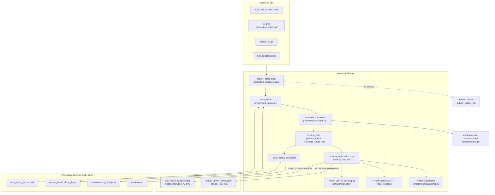
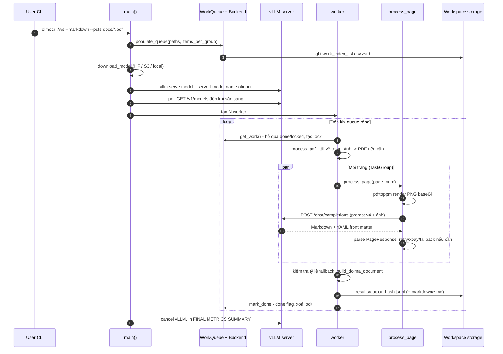

# olmOCR — Tài liệu thiết kế giải pháp

> **Fork:** [mrchinh189/olmocr](https://github.com/mrchinh189/olmocr) · **Upstream:** [allenai/olmocr](https://github.com/allenai/olmocr)
> **Nhóm:** Xử lý tài liệu
> **Ngôn ngữ chính:** Python (>=3.11) · **License:** Apache-2.0 · **Commit đã phân tích:** `f7cfe4c`

## 1. Tóm tắt

olmOCR là toolkit của Allen Institute for AI (AI2) để chuyển PDF và ảnh tài liệu (PNG/JPEG) thành văn bản Markdown "đọc tự nhiên" — đúng thứ tự đọc, bảng ra HTML, công thức ra LaTeX, bỏ header/footer — bằng một VLM 7B fine-tune từ Qwen2.5-VL (mặc định `allenai/olmOCR-2-7B-1025-FP8`) chạy trên vLLM. Trọng tâm thiết kế là **batch inference quy mô hàng triệu trang**: work queue phân tán trên S3 hoặc filesystem, retry thông minh theo trang, fallback `pdftotext`, output định dạng Dolma JSONL. Repo còn chứa toàn bộ phần huấn luyện (SFT, GRPO với "unit test rewards"), sinh dữ liệu tổng hợp và benchmark olmOCR-Bench.

## 2. Bài toán & yêu cầu

- **Bài toán:** Trích xuất văn bản sạch từ PDF đa dạng (bài báo, bản scan cũ, bảng, đa cột, chữ viết tay) để làm dữ liệu huấn luyện LLM hoặc tri thức cho ứng dụng; các pipeline OCR truyền thống sai thứ tự đọc, hỏng bảng/công thức, còn API thương mại thì đắt ở quy mô lớn.
- **Yêu cầu chức năng chính:**
  - Nhận PDF/PNG/JPEG từ local, S3 (hỗ trợ glob), file `.txt` liệt kê đường dẫn, hoặc tarball `.tar.gz` chứa nhiều PDF.
  - Render từng trang thành ảnh, gửi VLM, nhận Markdown kèm YAML front matter (`primary_language`, `is_rotation_valid`, `rotation_correction`, `is_table`, `is_diagram`).
  - Tự sửa trang bị xoay, retry khi output lỗi, fallback sang text layer.
  - Ghi kết quả Dolma JSONL vào `workspace/results/`, tuỳ chọn ghi Markdown giữ cấu trúc thư mục.
  - Dùng vLLM local hoặc server OpenAI-compatible từ xa (`--server`, `--api_key`), hoặc submit job lên cluster Beaker.
- **Yêu cầu phi chức năng:**
  - Thông lượng cao, chi phí thấp (README: dưới 200 USD cho một triệu trang).
  - Nhiều worker/máy cùng xử lý một workspace mà không trùng việc, có thể resume sau khi dừng.
  - Chịu lỗi: backoff khi mất kết nối, ngưỡng tỷ lệ trang lỗi cho mỗi tài liệu (`--max_page_error_rate`, mặc định 0.004).
- **Ngoài phạm vi:** Không xử lý trực tiếp DOCX/HTML/Office; không cung cấp REST API/thư viện "convert một file" dạng in-process; inference local bắt buộc GPU NVIDIA (README: tối thiểu 12 GB VRAM; `check_torch_gpu_available` trong `olmocr/check.py` kiểm tra mặc định 15 GiB).

## 3. Kiến trúc tổng thể



Toàn bộ inference pipeline nằm trong một file `olmocr/pipeline.py` chạy trên `asyncio`: một process điều phối vLLM (subprocess), một work queue dựa trên storage, nhiều worker coroutine; mọi trang của một PDF được xử lý song song bằng `asyncio.TaskGroup`. Khả năng scale ngang đến từ việc nhiều process/máy cùng trỏ vào một workspace S3 — điều phối hoàn toàn qua file lock và done flag, không cần message broker.

Bên cạnh inference là các khối "nhà máy model": `olmocr/data` (dựng dữ liệu silver bằng GPT-4o batch), `olmocr/synth` (sinh dữ liệu tổng hợp từ HTML template), `olmocr/train` (SFT + GRPO), `olmocr/bench` (olmOCR-Bench, runner cho nhiều hệ OCR khác).

## 4. Thành phần chính

| Thành phần | Vị trí trong mã nguồn | Trách nhiệm |
|---|---|---|
| CLI / orchestrator | `olmocr/pipeline.py` (`main`, `cli_main`) | Parse args, tạo work queue, khởi động vLLM, spawn worker, in metrics tổng kết |
| Worker | `olmocr/pipeline.py` (`worker`) | Lấy work item, xử lý từng PDF/tarball, ghi JSONL + Markdown, `mark_done` |
| Xử lý trang | `olmocr/pipeline.py` (`build_page_query`, `try_single_page`, `try_single_page_with_backoff`, `process_page`) | Render ảnh, gọi `/chat/completions`, kiểm tra hợp lệ, retry/xoay/fallback |
| HTTP client tối giản | `olmocr/pipeline.py` (`apost`) | POST thủ công qua `asyncio.open_connection` (tránh độ phức tạp/khóa của httpx/aiohttp theo comment trong code) |
| Quản lý vLLM | `olmocr/pipeline.py` (`vllm_server_task`, `vllm_server_host`, `vllm_server_ready`, `download_model`) | Chạy `vllm serve` với `--served-model-name olmocr`, parse log để biết số request đang chạy/xếp hàng, chờ `/models` sẵn sàng |
| Work queue | `olmocr/work_queue.py` (`WorkQueue`, `LocalBackend`, `S3Backend`) | Index nhóm công việc dạng CSV nén zstd, lock theo worker (timeout 1800s), done flag |
| Prompt & schema | `olmocr/prompts/prompts.py` (`build_no_anchoring_v4_yaml_prompt`, `PageResponse`) | Prompt yêu cầu Markdown + front matter; dataclass validate output |
| Anchor text | `olmocr/prompts/anchor.py` (`get_anchor_text`) | Lấy text layer qua pdftotext / pdfium / pypdf / pdfreport — dùng cho fallback và prompt kiểu cũ |
| Render PDF | `olmocr/data/renderpdf.py` | `pdftoppm` render trang theo cạnh dài mục tiêu (mặc định 1288px trong pipeline) |
| Parser front matter | `olmocr/train/front_matter.py` (`FrontMatterParser`) | Tách YAML front matter và map vào dataclass |
| Lọc PDF | `olmocr/filter/filter.py` (`PdfFilter`) | Giữ tiếng Anh, loại form và spam SEO khi bật `--apply_filter` |
| Metrics | `olmocr/metrics.py` | `MetricsKeeper` (token/s theo cửa sổ 5 phút), `WorkerTracker` (trạng thái trang theo worker) |
| Tiện ích S3 / ảnh | `olmocr/s3_utils.py`, `olmocr/image_utils.py`, `olmocr/check.py` | Glob/đọc/ghi S3, chuyển ảnh thành PDF, kiểm tra poppler & GPU |
| Huấn luyện | `olmocr/train/train.py`, `grpo_train.py`, `dataloader.py`, `configs/` | SFT Qwen2.5/2/3-VL; GRPO (TRL) với reward là tỉ lệ pass unit test của olmOCR-Bench |
| Dữ liệu | `olmocr/data/*`, `olmocr/synth/*` | Silver data từ OpenAI batch, chuẩn bị olmOCR-mix, sinh trang tổng hợp từ HTML |
| Benchmark | `olmocr/bench/*` | Test "fact" kiểu unit test (present, absent, order, table, math, baseline, format, footnote), runner cho Marker, MinerU, Docling, Mistral, Gemini, Claude… |
| Viewer | `olmocr/viewer/dolmaviewer.py` | Render Dolma JSONL thành HTML để xem kết quả |

### 4.1 `process_page` — chiến lược retry

1. Lần 0: gọi model với rotation 0. Nếu hợp lệ (`finish_reason == "stop"`, tổng token ≤ 16384) và `is_rotation_valid` → xong.
2. **Nhánh xoay:** nếu model báo trang bị xoay, cộng dồn `rotation_correction` (0/90/180/270), xoay ảnh bằng PIL và retry **tuần tự** vì cần phản hồi của model.
3. **Nhánh lỗi khác:** retry tuần tự; nếu hàng đợi vLLM trống (`vllm_queued_requests == 0`) thì bắn toàn bộ lần retry còn lại **song song** và lấy kết quả hợp lệ đầu tiên, huỷ phần còn lại.
4. Nhiệt độ tăng theo lần thử: `TEMPERATURE_BY_ATTEMPT = [0.1, 0.1, 0.2, 0.3, 0.5, 0.8, 0.9, 1.0]` để thoát lặp/hallucination.
5. Hết `--max_page_retries` (mặc định 8): `make_fallback_result` dùng `pdftotext`, đánh dấu `is_fallback=True`.
6. Lỗi kết nối được bắt riêng trong `try_single_page_with_backoff`: backoff `10 * 2^n` giây, tối đa 10 lần rồi `sys.exit(1)`.

### 4.2 Work queue phân tán không cần broker

`WorkQueue.populate_queue` băm danh sách path thành nhóm (`items_per_group = pages_per_group / số trang trung bình`, ước lượng bằng cách sample tối đa 100 PDF; `pages_per_group` mặc định 500, hoặc 50 khi dùng `--api_key`), lưu vào `work_index_list.csv.zstd`. `get_work` bỏ qua nhóm đã có done flag (có cache), bỏ qua nhóm có lock còn hiệu lực, rồi tạo lock của mình (ghi đè nếu lock cũ quá hạn). `mark_done` tạo done flag và xoá lock. Hai backend `LocalBackend`/`S3Backend` cài cùng interface `Backend`.

## 5. Luồng xử lý chính

### 5.1 Convert một batch PDF với vLLM local



### 5.2 Scale ra nhiều máy

Chạy cùng lệnh với workspace `s3://bucket/prefix/` trên nhiều node (hoặc `--beaker --beaker_gpus N` để `submit_beaker_job` tạo experiment với N replica). Lần chạy đầu với `--pdfs` dựng index; các node sau chỉ cần trỏ vào workspace và tự giành work item qua lock trên S3. Khi chạy trên Beaker, mỗi replica ngủ một khoảng theo `BEAKER_REPLICA_RANK` để không cùng lúc tải model. `--stats` in thống kê tiến độ của workspace thay vì chạy job.

## 6. Mô hình dữ liệu & giao diện

**Output model mỗi trang** (`olmocr/prompts/prompts.py`):

```python
@dataclass
class PageResponse:
    primary_language: Optional[str]
    is_rotation_valid: bool
    rotation_correction: int   # 0 | 90 | 180 | 270
    is_table: bool
    is_diagram: bool
    natural_text: Optional[str]
```

Model trả về dạng:

```markdown
---
primary_language: en
is_rotation_valid: True
rotation_correction: 0
is_table: False
is_diagram: False
---
Nội dung trang dạng Markdown, bảng HTML, công thức LaTeX...
```

Với `--guided_decoding`, request kèm `guided_regex` ép đúng cấu trúc front matter này.

**Request tới server** (`build_page_query`): chuẩn OpenAI Chat Completions, `model` = `olmocr` (khi dùng vLLM nội bộ) hoặc tên do `--model` chỉ định, message gồm text prompt + `image_url` data URI PNG, `max_tokens = 8000`, `temperature` theo lần thử.

**Dolma document** (`build_dolma_document`) — một dòng JSONL:

- `id` (SHA1 của text), `text`, `source = "olmocr"`, `added`, `created`.
- `metadata`: `Source-File`, `olmocr-version`, `pdf-total-pages`, `total-input-tokens`, `total-output-tokens`, `total-fallback-pages`.
- `attributes`: `pdf_page_numbers` (span `[start, end, page]`), và các mảng theo trang `primary_language`, `is_rotation_valid`, `rotation_correction`, `is_table`, `is_diagram`.

**Bố cục workspace:** `work_index_list.csv.zstd`, `worker_locks/`, `done_flags/`, `results/output_<hash>.jsonl`, `markdown/<đường dẫn gốc>.md` (đường dẫn được làm sạch, loại `..` để tránh path traversal; tarball dùng định dạng `tarball::internal_path`).

**CLI chính** (`olmocr` = `olmocr.pipeline:cli_main`): `workspace` (positional), `--pdfs`, `--model`, `--workers` (20), `--max_concurrent_requests` (1600), `--pages_per_group`, `--max_page_retries` (8), `--max_page_error_rate` (0.004), `--target_longest_image_dim` (1288), `--apply_filter`, `--markdown`, `--stats`, `--guided_decoding`, `--disk_logging`, `--server`, `--api_key`; nhóm vLLM: `--gpu-memory-utilization`, `--max_model_len` (16384), `-tp`, `-dp`, `--port` (30024) — tham số lạ được chuyển tiếp cho vLLM; nhóm Beaker: `--beaker`, `--beaker_workspace`, `--beaker_cluster`, `--beaker_gpus`, `--beaker_priority`.

## 7. Tech stack

| Lớp | Công nghệ | Vai trò |
|---|---|---|
| Ngôn ngữ / build | Python >=3.11, setuptools, version động từ `olmocr/version.py` (0.4.27) | Đóng gói package `olmocr` |
| Concurrency | asyncio (TaskGroup, BoundedSemaphore), `asyncio.to_thread` | Worker, xử lý song song trang, giới hạn render CPU và số request |
| Inference | vLLM 0.11.2, PyTorch >=2.7, transformers 4.57.3 (extra `gpu`) | Phục vụ VLM qua API OpenAI-compatible |
| Model | Qwen2.5-VL 7B fine-tune (`allenai/olmOCR-2-7B-1025-FP8`), huggingface_hub | Mô hình OCR |
| PDF | poppler-utils (`pdftoppm`, `pdftotext`), pypdf, pypdfium2 | Render, đếm trang, text layer |
| Ảnh / text | Pillow, ftfy, markdown2, markdownify, bleach, lingua-language-detector | Xoay ảnh, chuẩn hoá text, lọc ngôn ngữ |
| Storage | boto3, smart_open, zstandard, orjson | S3 workspace, index nén, JSON nhanh |
| Cluster | beaker-py (extra `beaker`) | Submit job lên Beaker (AI2) |
| Training | TRL (GRPOTrainer), peft, datasets, wandb, omegaconf, flash-attn | SFT + RL |
| Benchmark | rapidfuzz, fuzzysearch, playwright, KaTeX, flask, SDK OpenAI/Anthropic/Gemini/Mistral (extra `bench`) | Chấm điểm và so sánh hệ OCR |
| Container | `vllm/vllm-openai:v0.11.2`, uv | Image chính thức và image kèm model |

## 8. Quyết định thiết kế & đánh đổi

| Quyết định | Lý do | Đánh đổi |
|---|---|---|
| Một VLM end-to-end từ ảnh trang (prompt v4 "no anchoring") thay vì pipeline layout + OCR nhiều bước | Thứ tự đọc tự nhiên, bảng/công thức/chữ tay tốt, ít thành phần | Cần GPU lớn; có rủi ro hallucination/lặp (xử lý bằng retry, nhiệt độ, kiểm tra `finish_reason`) |
| Fine-tune model nhỏ 7B + FP8 thay vì gọi API lớn | Chi phí/trang thấp, chạy self-host được | Phải duy trì pipeline dữ liệu + training riêng |
| Output có front matter metadata (xoay, bảng, ngôn ngữ) | Model tự báo lỗi xoay để pipeline sửa; metadata hữu ích cho lọc dữ liệu | Phụ thuộc định dạng output; cần parser/guided decoding |
| Fallback `pdftotext` cho trang thất bại + ngưỡng tỷ lệ lỗi theo tài liệu | Không mất cả tài liệu vì vài trang; loại tài liệu quá tệ | Trang fallback chất lượng thấp hơn, không có metadata |
| Work queue trên S3/filesystem với lock + done flag | Không cần hạ tầng broker; resume tự nhiên; scale bằng cách thêm node | Lock dựa trên timeout (1800s) nên việc bị treo phải chờ hết hạn; có thể xử lý trùng hiếm hoi |
| Nhóm công việc theo số trang ước lượng | Cân bằng tải giữa worker, giảm số file output | Ước lượng dựa trên sample, có thể lệch |
| vLLM chạy như subprocess, giám sát qua log | Tận dụng continuous batching của vLLM; biết độ dài queue để quyết định retry song song | Gắn chặt với format log của vLLM |
| HTTP POST tự viết trên `asyncio.open_connection` | Tránh overhead và các khóa nội bộ của httpx/aiohttp ở concurrency rất cao | Tự gánh xử lý HTTP (chunked, SSL…) |
| Định dạng Dolma JSONL | Khớp hệ sinh thái dữ liệu huấn luyện OLMo/Dolma | Người dùng cần `--markdown` hoặc tự chuyển nếu chỉ muốn file .md |
| GRPO với reward là unit test của benchmark | Tối ưu trực tiếp các "fact" kiểm chứng được thay vì edit distance | Reward chỉ tốt bằng độ phủ của bộ test |

## 9. Triển khai & vận hành

- **Phụ thuộc hệ thống:** `poppler-utils` và các bộ font (`ttf-mscorefonts-installer`, `fonts-crosextra-caladea`, `fonts-crosextra-carlito`, `gsfonts`, `lcdf-typetools`) để render đúng; `check_poppler_version()` được gọi khi khởi động.
- **Cài đặt Python:** khuyến nghị môi trường conda sạch Python 3.11.
  - Chỉ dùng server từ xa: `pip install olmocr`.
  - GPU local: `pip install olmocr[gpu] --extra-index-url https://download.pytorch.org/whl/cu128` (+ flashinfer tuỳ chọn).
  - Beaker: `olmocr[beaker]`; benchmark: `olmocr[bench]`.
- **Chạy:** `olmocr ./localworkspace --markdown --pdfs sample.pdf`; server ngoài: `olmocr ./ws --server http://host:8000/v1 --model allenai/olmOCR-2-7B-1025-FP8 --markdown --pdfs *.pdf`.
- **Docker:** `Dockerfile` dựa trên `vllm/vllm-openai:v0.11.2`, cài poppler + font, `uv pip install ".[bench]"`, Playwright Chromium, `ENTRYPOINT ["/bin/bash"]`. `Dockerfile.with-model` kế thừa `alleninstituteforai/olmocr:latest` và tải sẵn model (~16 GB) vào `/opt/models`. Ví dụ: `docker run --gpus all -v $(pwd):/workspace alleninstituteforai/olmocr:latest-with-model -c "olmocr /workspace/output --markdown --pdfs /workspace/sample.pdf"`.
- **Quan sát:** log định kỳ từ `metrics_reporter` (token/s, số trang, trạng thái worker), log vLLM riêng (`vllm` logger), `--disk_logging` ghi file, `--stats` cho tiến độ workspace; cuối job in "FINAL METRICS SUMMARY" (tỷ lệ lỗi trang, phân bố số lần thử).
- **Tham số hiệu năng:** `--workers`, `--max_concurrent_requests`, `--gpu-memory-utilization`, `--max_model_len`, `-tp/-dp`; số tiến trình render đồng thời giới hạn bởi `BEAKER_ASSIGNED_CPU_COUNT` hoặc `cpu_count - 2`.
- **Giới hạn đã biết:** cần GPU NVIDIA cho inference local; lỗi `too many open files` cần `ulimit -n 65536`; `--apply_filter` chỉ giữ tài liệu tiếng Anh; mất kết nối kéo dài tới server sẽ làm process thoát (`sys.exit(1)`) — dựa vào work queue để chạy lại.

## 10. Điểm mở rộng

- **Thay model / provider:** `--model` nhận đường dẫn local, S3 hoặc Hugging Face; `--server` + `--api_key` trỏ tới bất kỳ endpoint OpenAI-compatible (vLLM, nhà cung cấp hosted).
- **Storage backend mới:** cài interface `Backend` trong `olmocr/work_queue.py` (load/save index, lock, done flag) — ví dụ GCS hoặc database.
- **Prompt / schema:** `olmocr/prompts/prompts.py` chứa nhiều phiên bản prompt (silver data, finetuning, no-anchoring v4); `PageResponse` có thể mở rộng thêm trường cùng `FrontMatterParser`.
- **Bộ lọc tài liệu:** tuỳ biến `PdfFilter` (ngôn ngữ giữ lại, kiểm tra form, spam).
- **Huấn luyện model riêng:** thêm config YAML trong `olmocr/train/configs/`, dữ liệu dạng cặp PDF một trang + Markdown có front matter (`olmocr/train/README.md`); RL với `grpo_train.py`.
- **Benchmark hệ OCR khác:** thêm runner trong `olmocr/bench/runners/` (đã có cho Marker, MinerU, Docling, Mistral, Gemini, Claude, PaddleOCR-VL, DotsOCR…) rồi chạy `olmocr/bench/benchmark.py`.

## 11. Bài học & cách áp dụng

- **Thiết kế cho batch quy mô lớn bằng storage-as-queue:** index nén + lock có TTL + done flag trên S3 là cách rẻ, bền để phân tán job idempotent mà không cần Kafka/Redis.
- **Để model tự báo trạng thái (front matter) để pipeline tự sửa:** ví dụ báo trang xoay → xoay ảnh và hỏi lại. Áp dụng cho mọi pipeline LLM cần tự kiểm tra.
- **Retry có chiến lược:** nhiệt độ tăng dần, retry song song khi hệ thống rảnh, backoff mũ cho lỗi mạng, fallback rẻ và ngưỡng lỗi theo đơn vị nghiệp vụ (tài liệu).
- **Tách giới hạn tài nguyên theo loại:** semaphore cho render CPU riêng, semaphore cho request GPU riêng.
- **Đo bằng unit test thay vì edit distance và dùng chính test đó làm reward RL:** áp dụng cho bài toán trích xuất có thể diễn đạt thành các "fact" kiểm chứng được.
- **Output kèm provenance theo trang (`pdf_page_numbers`) và metadata token:** thuận tiện cho truy vết và tính chi phí.

## 12. Tham khảo

- README: `README.md`, `olmocr/bench/README.md`, `olmocr/train/README.md`, `docs/source/overview.md`, `docs/source/installation.md`
- Manifest & triển khai: `pyproject.toml`, `Dockerfile`, `Dockerfile.with-model`, `olmocr/version.py`
- Mã nguồn chính: `olmocr/pipeline.py`, `olmocr/work_queue.py`, `olmocr/prompts/prompts.py`, `olmocr/prompts/anchor.py`, `olmocr/data/renderpdf.py`, `olmocr/train/front_matter.py`, `olmocr/filter/filter.py`, `olmocr/metrics.py`, `olmocr/train/grpo_train.py`, `olmocr/bench/tests.py`
- Paper: [olmOCR v1 — arXiv:2502.18443](https://arxiv.org/abs/2502.18443), [olmOCR 2 — arXiv:2510.19817](https://arxiv.org/abs/2510.19817)
- Model: https://huggingface.co/allenai/olmOCR-2-7B-1025-FP8 · Demo: https://olmocr.allenai.org
