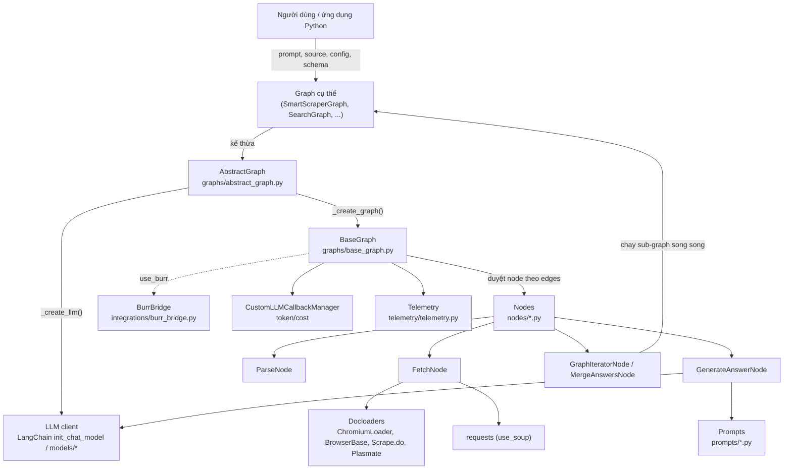
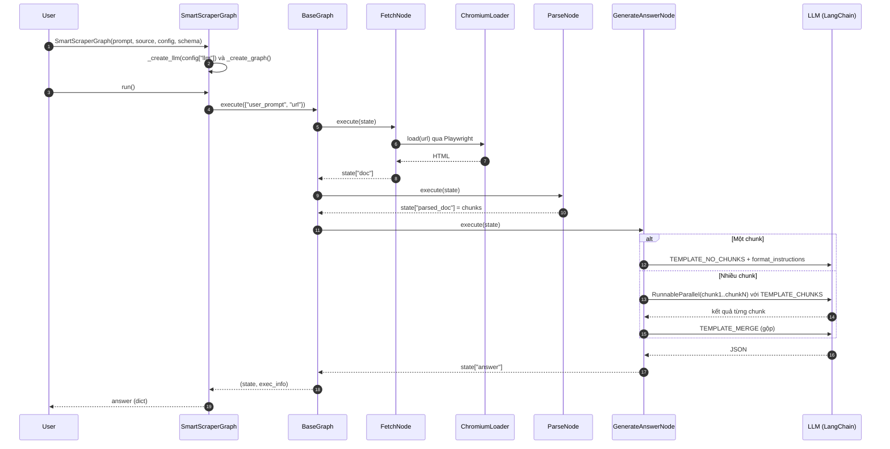
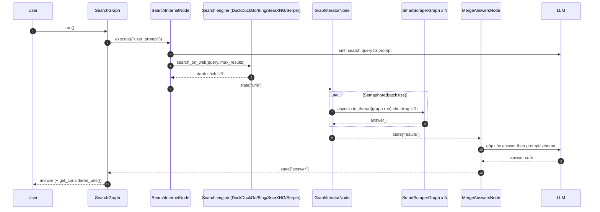

# Scrapegraph-ai — Tài liệu thiết kế giải pháp

> **Fork:** [mrchinh189/Scrapegraph-ai](https://github.com/mrchinh189/Scrapegraph-ai) · **Upstream:** [ScrapeGraphAI/Scrapegraph-ai](https://github.com/ScrapeGraphAI/Scrapegraph-ai)
> **Nhóm:** Web scraping
> **Ngôn ngữ chính:** Python (>=3.12) · **License:** MIT · **Commit đã phân tích:** `71ab440`

## 1. Tóm tắt

ScrapeGraphAI (package `scrapegraphai`, v2.1.3) là thư viện Python dùng LLM kết hợp với "graph logic" để dựng các pipeline scraping cho website và tài liệu cục bộ (HTML, XML, JSON, CSV, Markdown, PDF). Người dùng chỉ mô tả *cần trích xuất gì* bằng ngôn ngữ tự nhiên (prompt) cùng một `source`, thư viện tự fetch nội dung, làm sạch, chia chunk, gọi LLM và trả về JSON (tuỳ chọn ép theo Pydantic schema). Điểm khác biệt cốt lõi: mỗi kịch bản scraping là một **graph các node** có thể tái tổ hợp (`SmartScraperGraph`, `SearchGraph`, `ScriptCreatorGraph`...), không phụ thuộc vào CSS selector, và hỗ trợ nhiều LLM provider qua LangChain (OpenAI, Ollama, Anthropic, Bedrock, Mistral, Groq, DeepSeek...).

## 2. Bài toán & yêu cầu

- **Bài toán:** Scraper truyền thống dựa trên selector/XPath dễ vỡ khi giao diện trang thay đổi và tốn công viết cho từng site. Cần một cách trích xuất dữ liệu có cấu trúc "theo ý nghĩa" từ trang web hoặc file chỉ bằng prompt.
- **Yêu cầu chức năng chính:**
  - Trích xuất thông tin từ 1 URL/file theo prompt (`SmartScraperGraph`), từ nhiều URL (`SmartScraperMultiGraph`, `...MultiConcatGraph`, `...MultiLiteGraph`, `...MultiBatchGraph`).
  - Tìm kiếm Internet rồi scrape các kết quả (`SearchGraph`, `OmniSearchGraph`, `SearchLinkGraph`).
  - Scrape các định dạng tài liệu: `JSONScraperGraph`, `XMLScraperGraph`, `CSVScraperGraph`, `DocumentScraperGraph` (và biến thể `*MultiGraph`).
  - Sinh mã scraper Python (`ScriptCreatorGraph`, `CodeGeneratorGraph`), chuyển trang thành Markdown (`MarkdownifyGraph`), scrape kèm ảnh (`OmniScraperGraph`, `ScreenshotScraperGraph`), đọc kết quả thành audio (`SpeechGraph`), crawl theo độ sâu kèm RAG (`DepthSearchGraph`).
  - Output có cấu trúc theo Pydantic `schema`.
- **Yêu cầu phi chức năng:**
  - Tương thích nhiều LLM provider; tự xác định `model_tokens` để chunk vừa context window (`scrapegraphai/helpers/models_tokens.py`).
  - Timeout cấu hình được cho các thao tác blocking (`docs/timeout_configuration.md`, mặc định `timeout=480` ở `AbstractGraph`).
  - Rate limit LLM (`rate_limit.requests_per_second`, `max_retries` → `InMemoryRateLimiter`).
  - Song song hoá khi xử lý nhiều chunk (`RunnableParallel`) và nhiều URL (`asyncio.Semaphore` trong `GraphIteratorNode`).
  - Theo dõi chi phí token/USD theo từng node (`CustomLLMCallbackManager`).
  - Chống bot cơ bản: Playwright + `undetected-playwright`, proxy rotation (`utils/proxy_rotation.py`), dịch vụ ngoài (BrowserBase, Scrape.do, Plasmate).
- **Ngoài phạm vi:** Không phải crawler phân tán quy mô lớn (không có scheduler/queue bền vững, không có dedup URL toàn cục); không có REST server riêng trong repo — bản hosted/API là sản phẩm thương mại tách biệt (scrapegraphai.com, truy cập qua SDK `scrapegraph-py`).

## 3. Kiến trúc tổng thể



Kiến trúc chia thành 4 lớp:

1. **Lớp Graph (API công khai)** — các class trong `scrapegraphai/graphs/` kế thừa `AbstractGraph`, mỗi class chỉ định nghĩa `_create_graph()` (lắp node + edge) và `run()`.
2. **Lớp Engine** — `BaseGraph` thực thi tuần tự từ `entry_point`, chuyển `state` (dict) qua các node, hỗ trợ `ConditionalNode` để rẽ nhánh, hoặc uỷ quyền cho Burr khi bật `burr_kwargs`.
3. **Lớp Node** — đơn vị xử lý nhỏ (`BaseNode.execute(state) -> state`), đọc input từ state bằng biểu thức logic (`"user_prompt & (relevant_chunks | parsed_doc | doc)"`), ghi output vào state.
4. **Lớp hạ tầng** — docloaders (trình duyệt), LLM wrappers (`scrapegraphai/models/`), prompt templates, utils (chunking, cleanup HTML, proxy, search web), telemetry.

## 4. Thành phần chính

| Thành phần | Vị trí trong mã nguồn | Trách nhiệm |
|---|---|---|
| `AbstractGraph` | `scrapegraphai/graphs/abstract_graph.py` | Khởi tạo LLM từ config, xác định `model_token`, truyền tham số chung (`headless`, `loader_kwargs`, `timeout`, `cache_path`...) tới mọi node, bật Burr |
| `BaseGraph` | `scrapegraphai/graphs/base_graph.py` | Engine chạy graph: duyệt edges, gọi `node.execute`, thu thập token/cost, log telemetry, xử lý `ConditionalNode` |
| `SmartScraperGraph` | `scrapegraphai/graphs/smart_scraper_graph.py` | Pipeline chuẩn Fetch → Parse → (Reasoning) → GenerateAnswer → (Conditional → Regen) |
| `SearchGraph` | `scrapegraphai/graphs/search_graph.py` | SearchInternet → GraphIterator(SmartScraperGraph) → MergeAnswers |
| `DepthSearchGraph` | `scrapegraphai/graphs/depth_search_graph.py` | FetchNodeLevelK → ParseNodeDepthK → DescriptionNode → RAGNode → GenerateAnswerNodeKLevel |
| `CodeGeneratorGraph` | `scrapegraphai/graphs/code_generator_graph.py` | Fetch → Parse → GenerateAnswer → PromptRefiner → HtmlAnalyzer → GenerateCode (sinh code scraper) |
| `BaseNode` | `scrapegraphai/nodes/base_node.py` | Lớp trừu tượng của node, parser biểu thức input `&`/`|`/ngoặc, `update_config` |
| `FetchNode` | `scrapegraphai/nodes/fetch_node.py` | Lấy nội dung: file/thư mục cục bộ (pdf/csv/json/xml/md), URL qua `requests`, BrowserBase, Scrape.do, Plasmate hoặc `ChromiumLoader`; tuỳ chọn convert sang Markdown |
| `ParseNode` | `scrapegraphai/nodes/parse_node.py` | Chuyển HTML → text, tách chunk theo `model_token` (`utils/split_text_into_chunks.py` dùng `semchunk`), trích link/ảnh |
| `GenerateAnswerNode` | `scrapegraphai/nodes/generate_answer_node.py` | Gọi LLM: 1 chunk → prompt `TEMPLATE_NO_CHUNKS`; nhiều chunk → map song song (`RunnableParallel`) rồi reduce bằng `TEMPLATE_MERGE` |
| `ConditionalNode` | `scrapegraphai/nodes/conditional_node.py` | Đánh giá điều kiện (dùng `simpleeval`) để chọn node kế tiếp |
| `GraphIteratorNode` | `scrapegraphai/nodes/graph_iterator_node.py` | Tạo N instance của một graph con (vd. `SmartScraperGraph`), chạy song song với `asyncio.Semaphore(batchsize)` |
| `MergeAnswersNode` | `scrapegraphai/nodes/merge_answers_node.py` | Gộp kết quả từ nhiều nguồn bằng LLM |
| `SearchInternetNode` | `scrapegraphai/nodes/search_internet_node.py`, `utils/research_web.py` | Sinh query từ prompt, tìm qua DuckDuckGo (`ddgs`), Bing, SearXNG hoặc Serper |
| `RAGNode` | `scrapegraphai/nodes/rag_node.py` | Embed chunk và lưu vào Qdrant (in-memory/local/server) — cần cài `qdrant-client` |
| `ChromiumLoader` | `scrapegraphai/docloaders/chromium.py` | LangChain `BaseLoader` dùng Playwright (mặc định, kèm `undetected_playwright.Malenia`) hoặc Selenium/undetected-chromedriver; có retry, scroll |
| LLM wrappers | `scrapegraphai/models/*.py` | Wrapper cho provider không có trong `init_chat_model`: DeepSeek, OneApi, Nvidia, XAI, CLoD, MiniMax; TTS/ITT của OpenAI |
| Prompts | `scrapegraphai/prompts/*.py` | Prompt template cho từng node (chunks, merge, markdown, csv, pdf, omni, code...) |
| `GraphBuilder` | `scrapegraphai/builders/graph_builder.py` | (Thử nghiệm) dùng LLM để sinh định nghĩa graph JSON từ prompt, xuất Graphviz |
| `BurrBridge` | `scrapegraphai/integrations/burr_bridge.py` | Chuyển node thành Burr `Action` để có tracking/UI của Burr |
| scrapegraph-py compat | `scrapegraphai/integrations/scrapegraph_py_compat.py` | Khi `model == "scrapegraphai/smart-scraper"`, gọi thẳng API cloud qua SDK `scrapegraph-py` (v2/v3) |
| Telemetry | `scrapegraphai/telemetry/telemetry.py` | Gửi sự kiện thực thi graph tới `TRACK_URL`; tắt bằng `SCRAPEGRAPHAI_TELEMETRY_ENABLED` |

### 4.1 `AbstractGraph._create_llm`

- Gộp `{"streaming": False}` với `config["llm"]`; tách `rate_limit` thành `InMemoryRateLimiter`.
- Nếu có `model_instance` thì dùng trực tiếp (bắt buộc có `model_tokens`).
- Model dạng `"provider/model"` (vd. `"openai/gpt-4o-mini"`, `"ollama/llama3.2"`) → tách provider; nếu không có `/` thì tra ngược trong `models_tokens`.
- Kiểm tra provider thuộc `known_providers`; đa số provider đi qua `langchain.chat_models.init_chat_model`, một số đi qua wrapper riêng trong `scrapegraphai/models/`.
- `model_token` lấy từ `models_tokens[provider][model]`, mặc định 8192 nếu không tìm thấy — giá trị này quyết định `chunk_size` cho `ParseNode`.

### 4.2 `BaseGraph` – engine thực thi

- `edges` được chuẩn hoá thành dict `from_node_name → to_node_name` (một cạnh ra cho node thường); `ConditionalNode` bắt buộc có **đúng 2 cạnh ra** (`true_node_name`, `false_node_name`; `None` = kết thúc).
- `_execute_standard` lặp `while current_node_name`: chạy node trong context `exclusive_get_callback` để đo `total_tokens`, `prompt_tokens`, `completion_tokens`, `total_cost_USD`, `exec_time`; kết quả trả về `(state, exec_info)` với dòng tổng `"TOTAL RESULT"`.
- Khi node lỗi: log telemetry kèm `error_node` rồi raise lại.

### 4.3 Biểu thức input của node

`BaseNode._parse_input_keys` cho phép khai báo `input="user_prompt & (relevant_chunks | parsed_doc | doc)"`: AND bắt buộc đủ khoá, OR chọn khoá đầu tiên có trong state. Nhờ vậy cùng một `GenerateAnswerNode` dùng được dù trước nó có `ParseNode`, `RAGNode` hay không — đây là cơ chế "duck typing" giúp ghép graph linh hoạt.

### 4.4 `SmartScraperGraph` – biến thể theo cấu hình

`_create_graph()` tra bảng `graph_variation_config` theo bộ ba `(html_mode, reasoning, reattempt)`:

- `html_mode=True` → bỏ `ParseNode`, đưa HTML thô cho LLM.
- `reasoning=True` → chèn `ReasoningNode` trước `GenerateAnswerNode`.
- `reattempt=True` → thêm `ConditionalNode` (điều kiện `not answer or answer=="NA"`) và một `GenerateAnswerNode` thứ hai với prompt `REGEN_ADDITIONAL_INFO`.

## 5. Luồng xử lý chính

### 5.1 SmartScraperGraph (1 URL)



Chi tiết:

1. `FetchNode.execute` xác định loại input (`url`, `local_dir`, `pdf`, `json_dir`...) và gọi handler tương ứng. Với URL: nếu `use_soup` thì dùng `requests.get`; nếu cấu hình `browser_base` → BrowserBase; `scrape_do` → Scrape.do; `plasmate` → `PlasmateLoader`; còn lại dùng `ChromiumLoader`.
2. `ParseNode` chuyển HTML sang text (`html2text`) và chia chunk kích thước `model_token - 250` hoặc `min(model_token - 500, 0.8 * model_token)`.
3. `GenerateAnswerNode` chọn output parser: Pydantic parser khi có `schema`, `JsonOutputParser` nếu không (Bedrock là ngoại lệ không dùng parser), áp `invoke_with_timeout`.

### 5.2 SearchGraph (tìm kiếm + scrape nhiều trang)



## 6. Mô hình dữ liệu & giao diện

**State của graph** là `dict` dùng chung, các khoá phổ biến:

| Khoá | Ghi bởi | Ý nghĩa |
|---|---|---|
| `user_prompt` | input | Prompt người dùng |
| `url` / `local_dir` / `json` / `pdf_dir`... | input | Nguồn dữ liệu (loại khoá quyết định handler của `FetchNode`) |
| `doc` | `FetchNode` | List `langchain_core.documents.Document` |
| `parsed_doc` | `ParseNode` | List chunk text |
| `relevant_chunks` | (RAG/Reasoning) | Chunk liên quan |
| `answer` | `GenerateAnswerNode`, `MergeAnswersNode` | Kết quả cuối (dict) |
| `urls`, `results` | `SearchInternetNode`, `GraphIteratorNode` | Danh sách URL / kết quả con |
| `generated_code`, `merged_script` | `GenerateCodeNode`, `MergeGeneratedScriptsNode` | Mã scraper sinh ra |

**Cấu hình graph (`config: dict`)** — các khoá đọc trong code:

```python
graph_config = {
    "llm": {
        "model": "openai/gpt-4o-mini",      # "provider/model"
        "api_key": "...",
        "model_tokens": 8192,                # tuỳ chọn
        "rate_limit": {"requests_per_second": 1, "max_retries": 3},
        # hoặc "model_instance": <LangChain chat model>
    },
    "verbose": True, "headless": True,
    "timeout": 480,                          # giây
    "loader_kwargs": {"proxy": {...}},       # chuyển cho ChromiumLoader
    "html_mode": False, "reasoning": False, "reattempt": False,
    "force": False, "cut": True,
    "browser_base": {...}, "scrape_do": {...}, "plasmate": {...},
    "storage_state": "auth.json",            # Playwright session
    "search_engine": "duckduckgo", "serper_api_key": "...", "max_results": 3,
    "burr_kwargs": {"project_name": "..."},
    "additional_info": "...",                # tiền tố cho prompt
}
```

**API công khai:** `Graph(prompt, source, config, schema).run()`, `get_execution_info()` (thống kê token/cost theo node, in đẹp bằng `utils/prettify_exec_info.py`), `get_state(key)`, `append_node(node)`, `run_safe_async()`. Export kết quả qua `utils/data_export.py`.

Không có REST/CLI riêng; ví dụ config dạng YAML ở `examples/extras/example.yml` + `examples/extras/load_yml.py`.

## 7. Tech stack

| Lớp | Công nghệ | Vai trò |
|---|---|---|
| Ngôn ngữ | Python >=3.12 | Thư viện |
| LLM orchestration | `langchain`, `langchain-core`, `langchain-community`, `langchain-openai`, `-mistralai`, `-aws`, `-ollama` | Chat model, prompt template, output parser, `RunnableParallel` |
| Trình duyệt | `playwright`, `undetected-playwright` (tuỳ chọn Selenium/undetected-chromedriver) | Render JS, chống phát hiện bot |
| HTML/text | `beautifulsoup4`, `html2text`, `minify-html` | Làm sạch, chuyển Markdown |
| Chunking/token | `semchunk`, `tiktoken` | Chia chunk theo token |
| Search | `ddgs` (DuckDuckGo), Bing, SearXNG, Serper | Tìm URL |
| Proxy | `free-proxy` | Proxy rotation |
| Validation | `pydantic`, `jsonschema`, `simpleeval` | Schema output, điều kiện của ConditionalNode |
| Vector DB (tuỳ chọn) | `qdrant-client` | `RAGNode` |
| Workflow tracking (tuỳ chọn) | `burr[start]` | Quan sát graph |
| OCR (tuỳ chọn) | `surya-ocr` | Extra `ocr` |
| Build/dev | `hatchling`, `uv`, `pytest`, `ruff`, `black`, `pylint`, `mypy`, semantic-release | Đóng gói, test, release |

## 8. Quyết định thiết kế & đánh đổi

| Quyết định | Lý do | Đánh đổi |
|---|---|---|
| Mô hình pipeline = graph các node + state dict | Ghép/tái sử dụng node cho nhiều kịch bản (≈26 graph dựng sẵn) | State không có kiểu, lỗi khoá chỉ phát hiện lúc runtime |
| Input node bằng biểu thức `&`/`|` | Node linh hoạt, không phụ thuộc node đứng trước | Cú pháp tự chế, khó debug khi không khớp khoá |
| Engine tuần tự đơn giản (1 cạnh ra / node) | Dễ hiểu, dễ test | Không có fan-out song song trong graph; song song phải làm trong node (`GraphIteratorNode`, `RunnableParallel`) |
| Dùng LLM thay selector | Bền với thay đổi layout, dễ dùng | Chi phí token, độ trễ cao, kết quả không tất định, có thể "hallucinate" |
| Map-reduce theo chunk (`TEMPLATE_CHUNKS` → `TEMPLATE_MERGE`) | Xử lý trang dài hơn context window | Thêm một lần gọi LLM, có thể mất ngữ cảnh giữa các chunk |
| Dựa vào LangChain `init_chat_model` + wrapper riêng | Hỗ trợ nhiều provider với ít code | Phụ thuộc chặt vào API LangChain hay thay đổi |
| Playwright làm loader mặc định | Render được SPA/JS | Nặng, cần `playwright install`; chậm hơn `requests` |
| Graph con chạy qua `asyncio.to_thread(graph.run)` | Tái sử dụng graph đồng bộ trong ngữ cảnh async | Mỗi instance là một thread + browser riêng, tốn tài nguyên |
| Telemetry bật mặc định | Thu thập số liệu sử dụng | Vấn đề riêng tư — cần tắt bằng biến môi trường |

## 9. Triển khai & vận hành

- **Cài đặt local:** `pip install scrapegraphai` rồi `playwright install` (README). Extras: `scrapegraphai[burr]`, `[nvidia]`, `[ocr]`. Dev dùng `uv` (`uv.lock`) và `Makefile`.
- **Docker:** `Dockerfile` dựa trên `python:3.11-slim`, cài `scrapegraphai`, `scrapegraphai[burr]` và `playwright install-deps/install`. Lưu ý `pyproject.toml` yêu cầu Python >=3.12 nên image 3.11 có thể không khớp với phiên bản mới.
- **LLM local:** `docker-compose.yml` chỉ dựng một service `ollama/ollama` (port 11434, volume `ollama_volume`) để dùng model `ollama/...`.
- **Cấu hình bí mật:** API key đặt trong `config["llm"]["api_key"]` hoặc qua `.env` (`python-dotenv`, xem các ví dụ trong `examples/`).
- **Quan sát:** `verbose=True` bật log INFO (`utils/logging.py`); `get_execution_info()` cho token/chi phí theo node; Burr UI khi bật `burr_kwargs`; telemetry gửi tới `https://sgai-oss-tracing.onrender.com/v1/telemetry` — tắt bằng `SCRAPEGRAPHAI_TELEMETRY_ENABLED=false`.
- **CI:** `.github/workflows/test-suite.yml`, `codeql.yml`, `dependency-review.yml`, `release.yml` (semantic-release theo `.releaserc.yml`).
- **Giới hạn đã biết:** phụ thuộc chất lượng LLM; trang có anti-bot mạnh cần dịch vụ ngoài; `robots.txt` chỉ được kiểm tra khi graph dùng `RobotsNode` (không mặc định trong `SmartScraperGraph`); `RAGNode` yêu cầu cài thêm `qdrant-client`.

## 10. Điểm mở rộng

- **Graph tuỳ chỉnh:** tạo `BaseGraph(nodes=[...], edges=[...], entry_point=...)` trực tiếp (xem `examples/custom_graph/`) hoặc kế thừa `AbstractGraph` và cài `_create_graph()` + `run()`.
- **Node mới:** kế thừa `BaseNode`, khai báo `input` (biểu thức) và `output`, cài `execute(state)`; node rẽ nhánh dùng `node_type="conditional_node"` và trả về tên node kế tiếp.
- **LLM provider mới:** truyền `model_instance` (mọi LangChain chat model) + `model_tokens`, hoặc thêm wrapper vào `scrapegraphai/models/` và nhánh trong `AbstractGraph._create_llm`.
- **Loader mới:** thêm vào `scrapegraphai/docloaders/` và nhánh trong `FetchNode.handle_web_source` (mẫu: `browser_base.py`, `scrape_do.py`, `plasmate.py`).
- **Prompt:** sửa template trong `scrapegraphai/prompts/` hoặc chèn tiền tố qua `additional_info` (ví dụ `examples/extras/custom_prompt.py`).
- **Search engine:** thêm nhánh trong `utils/research_web.py` (`valid_engines`).
- **Integrations:** Burr (`integrations/burr_bridge.py`), Indexify (`integrations/indexify_node.py`).

## 11. Bài học & cách áp dụng

- **"Graph of nodes + shared state"** là pattern nhẹ để dựng pipeline LLM mà không cần framework lớn (như LangGraph): `BaseGraph` chỉ khoảng 400 dòng. Có thể áp dụng cho pipeline ETL/LLM nội bộ.
- **Biểu thức input `a & (b | c)`** giúp node chịu được nhiều topology khác nhau — đáng học khi thiết kế plugin có đầu vào tuỳ chọn.
- **Bảng biến thể graph** (`graph_variation_config` theo tuple cờ) là cách gọn để quản lý tổ hợp tính năng thay vì nhiều `if` lồng nhau.
- **Map-reduce theo chunk dựa trên context window của model** (`models_tokens`) là kỹ thuật chuẩn khi đưa tài liệu dài vào LLM.
- **Đo token/chi phí theo từng bước** bằng callback manager — nên làm ngay từ đầu cho mọi hệ thống dùng LLM.
- **Graph lồng graph** (`GraphIteratorNode` chạy `SmartScraperGraph`) cho phép tái sử dụng pipeline đơn lẻ thành pipeline nhiều nguồn.
- Khi áp dụng: kết hợp với scraper truyền thống (Scrapy) cho phần crawl quy mô, chỉ dùng LLM cho bước trích xuất ngữ nghĩa để giảm chi phí.

## 12. Tham khảo

- README: `README.md` (và bản dịch trong `docs/*.md`)
- Timeout: `docs/timeout_configuration.md`
- Manifest: `pyproject.toml`, `uv.lock`, `Dockerfile`, `docker-compose.yml`
- Engine: `scrapegraphai/graphs/abstract_graph.py`, `scrapegraphai/graphs/base_graph.py`
- Graph tiêu biểu: `scrapegraphai/graphs/smart_scraper_graph.py`, `scrapegraphai/graphs/search_graph.py`, `scrapegraphai/graphs/depth_search_graph.py`, `scrapegraphai/graphs/code_generator_graph.py`
- Node: `scrapegraphai/nodes/base_node.py`, `fetch_node.py`, `parse_node.py`, `generate_answer_node.py`, `graph_iterator_node.py`, `conditional_node.py`, `rag_node.py`
- Loader: `scrapegraphai/docloaders/chromium.py`
- Ví dụ: `examples/` (đặc biệt `examples/custom_graph/`, `examples/extras/`)
- Docs chính thức: https://docs.scrapegraphai.com/introduction
