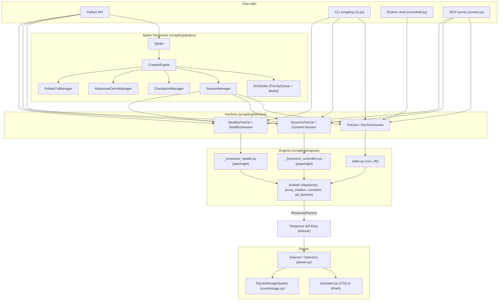
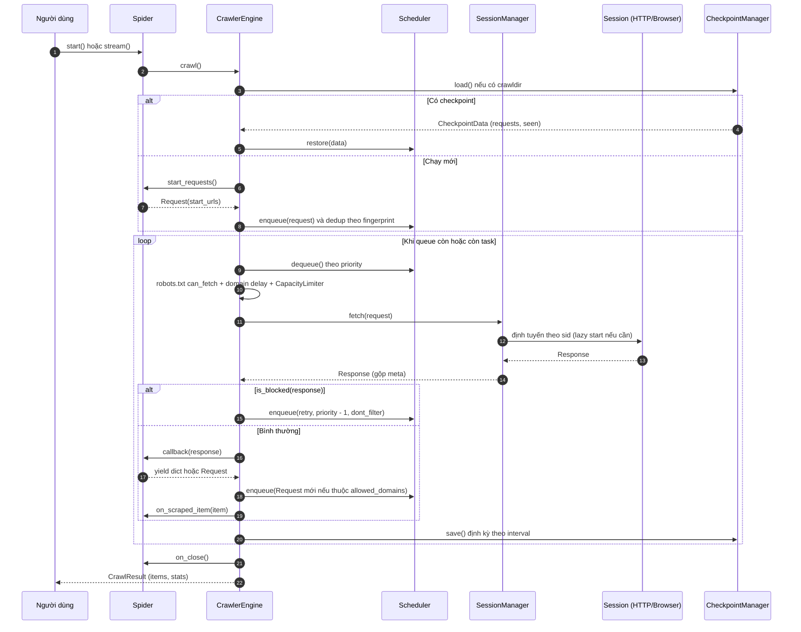
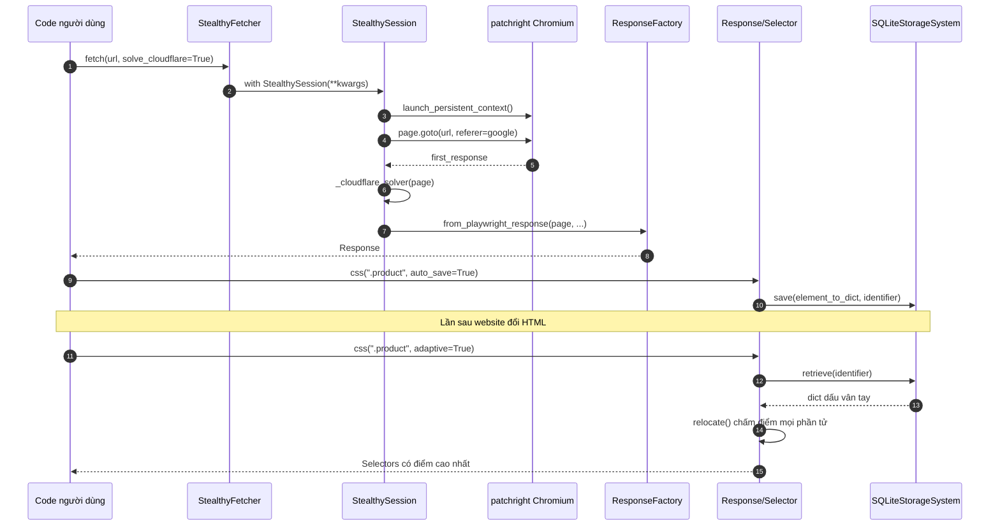

# Scrapling — Tài liệu thiết kế giải pháp

> **Fork:** [mrchinh189/Scrapling](https://github.com/mrchinh189/Scrapling) · **Upstream:** [D4Vinci/Scrapling](https://github.com/D4Vinci/Scrapling)
> **Nhóm:** Web scraping
> **Ngôn ngữ chính:** Python (>= 3.10) · **License:** BSD-3-Clause · **Commit đã phân tích:** `1490506`

## 1. Tóm tắt

Scrapling là một **thư viện/framework Python cho web scraping**, bao trọn từ một request đơn lẻ tới một crawl quy mô lớn. Nó gộp ba thứ thường phải ghép từ nhiều thư viện: (1) một **parser** dựa trên `lxml` có khả năng *adaptive* — tự định vị lại phần tử khi website đổi cấu trúc; (2) bộ **fetcher** từ HTTP thuần (giả lập TLS fingerprint bằng `curl_cffi`) đến trình duyệt headless "stealth" (`patchright`) có thể vượt Cloudflare Turnstile; (3) một **framework Spider** kiểu Scrapy, async, đa session, có pause/resume bằng checkpoint. Ngoài ra repo cung cấp CLI, shell tương tác IPython và **MCP server** để AI agent (Claude, Cursor...) gọi trực tiếp.

## 2. Bài toán & yêu cầu

- **Bài toán:** Scraper truyền thống dễ gãy khi (a) website đổi HTML/CSS làm selector hỏng, (b) hệ thống anti-bot (Cloudflare, fingerprinting) chặn request, (c) cần mở rộng từ script đơn lẻ sang crawl nhiều trang có kiểm soát tốc độ, retry, resume.
- **Yêu cầu chức năng chính:**
  - Chọn phần tử bằng CSS/XPath/text/regex/filter, duyệt DOM (parent, sibling, children), tìm phần tử tương tự (`find_similar`).
  - Lưu "dấu vân tay" phần tử và định vị lại khi trang thay đổi (`auto_save=True` / `adaptive=True`).
  - Fetch bằng HTTP (GET/POST/PUT/DELETE, HTTP/3, impersonate), bằng Playwright Chromium/Chrome, hoặc bằng trình duyệt stealth có giải Cloudflare.
  - Session bền (cookie, state), pool tab trình duyệt, xoay proxy, chặn domain/quảng cáo, DNS-over-HTTPS.
  - Spider: `start_urls`, callback async, priority queue + dedup, giới hạn concurrency toàn cục/theo domain, `download_delay`, robots.txt, phát hiện & retry request bị chặn, streaming item, export JSON/JSONL, development cache.
  - Giao diện: Python API, CLI `scrapling`, shell tương tác, MCP server (stdio hoặc streamable-http).
- **Yêu cầu phi chức năng:**
  - Hiệu năng parser cao (README benchmark: ngang Parsel/Scrapy, nhanh hơn BS4 ~780 lần); JSON nhanh qua `orjson`.
  - Tiết kiệm bộ nhớ (`__slots__` trên `Selector`, lazy import ở `scrapling/__init__.py` và `scrapling/fetchers/__init__.py`).
  - Thread-safe cho storage (SQLite WAL + `RLock`) và `ProxyRotator` (`Lock`).
  - Độ tin cậy: retry có delay, ghi checkpoint nguyên tử (temp file + rename).
  - Bảo mật cơ bản: `follow_redirects="safe"` mặc định chặn redirect tới IP nội bộ (chống SSRF); làm sạch nội dung ẩn trước khi đưa cho AI (`Convertor._sanitize_for_ai`).
  - Type hints đầy đủ, kiểm tra bằng PyRight/MyPy.
- **Ngoài phạm vi:** không có hàng đợi phân tán/multi-node, không có UI/dashboard, không có lưu trữ kết quả vào DB (chỉ export JSON/JSONL hoặc hook do người dùng tự viết), không có trích xuất bằng LLM bên trong thư viện (LLM nằm phía client MCP).

## 3. Kiến trúc tổng thể



Kiến trúc chia lớp rõ ràng:

1. **Parser** (`scrapling/parser.py`, `scrapling/core/*`) — lõi không phụ thuộc mạng, chỉ cần `lxml`, `cssselect`, `orjson`, `tld`, `w3lib`. Có thể cài riêng bằng `pip install scrapling`.
2. **Engines** (`scrapling/engines/*`) — triển khai thực tế việc gửi request: HTTP qua `curl_cffi`, trình duyệt qua `playwright`/`patchright`. Mọi engine trả về `Response` (lớp con của `Selector`) qua `ResponseFactory` ở `scrapling/engines/toolbelt/convertor.py`.
3. **Fetchers** (`scrapling/fetchers/*`) — facade công khai mỏng: lớp tĩnh một lần (`Fetcher.get`, `StealthyFetcher.fetch`) và lớp Session (giữ trình duyệt/kết nối).
4. **Spiders** (`scrapling/spiders/*`) — framework crawl async dựng trên `anyio`, dùng các Session làm "downloader".
5. **Interfaces** — CLI (`click`), shell (IPython), MCP server (`mcp.server.fastmcp.FastMCP`).

## 4. Thành phần chính

| Thành phần | Vị trí trong mã nguồn | Trách nhiệm |
|---|---|---|
| `Selector`, `Selectors` | `scrapling/parser.py` | Bọc `lxml.html.HtmlElement`; CSS/XPath, `find_all`, `find_by_text`, `find_by_regex`, `find_similar`, `relocate`, `re`, điều hướng DOM |
| `TextHandler`, `AttributesHandler` | `scrapling/core/custom_types.py` | Kiểu chuỗi/dict mở rộng (regex, clean, json) trả về từ selector |
| `css_to_xpath` | `scrapling/core/translator.py` | Dịch CSS (kèm pseudo-element `::text`, `::attr()`) sang XPath, phỏng theo Parsel |
| `SelectorsGeneration` | `scrapling/core/mixins.py` | Sinh CSS/XPath selector tự động cho một phần tử |
| `StorageSystemMixin`, `SQLiteStorageSystem` | `scrapling/core/storage.py` | Lưu/đọc "dấu vân tay" phần tử cho tính năng adaptive, phân tách theo domain |
| `_StorageTools.element_to_dict` | `scrapling/core/utils/_utils.py` | Chuyển phần tử thành dict: tag, attributes, text, path, parent, siblings, children |
| `FetcherSession`, `FetcherClient` | `scrapling/engines/static.py` | HTTP client sync/async trên `curl_cffi`, impersonate, retry, proxy, redirect "safe" |
| `DynamicSession`, `AsyncDynamicSession` | `scrapling/engines/_browsers/_controllers.py` | Điều khiển Chromium/Chrome qua Playwright |
| `StealthySession`, `AsyncStealthySession` | `scrapling/engines/_browsers/_stealth.py` | Trình duyệt stealth qua `patchright`, giải Cloudflare (`_cloudflare_solver`) |
| `SyncSession`, `AsyncSession`, mixins | `scrapling/engines/_browsers/_base.py` | Vòng đời trình duyệt, page pool, chờ ổn định trang, bắt XHR, sinh launch/context options |
| `PagePool`, `PageInfo` | `scrapling/engines/_browsers/_page.py` | Quản lý tab: busy/free/error, `max_pages` |
| Validators / types | `scrapling/engines/_browsers/_validators.py`, `_types.py` | `PlaywrightConfig`, `StealthConfig` (msgspec) và TypedDict tham số |
| `ResponseFactory` | `scrapling/engines/toolbelt/convertor.py` | Tạo `Response` từ Playwright hoặc `curl_cffi`, xử lý encoding, redirect history |
| `Response`, `BaseFetcher` | `scrapling/engines/toolbelt/custom.py` | `Response` = `Selector` + status/headers/cookies/meta + `follow()`; `BaseFetcher.configure()` |
| `generate_headers` | `scrapling/engines/toolbelt/fingerprints.py` | Sinh header trình duyệt thật bằng `browserforge` |
| `ProxyRotator` | `scrapling/engines/toolbelt/proxy_rotation.py` | Xoay proxy thread-safe, chiến lược cyclic hoặc tùy biến |
| Ad-block list | `scrapling/engines/toolbelt/ad_domains.py` | ~3.500 domain quảng cáo/tracker để chặn |
| `Spider` | `scrapling/spiders/spider.py` | Lớp người dùng kế thừa; cấu hình concurrency, hook vòng đời, `start()`, `stream()`, `pause()` |
| `CrawlerEngine` | `scrapling/spiders/engine.py` | Vòng lặp crawl chính, giới hạn concurrency, delay, robots, cache, blocked retry, checkpoint |
| `Scheduler` | `scrapling/spiders/scheduler.py` | `asyncio.PriorityQueue` + tập fingerprint đã thấy; `snapshot()`/`restore()` |
| `Request` | `scrapling/spiders/request.py` | URL, `sid`, callback, priority, `dont_filter`, meta, fingerprint |
| `SessionManager` | `scrapling/spiders/session.py` | Đăng ký nhiều session theo ID, lazy start, định tuyến request theo `sid` |
| `CheckpointManager` | `scrapling/spiders/checkpoint.py` | Pickle trạng thái (pending requests + seen) ghi nguyên tử |
| `ResponseCacheManager` | `scrapling/spiders/cache.py` | Cache response ra đĩa ở development mode |
| `RobotsTxtManager` | `scrapling/spiders/robotstxt.py` | Đọc robots.txt bằng `protego`, Crawl-delay/Request-rate |
| `CrawlSpider`, `SitemapSpider`, `LinkExtractor` | `scrapling/spiders/templates/*`, `scrapling/spiders/links.py` | Spider mẫu theo rule và theo sitemap |
| `CrawlResult`, `CrawlStats`, `ItemList` | `scrapling/spiders/result.py` | Kết quả crawl, thống kê, export JSON/JSONL |
| `ScraplingMCPServer` | `scrapling/core/ai.py` | MCP tools: `get`, `bulk_get`, `fetch`, `bulk_fetch`, `stealthy_fetch`, `bulk_stealthy_fetch`, `screenshot`, quản lý session |
| CLI | `scrapling/cli.py` | `install`, `mcp`, `shell`, `extract {get,post,put,delete,fetch,stealthy-fetch}` |
| Shell, `CurlParser`, `Convertor` | `scrapling/core/shell.py` | IPython shell, chuyển lệnh curl sang request Scrapling, chuyển HTML sang Markdown/text |

### 4.1. Parser adaptive (`scrapling/parser.py`)

`Selector` không kế thừa `HtmlElement` (vì `lxml` element không pickle được) mà bọc `_root`. Mọi truy vấn CSS được dịch sang XPath (`_css_to_xpath`) rồi chạy qua `xpath()`. Cơ chế adaptive gồm hai bước:

- **Lưu:** khi gọi `css(..., auto_save=True)`, phần tử tìm được được chuyển thành dict bởi `_StorageTools.element_to_dict` và lưu vào SQLite theo khóa `(url-domain, identifier)` — bảng `storage` được tạo trong `SQLiteStorageSystem._setup_database`.
- **Định vị lại:** khi gọi `css(..., adaptive=True)` mà selector không còn khớp, `relocate()` duyệt **toàn bộ** phần tử (`.//*`), tính điểm tương đồng bằng `__calculate_similarity_score` — kết hợp tag, text, attributes, riêng `class/id/href/src`, path, thông tin parent và siblings bằng `difflib.SequenceMatcher` — rồi trả về nhóm có điểm cao nhất nếu ≥ `percentage` (mặc định 40%).

Domain được rút gọn bằng thư viện `tld` (`_get_base_url`) để dữ liệu của các site khác nhau không lẫn lộn. File DB mặc định là `elements_storage.db` cạnh `parser.py`.

### 4.2. Fetchers & engines

- **HTTP** (`scrapling/engines/static.py`): `_ConfigurationLogic` gộp tham số session và request; `_SyncSessionLogic`/`_ASyncSessionLogic._make_request` gửi request qua `curl_cffi`, sinh header thật khi `stealthy_headers=True` (`_headers_job`), retry khi lỗi. `Fetcher`/`AsyncFetcher` ở `scrapling/fetchers/requests.py` chỉ là classmethod gọi một client singleton.
- **Dynamic** (`_controllers.py`): Playwright chuẩn, kênh `chromium` hoặc `chrome` (`real_chrome=True`), hoặc kết nối CDP (`cdp_url`).
- **Stealthy** (`_stealth.py`): dùng `patchright` (bản vá Playwright chống phát hiện). `start()` chọn giữa `connect_over_cdp`, `launch` (khi có proxy rotator — mỗi request tạo context mới với proxy riêng) hoặc `launch_persistent_context` với `user_data_dir`. `fetch()` thực hiện: chọn proxy → lấy page từ pool → gắn handler response/XHR → `page_setup` → `goto` (referer Google mặc định) → chờ ổn định → `_cloudflare_solver` → `page_action` → `wait_selector` → `ResponseFactory.from_playwright_response`. Có vòng retry theo `retries`/`retry_delay`, phân biệt lỗi proxy (`is_proxy_error`).
- **Tùy chọn trình duyệt** được sinh tập trung trong `BaseSessionMixin.__generate_options__` (`_base.py`): locale, timezone, user agent, flag DoH `--dns-over-https-templates=https://cloudflare-dns.com/dns-query`, extra flags.

### 4.3. Spider framework

`Spider` (`scrapling/spiders/spider.py`) khai báo cấu hình bằng thuộc tính lớp: `concurrent_requests=4`, `concurrent_requests_per_domain=0`, `download_delay=0.0`, `max_blocked_retries=3`, `robots_txt_obey=False`, `development_mode=False`, `allowed_domains`... Người dùng override `parse()`, `configure_sessions()`, và các hook `on_start`, `on_close`, `on_error`, `on_scraped_item`, `is_blocked`, `retry_blocked_request`.

`CrawlerEngine.crawl()` (`scrapling/spiders/engine.py`) chạy trong một `anyio` task group: nếu có checkpoint thì khôi phục và bỏ qua `start_requests()`; ngược lại enqueue các request khởi đầu. Vòng lặp chính lấy request từ scheduler khi `_active_tasks < concurrent_requests`, `start_soon(_task_wrapper)`, định kỳ lưu checkpoint, và kết thúc khi queue rỗng và không còn task. Concurrency theo domain dùng `anyio.CapacityLimiter` riêng mỗi domain (`_rate_limiter`); delay theo domain lấy max giữa `download_delay` và chỉ thị robots.txt (`_get_domain_delay`).

## 5. Luồng xử lý chính

### 5.1. Luồng crawl của Spider



Khi người dùng nhấn Ctrl+C, signal handler gọi `request_pause()`; engine chờ task đang chạy kết thúc (lần Ctrl+C thứ hai thì force stop), lưu checkpoint rồi dừng. Lần chạy sau với cùng `crawldir` sẽ resume. Khi hoàn tất bình thường, file `checkpoint.pkl` bị xóa.

### 5.2. Luồng một lần fetch stealth + adaptive parse



## 6. Mô hình dữ liệu & giao diện

**Cấu trúc dữ liệu cốt lõi**

- `Request` (`scrapling/spiders/request.py`): `url`, `sid`, `callback`, `priority`, `dont_filter`, `meta`, `_retry_count`, `_session_kwargs` (tham số chuyển thẳng cho session, vd `method`, `proxy`), `_fp` (fingerprint). Fingerprint gồm URL, method, body, session ID; tùy chọn thêm kwargs/headers/fragment qua `fp_include_kwargs`, `fp_include_headers`, `fp_keep_fragments`.
- `CheckpointData` (`scrapling/spiders/checkpoint.py`): `requests: List[Request]`, `seen: Set[bytes]` — lưu bằng `pickle` vào `<crawldir>/checkpoint.pkl`.
- `CrawlStats`, `CrawlResult`, `ItemList` (`scrapling/spiders/result.py`): số request, byte theo domain, status code, cache hit/miss, blocked, offsite, robots disallowed, proxy đã dùng...
- Bảng SQLite `storage(id, url, identifier, element_data, UNIQUE(url, identifier))` (`scrapling/core/storage.py`).
- MCP models (`scrapling/core/ai.py`): `ResponseModel{status, content: list[str], url}`, `SessionInfo`, `SessionCreatedModel`, `SessionClosedModel`.

**Python API công khai**

```python
from scrapling.fetchers import Fetcher, AsyncFetcher, FetcherSession, DynamicFetcher, DynamicSession, \
    AsyncDynamicSession, StealthyFetcher, StealthySession, AsyncStealthySession, ProxyRotator
from scrapling.spiders import Spider, Request, Response, CrawlSpider, CrawlRule, SitemapSpider, LinkExtractor
from scrapling.parser import Selector
```

**CLI** (`scrapling/cli.py`, entry point `scrapling = "scrapling.cli:main"` trong `pyproject.toml`):

| Lệnh | Mô tả |
|---|---|
| `scrapling install [--force]` | Cài trình duyệt và system deps (Playwright Chromium) |
| `scrapling mcp [--http --host --port]` | Chạy MCP server (stdio mặc định, `streamable-http` khi `--http`, port 8000) |
| `scrapling shell` | IPython shell tích hợp Scrapling |
| `scrapling extract get/post/put/delete URL out.{md,txt,html}` | Request HTTP và lưu nội dung |
| `scrapling extract fetch / stealthy-fetch ...` | Dùng DynamicFetcher / StealthyFetcher |

**MCP tools** (đăng ký trong `ScraplingMCPServer.serve`): `open_session`, `close_session`, `list_sessions`, `get`, `bulk_get`, `fetch`, `bulk_fetch`, `stealthy_fetch`, `bulk_stealthy_fetch`, `screenshot`. Nội dung trả về có thể là `markdown`, `html` hoặc `text`, lọc trước bằng `css_selector` để giảm token. Metadata registry MCP nằm ở `server.json` (tên `io.github.D4Vinci/Scrapling`, chạy qua `uvx scrapling mcp`).

## 7. Tech stack

| Lớp | Công nghệ | Vai trò |
|---|---|---|
| Parsing | `lxml`, `cssselect`, `w3lib` | Cây HTML, dịch CSS, tiện ích URL/HTML |
| Serialization | `orjson`, `msgspec` | JSON nhanh; validate cấu hình trình duyệt |
| Domain | `tld` | Tách domain cho storage adaptive |
| HTTP | `curl_cffi` | Request với TLS fingerprint giả lập, HTTP/3 |
| Browser | `playwright` 1.60, `patchright` 1.60.1 | Trình duyệt thường và trình duyệt stealth |
| Fingerprint | `browserforge`, `apify-fingerprint-datapoints` | Sinh header/UA thật |
| Async | `anyio` (tùy chọn uvloop/winloop) | Engine crawl, task group, CapacityLimiter |
| Robots | `protego` | Phân tích robots.txt và sitemap |
| AI | `mcp` (FastMCP), `markdownify` | MCP server, HTML sang Markdown |
| CLI/Shell | `click`, `IPython` | Dòng lệnh, shell tương tác |
| Storage | SQLite (stdlib) | Lưu dấu vân tay phần tử |
| Build/CI | setuptools, `uv`, GitHub Actions, tox, ruff, bandit, pre-commit | Đóng gói, Docker, kiểm thử, lint |
| Docs | Zensical/ReadTheDocs (`zensical.toml`, `.readthedocs.yaml`) | Trang tài liệu |

## 8. Quyết định thiết kế & đánh đổi

| Quyết định | Lý do | Đánh đổi |
|---|---|---|
| Tách extras `fetchers`, `ai`, `shell`, `all` | Cài lõi parser thật nhẹ; ai cần gì cài nấy | `import scrapling.fetchers` lỗi `ModuleNotFoundError` nếu chỉ cài gói gốc |
| Lazy import qua `__getattr__` ở `__init__.py` | Giảm thời gian import, tránh kéo Playwright khi chỉ cần parser | Khó cho static analysis; dùng `TYPE_CHECKING` để bù |
| Bọc `lxml` thay vì kế thừa `HtmlElement` | `HtmlElement` không pickle được | Thêm một lớp wrapper; dùng `__slots__` để giảm chi phí |
| Adaptive bằng so khớp tương đồng heuristic trên toàn DOM | Không cần ML, chạy offline, giải thích được | Độ phức tạp O(số phần tử) mỗi lần relocate; ngưỡng `percentage` cần tinh chỉnh; chỉ dựa trên cấu trúc |
| SQLite WAL + `RLock`, `check_same_thread=False` | An toàn đa luồng (vd khi chạy trong Scrapy) | Một file DB cục bộ, không chia sẻ giữa máy |
| Dùng `patchright` cho stealth, Playwright cho dynamic | Tách rõ trường hợp cần chống phát hiện | Phụ thuộc chặt phiên bản (pin `==1.60.x`), phải cập nhật theo Chrome |
| Giải Cloudflare bằng tự động hóa click trong trang | Không phụ thuộc dịch vụ captcha bên ngoài | Dễ gãy khi Cloudflare đổi giao diện; đệ quy giải lại |
| Spider async dựa trên `anyio`, Scheduler in-memory | Đơn giản, nhanh, không cần broker | Không phân tán; quy mô giới hạn bởi một tiến trình |
| Checkpoint bằng `pickle`, ghi nguyên tử | Pause/resume đơn giản, chống hỏng file | Pickle không an toàn với dữ liệu không tin cậy; callback được khôi phục theo tên (`_restore_callback`) |
| Một Spider nhiều session định tuyến bằng `sid` | Request rẻ qua HTTP, trang khó qua stealth | Người dùng phải tự quyết định route |
| `follow_redirects="safe"` mặc định | Chống SSRF khi bị gọi từ MCP/agent | Có thể chặn redirect hợp lệ tới mạng nội bộ |

## 9. Triển khai & vận hành

**Cài đặt local**

```bash
pip install "scrapling[all]"   # hoặc [fetchers] / [ai] / [shell]
scrapling install              # tải Chromium + system deps
```

**Docker** (`Dockerfile`): base `python:3.12-slim-trixie`, dùng `uv sync --all-extras`, cài `playwright install-deps chromium` và `playwright install chromium`, `EXPOSE 8000` cho MCP streamable-http, `ENTRYPOINT ["uv", "run", "scrapling"]`, `CMD ["--help"]`. Image phát hành sẵn: `pyd4vinci/scrapling` và `ghcr.io/d4vinci/scrapling:latest` (workflow `.github/workflows/docker-build.yml`).

```bash
docker run -p 8000:8000 ghcr.io/d4vinci/scrapling:latest mcp --http
```

**Cấu hình quan trọng**

- Parser: `Fetcher.configure(adaptive=True, ...)` hoặc `selector_config` mỗi request; storage tùy chỉnh qua `storage`/`storage_args`.
- Spider: thuộc tính lớp (concurrency, delay, robots, development mode), `crawldir` + `interval` (mặc định 300 s) cho checkpoint, `log_file`, `logging_level`.
- Browser: `headless`, `max_pages`, `proxy`/`proxy_rotator`, `block_ads`, `blocked_domains`, `dns_over_https`, `hide_canvas`, `block_webrtc`, `cdp_url`, `user_data_dir`, `retries`, `retry_delay`, `capture_xhr`.

**Quan sát:** `CrawlStats` (in khi kết thúc), `spider.stats` trong lúc `stream()`, đếm log theo level (`LogCounterHandler`), `session.get_pool_stats()` cho page pool.

**Giới hạn đã biết**

- Chạy trên một tiến trình/một máy; không có hàng đợi phân tán.
- Phiên bản Chromium/Chrome được hardcode trong `scrapling/engines/toolbelt/fingerprints.py` (`chromium_version = 148`) — phải cập nhật thủ công.
- Development cache chỉ dành cho phát triển, không dùng cho production (ghi chú trong `docs/spiders/architecture.md`).
- Lưu ý pháp lý: README nhấn mạnh tuân thủ ToS và robots.txt.

## 10. Điểm mở rộng

- **Storage adaptive tùy chỉnh:** kế thừa `StorageSystemMixin` (`scrapling/core/storage.py`), cài `save()` và `retrieve()`, truyền qua `Selector(storage=MyStorage, storage_args={...})`.
- **Chiến lược xoay proxy:** truyền hàm `strategy(proxies, current_index) -> (proxy, next_index)` vào `ProxyRotator`.
- **Hook Spider:** `on_start`, `on_close`, `on_error`, `on_scraped_item` (biến đổi/loại bỏ item — đóng vai pipeline), `is_blocked`, `retry_blocked_request` (vd đổi `sid` sang session stealth khi bị chặn).
- **Session tùy biến cho Spider:** `configure_sessions(manager)` với `manager.add(id, session, default=..., lazy=...)`.
- **Spider mẫu:** `CrawlSpider.rules()` trả về danh sách `CrawlRule(link_extractor, callback, priority, process_request)`; `SitemapSpider` cho site có sitemap.
- **Tự động hóa trang:** `page_setup(page)` (trước điều hướng), `page_action(page)` (sau điều hướng), `init_script`, `additional_args` cho Playwright context.
- **Agent Skill:** thư mục `agent-skill/Scrapling-Skill` (theo chuẩn AgentSkill) đóng gói tài liệu cho Claude Code/OpenClaw.

## 11. Bài học & cách áp dụng

1. **Phân lớp parser – engine – facade – orchestrator:** lõi parser thuần, không I/O, tách khỏi transport. Áp dụng: thiết kế scraper nội bộ sao cho phần "trích xuất" test được bằng HTML tĩnh, độc lập với cách tải trang.
2. **Response kế thừa Selector:** người dùng chỉ học một API cho mọi loại fetcher. Đáng áp dụng khi có nhiều backend trả về cùng loại dữ liệu.
3. **Adaptive selector bằng fingerprint cấu trúc:** lưu tag/attr/path/parent/siblings rồi chấm điểm `SequenceMatcher` — kỹ thuật rẻ, không cần ML, phù hợp để giảm bảo trì selector cho các job scraping dài hạn.
4. **Extras + lazy import** giúp thư viện "pin-to-feature": người cần parser không phải tải trình duyệt 200 MB.
5. **Checkpoint nguyên tử (temp + rename)** + snapshot scheduler không cần drain queue (mirror dict `_pending`) — pattern tốt cho mọi job queue in-memory cần resume.
6. **Multi-session routing theo `sid`:** dùng đường rẻ (HTTP) mặc định, chỉ leo thang lên trình duyệt stealth khi cần — tối ưu chi phí tài nguyên.
7. **MCP server trích xuất trước khi đưa cho LLM** (CSS selector + Markdown + lọc nội dung ẩn chống prompt injection) giúp giảm token và tăng an toàn — áp dụng cho bất kỳ tool nào trả HTML cho agent.
8. **An toàn mặc định:** redirect "safe" chống SSRF là chi tiết đáng sao chép khi xây tool fetch URL cho agent.

## 12. Tham khảo

- README: [`README.md`](https://github.com/D4Vinci/Scrapling/blob/main/README.md)
- Tài liệu: https://scrapling.readthedocs.io/en/latest/ — nguồn trong `docs/` (đặc biệt `docs/spiders/architecture.md`, `docs/parsing/adaptive.md`, `docs/fetching/choosing.md`, `docs/ai/mcp-server.md`, `docs/development/adaptive_storage_system.md`)
- Manifest: `pyproject.toml`, `server.json`, `Dockerfile`
- Mã nguồn chính: `scrapling/parser.py`, `scrapling/core/storage.py`, `scrapling/core/ai.py`, `scrapling/cli.py`, `scrapling/engines/static.py`, `scrapling/engines/_browsers/_stealth.py`, `scrapling/engines/_browsers/_base.py`, `scrapling/spiders/engine.py`, `scrapling/spiders/spider.py`, `scrapling/spiders/scheduler.py`, `scrapling/spiders/checkpoint.py`
- Agent skill: `agent-skill/README.md`
