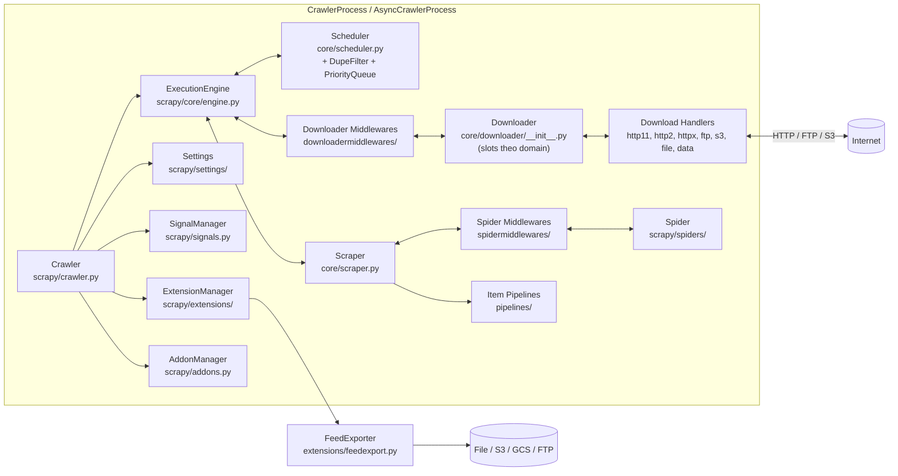
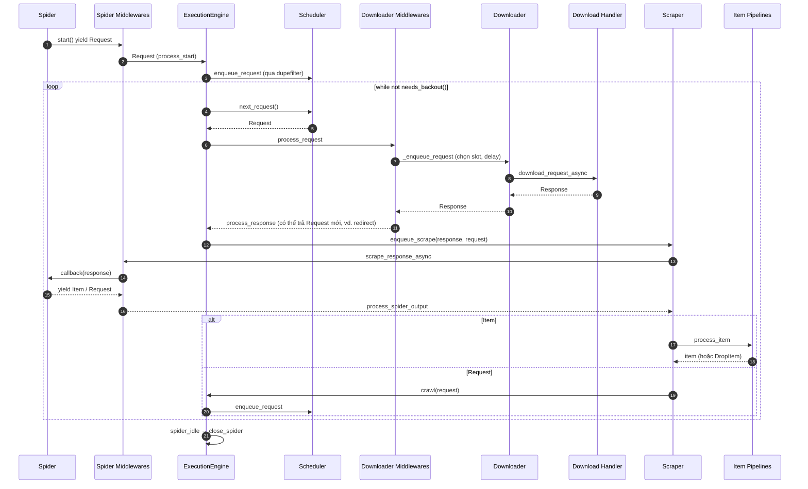

# Scrapy — Tài liệu thiết kế giải pháp

> **Fork:** [mrchinh189/scrapy](https://github.com/mrchinh189/scrapy) · **Upstream:** [scrapy/scrapy](https://github.com/scrapy/scrapy)
> **Nhóm:** Web scraping
> **Ngôn ngữ chính:** Python (>=3.10, CPython và PyPy) · **License:** BSD-3-Clause · **Commit đã phân tích:** `e746475`

## 1. Tóm tắt

Scrapy (phiên bản `2.16.0` theo `scrapy/VERSION`) là framework web crawling/scraping bậc cao viết bằng Python, được Zyte (trước đây là Scrapinghub) và cộng đồng duy trì. Nó cung cấp một **engine bất đồng bộ** (nền tảng Twisted, chạy trên asyncio reactor mặc định, và gần đây có chế độ không dùng reactor với httpx) điều phối Scheduler, Downloader, Spider và Item Pipeline, cho phép crawl hàng nghìn trang song song với kiểm soát concurrency theo domain. Điểm khác biệt cốt lõi là **kiến trúc component + middleware + signal** cực kỳ dễ mở rộng: hầu hết hành vi (retry, redirect, cookie, robots.txt, cache, throttle, export) đều là component cấu hình được qua settings.

## 2. Bài toán & yêu cầu

- **Bài toán:** Thu thập dữ liệu có cấu trúc từ nhiều website ở quy mô lớn, đòi hỏi quản lý hàng đợi URL, loại trùng, tôn trọng giới hạn tốc độ, retry khi lỗi mạng, xử lý cookie/redirect/nén, và xuất dữ liệu ra nhiều định dạng/kho lưu trữ.
- **Yêu cầu chức năng chính:**
  - Định nghĩa spider sinh `Request` và trích xuất item từ `Response` (selector CSS/XPath qua `parsel`).
  - Lập lịch và loại trùng request (`Scheduler`, `RFPDupeFilter`), ưu tiên theo `priority`, crawl theo chiều sâu/rộng.
  - Tải nội dung qua nhiều scheme: `http/https` (HTTP/1.1, HTTP/2, httpx), `ftp`, `s3`, `file`, `data`.
  - Xử lý item qua pipeline; xuất feed (`json`, `jsonlines`, `csv`, `xml`, `marshal`, `pickle`) tới file/FTP/S3/GCS...
  - CLI đầy đủ: `startproject`, `genspider`, `crawl`, `runspider`, `shell`, `fetch`, `view`, `parse`, `check`, `list`, `bench`...
  - Tạm dừng/tiếp tục crawl (`JOBDIR`, disk queue).
- **Yêu cầu phi chức năng:**
  - Hiệu năng: I/O không chặn, `CONCURRENT_REQUESTS=16`, `CONCURRENT_REQUESTS_PER_DOMAIN=8` mặc định; backpressure giữa downloader và scraper (`needs_backout`).
  - Lịch sự (politeness): `DOWNLOAD_DELAY`, `RANDOMIZE_DOWNLOAD_DELAY`, AutoThrottle, `ROBOTSTXT_OBEY`.
  - Độ tin cậy: `RetryMiddleware`, `DOWNLOAD_TIMEOUT=180`, giới hạn kích thước (`DOWNLOAD_MAXSIZE`, `DOWNLOAD_WARNSIZE`), `CloseSpider`.
  - Quan sát: stats collector, log stats định kỳ, telnet console, memory usage.
  - Typing nghiêm ngặt (`mypy strict`), đa nền tảng (CI trên Ubuntu/macOS/Windows), hỗ trợ PyPy.
- **Ngoài phạm vi:** Không render JavaScript (cần plugin bên ngoài, xem `docs/topics/dynamic-content.rst`); không có crawl phân tán sẵn (scheduler mặc định chỉ trong một process); không có UI quản lý job (dùng Scrapyd/Zyte Scrapy Cloud, xem `docs/topics/deploy.rst`, `docs/topics/scrapyd.rst`).

## 3. Kiến trúc tổng thể



Giải thích:

- **Crawler** gắn một spider với settings, signals, stats, extensions, addons và tạo **ExecutionEngine**. `CrawlerProcess`/`AsyncCrawlerProcess` quản lý vòng đời reactor/event loop và có thể chạy nhiều crawler.
- **Engine** là trung tâm điều phối luồng dữ liệu (đúng như `docs/topics/architecture.rst` mô tả 9 bước): lấy request từ spider → scheduler → downloader (qua downloader middlewares) → scraper (qua spider middlewares) → spider callback → item pipelines / request mới.
- **Signals** (`engine_started`, `request_scheduled`, `response_received`, `item_scraped`, `spider_idle`...) cho phép extension quan sát và can thiệp mà không sửa core.

## 4. Thành phần chính

| Thành phần | Vị trí trong mã nguồn | Trách nhiệm |
|---|---|---|
| CLI | `scrapy/cmdline.py`, `scrapy/commands/*.py` | Entry point `scrapy` (khai báo trong `[project.scripts]`), dispatch tới các command |
| `Crawler`, `CrawlerRunner`, `CrawlerProcess`, `AsyncCrawlerRunner`, `AsyncCrawlerProcess` | `scrapy/crawler.py` | Áp settings, cài reactor (hoặc chạy reactorless), tạo spider + engine, xử lý tín hiệu shutdown |
| `ExecutionEngine` | `scrapy/core/engine.py` | Vòng lặp điều phối, backpressure (`needs_backout`), phát hiện idle, mở/đóng spider |
| `Scheduler` | `scrapy/core/scheduler.py` | Hàng đợi request: memory queue + disk queue (khi có `JOBDIR`), lọc trùng qua dupefilter |
| `RFPDupeFilter` | `scrapy/dupefilters.py` | Loại trùng dựa trên request fingerprint (`scrapy/utils/request.py` → `RequestFingerprinter`) |
| `DownloaderAwarePriorityQueue`, `ScrapyPriorityQueue` | `scrapy/pqueues.py` | Ưu tiên request; phiên bản "downloader aware" chọn slot ít bận nhất |
| `Downloader` | `scrapy/core/downloader/__init__.py` | Quản lý `Slot` theo hostname (hoặc IP), concurrency/delay mỗi slot, gọi download handler |
| `DownloadHandlers` | `scrapy/core/downloader/handlers/` | Ánh xạ scheme → handler: `HTTP11DownloadHandler`, `H2DownloadHandler`, `HttpxDownloadHandler`, `FTPDownloadHandler`, `S3DownloadHandler`, `FileDownloadHandler`, `DataURIDownloadHandler` |
| `DownloaderMiddlewareManager` | `scrapy/core/downloader/middleware.py` | Chuỗi `process_request`/`process_response`/`process_exception` |
| Downloader middlewares | `scrapy/downloadermiddlewares/` | Offsite, RobotsTxt, HttpAuth, DownloadTimeout, DefaultHeaders, UserAgent, Retry, MetaRefresh, HttpCompression, Redirect, Cookies, HttpProxy, Stats, HttpCache |
| `Scraper` | `scrapy/core/scraper.py` | Nhận response/failure, gọi spider callback/errback qua spider middlewares, đẩy item vào pipeline, giới hạn bộ nhớ đang xử lý (`Slot.max_active_size`) |
| `SpiderMiddlewareManager` | `scrapy/core/spidermw.py` | Chuỗi `process_spider_input/output/exception`, `process_start` |
| Spider middlewares | `scrapy/spidermiddlewares/` | Start, HttpError, Referer, UrlLength, Depth |
| Spiders | `scrapy/spiders/__init__.py`, `crawl.py`, `sitemap.py`, `feed.py` | `Spider` (với `async def start()`), `CrawlSpider` + `Rule`, `SitemapSpider`, `XMLFeedSpider`/`CSVFeedSpider` |
| `ItemPipelineManager` | `scrapy/pipelines/__init__.py`, `files.py`, `images.py`, `media.py` | Chuỗi `process_item`; pipeline tải file/ảnh có sẵn |
| Extensions | `scrapy/extensions/` | CoreStats, LogStats, TelnetConsole, MemoryUsage, CloseSpider, FeedExporter, SpiderState, AutoThrottle, HttpCache storage, StatsMailer, PeriodicLog |
| HTTP model | `scrapy/http/request/`, `scrapy/http/response/` | `Request`, `JsonRequest`, `FormRequest` (đã deprecated ở 2.16), `XmlRpcRequest`; `TextResponse`, `HtmlResponse`, `XmlResponse`, `JsonResponse` |
| Selectors / Loaders / LinkExtractors | `scrapy/selector/`, `scrapy/loader/`, `scrapy/linkextractors/` | Wrapper quanh `parsel`, `itemloaders`, trích link bằng `lxml` |
| Exporters | `scrapy/exporters.py` | `JsonItemExporter`, `JsonLinesItemExporter`, `CsvItemExporter`, `XmlItemExporter`, ... |
| Contracts | `scrapy/contracts/` | Kiểm thử spider bằng docstring (`scrapy check`) |
| Settings | `scrapy/settings/__init__.py`, `default_settings.py` | Settings có priority (default/command/addon/project/spider/cmdline), freeze sau khi crawler khởi tạo |

### 4.1 ExecutionEngine

- Khi `start_async()`, engine phát `engine_started`, rồi chạy `_start_request_processing()`: lặp `anext(self._start)` lấy item/request từ `Spider.start()` (async generator). Request → `crawl()`; item → `scraper.start_itemproc_async()` trực tiếp.
- `_start_scheduled_requests()` được gọi qua `CallLaterOnce` (`slot.nextcall`) và heartbeat 5 giây: trong khi `needs_backout()` là `False`, lấy `scheduler.next_request()` và gọi `_download()`.
- `needs_backout()` = engine không chạy, slot đang đóng, `downloader.needs_backout()` (số request active >= `CONCURRENT_REQUESTS`) hoặc `scraper.slot.needs_backout()` (tổng kích thước response đang xử lý > `max_active_size`). Đây là cơ chế backpressure hai chiều.
- `_handle_downloader_output()`: nếu downloader middleware trả về `Request` (vd. redirect) thì lập lịch lại; nếu `Response`/`Failure` thì `scraper.enqueue_scrape()`.
- `spider_is_idle()` kiểm tra scraper rảnh, downloader không active, start iterator đã hết, scheduler không còn request → phát `spider_idle`; extension có thể nạp thêm request để giữ spider sống.

### 4.2 Downloader và slot

- Mỗi request được gán **slot key** = `request.meta["download_slot"]` hoặc hostname (hoặc IP nếu `CONCURRENT_REQUESTS_PER_IP`). Mỗi `Slot` có `concurrency`, `delay`, `randomize_delay` riêng, có thể cấu hình qua `DOWNLOAD_SLOTS`.
- `_process_queue()` áp `download_delay` (dùng `call_later` để trì hoãn) và chỉ chuyển request sang trạng thái transferring khi còn `free_transfer_slots()`.
- Slot không dùng sẽ được thu gom định kỳ (`_SLOT_GC_INTERVAL = 60s`).

### 4.3 Reactor và chế độ reactorless

- Mặc định `TWISTED_REACTOR_ENABLED = True`, `TWISTED_REACTOR = "twisted.internet.asyncioreactor.AsyncioSelectorReactor"` → code người dùng có thể dùng `async def` và thư viện asyncio.
- Khi `TWISTED_REACTOR_ENABLED = False`, `Crawler._apply_reactorless_default_settings()` tắt telnet console, chuyển handler `http/https` sang `scrapy.core.downloader.handlers._httpx.HttpxDownloadHandler` và vô hiệu `ftp`. `tox.ini` có môi trường `no-reactor` để test chế độ này.

## 5. Luồng xử lý chính

### 5.1 Vòng đời một request



Các signal được phát dọc đường: `request_scheduled` (một handler có thể raise `IgnoreRequest` để bỏ request), `request_dropped` (dupefilter từ chối), `request_reached_downloader`, `response_downloaded`, `request_left_downloader`, `response_received`, và `item_scraped`/`item_dropped`/`item_error` sau pipeline.

### 5.2 Khởi động bằng CLI

1. `scrapy crawl myspider` → `scrapy.cmdline:execute` nạp project settings (`scrapy.cfg`, `settings.py`), chọn command trong `scrapy/commands/crawl.py`.
2. Command tạo `CrawlerProcess`/`AsyncCrawlerProcess`, gọi `crawl(spidername)` → `SpiderLoader` (`scrapy/spiderloader.py`) tìm class trong `SPIDER_MODULES`.
3. `Crawler._apply_settings()` nạp addons, stats, log formatter, request fingerprinter, cài reactor (hoặc reactorless), tạo `ExtensionManager`, rồi **freeze** settings.
4. Engine `open_spider_async()` mở scheduler, scraper (pipelines), rồi `start_async()`.
5. Khi spider idle và không có ai giữ lại, `close_spider_async(reason="finished")` đóng downloader, scraper, scheduler, dump stats.

## 6. Mô hình dữ liệu & giao diện

**Request/Response** (`scrapy/http/`):

```python
Request(url, callback=None, method="GET", headers=None, body=None,
        cookies=None, meta=None, encoding="utf-8", priority=0,
        dont_filter=False, errback=None, flags=None, cb_kwargs=None)
```

`meta` là kênh giao tiếp giữa các component (`download_slot`, `proxy`, `dont_retry`, `handle_httpstatus_list`, `depth`...). `Response` có `url`, `status`, `headers`, `body`, `request`, và các subclass `TextResponse`/`HtmlResponse` hỗ trợ `.css()`, `.xpath()`, `.follow()`.

**Item:** dict, `scrapy.Item` (`scrapy/item.py`), dataclass hoặc attrs — truy cập thống nhất qua `itemadapter`.

**Spider API** (`scrapy/spiders/__init__.py`):

```python
class QuotesSpider(scrapy.Spider):
    name = "quotes"
    start_urls = ["https://quotes.toscrape.com"]
    custom_settings = {"DOWNLOAD_DELAY": 1}

    async def start(self):          # từ 2.13, thay vai trò start_requests()
        for url in self.start_urls:
            yield scrapy.Request(url)

    def parse(self, response):
        for q in response.css("div.quote"):
            yield {"text": q.css("span.text::text").get()}
        yield from response.follow_all(css="li.next a", callback=self.parse)
```

**Giao diện component:** mọi component (middleware, pipeline, extension, addon, download handler) được khởi tạo qua `from_crawler(cls, crawler)` và cấu hình bằng dict `{import_path: order}`:

- Downloader middleware: `process_request(request)`, `process_response(request, response)`, `process_exception(request, exception)`.
- Spider middleware: `process_spider_input`, `process_spider_output(_async)`, `process_spider_exception`, `process_start`.
- Pipeline: `open_spider`, `process_item(item)`, `close_spider`.
- Scheduler: `BaseScheduler` (`has_pending_requests`, `enqueue_request`, `next_request`, `open`, `close`).

**Settings quan trọng** (`scrapy/settings/default_settings.py`): `CONCURRENT_REQUESTS`, `CONCURRENT_REQUESTS_PER_DOMAIN`, `DOWNLOAD_DELAY`, `DOWNLOAD_TIMEOUT`, `DOWNLOAD_HANDLERS(_BASE)`, `DOWNLOADER_MIDDLEWARES(_BASE)`, `SPIDER_MIDDLEWARES(_BASE)`, `ITEM_PIPELINES`, `EXTENSIONS(_BASE)`, `FEEDS`, `SCHEDULER*`, `DUPEFILTER_CLASS`, `JOBDIR`, `ROBOTSTXT_OBEY`, `AUTOTHROTTLE_*`, `HTTPCACHE_*`, `TWISTED_REACTOR(_ENABLED)`, `ADDONS`.

**File cấu hình project:** `scrapy.cfg` + package sinh từ `scrapy/templates/project/module` (settings, items, middlewares, pipelines); template spider: `basic`, `crawl`, `csvfeed`, `xmlfeed` (`scrapy/templates/spiders/`).

## 7. Tech stack

| Lớp | Công nghệ | Vai trò |
|---|---|---|
| Ngôn ngữ | Python >=3.10 (3.10–3.14), CPython & PyPy | Nền tảng |
| Async/network | Twisted >=21.7 (asyncio reactor), tuỳ chọn `httpx` (reactorless), `h2` cho HTTP/2 | I/O không chặn, HTTP client |
| TLS | `pyOpenSSL`, `cryptography`, `service_identity` | HTTPS, kiểm tra chứng chỉ |
| Parsing | `lxml`, `parsel`, `cssselect`, `defusedxml` | Selector CSS/XPath, XML an toàn |
| URL/Robots | `w3lib`, `tldextract`, `protego` | Chuẩn hoá URL, domain, parse robots.txt |
| Item | `itemadapter`, `itemloaders` | Trừu tượng hoá item, loader |
| Queue | `queuelib` | Memory/disk queue cho scheduler |
| Event | `PyDispatcher`/`PyPyDispatcher`, `zope.interface` | Signal, interface |
| Build/QA | `hatchling`, `tox`, `pytest`, `mypy` (strict), `pre-commit`, `pylint`, codecov | Đóng gói, kiểm thử |
| Docs | Sphinx (`docs/`, `.readthedocs.yml`) | Tài liệu tại docs.scrapy.org |

## 8. Quyết định thiết kế & đánh đổi

| Quyết định | Lý do | Đánh đổi |
|---|---|---|
| Xây trên Twisted (event-driven) | I/O không chặn hiệu năng cao từ trước khi asyncio phổ biến | Đường cong học tập Deferred; mã nội bộ còn nhiều lớp tương thích Deferred ↔ coroutine |
| Mặc định `AsyncioSelectorReactor` | Cho phép `async def` và thư viện asyncio trong spider/middleware | Phải cài reactor trước khi import `twisted.internet.reactor`; ràng buộc khi nhúng vào app khác |
| Chế độ reactorless + `HttpxDownloadHandler` | Giảm phụ thuộc Twisted, chạy thuần asyncio | Một số tính năng tắt (telnet, ftp); đang trong quá trình hoàn thiện |
| Mọi thứ là component cấu hình bằng `{path: order}` | Mở rộng/thay thế mà không fork core; thứ tự rõ ràng | Thứ tự số dễ nhầm; lỗi cấu hình chỉ phát hiện lúc runtime |
| Signals cho cross-cutting concerns | Tách biệt core với extension (stats, feed export, closespider) | Luồng điều khiển khó lần theo |
| Slot theo domain/IP | Lịch sự với từng site, cô lập độ trễ | Crawl ít domain thì concurrency bị giới hạn bởi `CONCURRENT_REQUESTS_PER_DOMAIN` |
| Backpressure theo cả số request và kích thước response | Tránh tràn bộ nhớ khi spider xử lý chậm | Có thể làm chậm throughput nếu ngưỡng nhỏ |
| Scheduler LIFO + `DownloaderAwarePriorityQueue` mặc định | DFS-ish giảm bộ nhớ, phân tải đều giữa domain | Muốn BFS phải đổi `DEPTH_PRIORITY` và queue FIFO |
| Settings có priority và bị freeze | Kết quả cấu hình xác định, tránh sửa giữa chừng | Không đổi settings động sau khi crawler khởi tạo |
| Không tích hợp headless browser | Giữ core nhẹ, nhanh | Trang nặng JS cần plugin/handler ngoài |

## 9. Triển khai & vận hành

- **Cài đặt:** `pip install scrapy` (README) hoặc conda-forge; yêu cầu Python 3.10+. Repo không có Dockerfile.
- **Tạo & chạy project:** `scrapy startproject <name>` → `scrapy genspider <name> <domain>` → `scrapy crawl <name> -O items.json`. Chạy file đơn: `scrapy runspider spider.py`. Nhúng trong code: `CrawlerProcess`/`AsyncCrawlerProcess` hoặc `CrawlerRunner`/`AsyncCrawlerRunner` khi đã có event loop.
- **Triển khai:** theo `docs/topics/deploy.rst` — Scrapyd (`docs/topics/scrapyd.rst`) hoặc Zyte Scrapy Cloud.
- **Tạm dừng/tiếp tục:** `-s JOBDIR=crawls/job1` — scheduler ghi disk queue (`PickleLifoDiskQueue`), `SpiderState` lưu state của spider.
- **Quan sát:** stats (`MemoryStatsCollector`, dump khi đóng spider), `LogStats` định kỳ, `PeriodicLog`, `TelnetConsole` (127.0.0.1, chỉ khi dùng reactor), `MemoryUsage`, `StatsMailer`.
- **Tuning broad crawl:** `docs/topics/broad-crawls.rst` (tăng concurrency, tắt cookies/retry, BFS order...), AutoThrottle (`docs/topics/autothrottle.rst`), benchmark với `scrapy bench`.
- **CI:** `.github/workflows/tests-ubuntu.yml`, `tests-macos.yml`, `tests-windows.yml`, `checks.yml`, `publish.yml`; ma trận tox gồm `default-reactor`, `no-reactor`, `min` deps, `pypy3`.
- **Giới hạn đã biết:** không render JS; một process đơn (scale ngang cần chia job hoặc scheduler phân tán bên ngoài); API đang chuyển dần sang coroutine: `async def start()` (từ 2.13) thay vai trò của `start_requests()` (chỉ còn giữ để tương thích phiên bản cũ), các method Deferred như `engine.download()`/`engine.start()` đã deprecated để dùng `download_async()`/`start_async()`, và `FormRequest` bị deprecated ở 2.16.

## 10. Điểm mở rộng

- **Downloader middleware:** thêm vào `DOWNLOADER_MIDDLEWARES = {"myproj.mw.ProxyRotator": 610}` (đặt `None` để tắt middleware mặc định).
- **Spider middleware:** `SPIDER_MIDDLEWARES`.
- **Item pipeline:** `ITEM_PIPELINES = {"myproj.pipelines.PostgresPipeline": 300}`; tận dụng `FilesPipeline`/`ImagesPipeline` (`scrapy/pipelines/files.py`, `images.py`).
- **Extension:** class có `from_crawler` kết nối signal; khai báo trong `EXTENSIONS`.
- **Download handler:** thêm scheme mới hoặc thay `http/https` qua `DOWNLOAD_HANDLERS` (cách các plugin headless browser tích hợp; xem `docs/topics/download-handlers.rst`). Kế thừa `BaseDownloadHandler`/`BaseHttpDownloadHandler`.
- **Scheduler / priority queue / dupefilter:** đổi qua `SCHEDULER`, `SCHEDULER_PRIORITY_QUEUE`, `DUPEFILTER_CLASS` — điểm cắm cho crawl phân tán (vd. queue dùng Redis).
- **Feed:** `FEED_EXPORTERS`, `FEED_STORAGES`, hậu xử lý (`scrapy/extensions/postprocessing.py`, vd. nén gzip).
- **Add-on:** `ADDONS` — đóng gói nhiều thay đổi settings thành một add-on (`scrapy/addons.py`, `docs/topics/addons.rst`).
- **Command:** thêm command qua `COMMANDS_MODULE` hoặc entry point.
- **Contracts:** `SPIDER_CONTRACTS` cho `scrapy check`.
- **Thay đổi lớn của dự án** được thảo luận qua Scrapy Enhancement Proposals trong `sep/`.

## 11. Bài học & cách áp dụng

- **Engine + pipeline component có thứ tự số** là pattern kinh điển để xây framework mở rộng được (tương tự WSGI middleware). Có thể áp dụng cho bất kỳ hệ thống xử lý request/response nào (API gateway, ETL).
- **Backpressure hai phía** (số request đang tải + byte đang xử lý) — bài học quan trọng cho mọi producer/consumer bất đồng bộ để tránh OOM.
- **Slot theo key với concurrency/delay riêng** là cách đơn giản và hiệu quả để rate-limit theo tenant/domain.
- **`from_crawler` làm dependency injection** giúp mọi component truy cập settings/stats/signals mà không có global state.
- **Settings phân tầng có priority rồi freeze** — mô hình cấu hình rõ ràng, nên học cho hệ thống nhiều nguồn cấu hình.
- **Signals cho quan sát và cross-cutting** (stats, export) giữ core gọn.
- **Chiến lược chuyển đổi dần** từ Deferred sang coroutine (giữ API cũ kèm `ScrapyDeprecationWarning`, thêm `*_async`) là ví dụ tốt về tiến hoá API mà không phá vỡ người dùng.
- Khi áp dụng: dùng Scrapy cho lớp crawl/điều phối, cắm thêm LLM (như ScrapeGraphAI) trong pipeline hoặc callback chỉ cho các trang cần trích xuất ngữ nghĩa.

## 12. Tham khảo

- README: `README.rst`; cài đặt: `INSTALL.md`; changelog: `docs/news.rst`, `NEWS`
- Kiến trúc: `docs/topics/architecture.rst`
- Components & settings: `docs/topics/components.rst`, `docs/topics/settings.rst`, `scrapy/settings/default_settings.py`
- Core: `scrapy/crawler.py`, `scrapy/core/engine.py`, `scrapy/core/scheduler.py`, `scrapy/core/scraper.py`, `scrapy/core/downloader/__init__.py`, `scrapy/core/downloader/handlers/`
- Middleware: `scrapy/downloadermiddlewares/`, `scrapy/spidermiddlewares/`, `scrapy/middleware.py`
- Async & reactor: `docs/topics/asyncio.rst`, `docs/topics/coroutines.rst`, `docs/topics/download-handlers.rst`
- Triển khai: `docs/topics/deploy.rst`, `docs/topics/scrapyd.rst`, `docs/topics/jobs.rst`, `docs/topics/broad-crawls.rst`
- Manifest: `pyproject.toml`, `tox.ini`
- Docs chính thức: https://docs.scrapy.org/
