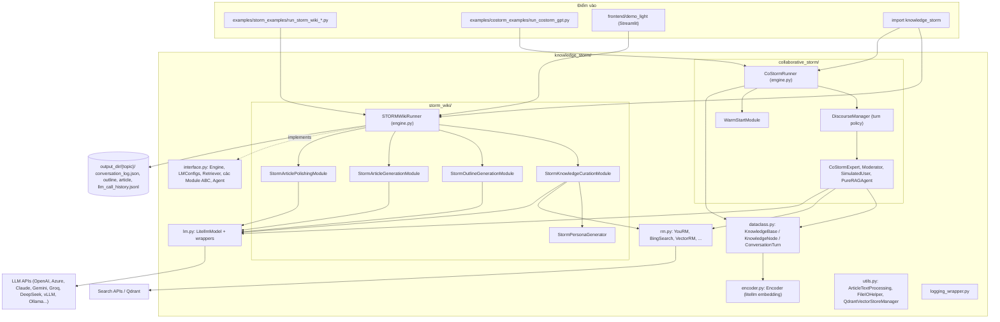
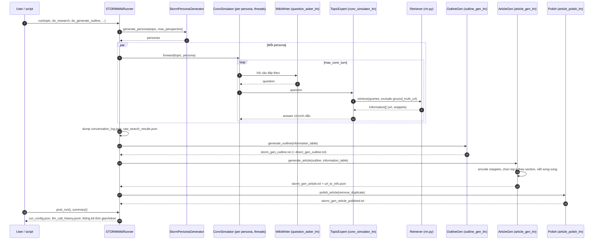

# STORM — Tài liệu thiết kế giải pháp

> **Fork:** [mrchinh189/storm](https://github.com/mrchinh189/storm) · **Upstream:** [stanford-oval/storm](https://github.com/stanford-oval/storm)
> **Nhóm:** AI Agent / Deep research
> **Ngôn ngữ chính:** Python · **License:** MIT · **Commit đã phân tích:** `fb951af`

## 1. Tóm tắt

STORM (*Synthesis of Topic Outlines through Retrieval and Multi-perspective Question Asking*) là thư viện Python `knowledge-storm` của Stanford OVAL, tự động viết bài dài kiểu Wikipedia có trích dẫn từ kết quả tìm kiếm Internet hoặc corpus riêng. Thay vì prompt trực tiếp, STORM mô phỏng nhiều cuộc hội thoại giữa "người viết Wikipedia" mang các **persona** khác nhau và một "chuyên gia" có grounding bằng search, rồi dùng dữ liệu thu được để dựng outline → viết từng section → polish. Bản mở rộng **Co-STORM** (EMNLP 2024) biến quy trình thành một bàn tròn đa agent (experts, moderator, người dùng thật) xoay quanh một **mind map** (`KnowledgeBase`) cập nhật liên tục. Toàn bộ pipeline được viết bằng **DSPy** với các module/Signature tách rời, dễ thay LM và retriever.

## 2. Bài toán & yêu cầu

- **Bài toán:** Giai đoạn "pre-writing" (nghiên cứu, thu thập nguồn, lập dàn ý) cho bài viết dài là tốn công nhất. Hỏi LLM trực tiếp cho ra câu hỏi nông và thiếu góc nhìn; STORM tự động hóa việc *đặt câu hỏi tốt* từ nhiều góc nhìn và gắn nguồn cho mọi câu.
- **Yêu cầu chức năng chính:**
  - Nhận một `topic`, tạo bài viết có cấu trúc phân cấp (`#`, `##`) và trích dẫn `[n]` tới URL.
  - 4 giai đoạn có thể bật/tắt độc lập và tiếp tục từ file trung gian: research, outline, article, polish.
  - Hỗ trợ nhiều LM (qua `litellm` và các wrapper DSPy) và nhiều retriever: `YouRM`, `BingSearch`, `VectorRM`, `SerperRM`, `BraveRM`, `SearXNG`, `DuckDuckGoSearchRM`, `TavilySearchRM`, `GoogleSearch`, `AzureAISearch`, `StanfordOvalArxivRM`.
  - Co-STORM: warm start, từng lượt hội thoại `step()`, người dùng chen câu hỏi, sinh báo cáo từ mind map.
  - Grounding vào tài liệu riêng (CSV → Qdrant qua `VectorRM`).
- **Yêu cầu phi chức năng:**
  - Chi phí/chất lượng cân bằng: mỗi giai đoạn dùng một LM riêng (model rẻ cho mô phỏng hội thoại, model mạnh cho viết bài).
  - Song song hóa bằng `ThreadPoolExecutor` (`max_thread_num`) cho hội thoại theo persona, truy vấn search và viết section.
  - Theo dõi token usage và số lượt query theo từng LM/RM; cache LLM trên đĩa (`~/.storm_local_cache`).
  - Tái lập thí nghiệm: log đầy đủ hội thoại, kết quả search, lịch sử gọi LLM.
- **Ngoài phạm vi:** Không phải dịch vụ server/API production (chỉ có demo Streamlit), không có agent dùng tool tổng quát, không sinh bài "sẵn sàng xuất bản" (README nói bài viết vẫn cần chỉnh sửa nhiều).

## 3. Kiến trúc tổng thể

Giải thích:
- **`interface.py`** định nghĩa khung trừu tượng: `Engine` (chạy pipeline, decorator đo thời gian + usage), `LMConfigs`, `Retriever`, `KnowledgeCurationModule`, `OutlineGenerationModule`, `ArticleGenerationModule`, `ArticlePolishingModule`, `Agent`, cùng data class `Information`, `Article`, `ArticleSectionNode`.
- **`storm_wiki/`** là hiện thực STORM gốc; **`collaborative_storm/`** là Co-STORM. Hai engine dùng chung `lm.py`, `rm.py`, `utils.py`, `interface.py`.
- Mọi bước suy luận đều là `dspy.Module`/`dspy.Signature`; LM được gắn cục bộ bằng `dspy.settings.context(lm=...)` nên mỗi module có thể dùng model khác nhau.

## 4. Thành phần chính

| Thành phần | Vị trí trong mã nguồn | Trách nhiệm |
|---|---|---|
| Interface/ABC | `knowledge_storm/interface.py` | Hợp đồng cho Engine, module 4 giai đoạn, Retriever, Agent; data class `Information`, `Article` |
| STORM runner | `knowledge_storm/storm_wiki/engine.py` (`STORMWikiRunner`, `STORMWikiRunnerArguments`, `STORMWikiLMConfigs`) | Lắp ráp pipeline, đọc/ghi file trung gian, `post_run()` dump config + lịch sử LLM |
| Persona generator | `storm_wiki/modules/persona_generator.py` | Tìm các trang Wikipedia liên quan, đọc mục lục, sinh danh sách editor persona |
| Knowledge curation | `storm_wiki/modules/knowledge_curation.py` (`ConvSimulator`, `WikiWriter`, `TopicExpert`) | Mô phỏng hội thoại writer ↔ expert cho từng persona, song song |
| Outline | `storm_wiki/modules/outline_generation.py` (`WriteOutline`) | Dàn ý nháp từ kiến thức nội tại của LM rồi tinh chỉnh bằng hội thoại |
| Article generation | `storm_wiki/modules/article_generation.py` (`ConvToSection`, `WriteSection`) | Viết từng section cấp 1 song song, dùng snippet truy hồi theo ngữ nghĩa |
| Polish | `storm_wiki/modules/article_polish.py` (`WriteLeadSection`, `PolishPage`) | Viết lead section, tùy chọn loại trùng lặp |
| STORM data | `storm_wiki/modules/storm_dataclass.py` (`DialogueTurn`, `StormInformationTable`, `StormArticle`) | Bảng thông tin URL→snippet, cây bài viết, đánh lại chỉ số trích dẫn |
| Lọc nguồn | `storm_wiki/modules/retriever.py` (`is_valid_wikipedia_source`) | Loại domain không đáng tin theo danh sách nguồn của Wikipedia |
| Co-STORM runner | `collaborative_storm/engine.py` (`CoStormRunner`, `RunnerArgument`, `CollaborativeStormLMConfigs`) | `warm_start()`, `step()`, `generate_report()`, `to_dict/from_dict` |
| Discourse manager | `collaborative_storm/engine.py` (`DiscourseManager`, `TurnPolicySpec`) | Chính sách chọn người nói lượt kế tiếp |
| Co-STORM agents | `collaborative_storm/modules/co_storm_agents.py` | `CoStormExpert`, `Moderator`, `SimulatedUser`, `PureRAGAgent` |
| Mind map | `knowledge_storm/dataclass.py` (`KnowledgeBase`, `KnowledgeNode`, `ConversationTurn`) | Cây khái niệm chứa `Information`, chèn/tái tổ chức/sinh báo cáo |
| Chèn thông tin | `collaborative_storm/modules/information_insertion_module.py` (`InsertInformationModule`, `ExpandNodeModule`) | Đặt thông tin mới vào node phù hợp, tách node khi quá nhiều |
| Warm start | `collaborative_storm/modules/warmstart_hierarchical_chat.py` | "mini-STORM" khởi tạo mind map và hội thoại tóm tắt cho người dùng |
| LM wrappers | `knowledge_storm/lm.py` | `LitellmModel` (chính), `OpenAIModel`, `AzureOpenAIModel`, `ClaudeModel`, `GoogleModel`, `GroqModel`, `DeepSeekModel`, `VLLMClient`, `OllamaClient`, `TGIClient`, `TogetherClient` |
| Retrievers | `knowledge_storm/rm.py` | Các lớp `dspy.Retrieve` cho search engine / vector DB |
| Encoder | `knowledge_storm/encoder.py` | Embedding qua litellm (`ENCODER_API_TYPE`), cache và đếm token |
| Tiện ích | `knowledge_storm/utils.py` | Xử lý văn bản trích dẫn, IO, `QdrantVectorStoreManager`, `WebPageHelper` |
| Demo UI | `frontend/demo_light/storm.py`, `demo_util.py`, `pages_util/` | Streamlit: tạo bài mới, xem tiến trình realtime, "My Articles" |

### 4.1 Knowledge curation (trái tim của STORM)
`StormKnowledgeCurationModule.research()` lấy persona từ `StormPersonaGenerator` (có thêm persona mặc định "basic fact writer"), sau đó chạy `ConvSimulator` cho mỗi persona trong thread pool. Mỗi lượt:
1. `WikiWriter` (LM `question_asker_lm`) sinh câu hỏi dựa trên persona và 4 lượt hội thoại gần nhất (các lượt cũ hơn bị lược bớt câu trả lời để tiết kiệm token); nói "Thank you so much for your help!" để kết thúc.
2. `TopicExpert` (LM `conv_simulator_lm`) tách câu hỏi thành tối đa `max_search_queries_per_turn` truy vấn (`QuestionToQuery`), gọi `Retriever.retrieve()` (loại trừ `ground_truth_url`), ghép snippet top-1 của mỗi kết quả, rồi trả lời bằng `AnswerQuestion` với trích dẫn; không có kết quả thì từ chối trả lời thay vì bịa.
3. Lặp tối đa `max_conv_turn` lượt. Kết quả là danh sách `(persona, [DialogueTurn])` → `StormInformationTable`.

### 4.2 Article generation có truy hồi ngữ nghĩa
`StormInformationTable.prepare_table_for_retrieval()` encode mọi snippet bằng `SentenceTransformer("paraphrase-MiniLM-L6-v2")`. Với mỗi section cấp 1 (bỏ qua "introduction", "conclusion", "summary"), các heading con trong outline dùng làm query; cosine similarity chọn `retrieve_top_k` snippet; `ConvToSection` viết section có trích dẫn. Các section chạy song song, sau đó `StormArticle.update_section()` gộp và `post_processing()` đánh lại chỉ số tham chiếu toàn bài.

### 4.3 Co-STORM: turn policy
`DiscourseManager.get_next_turn_policy()` quyết định agent lượt sau theo thứ tự ưu tiên: SimulatedUser (khi thí nghiệm tự động) → PureRAGAgent (chế độ baseline) → Moderator nếu bị override sau warm start → Moderator nếu đã có ≥ N lượt liên tiếp không phải câu hỏi (`moderator_override_N_consecutive_answering_turn`, kèm reorganize mind map) → còn lại là expert xoay vòng (hoặc General Knowledge Provider), với cờ cập nhật danh sách expert khi lượt trước là câu hỏi và cờ polish utterance.

## 5. Luồng xử lý chính

### 5.1 STORM: từ topic đến bài viết

### 5.2 Co-STORM: một lượt `step()`
1. Nếu người dùng truyền `user_utterance` → thêm `ConversationTurn(role="Guest", utterance_type="Original Question")` và trả về.
2. Ngược lại: `DiscourseManager.get_next_turn_policy()` → `turn_policy.agent.generate_utterance(knowledge_base, conversation_history)`.
3. Nếu `should_update_experts_list` → `GenerateExpertModule` sinh lại các expert theo trọng tâm mới.
4. `KnowledgeBase.update_from_conv_turn()` chèn `cited_info` vào mind map (qua `InsertInformationModule`) và ánh xạ lại chỉ số trích dẫn sang `citation_uuid` toàn cục.
5. Nếu `should_reorganize_knowledge_base` → `KnowledgeBase.reorganize()`: trim lá rỗng, gộp node một con, `ExpandNodeModule` tách node có nhiều thông tin (theo `node_expansion_trigger_count`).
6. Cuối phiên: `knowledge_base.reorganize()` rồi `generate_report()` → `to_report()` viết báo cáo theo cấu trúc node.

## 6. Mô hình dữ liệu & giao diện

- **`Information`** (`interface.py`): `url`, `description`, `snippets[]`, `title`, `meta` (ví dụ `query`), `citation_uuid`; có `from_dict/to_dict`, hash theo url + snippets.
- **`DialogueTurn`** (`storm_dataclass.py`): `agent_utterance`, `user_utterance`, `search_queries`, `search_results`.
- **`StormInformationTable`**: `conversations`, `url_to_info`; dựng lại từ `conversation_log.json` bằng `from_conversation_log_file()`.
- **`StormArticle`**: cây `ArticleSectionNode` + `reference` (url→Information, url→index); đọc/ghi outline dạng Markdown `#`.
- **`ConversationTurn`** (`dataclass.py`): `role`, `raw_utterance`, `utterance`, `utterance_type` (Original Question, Information Request, …), `claim_to_make`, `queries`, `raw_retrieved_info`, `cited_info`.
- **`KnowledgeBase` / `KnowledgeNode`**: cây khái niệm, mỗi node giữ tập chỉ số `Information`, `synthesize_output`; API `insert_node`, `insert_information`, `find_node_by_path`, `reorganize`, `to_report`, `to_dict/from_dict` (phục vụ lưu/khôi phục phiên `CoStormRunner`).
- **Cấu hình runner:** `STORMWikiRunnerArguments` (`output_dir`, `max_conv_turn=3`, `max_perspective=3`, `max_search_queries_per_turn=3`, `search_top_k=3`, `retrieve_top_k=3`, `max_thread_num=10`); `RunnerArgument` Co-STORM (`retrieve_top_k`, `total_conv_turn`, `warmstart_max_num_experts`, `node_expansion_trigger_count`, `disable_moderator`, `disable_multi_experts`, `rag_only_baseline_mode`…).
- **LM configs:** `STORMWikiLMConfigs` với 5 slot (`conv_simulator_lm`, `question_asker_lm`, `outline_gen_lm`, `article_gen_lm`, `article_polish_lm`); `CollaborativeStormLMConfigs` với 6 slot (`question_answering_lm`, `discourse_manage_lm`, `utterance_polishing_lm`, `warmstart_outline_gen_lm`, `question_asking_lm`, `knowledge_base_lm`).
- **Retriever contract:** lớp con `dspy.Retrieve`, `forward(query_or_queries, exclude_urls)` trả list dict `{url, title, description, snippets}`; tùy chọn `is_valid_source` callback và `get_usage_and_reset()`.
- **CLI ví dụ:** `python examples/storm_examples/run_storm_wiki_gpt.py --output-dir ... --retriever bing --do-research --do-generate-outline --do-generate-article --do-polish-article`.
- **Secrets:** `secrets.toml` ở thư mục gốc (OPENAI_API_KEY, OPENAI_API_TYPE, BING_SEARCH_API_KEY, ENCODER_API_TYPE, QDRANT_API_KEY…).
- **Callback:** `storm_wiki/modules/callback.py` và `collaborative_storm/modules/callback.py` (`BaseCallbackHandler`, `LocalConsolePrintCallBackHandler`) cho UI hiển thị tiến trình (ví dụ `on_dialogue_turn_end`, `on_turn_policy_planning_start`, `on_mindmap_insert_start`).

## 7. Tech stack

| Lớp | Công nghệ | Vai trò |
|---|---|---|
| Framework LLM | `dspy_ai==2.4.9` | Module/Signature, ChainOfThought, Predict, Retrieve |
| Gọi LLM/embedding | `litellm` (+ disk cache), wrapper DSPy cho OpenAI/Azure/Claude/Gemini/Groq/DeepSeek/vLLM/Ollama/TGI/Together | Đa provider |
| Embedding cục bộ | `sentence-transformers` (`paraphrase-MiniLM-L6-v2`) | Truy hồi snippet khi viết section |
| Vector store | `qdrant-client`, `langchain-qdrant`, `langchain-huggingface`, `langchain-text-splitters` | `VectorRM` cho corpus riêng |
| Web | `trafilatura`, `wikipedia` | Trích nội dung trang, đọc mục lục Wikipedia cho persona |
| Khác | `numpy`, `toml`, `diskcache` | Tính toán, secrets, cache |
| UI demo | Streamlit (`frontend/demo_light`) | Giao diện tối giản |
| Đóng gói | `setuptools` (`setup.py`, package `knowledge-storm`), GitHub Actions build/publish, `black` qua pre-commit | Phân phối PyPI |

## 8. Quyết định thiết kế & đánh đổi

| Quyết định | Lý do | Đánh đổi |
|---|---|---|
| Tách 2 giai đoạn pre-writing / writing, mỗi bước ghi file | Có thể chạy lại từng bước, kiểm tra trung gian, tái lập thí nghiệm | Nhiều file I/O; luồng tuyến tính, không có vòng phản hồi giữa viết và nghiên cứu |
| Hỏi theo persona + hội thoại mô phỏng | Tăng độ rộng và độ sâu câu hỏi so với prompt trực tiếp (luận điểm chính của paper) | Số lần gọi LLM và search tăng theo `persona × turn × queries` |
| Một LM riêng cho mỗi vai trò | Dùng model rẻ cho hội thoại, model mạnh cho viết | Cấu hình phức tạp hơn; phải `init_check()` đủ slot |
| DSPy làm lớp trừu tượng | Prompt dạng Signature có thể tối ưu/thay thế; LM gán theo context | Ghim `dspy_ai==2.4.9` (API cũ), khó nâng cấp |
| Retriever là `dspy.Retrieve` cắm được | Dễ thêm search engine hoặc vector DB | Mỗi lớp tự xử lý API key, rate limit, lọc nguồn |
| Expert chỉ dùng snippet top-1 và giới hạn 1000 từ | Kiểm soát context, giảm chi phí | Có thể bỏ sót chi tiết nằm ở snippet khác |
| Từ chối trả lời khi không có kết quả search | Giảm hallucination | Hội thoại có thể kết thúc sớm |
| Truy hồi bằng SentenceTransformer cục bộ khi viết | Không tốn API embedding | Cần tải model, chạy CPU/GPU cục bộ |
| Co-STORM dùng mind map làm trạng thái chung | Giảm tải nhận thức người dùng, sinh báo cáo theo cấu trúc | Thêm nhiều lần gọi LLM để chèn/tái tổ chức node |
| Thread pool thay vì asyncio | Đơn giản, tương thích DSPy đồng bộ | Phải giảm `max_thread_num` khi bị rate limit |

## 9. Triển khai & vận hành

- **Cài đặt:** `pip install knowledge-storm` hoặc clone + `pip install -r requirements.txt` (README gợi ý conda Python 3.11; `setup.py` yêu cầu `>=3.10`).
- **Chạy STORM:** đặt khóa trong `secrets.toml`, chạy một script trong `examples/storm_examples/` (GPT, Claude, Gemini, DeepSeek, Groq, Mistral qua vLLM, Ollama, Ollama + SearXNG, Serper, VectorRM). Kết quả nằm dưới `output_dir/<topic>/`.
- **Corpus riêng:** chuẩn bị CSV (`content`, `title`, `url`, `description`), chạy `run_storm_wiki_gpt_with_VectorRM.py --vector-db-mode offline|online ...`; vector store do `QdrantVectorStoreManager` (`utils.py`) tạo.
- **Chạy Co-STORM:** `examples/costorm_examples/run_costorm_gpt.py --output-dir ... --retriever bing` (cần `ENCODER_API_TYPE`).
- **Demo UI:** `cd frontend/demo_light && pip install -r requirements.txt && streamlit run storm.py`; secrets đặt ở `.streamlit/secrets.toml`; output ở `DEMO_WORKING_DIR`. Runner được khởi tạo trong `set_storm_runner()` (`demo_util.py`).
- **Quan sát:** `Engine.summary()` in thời gian từng giai đoạn và token theo LM; `post_run()` ghi `run_config.json` và `llm_call_history.jsonl`; Co-STORM có `LoggingWrapper` (`logging_wrapper.py`) với `dump_logging_and_reset()`.
- **Cache:** `lm.py` bật `litellm.cache` trên đĩa tại `~/.storm_local_cache` + LRU cache trong bộ nhớ.
- **Giới hạn đã biết:** không có Dockerfile/service; rate limit API cần hạ `max_thread_num`; phiên bản ghi trong `setup.py` (`1.1.1`) khác `knowledge_storm/__init__.py` (`1.1.0`) ở commit này, trong khi workflow `.github/workflows/python-package.yml` kiểm tra hai giá trị phải khớp.

## 10. Điểm mở rộng

- **Thêm retriever:** viết lớp `dspy.Retrieve` mới trong `knowledge_storm/rm.py` theo mẫu `TavilySearchRM`/`SerperRM` (trả `url`, `title`, `description`, `snippets`; hỗ trợ `exclude_urls`, `is_valid_source`, `get_usage_and_reset`). README khuyến khích PR thêm search engine.
- **Thêm LM:** dùng `LitellmModel(model="provider/model")` cho mọi provider litellm hỗ trợ, hoặc thêm wrapper trong `lm.py`.
- **Thay module pipeline:** hiện thực các ABC trong `interface.py` (ví dụ `ArticleGenerationModule` viết dạng bullet) rồi tự lắp `Engine` hoặc sửa `STORMWikiRunner`.
- **Thay đổi prompt:** chỉnh các `dspy.Signature` (`AskQuestionWithPersona`, `AnswerQuestion`, `WritePageOutlineFromConv`, `WriteSection`, `PolishPage`…).
- **Agent Co-STORM:** kế thừa `Agent` (`interface.py`), sửa `DiscourseManager.get_next_turn_policy()` để đổi chính sách lượt.
- **Callback:** kế thừa `BaseCallbackHandler` để đẩy tiến trình tới UI riêng.
- **Lọc nguồn:** truyền `is_valid_source` (ví dụ `is_valid_wikipedia_source`) khi tạo retriever.

## 11. Bài học & cách áp dụng

1. **"Đặt câu hỏi tốt" là cốt lõi của deep research**: sinh persona từ các tài liệu cùng chủ đề rồi cho mỗi persona tự hỏi — áp dụng cho bất kỳ agent nghiên cứu nào cần độ phủ.
2. **Hội thoại mô phỏng có grounding**: tách vai "người hỏi" và "chuyên gia có search", chuyên gia từ chối khi không có nguồn → giảm hallucination một cách đơn giản.
3. **Outline trước, viết sau, viết song song theo section** với truy hồi ngữ nghĩa cục bộ: pattern chuẩn cho sinh báo cáo dài, kiểm soát context từng phần.
4. **Mỗi vai trò một LM**: tối ưu chi phí bằng cách định tuyến bước rẻ sang model nhỏ.
5. **Pipeline có checkpoint bằng file** (`do_research`, `do_generate_outline`…): chạy lại từng bước khi debug prompt, rất hữu ích khi thí nghiệm.
6. **Mind map làm bộ nhớ chung (Co-STORM)**: cấu trúc hóa thông tin theo cây, tái tổ chức định kỳ (expand/trim/merge) — có thể dùng làm bộ nhớ dài hạn cho agent nghiên cứu.
7. **Turn policy rõ ràng cho multi-agent**: một hàm quyết định ai nói tiếp, dễ kiểm thử và thay đổi hơn để LLM tự điều phối.
8. **Chuẩn hóa trích dẫn toàn cục** (`citation_uuid`, `reorder_reference_index`) khi gộp nội dung từ nhiều nguồn/lượt.

## 12. Tham khảo

- `README.md`, `CONTRIBUTING.md`, `examples/storm_examples/README.md`, `frontend/demo_light/README.md`
- `setup.py`, `requirements.txt`, `.github/workflows/python-package.yml`
- `knowledge_storm/interface.py`
- `knowledge_storm/storm_wiki/engine.py` và `knowledge_storm/storm_wiki/modules/*`
- `knowledge_storm/collaborative_storm/engine.py` và `knowledge_storm/collaborative_storm/modules/*`
- `knowledge_storm/dataclass.py`, `knowledge_storm/lm.py`, `knowledge_storm/rm.py`, `knowledge_storm/encoder.py`, `knowledge_storm/utils.py`
- Paper STORM: https://arxiv.org/abs/2402.14207 · Co-STORM: https://www.arxiv.org/abs/2408.15232
- Dataset FreshWiki, WildSeek (Hugging Face, link trong README)
